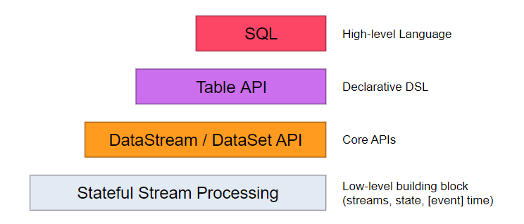
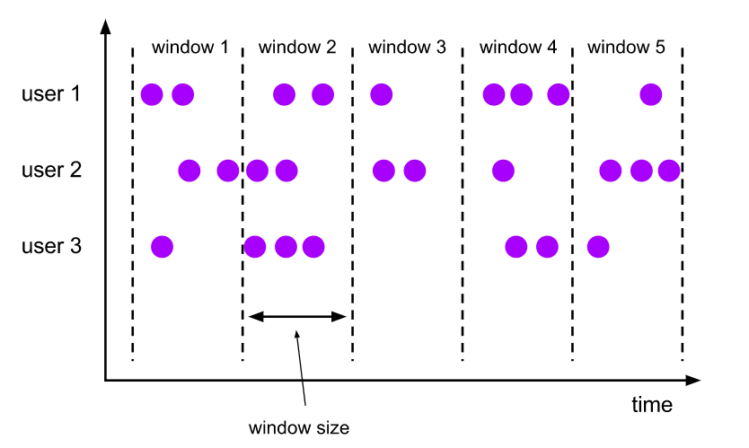
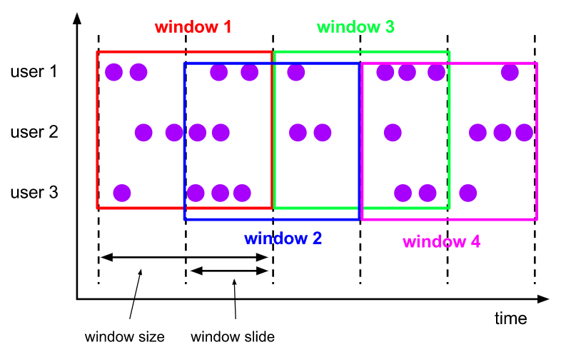
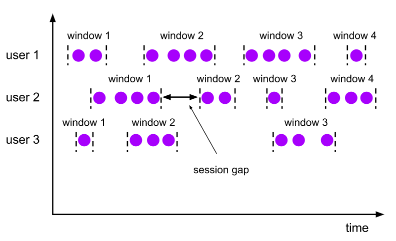

` 目录：`

- [第一部分——Flink初识](#第一部分flink初识)
    - [一、Flink概述](#一flink概述)
        - [1.1 Flink是什么](#11-flink是什么)
        - [1.2 Flink架构](#12-flink架构)
            - [1. API & Libraries 层](#1-api--libraries-层)
            - [2. Runtime 核心层](#2-runtime-核心层)
            - [3. 物理部署层](#3-物理部署层)
        - [1.3 Flink 分层 API](#13-flink-分层-api)
            - [1. SQL & Table API](#1-sql--table-api)
            - [2. DataStream & DataSet API](#2-datastream--dataset-api)
            - [3. Stateful Stream Processing](#3-stateful-stream-processing)
        - [1.4 Flink 集群架构](#14-flink-集群架构)
            - [1. 核心组件](#1-核心组件)
            - [2. Task & SubTask](#2-task--subtask)
            - [3. 资源管理](#3-资源管理)
            - [4. 组件通讯](#4-组件通讯)
        - [1.5 Flink 的优点](#15-flink-的优点)
    - [二、Flink开箱即用](#二flink开箱即用)
    - [三、Flink批处理完成WordCount](#三flink批处理完成wordcount)
        - [3.1 Flink + Java方式](#31-flink--java方式)
        - [3.2 使用Java调用FlinkAPI完成wordcount](#32-使用java调用flinkapi完成wordcount)
        - [3.3 Flink + Scala方式](#33-flink--scala方式)
        - [3.4 使用scala调用FlinkAPI完成wordcount](#34-使用scala调用flinkapi完成wordcount)
    - [四、Flink实时处理完成WordCount](#四flink实时处理完成wordcount)
        - [4.1 Flink + Java方式](#41-flink--java方式)
        - [4.2 Flink + scala方式](#42-flink--scala方式)
    - [五、DataSet API 编程](#五dataset-api-编程)
        - [5.1 数据源的读取](#51-数据源的读取)
            - [1. 从集合中读取数据](#1-从集合中读取数据)
            - [2. 从文件或文件夹中读取数据](#2-从文件或文件夹中读取数据)
            - [3. 从Csv中读取数据](#3-从csv中读取数据)
            - [4. 从多层文件夹中读取数据](#4-从多层文件夹中读取数据)
            - [5. 从压缩文件中读取数据](#5-从压缩文件中读取数据)
        - [5.2 Transformation](#52-transformation)
            - [1. Scala版高频算子的实现](#1-scala版高频算子的实现)
            - [2. Java版高频算子的实现](#2-java版高频算子的实现)
        - [5.3 Sink](#53-sink)
            - [1. Scala实现Sink](#1-scala实现sink)
            - [2. Java实现Sink](#2-java实现sink)
        - [5.4 计数器counter](#54-计数器counter)
            - [1. Scala实现counter](#1-scala实现counter)
            - [2. Java实现counter](#2-java实现counter)
        - [5.5 分布式缓存](#55-分布式缓存)
            - [1. Scala实现分布式缓存](#1-scala实现分布式缓存)
            - [2. Java实现分布式缓存](#2-java实现分布式缓存)
    - [六、DataStream API](#六datastream-api)
        - [6.1 基于Socket方式实现Source](#61-基于socket方式实现source)
            - [1. scala实现](#1-scala实现)
            - [2. Java实现](#2-java实现)
        - [6.2 SourceFunction实现Source](#62-sourcefunction实现source)
            - [1. parallelSourceFunction实现Source](#1-parallelsourcefunction实现source)
            - [2. nonparallelSourceFunction实现Source](#2-nonparallelsourcefunction实现source)
            - [3. richparallelSourceFunction实现Source](#3-richparallelsourcefunction实现source)
        - [6.3 Transformation](#63-transformation)
            - [1. Scala高频算子实现](#1-scala高频算子实现)
            - [2. Java高频算子实现](#2-java高频算子实现)
        - [6.4 自定义Sink方式](#64-自定义sink方式)
            - [1. Scala实现](#1-scala实现)
            - [2. Java实现](#2-java实现-1)
    - [七、Flink Table & SQL API](#七flink-table--sql-api)
        - [7.1  Flink Table & SQL API概述](#71--flink-table--sql-api概述)
        - [7.2 Scala实现Table api & sql](#72-scala实现table-api--sql)
    - [八、Time & windows操作](#八time--windows操作)
        - [8.1 Time类型](#81-time类型)
            - [1. 事件时间Event Time](#1-事件时间event-time)
            - [2. 摄取时间Ingestion time](#2-摄取时间ingestion-time)
            - [3. 处理时间Processing Time](#3-处理时间processing-time)
        - [8.2 Windows](#82-windows)
            - [1. 窗口概念](#1-窗口概念)
            - [2. Time Windows](#2-time-windows)
            - [3. Tumbling Windows](#3-tumbling-windows)
            - [4. Sliding Windows](#4-sliding-windows)
            - [5. Session Windows](#5-session-windows)
            - [6. Global Windows](#6-global-windows)
            - [7. Count Windows](#7-count-windows)
            - [8. 参考资料](#8-参考资料)


# 第一部分——Flink初识

## 一、Flink概述

### 1.1 Flink是什么

官网 flink.apache.org

Flink 是一个分布式的流处理框架，它能够对有界和无界的数据流进行高效的处理。Flink 的核心是流处理，当然它也能支持批处理，Flink 将批处理看成是流处理的一种特殊情况，即数据流是有明确界限的。这和 Spark Streaming 的思想是完全相反的，Spark Streaming 的核心是批处理，它将流处理看成是批处理的一种特殊情况， 即把数据流进行极小粒度的拆分，拆分为多个微批处理。Flink能够运行在常规集群上，在内存上执行，可水平扩展。

无界流数据：数据有开始但没有结尾，不间断，此数据流需要不停处理，可理解为此模式使用实时计算。

有界数据流：有开始有结束，可以等所有的数据一起批处理，可理解为此模式使用离线批处理。

Flink 有界数据流和无界数据流：

<div align="center">  </div>

Spark Streaming 数据流的拆分：

<div align="center">  </div>

### 1.2 Flink架构

Flink 采用分层的架构设计，从而保证各层在功能和职责上的清晰。如下图所示，由上而下分别是 API & Libraries 层、Runtime 核心层以及物理部署层：

<div align="center">  </div>

#### 1. API & Libraries 层

这一层主要提供了编程 API 和 顶层类库：

+ 编程 API : 用于进行流处理的 DataStream API 和用于进行批处理的 DataSet API；
+ 顶层类库：包括用于复杂事件处理的 CEP 库；用于结构化数据查询的 SQL & Table 库，以及基于批处理的机器学习库 FlinkML 和 图形处理库 Gelly。

#### 2. Runtime 核心层

这一层是 Flink 分布式计算框架的核心实现层，包括作业转换，任务调度，资源分配，任务执行等功能，基于这一层的实现，可以在流式引擎下同时运行流处理程序和批处理程序。

#### 3. 物理部署层

Flink 的物理部署层，用于支持在不同平台上部署运行 Flink 应用。

### 1.3 Flink 分层 API

在前一节介绍的 API & Libraries 这一层，Flink 又进行了更为具体的划分。具体如下：

<div align="center">  </div>

按照如上的层次结构，API 的一致性由下至上依次递增，接口的表现能力由下至上依次递减，各层的核心功能如下：

#### 1. SQL & Table API

SQL & Table API 同时适用于批处理和流处理，这意味着你可以对有界数据流和无界数据流以相同的语义进行查询，并产生相同的结果。除了基本查询外， 它还支持自定义的标量函数，聚合函数以及表值函数，可以满足多样化的查询需求。 

#### 2. DataStream & DataSet API

DataStream &  DataSet API 是 Flink 数据处理的核心 API，支持使用 Java 语言或 Scala 语言进行调用，提供了数据读取，数据转换和数据输出等一系列常用操作的封装。当前企业开发中，此层API用的最多。

#### 3. Stateful Stream Processing

Stateful Stream Processing 是最低级别的抽象，它通过 Process Function 函数内嵌到 DataStream API 中。 Process Function 是 Flink 提供的最底层 API，具有最大的灵活性，允许开发者对于时间和状态进行细粒度的控制。

### 1.4 Flink 集群架构

#### 1. 核心组件

按照上面的介绍，Flink 核心架构的第二层是 Runtime 层， 该层采用标准的 Master - Slave 结构， 其中，Master 部分又包含了三个核心组件：Dispatcher、ResourceManager 和 JobManager，而 Slave 则主要是 TaskManager 进程。它们的功能分别如下：

- **JobManagers** (也称为 *masters*) ：JobManagers 接收由 Dispatcher 传递过来的执行程序，该执行程序包含了作业图 (JobGraph)，逻辑数据流图 (logical dataflow graph) 及其所有的 classes 文件以及第三方类库 (libraries) 等等 。紧接着 JobManagers 会将 JobGraph 转换为执行图 (ExecutionGraph)，然后向 ResourceManager 申请资源来执行该任务，一旦申请到资源，就将执行图分发给对应的 TaskManagers 。因此每个作业 (Job) 至少有一个 JobManager；高可用部署下可以有多个 JobManagers，其中一个作为 *leader*，其余的则处于 *standby* 状态。
- **TaskManagers** (也称为 *workers*) : TaskManagers 负责实际的子任务 (subtasks) 的执行，每个 TaskManagers 都拥有一定数量的 slots。Slot 是一组固定大小的资源的合集 (如计算能力，存储空间)。TaskManagers 启动后，会将其所拥有的 slots 注册到 ResourceManager 上，由 ResourceManager 进行统一管理。
- **Dispatcher**：负责接收客户端提交的执行程序，并传递给 JobManager 。除此之外，它还提供了一个 WEB UI 界面，用于监控作业的执行情况。
- **ResourceManager** ：负责管理 slots 并协调集群资源。ResourceManager 接收来自 JobManager 的资源请求，并将存在空闲 slots 的 TaskManagers 分配给 JobManager 执行任务。Flink 基于不同的部署平台，如 YARN , Mesos，K8s 等提供了不同的资源管理器，当 TaskManagers 没有足够的 slots 来执行任务时，它会向第三方平台发起会话来请求额外的资源。

<div align="center">  </div>


#### 2. Task & SubTask

上面我们提到：TaskManagers 实际执行的是 SubTask，而不是 Task，这里解释一下两者的区别：

在执行分布式计算时，Flink 将可以链接的操作 (operators) 链接到一起，这就是 Task。之所以这样做， 是为了减少线程间切换和缓冲而导致的开销，在降低延迟的同时可以提高整体的吞吐量。 但不是所有的 operator 都可以被链接，如下 keyBy 等操作会导致网络 shuffle 和重分区，因此其就不能被链接，只能被单独作为一个 Task。  简单来说，一个 Task 就是一个可以链接的最小的操作链 (Operator Chains) 。如下图，source 和 map 算子被链接到一块，因此整个作业就只有三个 Task：

<div align="center">  </div>


解释完 Task ，我们在解释一下什么是 SubTask，其准确的翻译是： *A subtask is one parallel slice of a task*，即一个 Task 可以按照其并行度拆分为多个 SubTask。如上图，source & map 具有两个并行度，KeyBy 具有两个并行度，Sink 具有一个并行度，因此整个虽然只有 3 个 Task，但是却有 5 个 SubTask。Jobmanager 负责定义和拆分这些 SubTask，并将其交给 Taskmanagers 来执行，每个 SubTask 都是一个单独的线程。

#### 3. 资源管理

理解了 SubTasks ，我们再来看看其与 Slots 的对应情况。一种可能的分配情况如下：

<div align="center">  </div>


这时每个 SubTask 线程运行在一个独立的 TaskSlot， 它们共享所属的 TaskManager 进程的TCP 连接（通过多路复用技术）和心跳信息 (heartbeat messages)，从而可以降低整体的性能开销。此时看似是最好的情况，但是每个操作需要的资源都是不尽相同的，这里假设该作业 keyBy 操作所需资源的数量比 Sink 多很多 ，那么此时 Sink 所在 Slot 的资源就没有得到有效的利用。

基于这个原因，Flink 允许多个 subtasks 共享 slots，即使它们是不同 tasks 的 subtasks，但只要它们来自同一个 Job 就可以。假设上面 souce & map 和 keyBy 的并行度调整为 6，而 Slot 的数量不变，此时情况如下：

<div align="center">  </div>


可以看到一个 Task Slot 中运行了多个 SubTask 子任务，此时每个子任务仍然在一个独立的线程中执行，只不过共享一组 Sot 资源而已。那么 Flink 到底如何确定一个 Job 至少需要多少个 Slot 呢？Flink 对于这个问题的处理很简单，默认情况一个 Job 所需要的 Slot 的数量就等于其 Operation 操作的最高并行度。如下， A，B，D 操作的并行度为 4，而 C，E 操作的并行度为 2，那么此时整个 Job 就需要至少四个 Slots 来完成。通过这个机制，Flink 就可以不必去关心一个 Job 到底会被拆分为多少个 Tasks 和 SubTasks。

<div align="center">  </div>


#### 4. 组件通讯

Flink 的所有组件都基于 Actor System 来进行通讯。Actor system是多种角色的 actor 的容器，它提供调度，配置，日志记录等多种服务，并包含一个可以启动所有 actor 的线程池，如果 actor 是本地的，则消息通过共享内存进行共享，但如果 actor 是远程的，则通过 RPC 的调用来传递消息。

<div align="center">  </div>


### 1.5 Flink 的优点

最后基于上面的介绍，来总结一下 Flink 的优点：

+ 适用
+ Flink 是基于事件驱动 (Event-driven) 的应用，能够同时支持流处理和批处理；
+ 基于内存的计算，能够保证高吞吐和低延迟，具有优越的性能表现；
+ 支持精确一次 (Exactly-once) 语意，能够完美地保证一致性和正确性；
+ 分层 API ，能够满足各个层次的开发需求；
+ 支持高可用配置，支持保存点机制，能够提供安全性和稳定性上的保证；
+ 多样化的部署方式，支持本地，远端，云端等多种部署方案；
+ 具有横向扩展架构，能够按照用户的需求进行动态扩容；
+ 活跃度极高的社区和完善的生态圈的支持。


## 二、Flink开箱即用

本地测试的话，不需要向Hadoop章节那样安装相应的包来执行，它是一个开箱即用的工具，如同Spring、MyBatis这类框架。只需要使用maven来构建项目，使用Java或者Scala均可以，具体方法看第三节Flink批处理完成WordCount。

如何要在服务器集群上跑，则需要下载与Hadoop相匹配的flink包。下载地址 https://archive.apache.org/dist/flink/flink-1.7.0/

## 三、Flink批处理完成WordCount
	
### 3.1 Flink + Java方式
			
前置条件： Maven 3.0.4 (or higher) and Java 8.x

创建Flink+java项目的方式，选择本地一个文件夹，从终端中进入文件夹，并执行下面的语句：

```
mvn archetype:generate                           \
-DarchetypeGroupId=org.apache.flink              \
-DarchetypeArtifactId=flink-quickstart-java      \
-DarchetypeVersion=1.7.0 \
-DarchetypeCatalog=local
```

执行了上面的操作后，会自动创建一个maven项目，并且配置好相关的pom文件，我们使用IDEA打开此项目，进入后，会有一个使用maven构建项目的选项，点击import。文档pom文件如下：

```xml
<project xmlns="http://maven.apache.org/POM/4.0.0" xmlns:xsi="http://www.w3.org/2001/XMLSchema-instance"
	xsi:schemaLocation="http://maven.apache.org/POM/4.0.0 http://maven.apache.org/xsd/maven-4.0.0.xsd">
	<modelVersion>4.0.0</modelVersion>

	<groupId>com.zyx.flink.java</groupId>
	<artifactId>flink-project-java</artifactId>
	<version>1.0</version>
	<packaging>jar</packaging>

	<name>Flink Quickstart Job</name>
	<url>http://www.myorganization.org</url>

	<properties>
		<project.build.sourceEncoding>UTF-8</project.build.sourceEncoding>
		<flink.version>1.7.0</flink.version>
		<java.version>1.8</java.version>
		<scala.binary.version>2.11</scala.binary.version>
		<maven.compiler.source>${java.version}</maven.compiler.source>
		<maven.compiler.target>${java.version}</maven.compiler.target>
	</properties>

	<repositories>
		<repository>
			<id>apache.snapshots</id>
			<name>Apache Development Snapshot Repository</name>
			<url>https://repository.apache.org/content/repositories/snapshots/</url>
			<releases>
				<enabled>false</enabled>
			</releases>
			<snapshots>
				<enabled>true</enabled>
			</snapshots>
		</repository>
	</repositories>

	<dependencies>
		<!-- Apache Flink dependencies -->
		<!-- These dependencies are provided, because they should not be packaged into the JAR file. -->
		<dependency>
			<groupId>org.apache.flink</groupId>
			<artifactId>flink-java</artifactId>
			<version>${flink.version}</version>
		</dependency>
		<dependency>
			<groupId>org.apache.flink</groupId>
			<artifactId>flink-streaming-java_${scala.binary.version}</artifactId>
			<version>${flink.version}</version>
		</dependency>

		<dependency>
			<groupId>org.slf4j</groupId>
			<artifactId>slf4j-log4j12</artifactId>
			<version>1.7.7</version>
			<scope>runtime</scope>
		</dependency>
		<dependency>
			<groupId>log4j</groupId>
			<artifactId>log4j</artifactId>
			<version>1.2.17</version>
			<scope>runtime</scope>
		</dependency>

	</dependencies>

	<build>
		<plugins>

			<plugin>
				<groupId>org.apache.maven.plugins</groupId>
				<artifactId>maven-compiler-plugin</artifactId>
				<version>3.1</version>
				<configuration>
					<source>${java.version}</source>
					<target>${java.version}</target>
				</configuration>
			</plugin>

			<plugin>
				<groupId>org.apache.maven.plugins</groupId>
				<artifactId>maven-shade-plugin</artifactId>
				<version>3.0.0</version>
				<executions>
					<execution>
						<phase>package</phase>
						<goals>
							<goal>shade</goal>
						</goals>
						<configuration>
							<artifactSet>
								<excludes>
									<exclude>org.apache.flink:force-shading</exclude>
									<exclude>com.google.code.findbugs:jsr305</exclude>
									<exclude>org.slf4j:*</exclude>
									<exclude>log4j:*</exclude>
								</excludes>
							</artifactSet>
							<filters>
								<filter>
									<artifact>*:*</artifact>
									<excludes>
										<exclude>META-INF/*.SF</exclude>
										<exclude>META-INF/*.DSA</exclude>
										<exclude>META-INF/*.RSA</exclude>
									</excludes>
								</filter>
							</filters>
							<transformers>
								<transformer implementation="org.apache.maven.plugins.shade.resource.ManifestResourceTransformer">
									<mainClass>com.zyx.flink.java.StreamingJob</mainClass>
								</transformer>
							</transformers>
						</configuration>
					</execution>
				</executions>
			</plugin>
		</plugins>

		<pluginManagement>
			<plugins>


				<plugin>
					<groupId>org.eclipse.m2e</groupId>
					<artifactId>lifecycle-mapping</artifactId>
					<version>1.0.0</version>
					<configuration>
						<lifecycleMappingMetadata>
							<pluginExecutions>
								<pluginExecution>
									<pluginExecutionFilter>
										<groupId>org.apache.maven.plugins</groupId>
										<artifactId>maven-shade-plugin</artifactId>
										<versionRange>[3.0.0,)</versionRange>
										<goals>
											<goal>shade</goal>
										</goals>
									</pluginExecutionFilter>
									<action>
										<ignore/>
									</action>
								</pluginExecution>
								<pluginExecution>
									<pluginExecutionFilter>
										<groupId>org.apache.maven.plugins</groupId>
										<artifactId>maven-compiler-plugin</artifactId>
										<versionRange>[3.1,)</versionRange>
										<goals>
											<goal>testCompile</goal>
											<goal>compile</goal>
										</goals>
									</pluginExecutionFilter>
									<action>
										<ignore/>
									</action>
								</pluginExecution>
							</pluginExecutions>
						</lifecycleMappingMetadata>
					</configuration>
				</plugin>
			</plugins>
		</pluginManagement>
	</build>

	<profiles>
		<profile>
			<id>add-dependencies-for-IDEA</id>

			<activation>
				<property>
					<name>idea.version</name>
				</property>
			</activation>

			<dependencies>
				<dependency>
					<groupId>org.apache.flink</groupId>
					<artifactId>flink-java</artifactId>
					<version>${flink.version}</version>
					<scope>compile</scope>
				</dependency>
				<dependency>
					<groupId>org.apache.flink</groupId>
					<artifactId>flink-streaming-java_${scala.binary.version}</artifactId>
					<version>${flink.version}</version>
					<scope>compile</scope>
				</dependency>
			</dependencies>
		</profile>
	</profiles>

</project>

```

`注意在本地开发测试的时候，需要将<scope>provided</scope>删除掉，否则会报错。`


### 3.2 使用Java调用FlinkAPI完成wordcount

1. 开发流程/开发八股文编程

+ set up the batch execution environment
+ read
+ transform operations  开发的核心所在：开发业务逻辑
+ execute program


2. 功能拆解
    
+ 读取数据  
+ 每一行的数据按照指定的分隔符拆分
+ 为每一个单词赋上次数为1
+ 合并操作  groupBy	

```java

package com.zyx.flink.java;

import org.apache.flink.api.common.functions.FlatMapFunction;
import org.apache.flink.api.java.DataSet;
import org.apache.flink.api.java.ExecutionEnvironment;
import org.apache.flink.api.java.tuple.Tuple2;
import org.apache.flink.util.Collector;

/**
 * 使用Java调用Flink API 批处理进行词频统计
 */
public class BatchWCJavaApp {

    public static void main(String[] args) throws Exception{

        String input = "file:///home/willhope/data/input";

        //获取执行环境
        ExecutionEnvironment env = ExecutionEnvironment.getExecutionEnvironment();

        //读取数据
        DataSet<String> text = env.readTextFile(input);

        //处理，使用Lambda函数式编程
        text.flatMap((FlatMapFunction<String, Tuple2<String, Integer>>) (values, collector) -> {
            String[] tokens = values.toLowerCase().split("\t");
            for(String token : tokens){
                if(token.length() > 0){
                    collector.collect(new Tuple2<String,Integer>(token,1));
                }
            }
        }).groupBy(0).sum(1).print();

        //非Lambda式
//        text.flatMap(new FlatMapFunction<String, Tuple2<String,Integer>>() {
//            @Override
//            public void flatMap(String values, Collector<Tuple2<String, Integer>> collector) throws Exception {
//                String[] tokens = values.toLowerCase().split("\t");
//                for(String token : tokens){
//                    if(token.length() > 0){
//                        collector.collect(new Tuple2<String,Integer>(token,1));
//                    }
//                }
//            }
//        }).groupBy(0).sum(1).print();

    }

}


```

### 3.3 Flink + Scala方式

前置条件：Maven 3.0.4 (or higher) and Java 8.x 

```
mvn archetype:generate                               \
-DarchetypeGroupId=org.apache.flink              \
-DarchetypeArtifactId=flink-quickstart-scala     \
-DarchetypeVersion=1.7.0 \
-DarchetypeCatalog=local
```

构建完毕后，与java构建方式相同，使用idea将项目打开。

### 3.4 使用scala调用FlinkAPI完成wordcount

1. 开发流程/开发八股文编程

+ set up the batch execution environment
+ read
+ transform operations  开发的核心所在：开发业务逻辑
+ execute program


2. 功能拆解
    
+ 读取数据  
+ 每一行的数据按照指定的分隔符拆分
+ 为每一个单词赋上次数为1
+ 合并操作  groupBy	


```scala
import org.apache.flink.api.scala.{ExecutionEnvironment, createTypeInformation}

/**
 * 使用scala调用Flink API 批处理进行词频统计
 */
object BatchWCScalaApp {


  def main(args: Array[String]): Unit = {

    val input = "file:///home/willhope/data/input"

    val env = ExecutionEnvironment.getExecutionEnvironment

    val text = env.readTextFile(input)

    text.flatMap(_.toLowerCase().split("\t"))
      .filter(_.nonEmpty).map((_,1)).groupBy(0).sum(1)
      .print()

  }
}
```

## 四、Flink实时处理完成WordCount

### 4.1 Flink + Java方式

首先，我们需要对某个端口进行监听，因此电脑上需要安装netcat，使用sudo apt install netcat -y进行安装。其次，我们需要与代码中约定一个端口号。本次使用9990端口。在终端输入nc -lk -p 9990，然后终端等待要输入的内容。  


```java

import org.apache.flink.api.common.functions.FlatMapFunction;
import org.apache.flink.api.java.tuple.Tuple2;
import org.apache.flink.streaming.api.datastream.DataStreamSource;
import org.apache.flink.streaming.api.environment.StreamExecutionEnvironment;
import org.apache.flink.streaming.api.windowing.time.Time;
import org.apache.flink.util.Collector;

/**
 * 使用Java API来开发Flink的实时处理应用程序.
 *
 * wc统计的数据我们源自于socket
 */
public class StreamingWCJavaApp {


    public static void main(String[] args) throws Exception {

        // step1 ：获取执行环境
        StreamExecutionEnvironment env = StreamExecutionEnvironment.getExecutionEnvironment();


        // step2：读取数据
        DataStreamSource<String> text = env.socketTextStream("localhost", 9990);


        // step3: transform
        text.flatMap(new FlatMapFunction<String, Tuple2<String, Integer>>() {
            @Override
            public void flatMap(String value, Collector<Tuple2<String, Integer>> collector) throws Exception {
                String[] tokens = value.toLowerCase().split(",");
                for(String token : tokens) {
                    if(token.length() > 0) {
                        collector.collect(new Tuple2<String,Integer>(token,1));
                    }
                }
            }
        }).keyBy(0).timeWindow(Time.seconds(5)).sum(1).print().setParallelism(1);


        env.execute("StreamingWCJavaApp");
    }

}

```

### 4.2 Flink + scala方式

与Java方式同样，我们需要对某个端口进行监听，在终端输入nc -lk 9990，然后终端等待要输入的内容。  

```scala
import org.apache.flink.streaming.api.scala.{StreamExecutionEnvironment, createTypeInformation}
import org.apache.flink.streaming.api.windowing.time.Time

/**
 * 使用Scala开发flink的实时处理应用程序
 */
object StreamingWCScalaApp {

  def main(args: Array[String]): Unit = {

    val env = StreamExecutionEnvironment.getExecutionEnvironment

    val text = env.socketTextStream("localhost",9990)

    text.flatMap(_.split(",")).map((_,1)).keyBy(0)
      .timeWindow(Time.seconds(5)).sum(1).print().setParallelism(1)


    env.execute("StreamingWCScalaApp")

  }

}

```


## 五、DataSet API 编程

编程模型： Source(源数据)  ===》 transformation(处理)  ===》 Sink(目的地)

### 5.1 数据源的读取

#### 1. 从集合中读取数据

首先，使用maven在idea中创建一个空的scala工程，在pom文件中，添加如下语句：

```xml
  <properties>
    <project.build.sourceEncoding>UTF-8</project.build.sourceEncoding>
    <flink.version>1.7.0</flink.version>
    <scala.binary.version>2.11</scala.binary.version>
    <scala.version>2.11.12</scala.version>
    <hadoop.version>2.6.0-cdh5.15.1</hadoop.version>
  </properties>

  <repositories>
    <repository>
      <id>cloudera</id>
      <url>https://repository.cloudera.com/artifactory/cloudera-repos</url>
    </repository>
  </repositories>

  <pluginRepositories>
    <pluginRepository>
      <id>scala-tools.org</id>
      <name>Scala-Tools Maven2 Repository</name>
      <url>http://scala-tools.org/repo-releases</url>
    </pluginRepository>
  </pluginRepositories>

  <dependencies>
    <dependency>
      <groupId>org.apache.flink</groupId>
      <artifactId>flink-scala_${scala.binary.version}</artifactId>
      <version>${flink.version}</version>
    </dependency>

    <dependency>
      <groupId>org.apache.flink</groupId>
      <artifactId>flink-streaming-scala_${scala.binary.version}</artifactId>
      <version>${flink.version}</version>
    </dependency>

    <dependency>
      <groupId>org.apache.flink</groupId>
      <artifactId>flink-table_2.11</artifactId>
      <version>${flink.version}</version>
    </dependency>

    <dependency>
      <groupId>org.scala-lang</groupId>
      <artifactId>scala-library</artifactId>
      <version>${scala.version}</version>
    </dependency>

    <dependency>
      <groupId>org.slf4j</groupId>
      <artifactId>slf4j-log4j12</artifactId>
      <version>1.7.7</version>
    </dependency>

    <dependency>
      <groupId>org.apache.hadoop</groupId>
      <artifactId>hadoop-client</artifactId>
      <version>${hadoop.version}</version>
    </dependency>

    <dependency>
      <groupId>log4j</groupId>
      <artifactId>log4j</artifactId>
      <version>1.2.17</version>
    </dependency>

    <dependency>
      <groupId>mysql</groupId>
      <artifactId>mysql-connector-java</artifactId>
      <version>5.1.47</version>
    </dependency>

    <dependency>
      <groupId>org.apache.flink</groupId>
      <artifactId>flink-connector-filesystem_2.11</artifactId>
      <version>${flink.version}</version>
    </dependency>

    <dependency>
      <groupId>org.apache.flink</groupId>
      <artifactId>flink-connector-kafka_2.11</artifactId>
      <version>${flink.version}</version>
    </dependency>

    <dependency>
      <groupId>org.apache.kafka</groupId>
      <artifactId>kafka-clients</artifactId>
      <version>2.4.0</version>
    </dependency>
  </dependencies>
```

scala版本：

```scala
package flink.datasetcollection

import org.apache.flink.api.scala.{ExecutionEnvironment, createTypeInformation}

object DataSetDataSourceApp {

  def main(args: Array[String]): Unit = {

    val env = ExecutionEnvironment.getExecutionEnvironment
    fromCollection(env)

  }

  def fromCollection(env:ExecutionEnvironment):Unit={

    val data = 1 to 10
    env.fromCollection(data).print()

  }

}
```

java版本：


```java
package flink.datasetcollection;

import org.apache.flink.api.java.ExecutionEnvironment;

import java.util.ArrayList;
import java.util.List;

public class JDataSetDataSourceApp {


    public static void main(String[] args)throws Exception {
        ExecutionEnvironment env = ExecutionEnvironment.getExecutionEnvironment();
        fromCollection(env);
    }

    public static void fromCollection(ExecutionEnvironment env) throws Exception{
        List<Integer> list = new ArrayList<Integer>();
        for (int i = 1; i <= 10; i++) {
            list.add(i);
        }
        env.fromCollection(list).print();
    }


}
```

#### 2. 从文件或文件夹中读取数据

scala版本：

```scala

package flink.datasetfile

import org.apache.flink.api.scala.ExecutionEnvironment

object DataSetDataSourceApp {

  def main(args: Array[String]): Unit = {

    val env = ExecutionEnvironment.getExecutionEnvironment

    fromLocalFile(env)
    fromLocalDir(env)
  }

  //从文件中读取
  def fromLocalFile(env:ExecutionEnvironment):Unit={
    val inputPath = "file:///home/willhope/data/input/hello.txt"
    env.readTextFile(inputPath).print()
  }
  
  //从文件夹中读取
  def fromLocalDir(env: ExecutionEnvironment):Unit={
    val inputDir = "file:///home/willhope/data/input"
    env.readTextFile(inputDir).print()
  }

}

```


Java版本：


```java

package flink.datasetfile;

import org.apache.flink.api.java.ExecutionEnvironment;

public class JDataSetDataSourceApp {

    public static void main(String[] args) throws Exception{

        ExecutionEnvironment env = ExecutionEnvironment.getExecutionEnvironment();

        fromLocalFile(env);

        fromLocalDir(env);
    }

    public static void fromLocalFile(ExecutionEnvironment env)throws Exception{
        String inputPath = "file:///home/willhope/data/input/hello.txt";
        env.readTextFile(inputPath).print();
    }

    public static void fromLocalDir(ExecutionEnvironment env)throws Exception{
        String inputDir = "file:///home/willhope/data/input";
        env.readTextFile(inputDir).print();
    }

}
```

#### 3. 从Csv中读取数据

对CSV文件中字段属性的解析有多种方法，tuple定义法，caseclass方法，pojo方法。

scala版本：

```scala
import org.apache.flink.api.scala._

object DataSetDataSourceApp {

  def main(args: Array[String]): Unit = {
    val env = ExecutionEnvironment.getExecutionEnvironment
    csvFile(env)

  }

  def csvFile(environment: ExecutionEnvironment):Unit={
    val inputPath = "file:///home/willhope/data/people.csv"
    //使用tuple形式定义csv文件中的字段属性
    //使用ignoreFirstLine=true，忽略第一行的解析
    environment.readCsvFile[(String,Int,String)](inputPath,ignoreFirstLine = true).print()
    //也可以读取两列
    environment.readCsvFile[(String,Int)](inputPath,ignoreFirstLine = true).print()

    //使用case class形式解析文件
    case class MyCaseClass(name:String,age:Int)
    environment.readCsvFile[MyCaseClass](inputPath,ignoreFirstLine = true,includedFields = Array(0,1)).print()

    //pojo形式，使用Java定义一个Person类，使用Java更加直观一些，当然使用scala也可以，scala会自动生成getter和setter方法。
    environment.readCsvFile[Person](inputPath,ignoreFirstLine = true,pojoFields = Array("name","age","work")).print()

  }

}


```

java版本：

```java
import org.apache.flink.api.java.DataSet;
import org.apache.flink.api.java.ExecutionEnvironment;
import org.apache.flink.api.java.tuple.Tuple3;

public class JDataSetDataSourceApp {

    public static void main(String[] args) throws Exception {
        ExecutionEnvironment executionEnvironment = ExecutionEnvironment.getExecutionEnvironment();
        csvFile(executionEnvironment);
    }

    public static void csvFile(ExecutionEnvironment env)throws Exception{
        String inputPath = "file:///home/willhope/data/people.csv";

        //使用tuple方式
        DataSet<Tuple3<String, Integer, String>> csvInput = env.readCsvFile(inputPath)
                .fieldDelimiter(",")
                .types(String.class,Integer.class, String.class);
        csvInput.print();

        //使用pojo方式
        DataSet<Person> csvInput2 = env.readCsvFile(inputPath).ignoreFirstLine()
                .pojoType(Person.class,"name","age","work");
        csvInput2.print();
    }

}

```

#### 4. 从多层文件夹中读取数据

在开发中，总能碰见，多层文件目录，我们需要递归访问文件夹。在scala版本中的DataSetDataSourceApp类中添加下面的方法。

scala版本：

```scala

  //从多层文件夹中读取
  def readRecursiveFiles(env: ExecutionEnvironment): Unit ={
    val inputPath = "file:///home/willhope/data/input"
    val parameters = new Configuration()
    parameters.setBoolean("recursive.file.enumeration",true)
    env.readTextFile(inputPath).withParameters(parameters).print()
  }

```

java版本：在java版本中的JDataSetDataSourceApp类中添加下面的方法。

```java

    public static void readRecursiveFiles(ExecutionEnvironment env)throws Exception{
        String inputPath = "file:///home/willhope/data/input";
        Configuration parameters = new Configuration();
        parameters.setBoolean("recursive.file.enumeration",true);
        env.readTextFile(inputPath).withParameters(parameters).print();
    }


```

#### 5. 从压缩文件中读取数据

scala版本：在scala版本中的DataSetDataSourceApp类中添加下面的方法。

```scala
  //从压缩文件中读取数据
  def readCompressionFiles(env: ExecutionEnvironment): Unit ={
    val inputPath = "file:///home/willhope/data/compress"
    env.readTextFile(inputPath).print()

  }

```

java版本：在java版本中的JDataSetDataSourceApp类中添加下面的方法。

```java

  //从压缩文件中读取数据
  public static void readCompressionFiles(ExecutionEnvironment env)throws Exception{
      String inputPath = "file:///home/willhope/data/compress";
      env.readTextFile(inputPath).print();
  }

```

### 5.2 Transformation

使用高级算子将读取的源数据进行处理，`注意，这些高级算子在大数据处理框架中均有`。主要算子有:

|  算子名 | 解释   |
| :------: | :------:|
|Map|Takes one element and produces one element
|
|flapMap|Takes one element and produces zero, one, or more elements
|
|MapPartition|Transforms a parallel partition in a single function call. The function gets the partition as an Iterable stream and can produce an arbitrary number of result values. The number of elements in each partition depends on the degree-of-parallelism and previous operations
|
|Filter|Evaluates a boolean function for each element and retains those for which the function returns true.IMPORTANT: The system assumes that the function does not modify the elements on which the predicate is applied. Violating this assumption can lead to incorrect results
|
|Reduce|Combines a group of elements into a single element by repeatedly combining two elements into one. Reduce may be applied on a full data set or on a grouped data set
|
|ReduceGroup|Combines a group of elements into one or more elements. ReduceGroup may be applied on a full data set or on a grouped data set
|
|Aggregate|Aggregates a group of values into a single value. Aggregation functions can be thought of as built-in reduce functions. Aggregate may be applied on a full data set, or on a grouped data set
|
|Distinct|Returns the distinct elements of a data set. It removes the duplicate entries from the input DataSet, with respect to all fields of the elements, or a subset of fields
|
|Join|Joins two data sets by creating all pairs of elements that are equal on their keys. Optionally uses a JoinFunction to turn the pair of elements into a single element, or a FlatJoinFunction to turn the pair of elements into arbitrarily many (including none) elements. See the keys section to learn how to define join keys
|
|OuterJoin|Performs a left, right, or full outer join on two data sets. Outer joins are similar to regular (inner) joins and create all pairs of elements that are equal on their keys. In addition, records of the "outer" side (left, right, or both in case of full) are preserved if no matching key is found in the other side. Matching pairs of elements (or one element and a null value for the other input) are given to a JoinFunction to turn the pair of elements into a single element, or to a FlatJoinFunction to turn the pair of elements into arbitrarily many (including none) elements. See the keys section to learn how to define join keys
|
|CoGroup|The two-dimensional variant of the reduce operation. Groups each input on one or more fields and then joins the groups. The transformation function is called per pair of groups. See the keys section to learn how to define coGroup keys|
|Cross|Builds the Cartesian product (cross product) of two inputs, creating all pairs of elements. Optionally uses a CrossFunction to turn the pair of elements into a single element
|
|Union|Produces the union of two data sets
|
|Rebalance|Evenly rebalances the parallel partitions of a data set to eliminate data skew. Only Map-like transformations may follow a rebalance transformation
|
|Hash-Partition|Hash-partitions a data set on a given key. Keys can be specified as position keys, expression keys, and key selector functions
|
|Range-Partition|Range-partitions a data set on a given key. Keys can be specified as position keys, expression keys, and key selector functions|
|Custom Partitioning|Assigns records based on a key to a specific partition using a custom Partitioner function. The key can be specified as position key, expression key, and key selector function.Note: This method only works with a single field key
|
|Sort Partition|Locally sorts all partitions of a data set on a specified field in a specified order. Fields can be specified as tuple positions or field expressions. Sorting on multiple fields is done by chaining sortPartition() calls
|
|First-n|Returns the first n (arbitrary) elements of a data set. First-n can be applied on a regular data set, a grouped data set, or a grouped-sorted data set. Grouping keys can be specified as key-selector functions or field position keys
|

#### 1. Scala版高频算子的实现

```scala

package flinkprimary.transformation

import flinkprimary.DBUtils
import org.apache.flink.api.common.operators.Order
import org.apache.flink.api.scala._

import scala.collection.mutable.ListBuffer

object DataSetTransformationApp {


  def main(args: Array[String]): Unit = {
    val env = ExecutionEnvironment.getExecutionEnvironment
//    mapFunction(env)
//    filterFunction(env)
//    mapPartitionFunction(env)
//    firstFunction(env)
//    flatMapFunction(env)
//    distinctFunction(env)
//    joinFunction(env)
//    outerJoinFunction(env)
    crossFunction(env)
  }

  /**
   * 对数据集中每个元素进行操作
   * @param env
   */
  def mapFunction(env: ExecutionEnvironment): Unit ={
    val data = env.fromCollection(List(1,2,3,4,5,6,7,8,9,10))
    data.map(_+1).print()
  }

  /**
   * 对集合中的数据进行过滤
   * @param env
   */
  def filterFunction(env: ExecutionEnvironment) : Unit ={
    val data = env.fromCollection(List(1,2,3,4,5,6,7,8,9,10))
    data.map(_+1).filter(_>5).print()
  }

  /**
   * 将100个元素放入数据库中，此处模拟一个DB工具类
   * 使用分区，并行处理大量数据，提高效率
   * @param env
   */
  def mapPartitionFunction(env: ExecutionEnvironment) : Unit = {

    val students = new ListBuffer[String]
    for (i <- 1 to 100){
      students.append("student:" + i)
    }
    //并行度设置几个，就有几个分区
    val data = env.fromCollection(students).setParallelism(4)
    data.mapPartition(x => {
      //每个元素要存储到数据库中，要先获取connection
      val connection = DBUtils.getConnection()
      println(connection + "......")

      DBUtils.returnConnection(connection)
      x
    }).print()
  }

  /**
   * first算子的使用，取出前三条
   * @param env
   */
  def firstFunction(env: ExecutionEnvironment) : Unit ={
    val info = ListBuffer[(Int ,String)]()
    info.append((1,"hadoop"))
    info.append((1,"spark"))
    info.append((1,"flink"))
    info.append((2,"java"))
    info.append((2,"scala"))
    info.append((2,"python"))
    info.append((3,"linux"))
    info.append((4,"windows"))
    val data = env.fromCollection(info)
    data.first(3).print()
    //分组后，从组里取出前2个
    data.groupBy(0).first(2).print()
    //升序排列分组，从组里取出前2个
    data.groupBy(0).sortGroup(1,Order.ASCENDING).first(2).print()
  }

  /**
   * flatMapFunction的学习，将一个字符串拆分成多个字符串
   * @param env
   */
  def flatMapFunction(env: ExecutionEnvironment): Unit = {
    val info = ListBuffer[String]()
    info.append("hadoop,spark")
    info.append("hadoop,flink")
    info.append("flink,flink")

    val data = env.fromCollection(info)
    data.flatMap(_.split(",")).map((_,1)).groupBy(0).sum(1).print()
  }

  /**
   * 去重操作
   * @param env
   */
  def distinctFunction(env: ExecutionEnvironment): Unit = {
    val info = ListBuffer[String]()
    info.append("hadoop,spark")
    info.append("hadoop,flink")
    info.append("flink,flink")

    val data = env.fromCollection(info)

    data.flatMap(_.split(",")).distinct().print()
  }

  /**
   * join方法的学习
   * @param env
   */
  def joinFunction(env: ExecutionEnvironment): Unit = {
    val info1 = ListBuffer[(Int ,String)]()
    info1.append((1,"hadoop"))
    info1.append((2,"java"))
    info1.append((3,"linux"))
    info1.append((4,"windows"))

    val info2 = ListBuffer[(Int ,String)]()
    info2.append((1,"spark"))
    info2.append((2,"scala"))
    info2.append((3,"ubuntu"))
    info2.append((4,"vim"))

    val data1 = env.fromCollection(info1)
    val data2 = env.fromCollection(info2)

    //where左边,equalTo右边的
    data1.join(data2).where(0).equalTo(0).apply((first,second)=>{
      (first._1,first._2,second._2)
    }).print()
  }

  /**
   * 外联结outerJoin的用法
   * @param env
   */
  def outerJoinFunction(env: ExecutionEnvironment): Unit = {
    val info1 = ListBuffer[(Int ,String)]()
    info1.append((1,"hadoop"))
    info1.append((2,"java"))
    info1.append((3,"linux"))
    info1.append((4,"windows"))

    val info2 = ListBuffer[(Int ,String)]()
    info2.append((1,"spark"))
    info2.append((2,"scala"))
    info2.append((3,"ubuntu"))
    info2.append((5,"vim"))

    val data1 = env.fromCollection(info1)
    val data2 = env.fromCollection(info2)

    //where左边,equalTo右边的
    //左连接
    data1.leftOuterJoin(data2).where(0).equalTo(0).apply((first,second)=>{

      if(second == null){
        (first._1,first._2,'-')
      }else{
        (first._1,first._2,second._2)
      }

    }).print()

    println("-----------------------------------------")

    //右连接
    data1.rightOuterJoin(data2).where(0).equalTo(0).apply((first,second)=>{

      if(first == null){
        (second._1,'-',second._2)
      }else{
        (first._1,first._2,second._2)
      }

    }).print()


    println("-----------------------------------------")

    //全连接
    data1.fullOuterJoin(data2).where(0).equalTo(0).apply((first,second)=>{

      if(first == null){
        (second._1,'-',second._2)
      }else if (second == null){
        (first._1,first._2,'-')
      }else{
        (first._1,first._2,second._2)
      }

    }).print()
  }

  /**
   * cross方法的学习，即笛卡尔积
   * @param env
   */
  def crossFunction(env: ExecutionEnvironment): Unit = {
    val info1 = List("曼联","曼城")
    val info2 = List(3,1,0)

    val data1 = env.fromCollection(info1)
    val data2 = env.fromCollection(info2)

    data1.cross(data2).print()

  }

}

```

#### 2. Java版高频算子的实现

```java

package flinkprimary.transformation;

import flinkprimary.DBUtils;
import org.apache.flink.api.common.functions.*;
import org.apache.flink.api.common.operators.Order;
import org.apache.flink.api.java.ExecutionEnvironment;
import org.apache.flink.api.java.operators.DataSource;
import org.apache.flink.api.java.tuple.Tuple2;
import org.apache.flink.api.java.tuple.Tuple3;
import org.apache.flink.util.Collector;

import java.util.ArrayList;
import java.util.List;

public class JDataSetTransformationApp {


    public static void main(String[] args) throws Exception{
        ExecutionEnvironment env = ExecutionEnvironment.getExecutionEnvironment();
//        mapFunction(env);
//        filterFunction(env);
//        mapPartitionFunction(env);
//        firstFunction(env);
//        flatMapFunction(env);
//        distinctFunction(env);
//        joinFunction(env);
//        outerJoinFunction(env);
        crossFunction(env);
    }

    /**
     * map算子的学习,对数据集中每个元素进行操作
     * @param env
     * @throws Exception
     */
    public static void mapFunction(ExecutionEnvironment env)throws Exception{
        List<Integer> list = new ArrayList<Integer>();
        for (int i = 1; i <= 10; i++) {
            list.add(i);
        }
        DataSource<Integer> data = env.fromCollection(list);
        data.map(new MapFunction<Integer, Integer>() {

            public Integer map(Integer input) throws Exception {
                return input + 1;
            }
        }).print();
    }

    /**
     * filter算子的学习,对集合中的数据进行过滤
     * @param env
     * @throws Exception
     */
    public static void filterFunction(ExecutionEnvironment env)throws Exception {
        List<Integer> list = new ArrayList<Integer>();
        for (int i = 1; i <= 10; i++) {
            list.add(i);
        }
        DataSource<Integer> data = env.fromCollection(list);
        data.map(new MapFunction<Integer, Integer>() {

            public Integer map(Integer input) throws Exception {
                return input + 1;
            }
        }).filter(new FilterFunction<Integer>() {
            public boolean filter(Integer input) throws Exception {
                return input > 5;
            }
        }).print();
    }

    /**
     * mapPartition算子的学习，分区并行处理数据
     * @param env
     * @throws Exception
     */
    public static void mapPartitionFunction(ExecutionEnvironment env)throws Exception{
        List<String> list = new ArrayList<String>();
        for (int i = 1; i <= 10; i++) {
            list.add("student" + i);
        }
        DataSource<String> data = env.fromCollection(list).setParallelism(4);

        data.mapPartition(new MapPartitionFunction<String, String>() {
            public void mapPartition(Iterable<String> input, Collector<String> out) throws Exception {
                String connection = DBUtils.getConnection();
                System.out.println("connection = [" + connection + "]");
                DBUtils.returnConnection(connection);
            }
        }).print();
    }

    /**
     * 使用first算子
     * @param env
     */
    private static void firstFunction(ExecutionEnvironment env) throws Exception{
        List<Tuple2<Integer,String>> info = new ArrayList<Tuple2<Integer,String>>();
        info.add(new Tuple2<Integer, String>(1,"hadoop"));
        info.add(new Tuple2<Integer, String>(1,"spark"));
        info.add(new Tuple2<Integer, String>(1,"flink"));
        info.add(new Tuple2<Integer, String>(2,"java"));
        info.add(new Tuple2<Integer, String>(2,"scala"));
        info.add(new Tuple2<Integer, String>(2,"python"));
        info.add(new Tuple2<Integer, String>(3,"linux"));
        info.add(new Tuple2<Integer, String>(4,"windows"));

        DataSource<Tuple2<Integer,String>> data = env.fromCollection(info);
        data.groupBy(0).sortGroup(1, Order.ASCENDING).first(2).print();
        System.out.println("----分隔符-----");
        data.groupBy(0).first(2).print();

    }

    /**
     * flatMapFunction的学习，将一个字符串拆分成多个字符串
     * @param env
     * @throws Exception
     */
    private static void flatMapFunction(ExecutionEnvironment env) throws Exception{

        List<String> list = new ArrayList<String>();
        list.add("hadoop,spark");
        list.add("hadoop,flink");
        list.add("flink,flink");

        DataSource<String> data = env.fromCollection(list);
        data.flatMap(new FlatMapFunction<String, String>() {

            public void flatMap(String input, Collector<String> out) throws Exception {
                String[] splits = input.split(",");
                for(String split : splits){
                    out.collect(split);
                }
            }
        }).map(new MapFunction<String, Tuple2<String,Integer>>() {
            public Tuple2<String, Integer> map(String input) throws Exception {
                return new Tuple2<String, Integer>(input,1);
            }
        }).groupBy(0).sum(1).print();
    }

    /**
     *
     * @param env
     */
    private static void distinctFunction(ExecutionEnvironment env) throws Exception{
        List<String> list = new ArrayList<String>();
        list.add("hadoop,spark");
        list.add("hadoop,flink");
        list.add("flink,flink");

        DataSource<String> data = env.fromCollection(list);
        data.flatMap(new FlatMapFunction<String, String>() {

            public void flatMap(String input, Collector<String> out) throws Exception {
                String[] splits = input.split(",");
                for(String split : splits){
                    out.collect(split);
                }
            }
        }).distinct().print();
    }

    /**
     * 连接操作
     * @param env
     * @throws Exception
     */
    private static void joinFunction(ExecutionEnvironment env) throws Exception{

        List<Tuple2<Integer,String>> info1 = new ArrayList<Tuple2<Integer,String>>();
        info1.add(new Tuple2<Integer, String>(1,"hadoop"));
        info1.add(new Tuple2<Integer, String>(2,"java"));
        info1.add(new Tuple2<Integer, String>(3,"linux"));


        List<Tuple2<Integer,String>> info2 = new ArrayList<Tuple2<Integer,String>>();
        info2.add(new Tuple2<Integer, String>(1,"spark"));
        info2.add(new Tuple2<Integer, String>(2,"scala"));
        info2.add(new Tuple2<Integer, String>(4,"windows"));

        DataSource<Tuple2<Integer,String>> data1 = env.fromCollection(info1);
        DataSource<Tuple2<Integer,String>> data2 = env.fromCollection(info2);

        data1.join(data2).where(0).equalTo(0).with(new JoinFunction<Tuple2<Integer, String>, Tuple2<Integer, String>, Tuple3<Integer,String,String>>() {

            public Tuple3<Integer, String, String> join(Tuple2<Integer, String> first, Tuple2<Integer, String> second) throws Exception {
                return new Tuple3<Integer, String, String>(first.f0, first.f1,second.f1);
            }
        }).print();


    }


    /**
     * 外连接操作，左连接，右连接，全连接
     * @param env
     * @throws Exception
     */
    private static void outerJoinFunction(ExecutionEnvironment env) throws Exception{

        List<Tuple2<Integer,String>> info1 = new ArrayList<Tuple2<Integer,String>>();
        info1.add(new Tuple2<Integer, String>(1,"hadoop"));
        info1.add(new Tuple2<Integer, String>(2,"java"));
        info1.add(new Tuple2<Integer, String>(3,"linux"));


        List<Tuple2<Integer,String>> info2 = new ArrayList<Tuple2<Integer,String>>();
        info2.add(new Tuple2<Integer, String>(1,"spark"));
        info2.add(new Tuple2<Integer, String>(2,"scala"));
        info2.add(new Tuple2<Integer, String>(4,"windows"));

        DataSource<Tuple2<Integer,String>> data1 = env.fromCollection(info1);
        DataSource<Tuple2<Integer,String>> data2 = env.fromCollection(info2);

        data1.leftOuterJoin(data2).where(0).equalTo(0).with(new JoinFunction<Tuple2<Integer,String>, Tuple2<Integer,String>, Tuple3<Integer,String, String>>() {

            public Tuple3<Integer, String, String> join(Tuple2<Integer, String> first, Tuple2<Integer, String> second) throws Exception {
                if(second == null) {
                    return new Tuple3<Integer, String, String>(first.f0, first.f1, "-");

                } else {
                    return new Tuple3<Integer, String, String>(first.f0, first.f1, second.f1);
                }
            }
        }).print();

        System.out.println("------------------------------------------------------------");

        data1.rightOuterJoin(data2).where(0).equalTo(0).with(new JoinFunction<Tuple2<Integer,String>, Tuple2<Integer,String>, Tuple3<Integer,String, String>>() {
            public Tuple3<Integer, String, String> join(Tuple2<Integer, String> first, Tuple2<Integer, String> second) throws Exception {
                if(first == null) {
                    return new Tuple3<Integer, String, String>(second.f0, "-", second.f1);
                } else {
                    return new Tuple3<Integer, String, String>(first.f0, first.f1, second.f1);
                }
            }
        }).print();

        System.out.println("------------------------------------------------------------");

        data1.fullOuterJoin(data2).where(0).equalTo(0).with(new JoinFunction<Tuple2<Integer, String>, Tuple2<Integer, String>, Tuple3<Integer, String, String>>() {
            public Tuple3<Integer, String, String> join(Tuple2<Integer, String> first, Tuple2<Integer, String> second) throws Exception {
                if (first == null) {
                    return new Tuple3<Integer, String, String>(second.f0, "-", second.f1);
                } else if (second == null) {
                    return new Tuple3<Integer, String, String>(first.f0, first.f1, "-");
                } else {
                    return new Tuple3<Integer, String, String>(first.f0, first.f1, second.f1);
                }
            }
        }).print();

    }

    /**
     * cross算子的学习，即笛卡尔积
     * @param env
     */
    private static void crossFunction(ExecutionEnvironment env) throws Exception{

        List<String> list1 = new ArrayList<String>();
        list1.add("曼城");
        list1.add("曼联");

        List<Integer> list2 = new ArrayList<Integer>();
        list2.add(3);
        list2.add(0);
        list2.add(1);

        DataSource<String> data1 = env.fromCollection(list1);
        DataSource<Integer> data2 = env.fromCollection(list2);

        data1.cross(data2).print();

    }

}


```

### 5.3 Sink

#### 1. Scala实现Sink

```scala
import org.apache.flink.api.scala._
import org.apache.flink.core.fs.FileSystem.WriteMode

object DataSetSinkApp {

  def main(args: Array[String]): Unit = {


    val env = ExecutionEnvironment.getExecutionEnvironment

    val data = 1 to 10
    val text = env.fromCollection(data)

    val filePath = "file:///home/willhope/data/sink-out"

    text.writeAsText(filePath,WriteMode.OVERWRITE).setParallelism(2)

    env.execute("DataSetSinkApp")
  }


}

```

#### 2. Java实现Sink

```java
import org.apache.flink.api.java.ExecutionEnvironment;
import org.apache.flink.api.java.operators.DataSource;
import org.apache.flink.core.fs.FileSystem;

import java.util.ArrayList;
import java.util.List;

public class JDataSetSinkApp {

    public static void main(String[] args) throws Exception{


        ExecutionEnvironment env = ExecutionEnvironment.getExecutionEnvironment();

        List<Integer> list = new ArrayList<Integer>();
        for (int i = 1; i <= 10; i++) {
            list.add(i);
        }

        DataSource<Integer> data = env.fromCollection(list);
        String filePath = "file:///home/willhope/data/sink-out-java";
        data.writeAsText(filePath, FileSystem.WriteMode.OVERWRITE).setParallelism(2);


        env.execute("JDataSetSinkApp");
    }

}

```

### 5.4 计数器counter

#### 1. Scala实现counter

```scala
import org.apache.flink.api.common.accumulators.LongCounter
import org.apache.flink.api.common.functions.RichMapFunction
import org.apache.flink.api.scala._
import org.apache.flink.configuration.Configuration
import org.apache.flink.core.fs.FileSystem.WriteMode

object CounterApp {

  def main(args: Array[String]): Unit = {

    val env = ExecutionEnvironment.getExecutionEnvironment

    val data = env.fromElements("hadoop","flink","spark","storm")

    val info = data.map(new RichMapFunction[String , String]() {

      //定义计数器
      val counter = new LongCounter()

      override def open(parameters : Configuration) : Unit = {
        //注册计数器
        getRuntimeContext.addAccumulator("ele-counts-scala",counter)
      }

      override def map(value: String): String = {
        counter.add(1)
        value
      }
    })

    val filePath = "file:///home/willhope/data/counter-out-scala"
    info.writeAsText(filePath,WriteMode.OVERWRITE).setParallelism(5)
    val jobResult = env.execute("CounterApp")

    //获取计数器
    val num = jobResult.getAccumulatorResult[Long]("ele-counts-scala")
    print(num)
  }

}

```

#### 2. Java实现counter

```java
import org.apache.flink.api.common.JobExecutionResult;
import org.apache.flink.api.common.accumulators.LongCounter;
import org.apache.flink.api.common.functions.RichMapFunction;
import org.apache.flink.api.java.DataSet;
import org.apache.flink.api.java.ExecutionEnvironment;
import org.apache.flink.api.java.operators.DataSource;
import org.apache.flink.configuration.Configuration;
import org.apache.flink.core.fs.FileSystem;

public class JCounterApp {


    public static void main(String[] args) throws Exception{

        ExecutionEnvironment env = ExecutionEnvironment.getExecutionEnvironment();
        DataSource<String> data = env.fromElements("hadoop","flink","spark","storm");

        DataSet<String> info = data.map(new RichMapFunction<String , String>() {
            LongCounter counter = new LongCounter();

            @Override
            public void open(Configuration parameters) throws Exception {
                getRuntimeContext().addAccumulator("ele-counts-java",counter);
            }

            public String map(String value) throws Exception {
                counter.add(1);
                return value;
            }

        });

        String filePath = "file:///home/willhope/data/counter-out-java";
        info.writeAsText(filePath, FileSystem.WriteMode.OVERWRITE).setParallelism(3);
        JobExecutionResult jobResult = env.execute("JCounterApp");

        long num = jobResult.getAccumulatorResult("ele-counts-java");

        System.out.println("num = " + num);

    }

}

```

### 5.5 分布式缓存


#### 1. Scala实现分布式缓存

```scala

package flinkprimary.dataset.discache

import org.apache.commons.io.FileUtils
import org.apache.flink.api.common.functions.RichMapFunction
import org.apache.flink.api.scala.{ExecutionEnvironment, createTypeInformation}
import org.apache.flink.configuration.Configuration


object DistributedCacheApp {

  def main(args: Array[String]): Unit = {

    val env = ExecutionEnvironment.getExecutionEnvironment

    val filePath = "file:///home/willhope/data/input/hello.txt"

    env.registerCachedFile(filePath,"cache-scala")

    val data = env.fromElements("hadoop","spark","flink","storm")


    data.map(new RichMapFunction[String,String] {

      // step2：在open方法中获取到分布式缓存的内容即可
      override def open(parameters: Configuration): Unit = {
        val dcFile = getRuntimeContext.getDistributedCache().getFile("cache-scala")

        val lines = FileUtils.readLines(dcFile)  // java


        /**
         * 此时会出现一个异常：java集合和scala集合不兼容的问题
         */
        import scala.collection.JavaConverters._
        for(ele <- lines.asScala){ // scala
          println(ele)
        }
      }

      override def map(value: String): String = {
        value
      }
    }).print()

  }

}

```

#### 2. Java实现分布式缓存

```java

package flinkprimary.dataset.discache;

import org.apache.commons.io.FileUtils;
import org.apache.flink.api.common.functions.RichMapFunction;
import org.apache.flink.api.java.ExecutionEnvironment;
import org.apache.flink.api.java.operators.DataSource;
import org.apache.flink.configuration.Configuration;

import java.io.File;
import java.util.ArrayList;
import java.util.List;


public class JDistributedCacheApp {


    public static void main(String[] args) throws Exception {

        //获取环境
        ExecutionEnvironment env = ExecutionEnvironment.getExecutionEnvironment();

        String filePath = "file:///home/willhope/data/input/hello.txt";

        //注册
        env.registerCachedFile(filePath,"cache-java");

        DataSource<String> data = env.fromElements("hadoop","spark","flink","storm");

        data.map(new RichMapFunction<String , String>() {

            List<String> list = new ArrayList<String>();

            @Override
            public void open(Configuration parameters) throws Exception {
                File file = getRuntimeContext().getDistributedCache().getFile("cache-java");
                List<String> lines = FileUtils.readLines(file);
                for(String s : lines){
                    list.add(s);
                    System.out.println(s);
                }
            }

            public String map(String value) throws Exception {
                return value;
            }
        }).print();


    }

}

```

## 六、DataStream API

编程模型： Source(源数据)  ===》 transformation(处理)  ===》 Sink(目的地)

### 6.1 基于Socket方式实现Source

#### 1. scala实现

```scala

import org.apache.flink.streaming.api.scala.StreamExecutionEnvironment

object DataStreamSourceApp {


  def main(args: Array[String]): Unit = {

    val env = StreamExecutionEnvironment.getExecutionEnvironment

    socketFunction(env)

    env.execute("DataStreamSourceApp")
  }

  def socketFunction(environment: StreamExecutionEnvironment): Unit ={
    val data = environment.socketTextStream("localhost",9999)
    data.print().setParallelism(1)

  }

}

```

#### 2. Java实现

```java

import org.apache.flink.streaming.api.datastream.DataStreamSource;
import org.apache.flink.streaming.api.environment.StreamExecutionEnvironment;

public class JDataStreamSourceApp {


    public static void main(String[] args) throws Exception {


        StreamExecutionEnvironment env = StreamExecutionEnvironment.getExecutionEnvironment();

        socketFunction(env);

        env.execute("JDataStreamSourceApp");
    }

    private static void socketFunction(StreamExecutionEnvironment env) {

        DataStreamSource<String> data = env.socketTextStream("localhost",9999);

        data.print().setParallelism(1);

    }


}

```

### 6.2 SourceFunction实现Source

#### 1. parallelSourceFunction实现Source

1. Scala实现

首先创建一个CustomParallelSourceFunction类，模拟数据源
```scala
import org.apache.flink.streaming.api.functions.source.{ParallelSourceFunction, SourceFunction}

class CustomParallelSourceFunction extends ParallelSourceFunction[Long]{

  var isRunning = true
  var count = 1l

  override def cancel(): Unit = {
    isRunning = false
  }

  override def run(ctx: SourceFunction.SourceContext[Long]): Unit = {
    while (isRunning){
      ctx.collect(count)
      count += 1
      Thread.sleep(1000)
    }
  }

}

```

其次，装载数据源

```scala
package flinkprimary.datastream.source

import org.apache.flink.streaming.api.scala.{StreamExecutionEnvironment, createTypeInformation}

object DataStreamSourceApp {

  def main(args: Array[String]): Unit = {

    val env = StreamExecutionEnvironment.getExecutionEnvironment

    parallelSourceFunction(env)
    env.execute("DataStreamSourceApp")
  }

  def parallelSourceFunction(env: StreamExecutionEnvironment) = {
    val data = env.addSource(new CustomParallelSourceFunction).setParallelism(2)
    data.print().setParallelism(1)
  }

}

```

2. Java实现

创建JavaCustomParallelSourceFunction类

```java

import org.apache.flink.streaming.api.functions.source.ParallelSourceFunction;
import org.apache.flink.streaming.api.functions.source.SourceFunction;

public class JavaCustomParallelSourceFunction implements ParallelSourceFunction<Long> {
    boolean isRunning = true;
    long count = 1;

    public void run(SourceContext<Long> ctx) throws Exception {
        while (true) {
            ctx.collect(count);
            count += 1;
            Thread.sleep(1000);
        }
    }

    public void cancel() {
        isRunning = false;
    }
}


```
装载源

```java

import org.apache.flink.streaming.api.datastream.DataStreamSource;
import org.apache.flink.streaming.api.environment.StreamExecutionEnvironment;

public class JDataStreamSourceApp {


    public static void main(String[] args) throws Exception {

        StreamExecutionEnvironment env = StreamExecutionEnvironment.getExecutionEnvironment();

        parallelSourceFunction(env);
        env.execute("JDataStreamSourceApp");
    }


    private static void parallelSourceFunction(StreamExecutionEnvironment env) {
        DataStreamSource<Long> data = env.addSource(new JavaCustomParallelSourceFunction()).setParallelism(2);
        data.print().setParallelism(1);
    }
}


```

#### 2. nonparallelSourceFunction实现Source

1. Scala实现

首先创建一个CustomNonParallelSourceFunction类，模拟数据源

```scala
import org.apache.flink.streaming.api.functions.source.SourceFunction

class CustomNonParallelSourceFunction extends SourceFunction[Long]{

  var count = 0l

  var isRunning = true

  override def cancel(): Unit = {
    isRunning = false
  }

  override def run(ctx: SourceFunction.SourceContext[Long]): Unit = {
    while (isRunning){
      ctx.collect(count)
      count += 1
      Thread.sleep(1000)
    }

  }
}

```

其次，装载数据源

```scala
import org.apache.flink.streaming.api.scala.{StreamExecutionEnvironment, createTypeInformation}

object DataStreamSourceApp {


  def main(args: Array[String]): Unit = {

    val env = StreamExecutionEnvironment.getExecutionEnvironment

    nonParallelSourceFunction(env)
    env.execute("DataStreamSourceApp")
  }


  def nonParallelSourceFunction(env: StreamExecutionEnvironment) = {
    //非并行所以不能设置setParallelism，若设置则报错
    val data = env.addSource(new CustomNonParallelSourceFunction)//.setParallelism(2)
    data.print().setParallelism(1)
  }

}

```

2. Java实现

创建类

```java
import org.apache.flink.streaming.api.functions.source.SourceFunction;

public class JavaCustomNonParallelSourceFunction implements SourceFunction<Long> {
    boolean isRunning = true;
    long count = 1;

    public void run(SourceContext<Long> ctx) throws Exception {
        while (true) {
            ctx.collect(count);
            count += 1;
            Thread.sleep(1000);
        }
    }

    public void cancel() {
        isRunning = false;
    }
}

```

加载源

```java

package flinkprimary.datastream.source;

import org.apache.flink.streaming.api.datastream.DataStreamSource;
import org.apache.flink.streaming.api.environment.StreamExecutionEnvironment;

public class JDataStreamSourceApp {


    public static void main(String[] args) throws Exception {


        StreamExecutionEnvironment env = StreamExecutionEnvironment.getExecutionEnvironment();

        nonParallelSourceFunction(env);
        env.execute("JDataStreamSourceApp");
    }


    private static void nonParallelSourceFunction(StreamExecutionEnvironment env) {
        DataStreamSource<Long> data = env.addSource(new JavaCustomNonParallelSourceFunction());
        //.setParallelism(2);
        data.print().setParallelism(1);
    }
}

```

#### 3. richparallelSourceFunction实现Source

1. Scala实现

首先创建一个CustomRichParallelSourceFunction类，模拟数据源

```scala

package flinkprimary.datastream.source

import org.apache.flink.streaming.api.functions.source.{RichParallelSourceFunction, SourceFunction}

class CustomRichParallelSourceFunction extends RichParallelSourceFunction[Long] {

  var isRunning = true
  var count = 1l

  override def cancel(): Unit = {
    isRunning = false
  }

  override def run(ctx: SourceFunction.SourceContext[Long]): Unit = {
    while (isRunning){
      ctx.collect(count)
      count += 1
      Thread.sleep(1000)
    }
  }

}


```

其次，装载数据源

```scala

import org.apache.flink.streaming.api.scala.{StreamExecutionEnvironment, createTypeInformation}

object DataStreamSourceApp {

  def main(args: Array[String]): Unit = {

    val env = StreamExecutionEnvironment.getExecutionEnvironment

    richParallelSourceFunction(env)
    env.execute("DataStreamSourceApp")
  }


  def richParallelSourceFunction(env : StreamExecutionEnvironment)={
    val data = env.addSource(new CustomParallelSourceFunction).setParallelism(2)
    data.print()
  }

}


```

2. Java实现

首先创建一个JavaCustomRichParallelSourceFunction类，模拟数据源


```java
import org.apache.flink.configuration.Configuration;
import org.apache.flink.streaming.api.functions.source.RichParallelSourceFunction;

public class JavaCustomRichParallelSourceFunction extends RichParallelSourceFunction<Long> {
    boolean isRunning = true;
    long count = 1;

    public void run(SourceContext<Long> ctx) throws Exception {
        while (true) {
            ctx.collect(count);
            count += 1;
            Thread.sleep(1000);
        }
    }

    @Override
    public void open(Configuration parameters) throws Exception {
        super.open(parameters);
    }

    @Override
    public void close() throws Exception {
        super.close();
    }

    public void cancel() {
        isRunning = false;
    }
}

```

其次，装载数据源

```java

package flinkprimary.datastream.source;

import org.apache.flink.streaming.api.datastream.DataStreamSource;
import org.apache.flink.streaming.api.environment.StreamExecutionEnvironment;

public class JDataStreamSourceApp {

    public static void main(String[] args) throws Exception {
        StreamExecutionEnvironment env = StreamExecutionEnvironment.getExecutionEnvironment();
        richParallelSourceFunction(env);
        env.execute("JDataStreamSourceApp");
    }


    private static void richParallelSourceFunction(StreamExecutionEnvironment env) {
        DataStreamSource<Long> data = env.addSource(new JavaCustomRichParallelSourceFunction()).setParallelism(2);
        data.print().setParallelism(1);
    }
}
```

### 6.3 Transformation

#### 1. Scala高频算子实现

```scala

package flinkprimary.datastream.transformation

import java.{lang, util}

import flinkprimary.datastream.source.CustomNonParallelSourceFunction
import org.apache.flink.streaming.api.collector.selector.OutputSelector
import org.apache.flink.streaming.api.scala.StreamExecutionEnvironment
object DataStreamTransformationApp {

  def main(args: Array[String]): Unit = {
    val env = StreamExecutionEnvironment.getExecutionEnvironment

   env.setStreamTimeCharacteristic(TimeCharacteristic.EventTime)

   filterFunction(env)

   unionFunction(env)

    splitSelectFunction(env)
    env.execute("DataStreamTransformationApp")
  }

  def splitSelectFunction(env:StreamExecutionEnvironment): Unit = {
    import org.apache.flink.api.scala._
    val data = env.addSource(new CustomNonParallelSourceFunction)

    val splits = data.split(new OutputSelector[Long] {
      override def select(value: Long): lang.Iterable[String] = {
        val list = new util.ArrayList[String]()
        if(value % 2 == 0) {
          list.add("even")
        } else {
          list.add("odd")
        }
        list
      }
    })

    splits.select("even","odd").print().setParallelism(1)
  }


    def unionFunction(env:StreamExecutionEnvironment): Unit = {
    import org.apache.flink.api.scala._
    val data1 = env.addSource(new CustomNonParallelSourceFunction)
    val data2 = env.addSource(new CustomNonParallelSourceFunction)

    data1.union(data2).print().setParallelism(1)
  }


  def filterFunction(env:StreamExecutionEnvironment): Unit = {
    import org.apache.flink.api.scala._
    val data = env.addSource(new CustomNonParallelSourceFunction)

    data.map(x=>{
      println("received: " + x)
      x
    }).filter(_%2 == 0).print().setParallelism(1)
  }

}


```

#### 2. Java高频算子实现

```java

package flinkprimary.datastream.transformation;

import flinkprimary.datastream.source.JavaCustomNonParallelSourceFunction;
import org.apache.flink.api.common.functions.FilterFunction;
import org.apache.flink.api.common.functions.MapFunction;
import org.apache.flink.streaming.api.collector.selector.OutputSelector;
import org.apache.flink.streaming.api.datastream.DataStreamSource;
import org.apache.flink.streaming.api.datastream.SplitStream;
import org.apache.flink.streaming.api.environment.StreamExecutionEnvironment;

import java.util.ArrayList;
import java.util.List;

public class JavaDataStreamTransformationApp {

    public static void main(String[] args) throws Exception {
        StreamExecutionEnvironment env = StreamExecutionEnvironment.getExecutionEnvironment();

       filterFunction(env);

       unionFunction(env);
        splitSelectFunction(env);
        env.execute("JavaDataStreamTransformationApp");
    }

    public static void splitSelectFunction(StreamExecutionEnvironment env) {
        DataStreamSource<Long> data = env.addSource(new JavaCustomNonParallelSourceFunction());

        SplitStream<Long> splits = data.split(new OutputSelector<Long>() {
            public Iterable<String> select(Long value) {
                List<String> output = new ArrayList<String>();
                if (value % 2 == 0) {
                    output.add("even");
                }else {
                    output.add("odd");
                }
                return output;
            }
        });

        splits.select("odd").print().setParallelism(1);
    }


    public static void unionFunction(StreamExecutionEnvironment env) {

        DataStreamSource<Long> data1 = env.addSource(new JavaCustomNonParallelSourceFunction());
        DataStreamSource<Long> data2 = env.addSource(new JavaCustomNonParallelSourceFunction());

        data1.union(data2).print().setParallelism(1);
    }


    public static void filterFunction(StreamExecutionEnvironment env){
        DataStreamSource<Long> data = env.addSource(new JavaCustomNonParallelSourceFunction());
        data.map(new MapFunction<Long, Long>() {
            public Long map(Long value) throws Exception {
                System.out.println("value = [" + value + "]");
                return value;
            }
        }).filter(new FilterFunction<Long>() {
            public boolean filter(Long value) throws Exception {
                return value % 2 == 0;
            }
        }).print().setParallelism(1);

    }
}
```

### 6.4 自定义Sink方式

本节主要实现自定义sink的实现，非自定义sink可参照Dataset章节的sink学习。

本节使用一个Student类，将student的对象写入到mysql中。

在MySQL中创建一个flink数据库，在其中创建一个student表

```sql
create table student(
id int(11) not null 
_increment,
name varchar(25),
age int(10),
primary key(id)
);
```

#### 1. Scala实现

https://coding.imooc.com/learn/questiondetail/173960.html

首先创建一个student类，与MySQL建的student表相对应。

```scala

case class Student(id : Int , name : String, age : Int)

```

其次，创建一个SinkToMySQL类，用来实现数据库的连接，sql语句的插入

```scala

import java.sql.{Connection, DriverManager, PreparedStatement}

import org.apache.flink.configuration.Configuration
import org.apache.flink.streaming.api.functions.sink.{RichSinkFunction, SinkFunction}

class SinkToMySQL extends RichSinkFunction[Student]{

  var connection : Connection = null
  var pstmt : PreparedStatement = null

  def getConnection = {
    Class.forName("com.mysql.jdbc.Driver")
    val url = "jdbc:mysql://localhost:3306/flink?useUnicode=true&characterEncoding=utf8&useSSL=false"
    connection = DriverManager.getConnection(url,"root","123456")
    connection
  }

  /**
   * 在open 方法中创建连接
   *
   * @param parameters
   */
  override def open(parameters: Configuration): Unit = {

    val conn = getConnection
    val sql = "insert into student(id,name,age) values (?,?,?) ON DUPLICATE KEY UPDATE name=?,age=?"

    pstmt = conn.prepareStatement(sql)
    println("open~~~~~~~")
  }

  /**
   * 每条记录插入时调用一次
   *
   * @param value
   * @param context
   */
  override def invoke(value: Student, context: SinkFunction.Context[_]): Unit = {

    pstmt.setInt(1, value.id)
    pstmt.setString(2, value.name)
    pstmt.setInt(3, value.age)
    pstmt.setString(4, value.name)
    pstmt.setInt(5, value.age)

    pstmt.executeUpdate()
    println("invoke~~~~~~~~~~~")
  }
  /**
   * 关闭资源
   */
  override def close(): Unit = {

    if (pstmt != null) {
      pstmt.close()
    }
    if (connection != null) {
      connection.close()
    }
  }
}


```

最后，创建CustomSinkToMySQL类，使用socket方式，模拟student对象数据，加载数据源，加载SinkToMySQL类，然后将数据写入到MySQL

```scala

package flinkprimary.datastream.sink
import org.apache.flink.streaming.api.scala.{DataStream, StreamExecutionEnvironment}
import org.apache.flink.api.scala._
object CustomSinkToMySQL {

  def main(args: Array[String]): Unit = {


    val env = StreamExecutionEnvironment.getExecutionEnvironment

    val data = env.socketTextStream("localhost",7777)

    val ds: DataStream[Student] = data.map(x => {
      val strings = x.split(",")
      Student(strings(0).toInt, strings(1), strings(2).toInt)
    })

    ds.addSink(new SinkToMySQL)
    //.setParallelism(1)
    env.execute("CustomSinkToMySQL")


  }

}

```

#### 2. Java实现

首先创建一个student类，与MySQL建的student表相对应。

```java

package flinkprimary.datastream.sink;

public class Student {

    private int id;

    private String name;

    private int age;

    @Override
    public String toString() {
        return "Student{" +
                "id=" + id +
                ", name='" + name + '\'' +
                ", age=" + age +
                '}';
    }

    public int getId() {
        return id;
    }

    public void setId(int id) {
        this.id = id;
    }

    public String getName() {
        return name;
    }

    public void setName(String name) {
        this.name = name;
    }

    public int getAge() {
        return age;
    }

    public void setAge(int age) {
        this.age = age;
    }
}

```

其次，创建一个SinkToMySQL类，用来实现数据库的连接，sql语句的插入

```java

package flinkprimary.datastream.sink;

import org.apache.flink.configuration.Configuration;
import org.apache.flink.streaming.api.functions.sink.RichSinkFunction;

import java.sql.Connection;
import java.sql.DriverManager;
import java.sql.PreparedStatement;

/**
 * 自定义MySQL Sink
 */
public class SinkToMySQL extends RichSinkFunction<Student>{

    Connection connection;
    PreparedStatement pstmt;


    private Connection getConnection() {
        Connection conn = null;
        try {
            Class.forName("com.mysql.jdbc.Driver");

            String url = "jdbc:mysql://localhost:3306/flink";

            conn = DriverManager.getConnection(url,"root","123456");

        } catch (Exception e) {
            e.printStackTrace();
        }

        return conn;
    }

    /**
     * 在open方法中建立connection
     * @param parameters
     * @throws Exception
     */
    @Override
    public void open(Configuration parameters) throws Exception {
        super.open(parameters);

        connection = getConnection();
        String sql = "insert into student(id,name,age) values (?,?,?)";
        pstmt = connection.prepareStatement(sql);


        System.out.println("open");

    }

    // 每条记录插入时调用一次
    public void invoke(Student value, Context context) throws Exception {
        System.out.println("invoke~~~~~~~~~");
        // 未前面的占位符赋值
        pstmt.setInt(1, value.getId());
        pstmt.setString(2, value.getName());
        pstmt.setInt(3, value.getAge());

        pstmt.executeUpdate();

    }

    /**
     * 在close方法中要释放资源
     * @throws Exception
     */
    @Override
    public void close() throws Exception {
        super.close();

        if(pstmt != null) {
            pstmt.close();
        }

        if(connection != null) {
            connection.close();
        }
    }
}


```

最后，创建JavaCustomSinkToMySQL类，使用socket方式，模拟student对象数据，加载数据源，加载SinkToMySQL类，然后将数据写入到MySQL

```java

package flinkprimary.datastream.sink;

import org.apache.flink.api.common.functions.MapFunction;
import org.apache.flink.streaming.api.datastream.DataStreamSource;
import org.apache.flink.streaming.api.datastream.SingleOutputStreamOperator;
import org.apache.flink.streaming.api.environment.StreamExecutionEnvironment;

public class JavaCustomSinkToMySQL {

    public static void main(String[] args) throws Exception {

        StreamExecutionEnvironment env = StreamExecutionEnvironment.getExecutionEnvironment();

        DataStreamSource<String> source =  env.socketTextStream("localhost", 7777);

        SingleOutputStreamOperator<Student> studentStream =  source.map(new MapFunction<String, Student>() {
            public Student map(String value) throws Exception {

                String[] splits = value.split(",");

                Student stu = new Student();
                stu.setId(Integer.parseInt(splits[0]));
                stu.setName(splits[1]);
                stu.setAge(Integer.parseInt(splits[2]));

                return stu;
            }
        });

        studentStream.addSink(new SinkToMySQL());


        env.execute("JavaCustomSinkToMySQL");


    }
}


```

## 七、Flink Table & SQL API

Table 和 SQL API是关系型API，此章节仅作了解，当前API并不完善，有待后续版本的发布。

DataSet和DataStream API开发还是非常的有难度，开发中SQL相对来说，开发效率高。

### 7.1  Flink Table & SQL API概述

Apache Flink具有两个关系API-Table API和SQL-用于统一流和批处理。 Table API是用于Scala和Java的语言集成查询API，它允许以非常直观的方式组合来自关系运算符（例如选择，过滤和联接）的查询。 Flink的SQL支持基于实现SQL标准的Apache Calcite。 无论输入是批处理输入（DataSet）还是流输入（DataStream），在两个接口中指定的查询具有相同的语义并指定相同的结果。

Table API和SQL接口以及Flink的DataStream和DataSet API紧密集成在一起。 您可以在所有API和基于这些API的库之间轻松切换。 例如，您可以使用CEP库从DataStream中提取模式，然后再使用Table API分析模式，或者您可以使用SQL查询来扫描，过滤和聚合批处理表，然后在预处理程序上运行Gelly图算法 数据。

请注意，Table API和SQL尚未完成功能，正在积极开发中。 [Table API，SQL]和[stream，batch]输入的每种组合都不支持所有操作

### 7.2 Scala实现Table api & sql

scala版本：

```scala
import org.apache.flink.api.scala._
import org.apache.flink.table.api.TableEnvironment
import org.apache.flink.types.Row

object TableSQLApi {

  def main(args: Array[String]): Unit = {

    val env = ExecutionEnvironment.getExecutionEnvironment
    val tableEnv = TableEnvironment.getTableEnvironment(env)
    val filePath = "file:///home/willhope/data/sales.csv"

    //拿到dataset
    val csv = env.readCsvFile[SalesLog](filePath,ignoreFirstLine = true)

    //转换成table
    val salesTable = tableEnv.fromDataSet(csv)
    //注册成表
    tableEnv.registerTable("sales",salesTable)

    //执行sql语句
    val resultTable = tableEnv.sqlQuery("select customerId , sum(amountPaid) money from sales group by customerId")

    //在转换为dataset
    tableEnv.toDataSet[Row](resultTable).print()

  }

  case class SalesLog(transactionId:String,customerId:String,itemId:String,amountPaid:Double)
}

```

java版本:

```java
import org.apache.flink.api.java.DataSet;
import org.apache.flink.api.java.ExecutionEnvironment;
import org.apache.flink.table.api.Table;
import org.apache.flink.table.api.TableEnvironment;
import org.apache.flink.table.api.java.BatchTableEnvironment;
import org.apache.flink.types.Row;

public class JTableSQLApi {

    public static void main(String[] args) throws Exception {

        ExecutionEnvironment env = ExecutionEnvironment.getExecutionEnvironment();
        BatchTableEnvironment tableEnv = BatchTableEnvironment.getTableEnvironment(env);

        String filePath = "file:///home/willhope/data/sales.csv";
        //获取dataset
        DataSet<Sales> csv = env.readCsvFile(filePath)
                .ignoreFirstLine()
                .pojoType(Sales.class,"transactionId","customerId","itemId","amountPaid");

        //将dataset转换成table
        Table sales = tableEnv.fromDataSet(csv);
        //注册成表
        tableEnv.registerTable("sales",sales);
        //查询
        Table resultTable = tableEnv.sqlQuery("select customerId , sum(amountPaid) money from sales group by customerId");
        //将结果转换为dataset
        DataSet<Row> result = tableEnv.toDataSet(resultTable, Row.class);
        result.print();

    }


    public static class Sales{
        public String transactionId;
        public String customerId;
        public String itemId;
        public Double amountPaid;
    }

}

```

## 八、Time & windows操作

### 8.1 Time类型

Flink能够根据不同的时间概念处理流数据。有三种时间，分别是事件时间，摄取时间，处理时间。对于流处理来说，以事件时间作为基准时间来进行业务逻辑的处理。

+ 处理时间是指正在执行相应操作的机器的系统时间（也称为“挂钟时间”）。如果以ProcessingTime基准来定义时间窗口将形成ProcessingTimeWindow，以operator的systemTime为准。

+ 事件时间是指基于附加到每一行的时间戳对流数据进行处理。 时间戳可以在事件发生时进行编码。如果以EventTime为基准来定义时间窗口将形成EventTimeWindow,要求消息本身就应该携带EventTime。

+ 摄取时间是事件进入Flink的时间； 在内部，对事件的处理类似于事件时间。如果以IngesingtTime为基准来定义时间窗口将形成IngestingTimeWindow,以source的systemTime为准

#### 1. 事件时间Event Time


Event Time 是事件发生的时间，一般就是数据本身携带的时间。这个时间通常是在事件到达 Flink 之前就确定的，并且可以从每个事件中获取到事件时间戳。在 Event Time 中，时间取决于数据，而跟其他没什么关系。Event Time 程序必须指定如何生成 Event Time 水印，这是表示 Event Time 进度的机制。事件时间允许表程序根据每个记录中包含的时间来产生结果。 即使在无序事件或迟发事件的情况下，这也可以提供一致的结果。 从持久性存储中读取记录时，还可以确保表程序的可重播结果。

完美的说，无论事件什么时候到达或者其怎么排序，最后处理 Event Time 将产生完全一致和确定的结果。但是，除非事件按照已知顺序（按照事件的时间）到达，否则处理 Event Time 时将会因为要等待一些无序事件而产生一些延迟。由于只能等待一段有限的时间，因此就难以保证处理 Event Time 将产生完全一致和确定的结果。

假设所有数据都已到达， Event Time 操作将按照预期运行，即使在处理无序事件、延迟事件、重新处理历史数据时也会产生正确且一致的结果。 例如，每小时事件时间窗口将包含带有落入该小时的事件时间戳的所有记录，无论它们到达的顺序如何。

请注意，有时当 Event Time 程序实时处理实时数据时，它们将使用一些 Processing Time 操作，以确保它们及时进行。

#### 2. 摄取时间Ingestion time

Ingestion Time 是事件进入 Flink 的时间。 在源操作处，每个事件将源的当前时间作为时间戳，并且基于时间的操作（如时间窗口）会利用这个时间戳。

Ingestion Time 在概念上位于 Event Time 和 Processing Time 之间。 与 Processing Time 相比，它稍微贵一些，但结果更可预测。因为 Ingestion Time 使用稳定的时间戳（在源处分配一次），所以对事件的不同窗口操作将引用相同的时间戳，而在 Processing Time 中，每个窗口操作符可以将事件分配给不同的窗口（基于机器系统时间和到达延迟）。

与 Event Time 相比，Ingestion Time 程序无法处理任何无序事件或延迟数据，但程序不必指定如何生成水印。

在 Flink 中，，Ingestion Time 与 Event Time 非常相似，但 Ingestion Time 具有自动分配时间戳和自动生成水印功能。

#### 3. 处理时间Processing Time

Processing Time 是指事件被处理时机器的系统时间。处理时间允许表程序根据本地计算机的时间产生结果。 这是最简单的时间概念，但不提供确定性。 它既不需要时间戳提取也不需要水印生成。

当流程序在 Processing Time 上运行时，所有基于时间的操作(如时间窗口)将使用当时机器的系统时间。每小时 Processing Time 窗口将包括在系统时钟指示整个小时之间到达特定操作的所有事件。

例如，如果应用程序在上午 9:15 开始运行，则第一个每小时 Processing Time 窗口将包括在上午 9:15 到上午 10:00 之间处理的事件，下一个窗口将包括在上午 10:00 到 11:00 之间处理的事件。

Processing Time 是最简单的 “Time” 概念，不需要流和机器之间的协调，它提供了最好的性能和最低的延迟。但是，在分布式和异步的环境下，Processing Time 不能提供确定性，因为它容易受到事件到达系统的速度（例如从消息队列）、事件在系统内操作流动的速度以及中断的影响。


### 8.2 Windows

#### 1. 窗口概念

在大多数场景下，我们需要统计的数据流都是无界的，因此我们无法等待整个数据流终止后才进行统计。通常情况下，我们只需要对某个时间范围或者数量范围内的数据进行统计分析：如每隔五分钟统计一次过去一小时内所有商品的点击量；或者每发生1000次点击后，都去统计一下每个商品点击率的占比。在 Flink 中，我们使用窗口 (Window) 来实现这类功能。按照统计维度的不同，Flink 中的窗口可以分为 时间窗口 (Time Windows) 和 计数窗口 (Count Windows) 。

#### 2. Time Windows

Time Windows 用于以时间为维度来进行数据聚合，具体分为以下四类：

#### 3. Tumbling Windows

滚动窗口 (Tumbling Windows) 是指彼此之间没有重叠的窗口。例如：每隔1小时统计过去1小时内的商品点击量，那么 1 天就只能分为 24 个窗口，每个窗口彼此之间是不存在重叠的，具体如下：

<div align="center">  </div>


这里我们以词频统计为例，给出一个具体的用例，代码如下：

```java
final StreamExecutionEnvironment env = StreamExecutionEnvironment.getExecutionEnvironment();
// 接收socket上的数据输入
DataStreamSource<String> streamSource = env.socketTextStream("localhost", 9999, "\n", 3);
streamSource.flatMap(new FlatMapFunction<String, Tuple2<String, Long>>() {
    @Override
    public void flatMap(String value, Collector<Tuple2<String, Long>> out) throws Exception {
        String[] words = value.split("\t");
        for (String word : words) {
            out.collect(new Tuple2<>(word, 1L));
        }
    }
}).keyBy(0).timeWindow(Time.seconds(3)).sum(1).print(); //每隔3秒统计一次每个单词出现的数量
env.execute("Flink Streaming");
```

测试结果如下：

<div align="center">  </div>


#### 4. Sliding Windows

滑动窗口用于滚动进行聚合分析，例如：每隔 6 分钟统计一次过去一小时内所有商品的点击量，那么统计窗口彼此之间就是存在重叠的，即 1天可以分为 240 个窗口。图示如下：

<div align="center">  </div>


可以看到 window 1 - 4 这四个窗口彼此之间都存在着时间相等的重叠部分。想要实现滑动窗口，只需要在使用 timeWindow 方法时额外传递第二个参数作为滚动时间即可，具体如下：

```java
// 每隔3秒统计一次过去1分钟内的数据
timeWindow(Time.minutes(1),Time.seconds(3))
```

#### 5. Session Windows

当用户在进行持续浏览时，可能每时每刻都会有点击数据，例如在活动区间内，用户可能频繁的将某类商品加入和移除购物车，而你只想知道用户本次浏览最终的购物车情况，此时就可以在用户持有的会话结束后再进行统计。想要实现这类统计，可以通过 Session Windows 来进行实现。

<div align="center">  </div>


具体的实现代码如下：

```java
// 以处理时间为衡量标准，如果10秒内没有任何数据输入，就认为会话已经关闭，此时触发统计
window(ProcessingTimeSessionWindows.withGap(Time.seconds(10)))
// 以事件时间为衡量标准    
window(EventTimeSessionWindows.withGap(Time.seconds(10)))
```

#### 6. Global Windows

最后一个窗口是全局窗口， 全局窗口会将所有 key 相同的元素分配到同一个窗口中，其通常配合触发器 (trigger) 进行使用。如果没有相应触发器，则计算将不会被执行。

<div align="center">  </div>


这里继续以上面词频统计的案例为例，示例代码如下：

```java
// 当单词累计出现的次数每达到10次时，则触发计算，计算整个窗口内该单词出现的总数
window(GlobalWindows.create()).trigger(CountTrigger.of(10)).sum(1).print();
```

#### 7. Count Windows

Count Windows 用于以数量为维度来进行数据聚合，同样也分为滚动窗口和滑动窗口，实现方式也和时间窗口完全一致，只是调用的 API 不同，具体如下：

```java
// 滚动计数窗口，每1000次点击则计算一次
countWindow(1000)
// 滑动计数窗口，每10次点击发生后，则计算过去1000次点击的情况
countWindow(1000,10)
```

实际上计数窗口内部就是调用的我们上一部分介绍的全局窗口来实现的，其源码如下：

```java
public WindowedStream<T, KEY, GlobalWindow> countWindow(long size) {
    return window(GlobalWindows.create()).trigger(PurgingTrigger.of(CountTrigger.of(size)));
}


public WindowedStream<T, KEY, GlobalWindow> countWindow(long size, long slide) {
    return window(GlobalWindows.create())
        .evictor(CountEvictor.of(size))
        .trigger(CountTrigger.of(slide));
}
```


#### 8. 参考资料

Flink Windows： https://ci.apache.org/projects/flink/flink-docs-release-1.9/dev/stream/operators/windows.html 


## 九、Flink Connectors

### 9.1 Connector是什么

Connectors是数据进出Flink的一套接口和实现，可以实现Flink与各种存储、系统的连接

注意：数据进出Flink的方式不止Connectors，还有：

1.Async I/O(类Source能力)：异步访问外部数据库

2.Queryable State(类Sink能力)：当读多写少时，外部应用程序从Flink拉取需要的数据，而不是Flink把大量数据推入外部系统(后面再讲)

### 9.2 哪些渠道获取connector

预定义Source和Sink：直接就用，无序引入额外依赖，一般用于测试、调试。

捆绑的Connectors：需要专门引入对应的依赖(按需)，主要是实现外部数据进出Flink

1.Apache Kafka (source/sink)

2.Apache Cassandra (sink)

3.Amazon Kinesis Streams (source/sink)

4.Elasticsearch (sink)

5.Hadoop FileSystem (sink)

6.RabbitMQ (source/sink)

7.Apache NiFi (source/sink)

8.Twitter Streaming API (source)

Apache Bahir

1.Apache ActiveMQ (source/sink)

2.Apache Flume (sink)

3.Redis (sink)

4.Akka (sink)

5.Netty (source)

### 9.3 HDFS connector

这部分主要用来看一下如何实现，生产上不太可能直接这么写

```scala
import org.apache.flink.streaming.api.scala.StreamExecutionEnvironment
import org.apache.flink.streaming.connectors.fs.StringWriter
import org.apache.flink.streaming.connectors.fs.bucketing.{BucketingSink, DateTimeBucketer}

object FileSystemSinkApp {


  def main(args: Array[String]): Unit = {

    val env = StreamExecutionEnvironment.getExecutionEnvironment
    val data = env.socketTextStream("localhost",9999)
    data.print().setParallelism(1)

    val filePath = "file:///home/willhope/data/hdfssink"
    val sink = new BucketingSink[String](filePath)
    sink.setBucketer(new DateTimeBucketer[String]("yyyy-MM-dd--HHmm"))
    sink.setWriter(new StringWriter())
    //sink.setBatchSize(1024 * 1024 * 400) // this is 400 MB,
    //sink.setBatchRolloverInterval(20 * 60 * 1000); // this is 20 mins
    sink.setBatchRolloverInterval(2000)

    data.addSink(sink)

    env.execute("FileSystemSinkApp")

  }
}

```

### 9.4 zookeeper和kafka的安装

这部分请查看Installation篇的zk+kafka+flume安装文档。

在kafka目录下bin目录中执行： kafka-server-start.sh -daemon $KAFKA_HOME/config/server.properties

检查是否启动成功 jps Kafka

1. 创建topic
./kafka-topics.sh --create --zookeeper willhope-pc:2181 --replication-factor 1 --partitions 1 --topic test
2. 查看所有的topic
./kafka-topics.sh --list --zookeeper willhope-pc:2181
3. 启动生产者
./kafka-console-producer.sh --broker-list willhope-pc:9092 --topic test
4. 重开一个终端启动消费者
./kafka-console-consumer.sh --bootstrap-server willhope-pc:9092 --topic test	
5. 测试

在生产者那边输入数据，查看消费者终端是否有
```
>hadoop
>spark
>java
>scala
```


### 9.5 flink对接kafka作为source的使用

在9.4中，创建了一个test的topic，我们这里使用这个topic使得flink对接kafka作为source。即，使用kafka生产者生产数据，flink接受此数据作为source，Kafka =》 flink

```scala
package flinkprimary.connectors

import java.util.Properties

import org.apache.flink.api.common.serialization.SimpleStringSchema
import org.apache.flink.streaming.api.scala.StreamExecutionEnvironment
import org.apache.flink.streaming.connectors.kafka.FlinkKafkaConsumer

object KafkaConnectorConsumerApp {

  def main(args: Array[String]): Unit = {

    val env = StreamExecutionEnvironment.getExecutionEnvironment

      //优化代码
    // checkpoint常用设置参数
//    env.enableCheckpointing(4000)
//    env.getCheckpointConfig.setCheckpointingMode(CheckpointingMode.EXACTLY_ONCE)
//    env.getCheckpointConfig.setCheckpointTimeout(10000)
//    env.getCheckpointConfig.setMaxConcurrentCheckpoints(1)


    import org.apache.flink.api.scala._

    val topic = "test"
    val properties = new Properties()

    properties.setProperty("bootstrap.servers", "willhope-pc:9092")
    properties.setProperty("group.id", "test")

    //source端
    val data = env.addSource(new FlinkKafkaConsumer[String](topic,new SimpleStringSchema(), properties))

    data.print()

    env.execute("KafkaConnectorConsumerApp")
  }
}
```

执行上述代码后，在kafka的生产者终端，输入一些数据，查看idea终端是否出现输入的数据。如果出现，则表明程序正确。

### 9.6 flink对接kafka作为sink的使用

使用socket创建一些数据，flink接收这些数据并存储。本次使用netcat工具创建数据，监听9999端口。在使用此端口时，先查看是否被占用

ps -ef|grep 9999 查看端口是否被占用，未占用的话，使用nc -lk -p 9999 阻塞该端口


```scala
import java.util.Properties

import org.apache.flink.api.common.serialization.SimpleStringSchema
import org.apache.flink.streaming.api.scala.StreamExecutionEnvironment
import org.apache.flink.streaming.connectors.kafka.FlinkKafkaProducer
import org.apache.flink.streaming.util.serialization.KeyedSerializationSchemaWrapper


object KafkaConnectorProducerApp {

  def main(args: Array[String]): Unit = {

    val env = StreamExecutionEnvironment.getExecutionEnvironment

    // 从socket接收数据，通过Flink，将数据Sink到Kafka
    val data = env.socketTextStream("localhost", 9999)

    val topic = "test"
    val properties = new Properties()
    properties.setProperty("bootstrap.servers", "willhope-pc:9092")

    val kafkaSink = new FlinkKafkaProducer[String](topic,
      new KeyedSerializationSchemaWrapper[String](new SimpleStringSchema()),
      properties)

//优化代码
//    val kafkaSink = new FlinkKafkaProducer[String](topic,
//      new KeyedSerializationSchemaWrapper[String](new SimpleStringSchema()),
//      properties,
//      FlinkKafkaProducer.Semantic.EXACTLY_ONCE)

    data.addSink(kafkaSink)

    env.execute("KafkaConnectorProducerApp")
  }
}

```

执行上述代码后，在nc终端，输入一些数据，查看kafka消费者终端是否出现输入的数据。如果出现，则表明程序正确。


## 十、Flink 部署及作业提交


### 10.1 Flink单机部署

#### 1. 前置条件：

JDK、Maven3、Flink源码进行编译，不是使用直接下载二进制包

下载flink源码包：wget https://github.com/apache/flink/archive/release-1.7.0.tar.gz

#### 2. 编译

将下载的源码包进行解压，进入到该解压包，执行下面的语句进行编译：

mvn clean install -DskipTests -Pvendor-repos -Dfast -Dhadoop.version=2.6.0-cdh5.15.1 

第一次编译是需要花费很长时间的，因为需要去中央仓库下载flink源码中所有的依赖包

如果遇到某个包下载不下来而出现错误，可以根据错误提示手动下载包，并进行安装，之后重新编译。此处举一个例子，我在编译时候，这个maprfs-5.2.1-mapr.jar包总数出现问题，那就去https://mvnrepository.com/ 找这个包，下载后，进行手动安装。

mvn install:install-file -DgroupId=com.mapr.hadoop -DartifactId=maprfs -Dversion=5.2.1-mapr -Dpackaging=jar  -Dfile=/home/willhope/Downloads/maprfs-5.2.1-mapr.jar

mvn install:install-file -DgroupId=org.apache.flink -DartifactId=flink-mapr-fs -Dversion=1.7.0 -Dpackaging=jar -Dfile=/home/willhope/Downloads/flink-mapr-fs-1.7.0.jar

安装完毕后，继续编译mvn clean install -DskipTests -Pvendor-repos -Dfast -Dhadoop.version=2.6.0-cdh5.15.1 -rf :flink-mapr-fs

测试：使用flink执行wordcount
```
./bin/flink run examples/streaming/SocketWindowWordCount.jar --port 9000
```

将flink添加到环境中并source，$FLINK_HOME


# 第二部分——实战项目

## 一、项目需求

1. 统计一分钟内每个域名访问产生的流量  flink接收kafka的数据进行处理

2. 统计一分钟每个用户产生的流量  flink接收kafka的数据进行处理 + flink读取域名和用户的配置数据进行处理

数据来源：代码mock方式，即自己造数据

## 二、mock数据

本次想使用的数据如下面方式：
```
aliyun	
CN 	
E
[17/Jul/2018:17:07:50 +0800]
223.104.18.110
v2.go2yd.com
17168
```

通过mock方式向kafka的broker里面发送数据，使用Java编写一个KafkaProducerApp类，使用字符串数组，随机产生每个部分的字段，最后拼接起来，再将这些数据使用kafka的consumer进行消费。

```java
package project;

import org.apache.kafka.clients.producer.KafkaProducer;
import org.apache.kafka.clients.producer.ProducerRecord;
import org.apache.kafka.common.serialization.StringSerializer;

import java.text.SimpleDateFormat;
import java.util.Date;
import java.util.Properties;
import java.util.Random;

public class KafkaProducerApp {

    public static void main(String[] args) throws Exception{

        Properties props = new Properties();
        props.setProperty("bootstrap.servers", "willhope-pc:9092");
        props.setProperty("key.serializer", StringSerializer.class.getName());
        props.setProperty("value.serializer", StringSerializer.class.getName());

        //key为string类型，value为string类型
        KafkaProducer<String,String> producer = new KafkaProducer<String,String>(props);

        String topic = "test";

        //通过死循环一直往kafka中生产数据
        while (true){
            StringBuilder stringBuilder = new StringBuilder();

            stringBuilder.append("imooc").append("\t")
                    .append("CN").append("\t")
                    .append(getLevels()).append("\t")
                    .append(new SimpleDateFormat("yyyy-MM-dd HH:mm:ss").format(new Date())).append("\t")
                    .append(getIps()).append("\t")
                    .append(getDomains()).append("\t")
                    .append(getTraffic()).append("\t");

            System.out.println(stringBuilder.toString());

            producer.send(new ProducerRecord<String, String>(topic,stringBuilder.toString()));

            Thread.sleep(2000);

        }
    }

    //生产流量数据
    private static long getTraffic() {
        return new Random().nextInt(10000);
    }

    //生产域名数据
    private static String getDomains() {
        String[] domains = new String[]{
                "v1.go2yd.com",
                "v2.go2yd.com",
                "v3.go2yd.com",
                "v4.go2yd.com",
                "vmi.go2yd.com"
        };

        return domains[new Random().nextInt(domains.length)];
    }

    //生产Ip数据
    private static String getIps() {
        String[] ips = new String[]{
                "223.104.18.110",
                "113.101.75.194",
                "27.17.127.135",
                "183.225.139.16",
                "112.1.66.34",
                "175.148.211.190",
                "183.227.58.21",
                "59.83.198.84",
                "117.28.38.28",
                "117.59.39.169"
        };
        return ips[new Random().nextInt(ips.length)];
    }

    //生产level数据
    public static String getLevels(){
        String[] levels = new String[]{"M","E"};
        return levels[new Random().nextInt(levels.length)];
    }
}

```

执行上述代码后，可以在kafka的consumer终端看到有数据出现。

## 三、将数据写入es并使用kibana展示

首先，我们需要将我们mock出的数据进行一定的处理，然后，查看elastic官方文档，对数据进行展示。

```scala

package com.imooc.flink.project

import java.text.SimpleDateFormat
import java.util.{Date, Properties}

import org.apache.flink.api.common.functions.RuntimeContext
import org.apache.flink.api.common.serialization.SimpleStringSchema
import org.apache.flink.api.java.tuple.Tuple
import org.apache.flink.streaming.api.TimeCharacteristic
import org.apache.flink.streaming.api.functions.AssignerWithPeriodicWatermarks
import org.apache.flink.streaming.api.scala.StreamExecutionEnvironment
import org.apache.flink.streaming.api.scala.function.WindowFunction
import org.apache.flink.streaming.api.watermark.Watermark
import org.apache.flink.streaming.api.windowing.assigners.TumblingEventTimeWindows
import org.apache.flink.streaming.api.windowing.time.Time
import org.apache.flink.streaming.api.windowing.windows.TimeWindow
import org.apache.flink.streaming.connectors.elasticsearch.{ElasticsearchSinkFunction, RequestIndexer}
import org.apache.flink.streaming.connectors.elasticsearch6.ElasticsearchSink
import org.apache.flink.streaming.connectors.kafka.FlinkKafkaConsumer
import org.apache.flink.util.Collector
import org.apache.http.HttpHost
import org.elasticsearch.action.index.IndexRequest
import org.elasticsearch.client.Requests
import org.slf4j.LoggerFactory

import scala.collection.mutable.ArrayBuffer

object LogAnalysis {

  // 在生产上记录日志建议采用这种方式
  val logger = LoggerFactory.getLogger("LogAnalysis")

  def main(args: Array[String]): Unit = {

    val env = StreamExecutionEnvironment.getExecutionEnvironment
    //env.setParallelism(3)  配置在这里的并行度，并行度别写死，最好是外面传递进来
    env.setStreamTimeCharacteristic(TimeCharacteristic.EventTime)

    import org.apache.flink.api.scala._
    val topic = "test"

    val properties = new Properties()
    properties.setProperty("bootstrap.servers", "willhope-pc:9092")
    properties.setProperty("group.id", "test")

    val consumer = new FlinkKafkaConsumer[String](topic,
      new SimpleStringSchema(),
      properties)

    // 接收Kafka数据
    val data = env.addSource(consumer) //.setParallelism(4)

    val logData = data.map(x => {
      val splits = x.split("\t")
      val level = splits(2)

      val timeStr = splits(3)
      var time = 0l
      try {
        val sourceFormat = new SimpleDateFormat("yyyy-MM-dd HH:mm:ss")
        time = sourceFormat.parse(timeStr).getTime
      } catch {
        case e: Exception => {
          logger.error(s"time parse error: $timeStr", e.getMessage)
        }
      }

      val domain = splits(5)
      val traffic = splits(6).toLong

      (level, time, domain, traffic)
    }).filter(_._2 != 0).filter(_._1 == "E")
      .map(x => {
        (x._2, x._3, x._4) // 1 level(抛弃)  2 time  3 domain   4 traffic
      })

    /**
     * 在生产上进行业务处理的时候，一定要考虑处理的健壮性以及你数据的准确性
     * 脏数据或者是不符合业务规则的数据是需要全部过滤掉之后
     * 再进行相应业务逻辑的处理
     *
     * 对于我们的业务来说，我们只需要统计level=E的即可
     * 对于level非E的，不做为我们业务指标的统计范畴
     *
     * 数据清洗：就是按照我们的业务规则把原始输入的数据进行一定业务规则的处理
     * 使得满足我们的业务需求为准
     */

    //logData.print().setParallelism(1)

    val resultData = logData.assignTimestampsAndWatermarks(new AssignerWithPeriodicWatermarks[(Long, String, Long)] {

      val maxOutOfOrderness = 10000L // 3.5 seconds

      var currentMaxTimestamp: Long = _ // scala里面的_是非常重要的，请参考Scala实战

      override def getCurrentWatermark: Watermark = {
        new Watermark(currentMaxTimestamp - maxOutOfOrderness)
      }

      override def extractTimestamp(element: (Long, String, Long), previousElementTimestamp: Long): Long = {
        val timestamp = element._1
        currentMaxTimestamp = Math.max(timestamp, currentMaxTimestamp)
        timestamp
      }
    }).keyBy(1) //此处是按照域名进行keyBy的
      .window(TumblingEventTimeWindows.of(Time.seconds(60)))
      .apply(new WindowFunction[(Long, String, Long), (String, String, Long), Tuple, TimeWindow] {
        override def apply(key: Tuple, window: TimeWindow, input: Iterable[(Long, String, Long)], out: Collector[(String, String, Long)]): Unit = {

          val domain = key.getField(0).toString
          var sum = 0l

          val times = ArrayBuffer[Long]()

          val iterator = input.iterator
          while (iterator.hasNext) {
            val next = iterator.next()
            sum += next._3 // traffic求和

            // TODO... 是能拿到你这个window里面的时间的  next._1
            times.append(next._1)
          }

          /**
           * 第一个参数：这一分钟的时间 2020-08-21 09:17
           * 第二个参数：域名
           * 第三个参数：traffic的和
           */
          val time = new SimpleDateFormat("yyyy-MM-dd HH:mm").format(new Date(times.max))
          out.collect((time, domain, sum))
        }
      })

    val httpHosts = new java.util.ArrayList[HttpHost]
    httpHosts.add(new HttpHost("localhost", 9200, "http"))

    val esSinkBuilder = new ElasticsearchSink.Builder[(String, String, Long)](
      httpHosts,
      new ElasticsearchSinkFunction[(String, String, Long)] {
        def process(element: (String, String, Long), ctx: RuntimeContext, indexer: RequestIndexer) {
          val json = new java.util.HashMap[String, Any]
          json.put("time", element._1)
          json.put("domain", element._2)
          json.put("traffics", element._3)

          val id = element._1 + "-" + element._2

          val rqst: IndexRequest = Requests.indexRequest
            .index("cdn")
            .`type`("traffic")
            .id(id)
            .source(json)

          indexer.add(rqst)
        }
      }
    )

    // configuration for the bulk requests; this instructs the sink to emit after every element, otherwise they would be buffered
    esSinkBuilder.setBulkFlushMaxActions(1)


    // finally, build and add the sink to the job's pipeline
    resultData.addSink(esSinkBuilder.build)

    env.execute("LogAnalysis")
  }
}


```

在终端的根目录下执行下面这句话 curl -XPUT 'http://localhost:9200/cdn' 

再执行这下面的数据

curl -H "Content-Type: application/json" -XPOST 'http://localhost:9200/cdn/traffic/_mapping?pretty' -d '{
"traffic":{
	"properties":{
		"domain":{"type":"keyword"},
		"traffics":{"type":"long"},
		"time":{"type":"date","format": "yyyy-MM-dd HH:mm"}
		}
    }
}
'


## 四、将数据写入MySQL

需求：CDN业务
userid对应多个域名

userid: 8000000

domains:
	v1.go2yd.com
	v2.go2yd.com
	v3.go2yd.com
	v4.go2yd.com
	vmi.go2yd.com


userid: 8000001
	test.gifshow.com

用户id和域名的映射关系
	从日志里能拿到domain，还得从另外一个表(MySQL)里面去获取userid和domain的映射关系


CREATE TABLE user_domain_config(
id int unsigned auto_increment,
user_id varchar(40) not null,
domain varchar(40) not null,
primary key (id)
);


insert into user_domain_config(user_id,domain) values('8000000','v1.go2yd.com');
insert into user_domain_config(user_id,domain) values('8000000','v2.go2yd.com');
insert into user_domain_config(user_id,domain) values('8000000','v3.go2yd.com');
insert into user_domain_config(user_id,domain) values('8000000','v4.go2yd.com');
insert into user_domain_config(user_id,domain) values('8000000','vmi.go2yd.com');


在做实时数据清洗的时候，不仅需要处理raw日志，还需要关联MySQL表里的数据

自定义一个Flink去读MySQL数据的数据源，然后把两个Stream关联起来

Flink进行数据的清洗
	读取Kafka的数据
	读取MySQL的数据
	connect

	业务逻辑的处理分析：水印 WindowFunction
	==> ES 注意数据类型  <= Kibana 图形化的统计结果展示

Kibana：各个环节的监控  监控图形化

1 30
2 40
3 300
4 35

我们已经实现的 +  CDN业务文档的描述  ==> 扩展