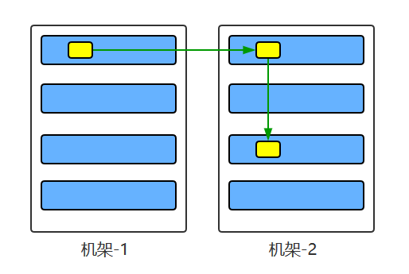
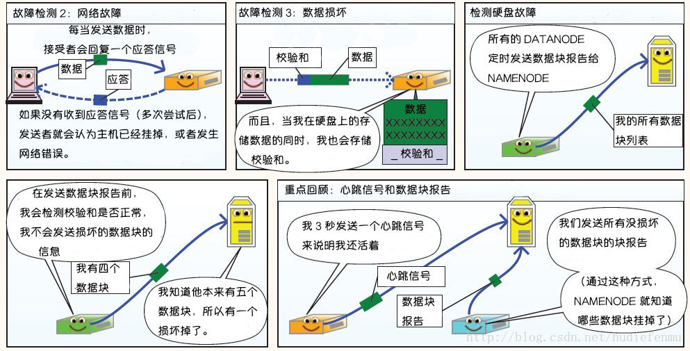

## 一、介绍

**HDFS** （Hadoop Distributed File System）是 Hadoop 下的分布式文件系统，具有高容错、高吞吐量等特性，可以部署在低成本的硬件上。

普通的文件系统：例如Linux、Windows、Mac等，有着清晰的目录结构，存放的是文件或者文件夹，对外提供创建、修改、删除、查看、移动等等。

分布式文件系统：除了包括普通文加系统的功能，还能够横跨N个机器

## 二、HDFS 设计原理

<div align="center">  </div>

### 2.1 HDFS 设计目标

硬件的错误是非常常见的，在一个HDFS集群里，有着成百上千的服务器，每个机器只存储文件的部分数据，默认使用3个副本，且集群中有着一个可以监控集群状况的组件。

HDFS更多的用来做数据批处理，存储大规模数据，不适合低延时数据访问和小文件存储，不适合实时访问。

### 2.2 HDFS 架构（非常重要，面试重点）

HDFS 遵循主/从（master/slave）架构，由单个 NameNode(简称NN) 和多个 DataNode(简称DN) 组成：

- **NameNode** : 充当master的职责，负责执行有关 ` 文件系统命名空间 ` 的操作，例如打开，关闭、重命名文件和目录等。它提供客户端对文件的访问，还负责集群元数据的存储，记录着文件中各个数据块的位置信息。例如，存储一个150MB文件，默认blocksize:128MB，150MB的文件会拆分成两个block来存储。block1:128MB，block2：22MB，NN会记录下每个块存放在哪个DN上。
- **DataNode**：充当slave，负责提供来自文件系统客户端的读写请求，执行块的创建，删除等操作。

### 2.3 详解文件系统命名空间

HDFS 的 ` 文件系统命名空间 ` 的层次结构与大多数文件系统类似 (如 Linux下的/home/Documents/dev/BigData/Hadoop/HadoopPictures)， 支持目录和文件的创建、移动、删除和重命名等操作，支持配置用户和访问权限，但不支持硬链接和软连接。`NameNode` 负责维护文件系统名称空间，记录对名称空间或其属性的任何更改，应用程序可以自己指定副本数。

### 2.5 数据复制

由于 Hadoop 被设计运行在廉价的机器上，这意味着硬件是不可靠的，为了保证容错性，HDFS 提供了数据复制机制。HDFS 将每一个文件存储为一系列**块**，每个块由多个副本来保证容错，块的大小和复制因子可以自行配置（默认情况下，块大小是 128M，默认复制因子是 3）。

<div align="center">  </div>

### 2.6 数据复制的实现原理

大型的 HDFS 实例在通常分布在多个机架的多台服务器上，不同机架上的两台服务器之间通过交换机进行通讯。在大多数情况下，同一机架中的服务器间的网络带宽大于不同机架中的服务器之间的带宽。因此 HDFS 采用机架感知副本放置策略，对于常见情况，当复制因子为 3 时，HDFS 的放置策略是：

在写入程序位于 `datanode` 上时，就优先将写入文件的一个副本放置在该 `datanode` 上，否则放在随机 `datanode` 上。之后在另一个远程机架上的任意一个节点上放置另一个副本，并在该机架上的另一个节点上放置最后一个副本。此策略可以减少机架间的写入流量，从而提高写入性能。

<div align="center">  </div>

如果复制因子大于 3，则随机确定第 4 个和之后副本的放置位置，同时保持每个机架的副本数量低于上限，上限值通常为 `（复制系数 - 1）/机架数量 + 2`，需要注意的是不允许同一个 `dataNode` 上具有同一个块的多个副本。

### 2.7  副本的选择

为了最大限度地减少带宽消耗和读取延迟，HDFS 在执行读取请求时，优先读取距离读取器最近的副本。如果在与读取器节点相同的机架上存在副本，则优先选择该副本。如果 HDFS 群集跨越多个数据中心，则优先选择本地数据中心上的副本。

### 2.8 架构的稳定性

#### 1. 心跳机制和重新复制

每个 DataNode 定期向 NameNode 发送心跳消息，如果超过指定时间没有收到心跳消息，则将 DataNode 标记为死亡。NameNode 不会将任何新的 IO 请求转发给标记为死亡的 DataNode，也不会再使用这些 DataNode 上的数据。 由于数据不再可用，可能会导致某些块的复制因子小于其指定值，NameNode 会跟踪这些块，并在必要的时候进行重新复制。

#### 2. 数据的完整性

由于存储设备故障等原因，存储在 DataNode 上的数据块也会发生损坏。为了避免读取到已经损坏的数据而导致错误，HDFS 提供了数据完整性校验机制来保证数据的完整性，具体操作如下：

当客户端创建 HDFS 文件时，它会计算文件的每个块的 ` 校验和 `，并将 ` 校验和 ` 存储在同一 HDFS 命名空间下的单独的隐藏文件中。当客户端检索文件内容时，它会验证从每个 DataNode 接收的数据是否与存储在关联校验和文件中的 ` 校验和 ` 匹配。如果匹配失败，则证明数据已经损坏，此时客户端会选择从其他 DataNode 获取该块的其他可用副本。

#### 3.元数据的磁盘故障

`FsImage` 和 `EditLog` 是 HDFS 的核心数据，这些数据的意外丢失可能会导致整个 HDFS 服务不可用。为了避免这个问题，可以配置 NameNode 使其支持 `FsImage` 和 `EditLog` 多副本同步，这样 `FsImage` 或 `EditLog` 的任何改变都会引起每个副本 `FsImage` 和 `EditLog` 的同步更新。

#### 4.支持快照

快照支持在特定时刻存储数据副本，在数据意外损坏时，可以通过回滚操作恢复到健康的数据状态。


## 三、图解HDFS存储原理

> 说明：以下图片引用自博客：[翻译经典 HDFS 原理讲解漫画](https://blog.csdn.net/hudiefenmu/article/details/37655491)

### 1. HDFS写数据原理

<div align="center">  </div>

<div align="center">  </div>

<div align="center">  </div>


### 2. HDFS读数据原理

<div align="center">  </div>


### 3. HDFS故障类型和其检测方法

<div align="center">  </div>

<div align="center">  </div>


### 4. 读写故障的处理

<div align="center">  </div>


### 5. DataNode 故障处理

<div align="center">  </div>


### 6. 副本布局策略

<div align="center">  </div>


## 四、HDFS的操作

HDFS的操作跟shell的操作一致，在hadoop目录下进行操作，前缀hadoop fs 加上下面的各类操作，常用的，例如：

-put（将文件上传）,

-ls（显示当前仓库中有哪些文件），

-cat（查看文件），

-mkdir（创建一个文件夹），

-get（从hdfs上获得一份文件到本地），

-mv（移动某个文件到某个位置），

-cp（将一个文件拷贝一份），

-getmerge（将两个文件合并起来），

-rm（删除一个文件），

-rmdir（删除一个为空的文件夹），

-rmr(此命令相当于-rm -r，删除一个文件夹),

-text(查看某个文件),-R(递归显示某个文件夹中的文件)
    
上传一个本地文件到hdfs后，可以使用Hadoop fs -du -s -h /文件，可以查看文件的具体大小。
    
其他操作：

```
Usage: hadoop fs [generic options]
    [-appendToFile <localsrc> ... <dst>]
    [-cat [-ignoreCrc] <src> ...]
    [-checksum <src> ...]
    [-chgrp [-R] GROUP PATH...]
    [-chmod [-R] <MODE[,MODE]... | OCTALMODE> PATH...]
    [-chown [-R] [OWNER][:[GROUP]] PATH...]
    [-copyFromLocal [-f] [-p] [-l] <localsrc> ... <dst>]
    [-copyToLocal [-p] [-ignoreCrc] [-crc] <src> ... <localdst>]
    [-count [-q] [-h] [-v] [-x] <path> ...]
    [-cp [-f] [-p | -p[topax]] <src> ... <dst>]
    [-createSnapshot <snapshotDir> [<snapshotName>]]
    [-deleteSnapshot <snapshotDir> <snapshotName>]
    [-df [-h] [<path> ...]]
    [-du [-s] [-h] [-x] <path> ...]
    [-expunge]
    [-find <path> ... <expression> ...]
    [-get [-p] [-ignoreCrc] [-crc] <src> ... <localdst>]
    [-getfacl [-R] <path>]
    [-getfattr [-R] {-n name | -d} [-e en] <path>]
    [-getmerge [-nl] <src> <localdst>]
    [-help [cmd ...]]
    [-ls [-C] [-d] [-h] [-q] [-R] [-t] [-S] [-r] [-u] [<path> ...]]
    [-mkdir [-p] <path> ...]
    [-moveFromLocal <localsrc> ... <dst>]
    [-moveToLocal <src> <localdst>]
    [-mv <src> ... <dst>]
    [-put [-f] [-p] [-l] <localsrc> ... <dst>]
    [-renameSnapshot <snapshotDir> <oldName> <newName>]
    [-rm [-f] [-r|-R] [-skipTrash] <src> ...]
    [-rmdir [--ignore-fail-on-non-empty] <dir> ...]
    [-setfacl [-R] [{-b|-k} {-m|-x <acl_spec>} <path>]|[--set <acl_spec> <path>]]
    [-setfattr {-n name [-v value] | -x name} <path>]
    [-setrep [-R] [-w] <rep> <path> ...]
    [-stat [format] <path> ...]
    [-tail [-f] <file>]
    [-test -[defsz] <path>]
    [-text [-ignoreCrc] <src> ...]
    [-touchz <path> ...]
    [-usage [cmd ...]]
```

## 五、HDFS API的初识

` HDFS相关的代码存放在 BigData-Learning/Hadoop/codes/HDFS/HDFS-API初识/hdfs 目录中 `

1. 首先在IDEA上，使用Maven来构建项目。创建一个maven-quickstart项目，引入下面的pom文件

```xml
<?xml version="1.0" encoding="UTF-8"?>

<project xmlns="http://maven.apache.org/POM/4.0.0" xmlns:xsi="http://www.w3.org/2001/XMLSchema-instance"
  xsi:schemaLocation="http://maven.apache.org/POM/4.0.0 http://maven.apache.org/xsd/maven-4.0.0.xsd">
  <modelVersion>4.0.0</modelVersion>

  <groupId>org.example</groupId>
  <artifactId>com.zyx.bigdata</artifactId>
  <version>1.0-SNAPSHOT</version>

  <name>com.zyx.bigdata</name>
  <!-- FIXME change it to the project's website -->
  <url>http://www.example.com</url>

  <properties>
    <project.build.sourceEncoding>UTF-8</project.build.sourceEncoding>
    <maven.compiler.source>1.8</maven.compiler.source>
    <maven.compiler.target>1.8</maven.compiler.target>
    <hadoop.version>2.6.0-cdh5.15.1</hadoop.version>

  </properties>
  <repositories>
    <repository>
      <id>cloudera</id>
      <url>https://repository.cloudera.com/artifactory/cloudera-repos</url>
    </repository>
  </repositories>
  <dependencies>
    <dependency>
      <groupId>junit</groupId>
      <artifactId>junit</artifactId>
      <version>4.11</version>
      <scope>test</scope>
    </dependency>


    <dependency>
      <groupId>org.apache.hadoop</groupId>
      <artifactId>hadoop-client</artifactId>
      <version>${hadoop.version}</version>
    </dependency>

  </dependencies>

  <build>
    <pluginManagement><!-- lock down plugins versions to avoid using Maven defaults (may be moved to parent pom) -->
      <plugins>
        <!-- clean lifecycle, see https://maven.apache.org/ref/current/maven-core/lifecycles.html#clean_Lifecycle -->
        <plugin>
          <artifactId>maven-clean-plugin</artifactId>
          <version>3.1.0</version>
        </plugin>
        <!-- default lifecycle, jar packaging: see https://maven.apache.org/ref/current/maven-core/default-bindings.html#Plugin_bindings_for_jar_packaging -->
        <plugin>
          <artifactId>maven-resources-plugin</artifactId>
          <version>3.0.2</version>
        </plugin>
        <plugin>
          <artifactId>maven-compiler-plugin</artifactId>
          <version>3.8.0</version>
        </plugin>
        <plugin>
          <artifactId>maven-surefire-plugin</artifactId>
          <version>2.22.1</version>
        </plugin>
        <plugin>
          <artifactId>maven-jar-plugin</artifactId>
          <version>3.0.2</version>
        </plugin>
        <plugin>
          <artifactId>maven-install-plugin</artifactId>
          <version>2.5.2</version>
        </plugin>
        <plugin>
          <artifactId>maven-deploy-plugin</artifactId>
          <version>2.8.2</version>
        </plugin>
        <!-- site lifecycle, see https://maven.apache.org/ref/current/maven-core/lifecycles.html#site_Lifecycle -->
        <plugin>
          <artifactId>maven-site-plugin</artifactId>
          <version>3.7.1</version>
        </plugin>
        <plugin>
          <artifactId>maven-project-info-reports-plugin</artifactId>
          <version>3.0.0</version>
        </plugin>
      </plugins>
    </pluginManagement>
  </build>
</project>


```

2. 使用HDFS API进行目录的创建，1.首先创建configuration 2.获取filesystem 3.设置相关的操作路径 4.调用api操作

```java
package org.example;

import org.apache.hadoop.conf.Configuration;
import org.apache.hadoop.fs.*;
import org.apache.hadoop.io.IOUtils;

import java.net.URI;

/**
 * 使用Java操作HDFS API
 * 1.首先创建configuration
 * 2.获取filesystem
 * 3.设置相关的操作路径
 * 4.调用api操作
 */
public class HdfsApp {

    public static final String HDFS_PATH = "hdfs://willhope-pc:8020";

    public static void main(String[] args) throws Exception {
        Configuration configuration = new Configuration();
        configuration.set("dfs.replication","1");
        //使用此抽象类来访问hdfs文件系统，设置服务地址和配置信息，如果使用的是虚拟机，则需要传入当前用户名
        FileSystem fileSystem = FileSystem.get(new URI(HDFS_PATH),configuration);

        System.out.println("---------进行文件目录的创建---------");

        boolean result = fileSystem.mkdirs(new Path("/hdfsapi/test"));
        System.out.println(result);

        System.out.println("---------上传本地文件到HDFS上---------");
        fileSystem.copyFromLocalFile(new Path("/home/willhope/Desktop/Marvel.txt"),new Path("/hdfsapi/test"));


        System.out.println("---------查看HDFS上某文件的内容---------");
        //从hdfs上读取文件时，使用FSDataInputStream类
        FSDataInputStream fsDataInputStream = fileSystem.open(new Path("/hdfsapi/test/Marvel.txt"));
        IOUtils.copyBytes(fsDataInputStream, System.out,1024);

        System.out.println("---------创建文件上传到HDFS上---------");
        //向hdfs上写文件时，使用FSDataOutputStream类
        FSDataOutputStream fsDataOutputStream = fileSystem.create(new Path("/hdfsapi/test/a.txt"));
        fsDataOutputStream.writeUTF("My-bigdata-learning");
        fsDataOutputStream.flush();
        fsDataOutputStream.close();

        System.out.println("---------对HDFS上文件名的更改---------");
        boolean res = fileSystem.rename(new Path("/hdfsapi/test/a.txt"),new Path("/hdfsapi/test/hello.txt"));
        System.out.println(res);

        System.out.println("---------从HDFS上下载文件---------");
        fileSystem.copyToLocalFile(new Path("/hdfsapi/test/hello.txt"),new Path("/home/willhope/Documents/"));

        System.out.println("---------列出HDFS上某目录下所有文件信息---------");
//        FileStatus[] fileStatuses = fileSystem.listStatus(new Path("/hdfsapi/test/"));
//        System.out.println(Arrays.asList(fileStatuses).toString());
        RemoteIterator<LocatedFileStatus> fileStatus = fileSystem.listFiles(new Path("/hdfsapi/test/"),true);
        while (fileStatus.hasNext()){
            LocatedFileStatus locatedFileStatus = fileStatus.next();
            String isDir = locatedFileStatus.isDirectory()?"文件夹":"文件";
            String permission = locatedFileStatus.getPermission().toString();
            short replication = locatedFileStatus.getReplication();
            long length = locatedFileStatus.getLen();
            String path = locatedFileStatus.getPath().toString();

            System.out.println(isDir+"\t"+permission+"\t"+replication+"\t"
                +length+"\t"+path);
        }

        System.out.println("---------查看HDFS上某文件的块信息---------");
        FileStatus fileStatus2 = fileSystem.getFileStatus(new Path("/hdfsapi/test/hello.txt"));
        BlockLocation[] blocks = fileSystem.getFileBlockLocations(fileStatus2,0,fileStatus2.getLen());

        for (BlockLocation block : blocks){
            for (String name : block.getNames()){
                System.out.println(name+":"+block.getOffset()+":"+block.getLength());
            }
        }

        System.out.println("---------删除HDFS上的文件---------");
        boolean rest = fileSystem.delete(new Path("/hdfsapi/test/hello.txt"),true);
        System.out.println(rest);

    }


}

```

3. 