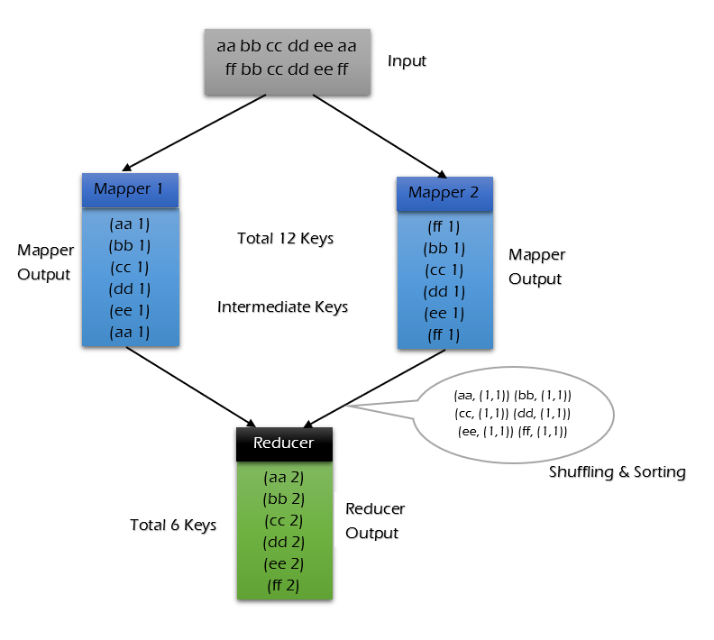
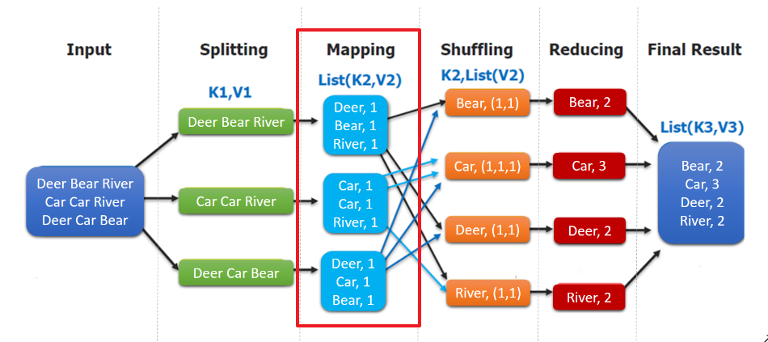
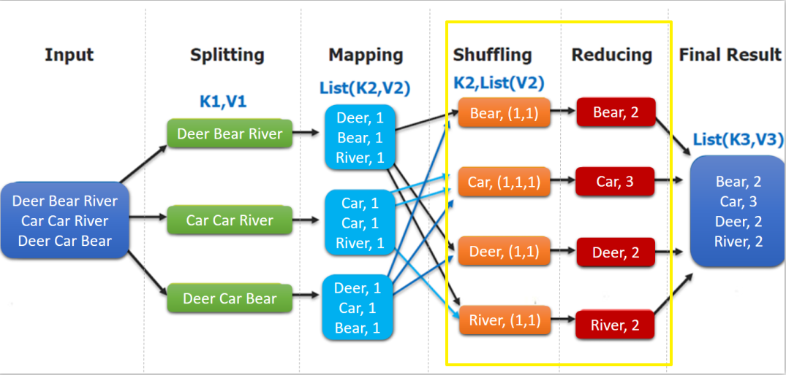
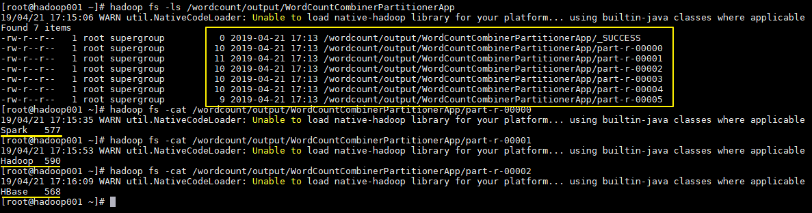

` 目录 `

- [一、MapReduce概述](#一mapreduce概述)
- [二、MapReduce编程模型简述](#二mapreduce编程模型简述)
- [三、combiner & partitioner](#三combiner--partitioner)
    - [3.1 InputFormat & RecordReaders](#31-inputformat--recordreaders)
    - [3.2 Combiner](#32-combiner)
    - [3.3 Partitioner](#33-partitioner)
- [四、MapReduce初识](#四mapreduce初识)
    - [4.1 项目简介](#41-项目简介)
    - [4.2 WordCountMapper](#42-wordcountmapper)
    - [4.3 WordCountReducer](#43-wordcountreducer)
    - [4.4 WordCountApp](#44-wordcountapp)
    - [4.5 提交到服务器运行](#45-提交到服务器运行)
    - [4.6 本地测试](#46-本地测试)
    - [4.7 数据文本忽略大小写问题](#47-数据文本忽略大小写问题)
- [五、词频统计案例进阶之Combiner](#五词频统计案例进阶之combiner)
    - [5.1 代码实现](#51-代码实现)
    - [5.2 执行结果](#52-执行结果)
- [六、词频统计案例进阶之Partitioner](#六词频统计案例进阶之partitioner)
    - [6.1  默认的Partitioner](#61--默认的partitioner)
    - [6.2 自定义Partitioner](#62-自定义parttioner)
    - [6.3  执行结果](#63--执行结果)
- [七、MapReduce实战](#七mapreduce实战)
    - [7.1 项目需求](#71-项目需求)  
    - [7.2 需求实现](#72-需求实现)

## 一、MapReduce概述

源自Google的MapReduce论文，论文发表于2004年12月。

Hadoop MapReduce 是一个分布式计算框架，用于编写批处理应用程序。编写好的程序可以提交到 Hadoop 集群上用于并行离线处理大规模的数据集，不适用实时处理。


## 二、MapReduce编程模型简述

这里以词频统计为例进行说明，MapReduce 处理的流程如下：

<div align="center">  </div>

1. **input** : 读取文本文件，输入数据；

2. **splitting** : 将文件按照行进行拆分，此时得到的 `K1` 行数，`V1` 表示对应行的文本内容；

3. **mapping** : 此部分并行将每一行按照拆分规则进行拆分，拆分规则有程序员编写，拆分得到的 `List(K2,V2)`，其中 `K2` 代表每一个单词，由于是做词频统计，所以 `V2` 的值为 1，代表出现 1 次；

4. **shuffling** ： 由于 `Mapping` 操作可能是在不同的机器上并行处理的，所以需要通过 `shuffling` 将相同 `key` 值的数据分发到同一个节点上去合并，这样才能统计出最终的结果，此时得到 `K2` 为每一个单词，`List(V2)` 为可迭代集合，`V2` 就是 Mapping 中的 V2；

5. **Reducing** : 设置整合归并规则。这里的案例是统计单词出现的总次数，所以 `Reducing` 对 `List(V2)` 进行归约求和操作，最终输出。

MapReduce 编程模型中 `splitting` 和 `shuffing` 操作都是由框架实现的，需要我们自己编程实现的只有 `mapping` 和 `reducing`，这也就是 MapReduce 这个称呼的来源。MapReduce 框架专门用于 `<key，value>` 键值对处理，它将作业的输入视为一组 `<key，value>` 对，并生成一组 `<key，value>` 对作为输出。输出和输出的 `key` 和 `value` 都必须实现[Writable](http://hadoop.apache.org/docs/stable/api/org/apache/hadoop/io/Writable.html) 接口。

```
(input) <k1, v1> -> map -> <k2, v2> -> combine -> <k2, v2> -> reduce -> <k3, v3> (output)
```


## 三、combiner & partitioner

<div align="center">  </div>

### 3.1 InputFormat & RecordReaders 

`InputFormat` 将输出文件拆分为多个 `InputSplit`，并由 `RecordReaders` 将 `InputSplit` 转换为标准的<key，value>键值对，作为 map 的输出。这一步的意义在于只有先进行逻辑拆分并转为标准的键值对格式后，才能为多个 `map` 提供输入，以便进行并行处理。


### 3.2 Combiner

`combiner` 是 `map` 运算后的可选操作，它实际上是一个本地化的 `reduce` 操作，它主要是在 `map` 计算出中间文件后做一个简单的合并重复 `key` 值的操作。这里以词频统计为例：

`map` 在遇到一个 hadoop 的单词时就会记录为 1，但是这篇文章里 hadoop 可能会出现 n 多次，那么 `map` 输出文件冗余就会很多，因此在 `reduce` 计算前对相同的 key 做一个合并操作，那么需要传输的数据量就会减少，传输效率就可以得到提升。

但并非所有场景都适合使用 `combiner`，使用它的原则是 `combiner` 的输出不会影响到 `reduce` 计算的最终输入，例如：求总数，最大值，最小值时都可以使用 `combiner`，但是做平均值计算则不能使用 `combiner`。

不使用 combiner 的情况：

<div align="center">  </div>

使用 combiner 的情况：

<div align="center">  </div>


可以看到使用 combiner 的时候，需要传输到 reducer 中的数据由 12keys，降低到 10keys。降低的幅度取决于你 keys 的重复率，下文词频统计案例会演示用 combiner 降低数百倍的传输量。

### 3.3 Partitioner

`partitioner` 可以理解成分类器，将 `map` 的输出按照 key 值的不同分别分给对应的 `reducer`，支持自定义实现，下文案例会给出演示。


## 四、MapReduce初识

WordCount词频统计案例

> 项目代码：BigData-Learning/Hadoop/codes/MapReduce/mrpreliminary

### 4.1 项目简介

这里给出一个经典的词频统计的案例：统计如下样本数据中每个单词出现的次数。

```
Spark	HBase
Hive	Flink	Storm	Hadoop	HBase	Spark
Flink
HBase	Storm
HBase	Hadoop	Hive	Flink
HBase	Flink	Hive	Storm
Hive	Flink	Hadoop
HBase	Hive
Hadoop	Spark	HBase	Storm
HBase	Hadoop	Hive	Flink
HBase	Flink	Hive	Storm
Hive	Flink	Hadoop
HBase	Hive
```

### 4.2 WordCountMapper

自定义mapper类，实现将每行数据按照指定分隔符进行拆分，继承Hadoop提供的Mapper类，并且重写map函数，在map函数中，实现拆分的逻辑。这里需要注意在 MapReduce 中必须使用 Hadoop 定义的类型，因为 Hadoop 预定义的类型都是[可序列化](https://www.jianshu.com/p/89c2a19772e2)，可比较的，所有类型均实现了 `WritableComparable` 接口。

```java
import org.apache.hadoop.mapreduce.Mapper;

import java.io.IOException;

/**
 * KEYIN: Map任务读取数据的key，offset，是每行数据的起始位置的偏移量，也可直接理解为行数，Long类型
 * VALUEIN: Map任务读取数据的value，其实就是一行行的字符串，String类型
 *
 * 其实keyin，valuein是splitting阶段执行的将文件按照行进行拆分操作，此时得到的keyin表示行数，valuein表示对应行的文本内容；
 *
 * 经过Mapping操作，自定义拆分规则后，得到下面(KEYOUT,VALUEOUT)
 *
 * KEYOUT: Map任务结束后的输出key，词频统计，此key就是单词，String类型
 * VALUEOUT: Map任务结束的输出value，为每个单词追加数字1，Interger，或者Long类型
 *
 * 其中keyout，valueout是一个list，即list(keyout,valueout)
 * 例如 hello    word    hello，输出后，就是list(hello,1) list(word,1) list(hello,1)
 *
 * Long,String,Integer是Java里的数据类型，但是在Hadoop中，这些类型要使用Hadoop自定义的类型。对应的类型如下：
 * LongWritable，Text，IntWritable
 *
 */
public class WordCountMapper extends Mapper<LongWritable,Text,Text, IntWritable> {

    @Override
    protected void map(LongWritable key, Text value, Context context) throws IOException, InterruptedException {

        // 把value对应的行数据按照指定的分隔符拆分
        String[] words = value.toString().split("\t");

        for (String word : words){
            //使用上下文将结果写出去，当前的word是Java的String类型，追加数字是int类型，要转换为Hadoop的类型，这些类型都是类，因此做一个封装
            context.write(new Text(word) , new IntWritable(1));
        }

    }
}

```

`WordCountMapper` 对应下图的 Mapping 操作：

<div align="center">  </div>


`WordCountMapper` 继承自 `Mappe` 类，这是一个泛型类，定义如下：

```java
WordCountMapper extends Mapper<LongWritable, Text, Text, IntWritable>

public class Mapper<KEYIN, VALUEIN, KEYOUT, VALUEOUT> {
   ......
}
```

+ **KEYIN** : `mapping` 输入 key 的类型，即每行的偏移量 (每行第一个字符在整个文本中的位置)，`Long` 类型，对应 Hadoop 中的 `LongWritable` 类型；
+ **VALUEIN** : `mapping` 输入 value 的类型，即每行数据；`String` 类型，对应 Hadoop 中 `Text` 类型；
+ **KEYOUT** ：`mapping` 输出的 key 的类型，即每个单词；`String` 类型，对应 Hadoop 中 `Text` 类型；
+ **VALUEOUT**：`mapping` 输出 value 的类型，即每个单词出现的次数；这里用 `int` 类型，对应 `IntWritable` 类型。


### 4.3 WordCountReducer

在 Reduce 中进行单词出现次数的统计：

```java
package org.example.mapreduce.mrpreliminary;

import org.apache.hadoop.io.IntWritable;
import org.apache.hadoop.io.Text;
import org.apache.hadoop.mapreduce.Reducer;

import java.io.IOException;
import java.util.Iterator;

public class WordCountReducer extends Reducer<Text, IntWritable , Text , IntWritable> {

    /**
     *  mapping到reducing阶段中间有一个shuffling,
     *  通过 shuffling 将相同 key 值的数据分发到同一个节点上去合并，
     *  这样才能统计出最终的结果，
     *  此时得到 K2 为每一个单词，
     *  List(V2) 为可迭代集合，
     *  V2 就是 Mapping 中的 V2；
     *
     *  例如 hello    word    hello
     *
     *  map结束输出list(hello,1)，list(word,1)，list(hello,1)
     *  shuffle结束后输出 hello，list(1,1)  word，list(1)
     *  reduce接收  hello，list(1,1)  word，list(1)进行处理
     *
     * @param key 单词
     * @param values 可迭代的list集合
     * @param context 上下文
     * @throws IOException
     * @throws InterruptedException
     */
    @Override
    protected void reduce(Text key, Iterable<IntWritable> values, Context context) throws IOException, InterruptedException {
        //定义count用来计数
        int count = 0;

        //values是一个可以迭代的集合，将其赋值给一个迭代器
        Iterator<IntWritable> iterator = values.iterator();

        //通过迭代器取出集合中的元素
        while(iterator.hasNext()){
            IntWritable value = iterator.next();
            //使用get方法，将取出的单个元素返回成int类型
            count += value.get();
        }

        //将结果写出去
        context.write(key , new IntWritable(count));
    }
}

```

如下图，`shuffling` 的输出是 reduce 的输入。这里的 key 是每个单词，values 是一个可迭代的数据类型，类似 `(1,1,1,...)`。

<div align="center">  </div>

### 4.4 WordCountApp

组装 MapReduce 作业，并提交到服务器运行，代码如下：

```java

import org.apache.hadoop.conf.Configuration;
import org.apache.hadoop.fs.FileSystem;
import org.apache.hadoop.fs.Path;
import org.apache.hadoop.io.IntWritable;
import org.apache.hadoop.io.Text;
import org.apache.hadoop.mapreduce.Job;
import org.apache.hadoop.mapreduce.lib.input.FileInputFormat;
import org.apache.hadoop.mapreduce.lib.output.FileOutputFormat;

import java.net.URI;

/**
 * 组装作业 并提交到集群运行
 */
public class WordCountApp {


    // 这里为了直观显示参数 使用了硬编码，实际开发中可以通过外部传参
    private static final String HDFS_PATH = "hdfs://willhope-pc:8020";
    //如果使用虚拟机则要定义下面的用户名，以防止权限不足
//    private static final String HADOOP_USER_NAME = "root";

    public static void main(String[] args) throws Exception {

        // 需要指明 hadoop 用户名，否则在 HDFS 上创建目录时可能会抛出权限不足的异常
//        System.setProperty("HADOOP_USER_NAME", HADOOP_USER_NAME);

        Configuration configuration = new Configuration();
        // 指明 HDFS 的地址
        configuration.set("fs.defaultFS", HDFS_PATH);
        configuration.set("dfs.replication","1");
        // 创建一个 Job
        Job job = Job.getInstance(configuration);

        // 设置Job对应的主类
        job.setJarByClass(WordCountApp.class);

        // 设置Job对应参数：设置 Mapper 和 Reducer处理类
        job.setMapperClass(WordCountMapper.class);
        job.setReducerClass(WordCountReducer.class);

        // 设置 Mapper 输出 key 和 value 的类型
        job.setMapOutputKeyClass(Text.class);
        job.setMapOutputValueClass(IntWritable.class);

        // 设置 Reducer 输出 key 和 value 的类型
        job.setOutputKeyClass(Text.class);
        job.setOutputValueClass(IntWritable.class);

        // 如果输出目录已经存在，则必须先删除，否则重复运行程序时会抛出异常
//        FileSystem fileSystem = FileSystem.get(new URI(HDFS_PATH), configuration, HADOOP_USER_NAME);
        FileSystem fileSystem = FileSystem.get(new URI(HDFS_PATH), configuration);
        Path inputPath = new Path("/wordcount/input");
        Path outputPath = new Path("/wordcount/output");
        if (fileSystem.exists(outputPath)) {
            fileSystem.delete(outputPath, true);
        }

        // 设置作业输入文件和输出文件的路径
        FileInputFormat.setInputPaths(job, inputPath);
        FileOutputFormat.setOutputPath(job, outputPath);

        // 使用wautForCompletion方法，将作业提交到群集并等待它完成，参数设置为 true 代表打印显示对应的进度
        boolean result = job.waitForCompletion(true);

        // 关闭之前创建的 fileSystem
        fileSystem.close();

        // 根据作业结果,终止当前运行的 Java 虚拟机,退出程序
        System.exit(result ? 0 : -1);

    }
}
```

需要注意的是：如果不设置 `Mapper` 操作的输出类型，则程序默认它和 `Reducer` 操作输出的类型相同。

### 4.5 提交到服务器运行

在实际开发中，可以在本机配置 hadoop 开发环境，直接在 IDE 中启动进行测试。这里主要介绍一下打包提交到服务器运行。由于本项目没有使用除 Hadoop 外的第三方依赖，直接打包即可：

```shell
# mvn clean package
```

使用以下命令提交作业：

```shell
hadoop jar /willhope/usrlib/hadoop-word-count-1.0.jar \
org.example.mapreduce.mrpreliminary.WordCountApp \
/wordcount/input/data.txt /wordcount/output/
```


### 4.6 本地测试

在IDEA的当前项目中，创建一个input目录，在此目录中放入要处理的数据文件。使用本地测试运行wordcount，map和reduce不变，只需要更改driver类。代码如下：

```java
import org.apache.hadoop.conf.Configuration;
import org.apache.hadoop.fs.Path;
import org.apache.hadoop.io.IntWritable;
import org.apache.hadoop.io.Text;
import org.apache.hadoop.mapreduce.Job;
import org.apache.hadoop.mapreduce.lib.input.FileInputFormat;
import org.apache.hadoop.mapreduce.lib.output.FileOutputFormat;

/**
 * 使用本地文件进行统计，将结果输出到本地
 */
public class WordCountLocalApp {


    public static void main(String[] args) throws Exception {


        Configuration configuration = new Configuration();
        // 指明 HDFS 的地址
        configuration.set("dfs.replication","1");
        // 创建一个 Job
        Job job = Job.getInstance(configuration);

        // 设置Job对应的主类
        job.setJarByClass(WordCountLocalApp.class);

        // 设置Job对应参数：设置 Mapper 和 Reducer处理类
        job.setMapperClass(WordCountMapper.class);
        job.setReducerClass(WordCountReducer.class);

        // 设置 Mapper 输出 key 和 value 的类型
        job.setMapOutputKeyClass(Text.class);
        job.setMapOutputValueClass(IntWritable.class);

        // 设置 Reducer 输出 key 和 value 的类型
        job.setOutputKeyClass(Text.class);
        job.setOutputValueClass(IntWritable.class);


        // 设置作业输入文件和输出文件的路径
        FileInputFormat.setInputPaths(job, new Path("input"));
        FileOutputFormat.setOutputPath(job, new Path("output"));

        // 使用wautForCompletion方法，将作业提交到群集并等待它完成，参数设置为 true 代表打印显示对应的进度
        boolean result = job.waitForCompletion(true);


        // 根据作业结果,终止当前运行的 Java 虚拟机,退出程序
        System.exit(result ? 0 : -1);

    }
}


```

### 4.7 数据文本忽略大小写问题

如果想要的结果不区分到小写，让结果转换成大写或小写，只需要在Mapper类map函数写出数据时，设置大小写。

```java

    //转换为小写
    context.write(new Text(word.toLowerCase()) , new IntWritable(1));
    //转换为大写
    context.write(new Text(word.toUpperCase()) , new IntWritable(1));

```


## 五、词频统计案例进阶之Combiner

### 5.1 代码实现

想要使用 `combiner` 功能只要在组装作业时，添加下面一行代码即可：

```java
// 设置 Combiner
job.setCombinerClass(WordCountReducer.class);
```

### 5.2 执行结果

加入 `combiner` 后统计结果是不会有变化的，但是可以从打印的日志看出 `combiner` 的效果：

没有加入 `combiner` 的打印日志：

<div align="center">  </div>

加入 `combiner` 后的打印日志如下：

<div align="center">  </div>

这里我们只有一个输入文件并且小于 128M，所以只有一个 Map 进行处理。可以看到经过 combiner 后，records 由 `3519` 降低为 `6`(样本中单词种类就只有 6 种)，在这个用例中 combiner 就能极大地降低需要传输的数据量。

Combiner有着局限性，不适合除法，求平均等操作。

## 六、词频统计案例进阶之Partitioner

### 6.1  默认的Partitioner

这里假设有个需求：将不同单词的统计结果输出到不同文件。这种需求实际上比较常见，比如统计产品的销量时，需要将结果按照产品种类进行拆分。要实现这个功能，就需要用到自定义 `Partitioner`。

这里先介绍下 MapReduce 默认的分类规则：在构建 job 时候，如果不指定，默认的使用的是 `HashPartitioner`：对 key 值进行哈希散列并对 `numReduceTasks` 取余。其实现如下：

```java
public class HashPartitioner<K, V> extends Partitioner<K, V> {

  public int getPartition(K key, V value,
                          int numReduceTasks) {
    return (key.hashCode() & Integer.MAX_VALUE) % numReduceTasks;
  }

}
```

### 6.2 自定义Partitioner

这里我们继承 `Partitioner` 自定义分类规则，这里按照单词进行分类：

```java
public class CustomPartitioner extends Partitioner<Text, IntWritable> {

    public int getPartition(Text text, IntWritable intWritable, int numPartitions) {
        return WordCountDataUtils.WORD_LIST.indexOf(text.toString());
    }
}
```

在构建 `job` 时候指定使用我们自己的分类规则，并设置 `reduce` 的个数：

```java
// 设置自定义分区规则
job.setPartitionerClass(CustomPartitioner.class);
// 设置 reduce 个数
job.setNumReduceTasks(WordCountDataUtils.WORD_LIST.size());
```


### 6.3  执行结果

执行结果如下，分别生成 6 个文件，每个文件中为对应单词的统计结果：

<div align="center">  </div>


## 七、MapReduce实战

### 7.1 项目需求

本地处理access日志，存放于AccessInput目录下：

```
1363157985066 	13726230503	00-FD-07-A4-72-B8:CMCC	120.196.100.82	i02.c.aliimg.com		24	27	2481	24681	200
1363157995052 	13826544101	5C-0E-8B-C7-F1-E0:CMCC	120.197.40.4			4	0	264	0	200
1363157991076 	13926435656	20-10-7A-28-CC-0A:CMCC	120.196.100.99			2	4	132	1512	200
1363154400022 	13926251106	5C-0E-8B-8B-B1-50:CMCC	120.197.40.4			4	0	240	0	200
1363157993044 	18211575961	94-71-AC-CD-E6-18:CMCC-EASY	120.196.100.99	iface.qiyi.com	视频网站	15	12	1527	2106	200
1363157995074 	84138413	5C-0E-8B-8C-E8-20:7DaysInn	120.197.40.4	122.72.52.12		20	16	4116	1432	200
1363157993055 	13560439658	C4-17-FE-BA-DE-D9:CMCC	120.196.100.99			18	15	1116	954	200
1363157995033 	15920133257	5C-0E-8B-C7-BA-20:CMCC	120.197.40.4	sug.so.360.cn	信息安全	20	20	3156	2936	200
1363157983019 	13719199419	68-A1-B7-03-07-B1:CMCC-EASY	120.196.100.82			4	0	240	0	200
1363157984041 	13660577991	5C-0E-8B-92-5C-20:CMCC-EASY	120.197.40.4	s19.cnzz.com	站点统计	24	9	6960	690	200
1363157973098 	15013685858	5C-0E-8B-C7-F7-90:CMCC	120.197.40.4	rank.ie.sogou.com	搜索引擎	28	27	3659	3538	200
1363157986029 	15989002119	E8-99-C4-4E-93-E0:CMCC-EASY	120.196.100.99	www.umeng.com	站点统计	3	3	1938	180	200
1363157992093 	13560439658	C4-17-FE-BA-DE-D9:CMCC	120.196.100.99			15	9	918	4938	200
1363157986041 	13480253104	5C-0E-8B-C7-FC-80:CMCC-EASY	120.197.40.4			3	3	180	180	200
1363157984040 	13602846565	5C-0E-8B-8B-B6-00:CMCC	120.197.40.4	2052.flash2-http.qq.com	综合门户	15	12	1938	2910	200
1363157995093 	13922314466	00-FD-07-A2-EC-BA:CMCC	120.196.100.82	img.qfc.cn		12	12	3008	3720	200
1363157982040 	13502468823	5C-0A-5B-6A-0B-D4:CMCC-EASY	120.196.100.99	y0.ifengimg.com	综合门户	57	102	7335	110349	200
1363157986072 	18320173382	84-25-DB-4F-10-1A:CMCC-EASY	120.196.100.99	input.shouji.sogou.com	搜索引擎	21	18	9531	2412	200
1363157990043 	13925057413	00-1F-64-E1-E6-9A:CMCC	120.196.100.55	t3.baidu.com	搜索引擎	69	63	11058	48243	200
1363157988072 	13760778710	00-FD-07-A4-7B-08:CMCC	120.196.100.82			2	2	120	120	200
1363157985066 	13726238888	00-FD-07-A4-72-B8:CMCC	120.196.100.82	i02.c.aliimg.com		24	27	2481	24681	200
1363157993055 	13560436666	C4-17-FE-BA-DE-D9:CMCC	120.196.100.99			18	15	1116	954	200
1363157985066 	13726238888	00-FD-07-A4-72-B8:CMCC	120.196.100.82	i02.c.aliimg.com		24	27	10000	20000	200
```

第二个字段是电话号，倒数第三个字段是上行流量、倒数第二个下行流量。

需求：统计每个手机号上行流量和、下行流量和、总的流量（上行+下行）。需要根据手机号进行分组，将该手机的上行和下行流量加起来。

### 7.2 需求实现

1. 首先需要定义一个Access类，这个类是我们的自定义复杂类型，主要用来将需求中的所需要的项提取出来。

```java
import org.apache.hadoop.io.Writable;

import java.io.DataInput;
import java.io.DataOutput;
import java.io.IOException;

/**
 * 自定义一个复杂类型
 * 1. 按照hadoop规范，需要实现Writable接口
 * 2. 按照Hadoop规范，需要重写write和readFields这两个方法
 * 3. 定义一个默认的构造方法
 */
public class Access implements Writable{

    private String phone;
    private long up;
    private long down;
    private long sum;

    public Access(){}

    public String getPhone() {
        return phone;
    }

    public void setPhone(String phone) {
        this.phone = phone;
    }

    public long getUp() {
        return up;
    }

    public void setUp(long up) {
        this.up = up;
    }

    public long getDown() {
        return down;
    }

    public void setDown(long down) {
        this.down = down;
    }

    public long getSum() {
        return sum;
    }

    public void setSum(long sum) {
        this.sum = sum;
    }

    @Override
    public void write(DataOutput out) throws IOException {
        //将需求中所需要的项写出去
        out.writeUTF(phone);
        out.writeLong(up);
        out.writeLong(down);
        out.writeLong(sum);

    }

    @Override
    public void readFields(DataInput in) throws IOException {

        this.phone = in.readUTF();
        this.up = in.readLong();
        this.down = in.readLong();
        this.sum = in.readLong();
    }

    @Override
    public String toString() {
        return "Access{" +
                "phone='" + phone + '\'' +
                ", up=" + up +
                ", down=" + down +
                ", sum=" + sum +
                '}';
    }
}


```

2. Mapper阶段：需要将输入的数据，安行拆分出手机号、上行流量、下行流量、求出总和，将手机号作为key，将Access作为value输出。

```java
import org.apache.hadoop.io.LongWritable;
import org.apache.hadoop.io.Text;
import org.apache.hadoop.mapreduce.Mapper;

import java.io.IOException;

/**
 * 自定义Mapper类
 */
public class AccessMapper extends Mapper<LongWritable , Text , Text , Access> {

    @Override
    protected void map(LongWritable key, Text value, Context context) throws IOException, InterruptedException {

        String[] lines = value.toString().split("\t");
        String phone = lines[1];
        Long up = Long.parseLong(lines[lines.length-3]);
        Long down = Long.parseLong(lines[lines.length-2]);

        context.write(new Text(phone),new Access(phone,up,down));
    }
}


```

3. Reducer阶段：

```java
import org.apache.hadoop.io.Text;
import org.apache.hadoop.mapreduce.Reducer;

import java.io.IOException;

public class AccessReducer extends Reducer<Text,Access,Text,Access> {

    @Override
    protected void reduce(Text key, Iterable<Access> values, Context context) throws IOException, InterruptedException {

        long ups = 0;
        long downs = 0;

        for (Access access : values){
            ups += access.getUp();
            downs += access.getDown();
        }


        context.write(key , new Access(key.toString(),ups,downs));
    }
}


```

4. Driver类

```java

import org.apache.hadoop.conf.Configuration;
import org.apache.hadoop.fs.Path;
import org.apache.hadoop.io.Text;
import org.apache.hadoop.mapreduce.Job;
import org.apache.hadoop.mapreduce.lib.input.FileInputFormat;
import org.apache.hadoop.mapreduce.lib.output.FileOutputFormat;

public class AccessLocalApp {

    public static void main(String[] args) throws Exception{

        Configuration configuration = new Configuration();
        configuration.set("dfs.replication","1");

        Job job = Job.getInstance(configuration);

        //设置主类
        job.setJarByClass(AccessLocalApp.class);

        //设置mapper和reducer主类‘
        job.setMapperClass(AccessMapper.class);
        job.setReducerClass(AccessReducer.class);

        //设置mapper输出类型
        job.setMapOutputKeyClass(Text.class);
        job.setMapOutputValueClass(Access.class);

        //设置reducer输出类型
        job.setOutputKeyClass(Text.class);
        job.setOutputValueClass(Access.class);

        //设置输入输出文件目录
        FileInputFormat.setInputPaths(job,new Path("AccessInput"));
        FileOutputFormat.setOutputPath(job,new Path("AccessOutput"));

        //提交
        job.waitForCompletion(true);
    }


}


```

5. 运行结果

```

13480253104	Access{phone='13480253104', up=180, down=180, sum=360}
13502468823	Access{phone='13502468823', up=7335, down=110349, sum=117684}
13560436666	Access{phone='13560436666', up=1116, down=954, sum=2070}
13560439658	Access{phone='13560439658', up=2034, down=5892, sum=7926}
13602846565	Access{phone='13602846565', up=1938, down=2910, sum=4848}
13660577991	Access{phone='13660577991', up=6960, down=690, sum=7650}
13719199419	Access{phone='13719199419', up=240, down=0, sum=240}
13726230503	Access{phone='13726230503', up=2481, down=24681, sum=27162}
13726238888	Access{phone='13726238888', up=12481, down=44681, sum=57162}
13760778710	Access{phone='13760778710', up=120, down=120, sum=240}
13826544101	Access{phone='13826544101', up=264, down=0, sum=264}
13922314466	Access{phone='13922314466', up=3008, down=3720, sum=6728}
13925057413	Access{phone='13925057413', up=11058, down=48243, sum=59301}
13926251106	Access{phone='13926251106', up=240, down=0, sum=240}
13926435656	Access{phone='13926435656', up=132, down=1512, sum=1644}
15013685858	Access{phone='15013685858', up=3659, down=3538, sum=7197}
15920133257	Access{phone='15920133257', up=3156, down=2936, sum=6092}
15989002119	Access{phone='15989002119', up=1938, down=180, sum=2118}
18211575961	Access{phone='18211575961', up=1527, down=2106, sum=3633}
18320173382	Access{phone='18320173382', up=9531, down=2412, sum=11943}
84138413	Access{phone='84138413', up=4116, down=1432, sum=5548}


```

发现上面的运行结果不好看，电话号的显示重复了，而且，有Access{}的出现。对于电话号的重复问题，我们可以使用NullWritable来作为reducer阶段输出的key。而Access{}则是在Access类中，修改重写的toString方法。

```java

//在Access类中，修改toString方法
    @Override
    public String toString() {
        return  phone + "\t" +
                ", " + up +
                ", " + down +
                ", " + sum ;
    }

//在reducer类处，修改第三个参数为NullWritable
public class AccessReducer extends Reducer<Text,Access, NullWritable,Access>

//在reducer类写出时，使用NullWritable.get()
context.write(NullWritable.get() , new Access(key.toString(),ups,downs));

//再修改driver中reducer输出类
job.setOutputKeyClass(NullWritable.class);

```

6. 将统计结果进行分区

定义一个自定义分区类，设置分区规则。Patitioner类接收的类型是map的输出类型。我们将以13开头的，15开头的和其他开头的结果各自存放在一个文件中。即定义了3个分区。

```java
import org.apache.hadoop.io.Text;
import org.apache.hadoop.mapreduce.Partitioner;

/**
 * 自定义分区
 * Partitioner需要传入map的输出类型
 */
public class AccessPartitioner extends Partitioner<Text, Access> {

    /**
     * @param text 手机号
     */
    @Override
    public int getPartition(Text text, Access access, int numPartitions) {

        if(text.toString().startsWith("13")){
            return 0;
        }else if(text.toString().startsWith("15")){
            return 1;
        }else {
            return 2;
        }
    }
}
```

在Driver类中，要加载partitioner类，并设置reduce的个数

```java

    //设置自定义分区规则
    job.setPartitionerClass(AccessPartitioner.class);
    //设置分区数，即设置reduce个数，分区逻辑分了几个，reduce就写几个
    job.setNumReduceTasks(3);

```