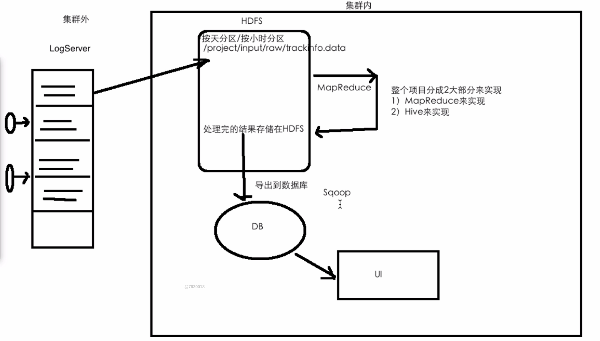
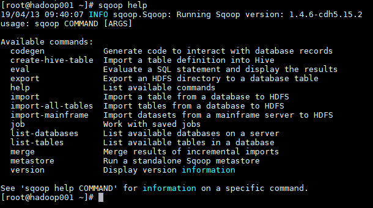
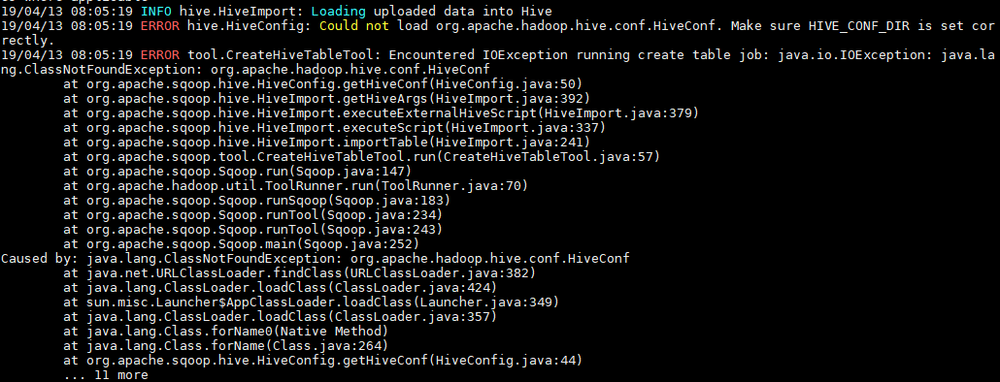
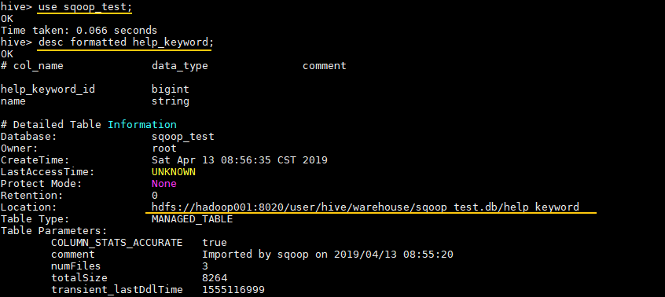

` 目录 `

- [第一部分——HDFS](#第一部分hdfs)
    - [一、介绍](#一介绍)
    - [二、HDFS 设计原理](#二hdfs-设计原理)
        - [2.1 HDFS 设计目标](#21-hdfs-设计目标)
        - [2.2 HDFS 架构（非常重要，面试重点）](#22-hdfs-架构非常重要面试重点)
        - [2.3 详解文件系统命名空间](#23-详解文件系统命名空间)
        - [2.5 数据复制](#25-数据复制)
        - [2.6 数据复制的实现原理](#26-数据复制的实现原理)
        - [2.7  副本的选择](#27--副本的选择)
        - [2.8 架构的稳定性](#28-架构的稳定性)
            - [1. 心跳机制和重新复制](#1-心跳机制和重新复制)
            - [2. 数据的完整性](#2-数据的完整性)
            - [3.元数据的磁盘故障](#3元数据的磁盘故障)
            - [4.支持快照](#4支持快照)
    - [三、图解HDFS存储原理](#三图解hdfs存储原理)
        - [3.1 HDFS写数据原理](#31-hdfs写数据原理)
        - [3.2 HDFS读数据原理](#32-hdfs读数据原理)
        - [3.3 HDFS故障类型和其检测方法](#33-hdfs故障类型和其检测方法)
        - [3.4 读写故障的处理](#34-读写故障的处理)
        - [3.5 DataNode 故障处理](#35-datanode-故障处理)
        - [3.6 副本布局策略](#36-副本布局策略)
    - [四、HDFS的操作](#四hdfs的操作)
    - [五、HDFS API的初识](#五hdfs-api的初识)
    - [六、HDFS实战](#六hdfs实战)
- [第二部分——MapReduce](#第二部分mapreduce)
    - [一、MapReduce概述](#一mapreduce概述)
    - [二、MapReduce编程模型简述](#二mapreduce编程模型简述)
    - [三、combiner & partitioner](#三combiner--partitioner)
        - [3.1 InputFormat & RecordReaders](#31-inputformat--recordreaders)
        - [3.2 Combiner](#32-combiner)
        - [3.3 Partitioner](#33-partitioner)
    - [四、MapReduce初识](#四mapreduce初识)
        - [4.1 项目简介](#41-项目简介)
        - [4.2 WordCountMapper](#42-wordcountmapper)
        - [4.3 WordCountReducer](#43-wordcountreducer)
        - [4.4 WordCountApp](#44-wordcountapp)
        - [4.5 提交到服务器运行](#45-提交到服务器运行)
        - [4.6 本地测试](#46-本地测试)
        - [4.7 数据文本忽略大小写问题](#47-数据文本忽略大小写问题)
    - [五、词频统计案例进阶之Combiner](#五词频统计案例进阶之combiner)
        - [5.1 代码实现](#51-代码实现)
        - [5.2 执行结果](#52-执行结果)
    - [六、词频统计案例进阶之Partitioner](#六词频统计案例进阶之partitioner)
        - [6.1  默认的Partitioner](#61--默认的partitioner)
        - [6.2 自定义Partitioner](#62-自定义partitioner)
        - [6.3  执行结果](#63--执行结果)
    - [七、MapReduce实战](#七mapreduce实战)
        - [7.1 项目需求](#71-项目需求)
        - [7.2 需求实现](#72-需求实现)
- [第三部分——Yarn](#第三部分yarn)
    - [一、hadoop yarn 简介](#一hadoop-yarn-简介)
    - [二、YARN架构](#二yarn架构)
        - [2.1 ResourceManager](#21-resourcemanager)
        - [2.2 NodeManager](#22-nodemanager)
        - [2.3 ApplicationMaster](#23-applicationmaster)
        - [2.4 Contain](#24-contain)
    - [三、YARN工作原理简述](#三yarn工作原理简述)
    - [四、YARN工作原理详述](#四yarn工作原理详述)
        - [4.1 作业提交](#41-作业提交)
        - [4.2 作业初始化](#42-作业初始化)
        - [4.3 任务分配](#43-任务分配)
        - [4.4 任务运行](#44-任务运行)
        - [4.5 进度和状态更新](#45-进度和状态更新)
        - [4.6 作业完成](#46-作业完成)
    - [五、提交作业到YARN上运行](#五提交作业到yarn上运行)
- [第四部分——电商日志分析项目](#第四部分电商日志分析项目)
    - [一、什么是用户行为日志？](#一什么是用户行为日志)
    - [二、项目需求](#二项目需求)
    - [三、需求实现版本一](#三需求实现版本一)
        - [3.1 页面的浏览量的统计](#31-页面的浏览量的统计)
        - [3.2 各个省份浏览量的统计](#32-各个省份浏览量的统计)
        - [3.3 统计页面的访问量](#33-统计页面的访问量)
    - [四、需求实现版本二](#四需求实现版本二)
        - [4.1 ETL处理](#41-etl处理)
        - [4.2 页面的浏览量的统计V2](#42-页面的浏览量的统计v2)
        - [4.3 各个省份浏览量的统计V2](#43-各个省份浏览量的统计v2)
        - [4.4 统计页面的访问量V2](#44-统计页面的访问量v2)
        - [4.5 提交到服务器端运行](#45-提交到服务器端运行)
- [第五部分——Hive](#第五部分hive)
    - [一、Hive产生的背景](#一hive产生的背景)
    - [二、Hive体系架构](#二hive体系架构)
    - [三、Hive部署架构](#三hive部署架构)
    - [四、Hive和关系型数据库的区别](#四hive和关系型数据库的区别)
    - [五、Hive部署操作](#五hive部署操作)
    - [六、Hive配置遇到的坑](#六hive配置遇到的坑)
    - [七、Hive的常用操作](#七hive的常用操作)
    - [八、电商日志分析项目Hive版](#八电商日志分析项目hive版)
- [第六部分——Sqoop](#第六部分sqoop)
    - [一、Sqoop 基本命令](#一sqoop-基本命令)
        - [1.1 查看所有命令](#11-查看所有命令)
        - [1.2 查看某条命令的具体使用方法](#12-查看某条命令的具体使用方法)
    - [二、Sqoop 与 MySQL](#二sqoop-与-mysql)
        - [2.1 查询MySQL所有数据库](#21-查询mysql所有数据库)
        - [2. 查询指定数据库中所有数据表](#2-查询指定数据库中所有数据表)
    - [三、Sqoop 与 HDFS](#三sqoop-与-hdfs)
        - [3.1 MySQL数据导入到HDFS](#31-mysql数据导入到hdfs)
            - [1. 导入命令](#1-导入命令)
            - [2. 导入验证](#2-导入验证)
        - [3.2 HDFS数据导出到MySQL](#32-hdfs数据导出到mysql)
    - [四、Sqoop 与 Hive](#四sqoop-与-hive)
        - [4.1 MySQL数据导入到Hive](#41-mysql数据导入到hive)
            - [1. 导入命令](#1-导入命令-1)
            - [2. 导入验证](#2-导入验证-1)
            - [3. 可能出现的问题](#3-可能出现的问题)
        - [4.2 Hive 导出数据到MySQL](#42-hive-导出数据到mysql)
            - [1. 查看Hive表在HDFS的存储位置](#1-查看hive表在hdfs的存储位置)
            - [3.2 执行导出命令](#32-执行导出命令)
    - [五、Sqoop 与 HBase](#五sqoop-与-hbase)
        - [5.1 MySQL导入数据到HBase](#51-mysql导入数据到hbase)
            - [1. 导入数据](#1-导入数据)
            - [2. 导入验证](#2-导入验证-2)
    - [六、全库导出](#六全库导出)
    - [七、Sqoop 数据过滤](#七sqoop-数据过滤)
        - [7.1 query参数](#71-query参数)
        - [7.2 增量导入](#72-增量导入)
    - [八、类型支持](#八类型支持)

# 第一部分——HDFS

## 一、介绍

**HDFS** （Hadoop Distributed File System）是 Hadoop 下的分布式文件系统，具有高容错、高吞吐量等特性，可以部署在低成本的硬件上。

普通的文件系统：例如Linux、Windows、Mac等，有着清晰的目录结构，存放的是文件或者文件夹，对外提供创建、修改、删除、查看、移动等等。

分布式文件系统：除了包括普通文加系统的功能，还能够横跨N个机器

## 二、HDFS 设计原理

<div align="center">  </div>

### 2.1 HDFS 设计目标

硬件的错误是非常常见的，在一个HDFS集群里，有着成百上千的服务器，每个机器只存储文件的部分数据，默认使用3个副本，且集群中有着一个可以监控集群状况的组件。

HDFS更多的用来做数据批处理，存储大规模数据，不适合低延时数据访问和小文件存储，不适合实时访问。

### 2.2 HDFS 架构（非常重要，面试重点）

HDFS 遵循主/从（master/slave）架构，由单个 NameNode(简称NN) 和多个 DataNode(简称DN) 组成：

- **NameNode** : 充当master的职责，负责执行有关 ` 文件系统命名空间 ` 的操作，例如打开，关闭、重命名文件和目录等。它提供客户端对文件的访问，还负责集群元数据的存储，记录着文件中各个数据块的位置信息。例如，存储一个150MB文件，默认blocksize:128MB，150MB的文件会拆分成两个block来存储。block1:128MB，block2：22MB，NN会记录下每个块存放在哪个DN上。
- **DataNode**：充当slave，负责提供来自文件系统客户端的读写请求，执行块的创建，删除等操作。

### 2.3 详解文件系统命名空间

HDFS 的 ` 文件系统命名空间 ` 的层次结构与大多数文件系统类似 (如 Linux下的/home/Documents/dev/BigData/Hadoop/HadoopPictures)， 支持目录和文件的创建、移动、删除和重命名等操作，支持配置用户和访问权限，但不支持硬链接和软连接。`NameNode` 负责维护文件系统名称空间，记录对名称空间或其属性的任何更改，应用程序可以自己指定副本数。

### 2.5 数据复制

由于 Hadoop 被设计运行在廉价的机器上，这意味着硬件是不可靠的，为了保证容错性，HDFS 提供了数据复制机制。HDFS 将每一个文件存储为一系列**块**，每个块由多个副本来保证容错，块的大小和复制因子可以自行配置（默认情况下，块大小是 128M，默认复制因子是 3）。

<div align="center">  </div>

### 2.6 数据复制的实现原理

大型的 HDFS 实例在通常分布在多个机架的多台服务器上，不同机架上的两台服务器之间通过交换机进行通讯。在大多数情况下，同一机架中的服务器间的网络带宽大于不同机架中的服务器之间的带宽。因此 HDFS 采用机架感知副本放置策略，对于常见情况，当复制因子为 3 时，HDFS 的放置策略是：

在写入程序位于 `datanode` 上时，就优先将写入文件的一个副本放置在该 `datanode` 上，否则放在随机 `datanode` 上。之后在另一个远程机架上的任意一个节点上放置另一个副本，并在该机架上的另一个节点上放置最后一个副本。此策略可以减少机架间的写入流量，从而提高写入性能。

<div align="center">  </div>

如果复制因子大于 3，则随机确定第 4 个和之后副本的放置位置，同时保持每个机架的副本数量低于上限，上限值通常为 `（复制系数 - 1）/机架数量 + 2`，需要注意的是不允许同一个 `dataNode` 上具有同一个块的多个副本。

### 2.7  副本的选择

为了最大限度地减少带宽消耗和读取延迟，HDFS 在执行读取请求时，优先读取距离读取器最近的副本。如果在与读取器节点相同的机架上存在副本，则优先选择该副本。如果 HDFS 群集跨越多个数据中心，则优先选择本地数据中心上的副本。

### 2.8 架构的稳定性

#### 1. 心跳机制和重新复制

每个 DataNode 定期向 NameNode 发送心跳消息，如果超过指定时间没有收到心跳消息，则将 DataNode 标记为死亡。NameNode 不会将任何新的 IO 请求转发给标记为死亡的 DataNode，也不会再使用这些 DataNode 上的数据。 由于数据不再可用，可能会导致某些块的复制因子小于其指定值，NameNode 会跟踪这些块，并在必要的时候进行重新复制。

#### 2. 数据的完整性

由于存储设备故障等原因，存储在 DataNode 上的数据块也会发生损坏。为了避免读取到已经损坏的数据而导致错误，HDFS 提供了数据完整性校验机制来保证数据的完整性，具体操作如下：

当客户端创建 HDFS 文件时，它会计算文件的每个块的 ` 校验和 `，并将 ` 校验和 ` 存储在同一 HDFS 命名空间下的单独的隐藏文件中。当客户端检索文件内容时，它会验证从每个 DataNode 接收的数据是否与存储在关联校验和文件中的 ` 校验和 ` 匹配。如果匹配失败，则证明数据已经损坏，此时客户端会选择从其他 DataNode 获取该块的其他可用副本。

#### 3.元数据的磁盘故障

`FsImage` 和 `EditLog` 是 HDFS 的核心数据，这些数据的意外丢失可能会导致整个 HDFS 服务不可用。为了避免这个问题，可以配置 NameNode 使其支持 `FsImage` 和 `EditLog` 多副本同步，这样 `FsImage` 或 `EditLog` 的任何改变都会引起每个副本 `FsImage` 和 `EditLog` 的同步更新。

#### 4.支持快照

快照支持在特定时刻存储数据副本，在数据意外损坏时，可以通过回滚操作恢复到健康的数据状态。


## 三、图解HDFS存储原理

> 说明：以下图片引用自博客：[翻译经典 HDFS 原理讲解漫画](https://blog.csdn.net/hudiefenmu/article/details/37655491)

### 3.1 HDFS写数据原理

<div align="center">  </div>

<div align="center">  </div>

<div align="center">  </div>


### 3.2 HDFS读数据原理

<div align="center">  </div>


### 3.3 HDFS故障类型和其检测方法

<div align="center">  </div>

<div align="center">  </div>


### 3.4 读写故障的处理

<div align="center">  </div>


### 3.5 DataNode 故障处理

<div align="center">  </div>


### 3.6 副本布局策略

<div align="center">  </div>


## 四、HDFS的操作

HDFS的操作跟shell的操作一致，在hadoop目录下进行操作，前缀hadoop fs 或者hdfs dfs加上下面的各类操作，常用的，例如：

操作 | 功能 |  
-|-|-
-put | 将文件上传 
-ls | 显示当前仓库中有哪些文件
-cat |查看文件
-mkdir | 创建一个文件夹
-get | 从hdfs上获得一份文件到本地
-mv | 移动某个文件到某个位置
-cp | 将一个文件拷贝一份
-getmerge | 将两个文件合并起来
-rm | 删除一个文件
-rmdir | 删除一个为空的文件夹
-rmr | 此命令相当于-rm -r，删除一个文件夹
-text | 查看某个文件
-R | 递归显示某个文件夹中的文件
    
上传一个本地文件到hdfs后，可以使用Hadoop fs -du -s -h /文件，可以查看文件的具体大小。
    
其他操作：

```
Usage: hadoop fs [generic options]
    [-appendToFile <localsrc> ... <dst>]
    [-cat [-ignoreCrc] <src> ...]
    [-checksum <src> ...]
    [-chgrp [-R] GROUP PATH...]
    [-chmod [-R] <MODE[,MODE]... | OCTALMODE> PATH...]
    [-chown [-R] [OWNER][:[GROUP]] PATH...]
    [-copyFromLocal [-f] [-p] [-l] <localsrc> ... <dst>]
    [-copyToLocal [-p] [-ignoreCrc] [-crc] <src> ... <localdst>]
    [-count [-q] [-h] [-v] [-x] <path> ...]
    [-cp [-f] [-p | -p[topax]] <src> ... <dst>]
    [-createSnapshot <snapshotDir> [<snapshotName>]]
    [-deleteSnapshot <snapshotDir> <snapshotName>]
    [-df [-h] [<path> ...]]
    [-du [-s] [-h] [-x] <path> ...]
    [-expunge]
    [-find <path> ... <expression> ...]
    [-get [-p] [-ignoreCrc] [-crc] <src> ... <localdst>]
    [-getfacl [-R] <path>]
    [-getfattr [-R] {-n name | -d} [-e en] <path>]
    [-getmerge [-nl] <src> <localdst>]
    [-help [cmd ...]]
    [-ls [-C] [-d] [-h] [-q] [-R] [-t] [-S] [-r] [-u] [<path> ...]]
    [-mkdir [-p] <path> ...]
    [-moveFromLocal <localsrc> ... <dst>]
    [-moveToLocal <src> <localdst>]
    [-mv <src> ... <dst>]
    [-put [-f] [-p] [-l] <localsrc> ... <dst>]
    [-renameSnapshot <snapshotDir> <oldName> <newName>]
    [-rm [-f] [-r|-R] [-skipTrash] <src> ...]
    [-rmdir [--ignore-fail-on-non-empty] <dir> ...]
    [-setfacl [-R] [{-b|-k} {-m|-x <acl_spec>} <path>]|[--set <acl_spec> <path>]]
    [-setfattr {-n name [-v value] | -x name} <path>]
    [-setrep [-R] [-w] <rep> <path> ...]
    [-stat [format] <path> ...]
    [-tail [-f] <file>]
    [-test -[defsz] <path>]
    [-text [-ignoreCrc] <src> ...]
    [-touchz <path> ...]
    [-usage [cmd ...]]
```

## 五、HDFS API的初识

> 相关的代码存放在 BigData-Learning/Hadoop/codes/HDFS/HDFS-API初识 目录中

1. 首先在IDEA上，使用Maven来构建项目。创建一个maven-quickstart项目，引入下面的pom文件

```xml
<?xml version="1.0" encoding="UTF-8"?>

<project xmlns="http://maven.apache.org/POM/4.0.0" xmlns:xsi="http://www.w3.org/2001/XMLSchema-instance"
  xsi:schemaLocation="http://maven.apache.org/POM/4.0.0 http://maven.apache.org/xsd/maven-4.0.0.xsd">
  <modelVersion>4.0.0</modelVersion>

  <groupId>org.example</groupId>
  <artifactId>com.zyx.bigdata</artifactId>
  <version>1.0-SNAPSHOT</version>

  <name>com.zyx.bigdata</name>
  <!-- FIXME change it to the project's website -->
  <url>http://www.example.com</url>

  <properties>
    <project.build.sourceEncoding>UTF-8</project.build.sourceEncoding>
    <maven.compiler.source>1.8</maven.compiler.source>
    <maven.compiler.target>1.8</maven.compiler.target>
    <hadoop.version>2.6.0-cdh5.15.1</hadoop.version>

  </properties>
  <repositories>
    <repository>
      <id>cloudera</id>
      <url>https://repository.cloudera.com/artifactory/cloudera-repos</url>
    </repository>
  </repositories>
  <dependencies>
    <dependency>
      <groupId>junit</groupId>
      <artifactId>junit</artifactId>
      <version>4.11</version>
      <scope>test</scope>
    </dependency>


    <dependency>
      <groupId>org.apache.hadoop</groupId>
      <artifactId>hadoop-client</artifactId>
      <version>${hadoop.version}</version>
    </dependency>

  </dependencies>

  <build>
    <pluginManagement><!-- lock down plugins versions to avoid using Maven defaults (may be moved to parent pom) -->
      <plugins>
        <!-- clean lifecycle, see https://maven.apache.org/ref/current/maven-core/lifecycles.html#clean_Lifecycle -->
        <plugin>
          <artifactId>maven-clean-plugin</artifactId>
          <version>3.1.0</version>
        </plugin>
        <!-- default lifecycle, jar packaging: see https://maven.apache.org/ref/current/maven-core/default-bindings.html#Plugin_bindings_for_jar_packaging -->
        <plugin>
          <artifactId>maven-resources-plugin</artifactId>
          <version>3.0.2</version>
        </plugin>
        <plugin>
          <artifactId>maven-compiler-plugin</artifactId>
          <version>3.8.0</version>
        </plugin>
        <plugin>
          <artifactId>maven-surefire-plugin</artifactId>
          <version>2.22.1</version>
        </plugin>
        <plugin>
          <artifactId>maven-jar-plugin</artifactId>
          <version>3.0.2</version>
        </plugin>
        <plugin>
          <artifactId>maven-install-plugin</artifactId>
          <version>2.5.2</version>
        </plugin>
        <plugin>
          <artifactId>maven-deploy-plugin</artifactId>
          <version>2.8.2</version>
        </plugin>
        <!-- site lifecycle, see https://maven.apache.org/ref/current/maven-core/lifecycles.html#site_Lifecycle -->
        <plugin>
          <artifactId>maven-site-plugin</artifactId>
          <version>3.7.1</version>
        </plugin>
        <plugin>
          <artifactId>maven-project-info-reports-plugin</artifactId>
          <version>3.0.0</version>
        </plugin>
      </plugins>
    </pluginManagement>
  </build>
</project>


```

2. 使用HDFS API进行目录的创建，1.首先创建configuration 2.获取filesystem 3.设置相关的操作路径 4.调用api操作

```java
package org.example;

import org.apache.hadoop.conf.Configuration;
import org.apache.hadoop.fs.*;
import org.apache.hadoop.io.IOUtils;

import java.net.URI;

/**
 * 使用Java操作HDFS API
 * 1.首先创建configuration
 * 2.获取filesystem
 * 3.设置相关的操作路径
 * 4.调用api操作
 */
public class HdfsApp {

    public static final String HDFS_PATH = "hdfs://willhope-pc:8020";

    public static void main(String[] args) throws Exception {
        Configuration configuration = new Configuration();
        configuration.set("dfs.replication","1");
        //使用此抽象类来访问hdfs文件系统，设置服务地址和配置信息，如果使用的是虚拟机，则需要传入当前用户名
        FileSystem fileSystem = FileSystem.get(new URI(HDFS_PATH),configuration);

        System.out.println("---------进行文件目录的创建---------");

        boolean result = fileSystem.mkdirs(new Path("/hdfsapi/test"));
        System.out.println(result);

        System.out.println("---------上传本地文件到HDFS上---------");
        fileSystem.copyFromLocalFile(new Path("/home/willhope/Desktop/Marvel.txt"),new Path("/hdfsapi/test"));


        System.out.println("---------查看HDFS上某文件的内容---------");
        //从hdfs上读取文件时，使用FSDataInputStream类
        FSDataInputStream fsDataInputStream = fileSystem.open(new Path("/hdfsapi/test/Marvel.txt"));
        IOUtils.copyBytes(fsDataInputStream, System.out,1024);

        System.out.println("---------创建文件上传到HDFS上---------");
        //向hdfs上写文件时，使用FSDataOutputStream类
        FSDataOutputStream fsDataOutputStream = fileSystem.create(new Path("/hdfsapi/test/a.txt"));
        fsDataOutputStream.writeUTF("My-bigdata-learning");
        fsDataOutputStream.flush();
        fsDataOutputStream.close();

        System.out.println("---------对HDFS上文件名的更改---------");
        boolean res = fileSystem.rename(new Path("/hdfsapi/test/a.txt"),new Path("/hdfsapi/test/hello.txt"));
        System.out.println(res);

        System.out.println("---------从HDFS上下载文件---------");
        fileSystem.copyToLocalFile(new Path("/hdfsapi/test/hello.txt"),new Path("/home/willhope/Documents/"));

        System.out.println("---------列出HDFS上某目录下所有文件信息---------");
//        FileStatus[] fileStatuses = fileSystem.listStatus(new Path("/hdfsapi/test/"));
//        System.out.println(Arrays.asList(fileStatuses).toString());
        RemoteIterator<LocatedFileStatus> fileStatus = fileSystem.listFiles(new Path("/hdfsapi/test/"),true);
        while (fileStatus.hasNext()){
            LocatedFileStatus locatedFileStatus = fileStatus.next();
            String isDir = locatedFileStatus.isDirectory()?"文件夹":"文件";
            String permission = locatedFileStatus.getPermission().toString();
            short replication = locatedFileStatus.getReplication();
            long length = locatedFileStatus.getLen();
            String path = locatedFileStatus.getPath().toString();

            System.out.println(isDir+"\t"+permission+"\t"+replication+"\t"
                +length+"\t"+path);
        }

        System.out.println("---------查看HDFS上某文件的块信息---------");
        FileStatus fileStatus2 = fileSystem.getFileStatus(new Path("/hdfsapi/test/hello.txt"));
        BlockLocation[] blocks = fileSystem.getFileBlockLocations(fileStatus2,0,fileStatus2.getLen());

        for (BlockLocation block : blocks){
            for (String name : block.getNames()){
                System.out.println(name+":"+block.getOffset()+":"+block.getLength());
            }
        }

        System.out.println("---------删除HDFS上的文件---------");
        boolean rest = fileSystem.delete(new Path("/hdfsapi/test/hello.txt"),true);
        System.out.println(rest);

    }


}

```

## 六、HDFS实战

> 相关的代码存放在 BigData-Learning/Hadoop/codes/HDFS/HDFS-实战 目录中

1. 项目需求：使用HDFS JavaAPI完成HDFS文件系统上的文件的词频统计，即仅使用HDFS完成wordcount项目。

2. 先自定义一个上下文类MyContext，这个类主要用来做缓存，暂存数据。

```java

import java.util.HashMap;
import java.util.Map;

public class MyContext {
    

    //定义一个哈希表，用来做数据缓存
    private Map<Object, Object> cacheMap = new HashMap<>();


    public Map<Object, Object> getCacheMap(){
        return cacheMap;
    }

    /**
     * 写数据到缓存中去
     * @param key 单词
     * @param value 次数
     */
    public void write(Object key , Object value){
        cacheMap.put(key, value);
    }

    /**
     * 从缓存中获取值
     * @param key 单词
     * @return 单词对应词频
     */
    public Object get(Object key){
        return cacheMap.get(key);
    }

}

```

3. 自定义一个MyMapper接口，用一个WordCountMapper类实现这个接口，WordCountMapper类主要用来将文本分割，并且进行统计。

```java

public interface MyMapper {
    /**
     *
     * @param line 读取到的每行数据
     * @param context 上下文/缓存
     */
    void map(String line , MyContext context);
}


/**
 * 自定义单词处理类WordCountMapper，实现MyMapper接口
 */
public class WordCountMapper implements MyMapper{

    @Override
    public void map(String line, MyContext context) {

        //按照文本的分隔符将读取的每行数据进行分割
        String[] words = line.split("\t");

        //遍历数组中
        for(String word : words){
            //将单词写入到上下文中
            Object value = context.get(word);
            if(value == null){ // 表示没出现过该单词
                context.write(word,1);
            }else{
                int v = Integer.parseInt(value.toString());
                context.write(word, v+1);  // 取出单词对应的次数+1
            }
        }

    }
}

```

4. 定义HDFSapp主类，操作hdfs。

```java

import org.apache.hadoop.conf.Configuration;
import org.apache.hadoop.fs.*;
import java.io.BufferedReader;
import java.io.InputStreamReader;
import java.net.URI;
import java.util.Map;
import java.util.Set;

/**
 * 使用HDFS API完成wordcount
 * 需求：统计结果后，将统计结果输出到HDFS上
 *
 * 功能拆解：
 *  读取HDFS上的文件  ==>使用HDFS  API
 *  业务处理，按照分隔符分割 ==>抽象出Mapper
 *  缓存处理结果  ==>Context
 *  将结果写到HDFS上  ==>HDFS API
 *
 */
public class HDFSapp {

    public static final String HDFS_PATH = "hdfs://willhope-pc:8020";
    public static final Configuration configuration = new Configuration();
    public static final Path input = new Path("/hdfsapi/test/data.txt");
    public static final Path output = new Path("/hdfsapi/output/");

    public static void main(String[] args) throws Exception{

        //设置副本数为1
        configuration.set("dfs.replication","1");

        //获取要操作的HDFS文件系统
        FileSystem fileSystem = FileSystem.get(new URI(HDFS_PATH),configuration);
        //列出当前文件的信息
        RemoteIterator<LocatedFileStatus> remoteIterator = fileSystem.listFiles(input,false);
        //定义缓存类
        MyContext context = new MyContext();
        //定义词频统计类
        MyMapper mapper = new WordCountMapper();

        while(remoteIterator.hasNext()){
            LocatedFileStatus file = remoteIterator.next();
            FSDataInputStream in = fileSystem.open(file.getPath());
            BufferedReader reader = new BufferedReader(new InputStreamReader(in));

            String line = "";   // 用来接收读取的每行数据
            while((line = reader.readLine())!=null){
                mapper.map(line,context);
            }
            reader.close();
            in.close();
        }

        Map<Object,Object> contextMap = context.getCacheMap();

        //创建一个HDFS目录以及文件，将结果写入到此文件中
        /** new Path(a,b) Resolve a child path against a parent path. */
        FSDataOutputStream out = fileSystem.create(new Path(output , new Path("wc.out")));

        //使此map可迭代
        Set<Map.Entry<Object, Object>> entries = contextMap.entrySet();
        //循环取出写入
        for(Map.Entry<Object , Object> entry : entries){
            out.write((entry.getKey().toString()+"\t"+entry.getValue()+"\n").getBytes());
        }

        out.close();
        fileSystem.close();
    }


}


```

4. 对上面代码的重构。上面的代码中存在大量的地址代码，这属于硬编码，在编程中比较忌讳。因此，需要建立一个resources文件夹，将非业务逻辑的地址代码编写成一个文件hdfs.properties。

```

INPUT_PATH=/hdfsapi/test/data.txt
OUTPUT_PATH=/hdfsapi/output/
OUTPUT_FILE=wc.out
HDFS_URI=hdfs://willhope-pc:8020

```

5. 定义一个读取properties的类ParamsUtils。

```java

import java.io.IOException;
import java.util.Properties;

/**
 * 读取属性配置文件
 */
public class ParamsUtils {
    private static Properties properties = new Properties();
    static {
        try {
            properties.load(ParamsUtils.class.getClassLoader().getResourceAsStream("hdfs.properties"));
        }catch (IOException e){
            e.printStackTrace();
        }
    }

    public static Properties getProperties() throws Exception{
        return properties;
    }

}


```

6. 设置一个常量类Constants，将properties的内容，设置成常量

```java

public class Constants {

    public static final String INPUT_PATH ="INPUT_PATH";
    public static final String OUTPUT_PATH ="OUTPUT_PATH";
    public static final String OUTPUT_FILE ="OUTPUT_FILE";
    public static final String HDFS_URI ="HDFS_URI";

}

```

7. 重构HDFSapp类

```java

import org.apache.hadoop.conf.Configuration;
import org.apache.hadoop.fs.*;
import java.io.BufferedReader;
import java.io.InputStreamReader;
import java.net.URI;
import java.util.Map;
import java.util.Properties;
import java.util.Set;

/**
 * 使用HDFS API完成wordcount
 * 需求：统计结果后，将统计结果输出到HDFS上
 *
 * 功能拆解：
 *  读取HDFS上的文件  ==>使用HDFS  API
 *  业务处理，按照分隔符分割 ==>抽象出Mapper
 *  缓存处理结果  ==>Context
 *  将结果写到HDFS上  ==>HDFS API
 *
 */
public class HDFSapp2 {


    public static void main(String[] args) throws Exception{
        Properties properties = ParamsUtils.getProperties();
        Configuration configuration = new Configuration();
        //设置副本数为1
        configuration.set("dfs.replication","1");
        Path input = new Path(properties.getProperty(Constants.INPUT_PATH));
        Path output = new Path(properties.getProperty(Constants.OUTPUT_PATH));
        //获取要操作的HDFS文件系统
        FileSystem fileSystem = FileSystem.get(new URI(properties.getProperty(Constants.HDFS_URI)),configuration);
        //列出当前文件的信息和块信息
        RemoteIterator<LocatedFileStatus> remoteIterator = fileSystem.listFiles(input,false);
        MyContext context = new MyContext();
        MyMapper mapper = new WordCountMapper();

        while(remoteIterator.hasNext()){
            LocatedFileStatus file = remoteIterator.next();
            FSDataInputStream in = fileSystem.open(file.getPath());
            BufferedReader reader = new BufferedReader(new InputStreamReader(in));

            String line = "";   // 用来接收读取的每行数据
            while((line = reader.readLine())!=null){
                mapper.map(line,context);
            }
            reader.close();
            in.close();
        }

        Map<Object,Object> contextMap = context.getCacheMap();

        //创建一个HDFS目录以及文件，将结果写入到此文件中
        /** new Path(a,b) Resolve a child path against a parent path. */
        FSDataOutputStream out = fileSystem.create(new Path(output , new Path(properties.getProperty(Constants.OUTPUT_FILE))));

        //使此map可迭代
        Set<Map.Entry<Object, Object>> entries = contextMap.entrySet();
        //循环取出写入
        for(Map.Entry<Object , Object> entry : entries){
            out.write((entry.getKey().toString()+"\t"+entry.getValue()+"\n").getBytes());
        }

        out.close();
        fileSystem.close();
    }


}

```

8. 上面的代码运行后，发现，处理的数据，没有忽略大小写，因此更改WordCountMapper的逻辑。只需要追加toLowerCase()，使得所有的字符都转换为小写。String[] words = line.toLowerCase().split("\t");

```java

public class WordCountMapper implements MyMapper{

    @Override
    public void map(String line, MyContext context) {

        //按照文本的分隔符将读取的每行数据进行分割
        String[] words = line.toLowerCase().split("\t");

        //遍历数组中
        for(String word : words){
            //将单词写入到上下文中
            Object value = context.get(word);
            if(value == null){ // 表示没出现过该单词
                context.write(word,1);
            }else{
                int v = Integer.parseInt(value.toString());
                context.write(word, v+1);  // 取出单词对应的次数+1
            }
        }

    }
}

```

9. 通过上面的代码，又发现一个问题，MyMapper mapper = new WordCountMapper();是在主函数中定义的，如果，mapper的逻辑更改了，或者有其他的不同的业务要处理，要添加新的类，这样就得又重新定义。因此，为了方便处理逻辑的更换，把处理逻辑的类写到properties中，使用反射进行加载。

```

INPUT_PATH=/hdfsapi/test/data.txt
OUTPUT_PATH=/hdfsapi/output/
OUTPUT_FILE=wc.out
HDFS_URI=hdfs://willhope-pc:8020
public static final String MAPPER_CLASS="MAPPER_CLASS";

```

同时，在Constants类中，添加常量MAPPER_CLASS。

```java

public class Constants {

    public static final String INPUT_PATH ="INPUT_PATH";
    public static final String OUTPUT_PATH ="OUTPUT_PATH";
    public static final String OUTPUT_FILE ="OUTPUT_FILE";
    public static final String HDFS_URI ="HDFS_URI";
    public static final String MAPPER_CLASS="MAPPER_CLASS";

}

```

再将HDFSapp中的MyMapper mapper = new WordCountMapper();更改成下面的代码：

```java
//通过反射加载类，创建对象
Class<?> clazz= Class.forName(properties.getProperty(Constants.MAPPER_CLASS));
MyMapper mapper = (MyMapper)clazz.newInstance();

```

# 第二部分——MapReduce

## 一、MapReduce概述

源自Google的MapReduce论文，论文发表于2004年12月。

Hadoop MapReduce 是一个分布式计算框架，用于编写批处理应用程序。编写好的程序可以提交到 Hadoop 集群上用于并行离线处理大规模的数据集，不适用实时处理。


## 二、MapReduce编程模型简述

这里以词频统计为例进行说明，MapReduce 处理的流程如下：

<div align="center">  </div>

1. **input** : 读取文本文件，输入数据；

2. **splitting** : 将文件按照行进行拆分，此时得到的 `K1` 行数，`V1` 表示对应行的文本内容；

3. **mapping** : 此部分并行将每一行按照拆分规则进行拆分，拆分规则有程序员编写，拆分得到的 `List(K2,V2)`，其中 `K2` 代表每一个单词，由于是做词频统计，所以 `V2` 的值为 1，代表出现 1 次；

4. **shuffling** ： 由于 `Mapping` 操作可能是在不同的机器上并行处理的，所以需要通过 `shuffling` 将相同 `key` 值的数据分发到同一个节点上去合并，这样才能统计出最终的结果，此时得到 `K2` 为每一个单词，`List(V2)` 为可迭代集合，`V2` 就是 Mapping 中的 V2；

5. **Reducing** : 设置整合归并规则。这里的案例是统计单词出现的总次数，所以 `Reducing` 对 `List(V2)` 进行归约求和操作，最终输出。

MapReduce 编程模型中 `splitting` 和 `shuffing` 操作都是由框架实现的，需要我们自己编程实现的只有 `mapping` 和 `reducing`，这也就是 MapReduce 这个称呼的来源。MapReduce 框架专门用于 `<key，value>` 键值对处理，它将作业的输入视为一组 `<key，value>` 对，并生成一组 `<key，value>` 对作为输出。输出和输出的 `key` 和 `value` 都必须实现[Writable](http://hadoop.apache.org/docs/stable/api/org/apache/hadoop/io/Writable.html) 接口。

```
(input) <k1, v1> -> map -> <k2, v2> -> combine -> <k2, v2> -> reduce -> <k3, v3> (output)
```


## 三、combiner & partitioner

<div align="center">  </div>

### 3.1 InputFormat & RecordReaders 

`InputFormat` 将输出文件拆分为多个 `InputSplit`，并由 `RecordReaders` 将 `InputSplit` 转换为标准的<key，value>键值对，作为 map 的输出。这一步的意义在于只有先进行逻辑拆分并转为标准的键值对格式后，才能为多个 `map` 提供输入，以便进行并行处理。


### 3.2 Combiner

`combiner` 是 `map` 运算后的可选操作，它实际上是一个本地化的 `reduce` 操作，它主要是在 `map` 计算出中间文件后做一个简单的合并重复 `key` 值的操作。这里以词频统计为例：

`map` 在遇到一个 hadoop 的单词时就会记录为 1，但是这篇文章里 hadoop 可能会出现 n 多次，那么 `map` 输出文件冗余就会很多，因此在 `reduce` 计算前对相同的 key 做一个合并操作，那么需要传输的数据量就会减少，传输效率就可以得到提升。

但并非所有场景都适合使用 `combiner`，使用它的原则是 `combiner` 的输出不会影响到 `reduce` 计算的最终输入，例如：求总数，最大值，最小值时都可以使用 `combiner`，但是做平均值计算则不能使用 `combiner`。

不使用 combiner 的情况：

<div align="center">  </div>

使用 combiner 的情况：

<div align="center">  </div>


可以看到使用 combiner 的时候，需要传输到 reducer 中的数据由 12keys，降低到 10keys。降低的幅度取决于你 keys 的重复率，下文词频统计案例会演示用 combiner 降低数百倍的传输量。

### 3.3 Partitioner

`partitioner` 可以理解成分类器，将 `map` 的输出按照 key 值的不同分别分给对应的 `reducer`，支持自定义实现，下文案例会给出演示。


## 四、MapReduce初识

WordCount词频统计案例

> 项目代码：BigData-Learning/Hadoop/codes/MapReduce/mrpreliminary

### 4.1 项目简介

这里给出一个经典的词频统计的案例：统计如下样本数据中每个单词出现的次数。

```
Spark	HBase
Hive	Flink	Storm	Hadoop	HBase	Spark
Flink
HBase	Storm
HBase	Hadoop	Hive	Flink
HBase	Flink	Hive	Storm
Hive	Flink	Hadoop
HBase	Hive
Hadoop	Spark	HBase	Storm
HBase	Hadoop	Hive	Flink
HBase	Flink	Hive	Storm
Hive	Flink	Hadoop
HBase	Hive
```

### 4.2 WordCountMapper

自定义mapper类，实现将每行数据按照指定分隔符进行拆分，继承Hadoop提供的Mapper类，并且重写map函数，在map函数中，实现拆分的逻辑。这里需要注意在 MapReduce 中必须使用 Hadoop 定义的类型，因为 Hadoop 预定义的类型都是[可序列化](https://www.jianshu.com/p/89c2a19772e2)，可比较的，所有类型均实现了 `WritableComparable` 接口。

```java
import org.apache.hadoop.mapreduce.Mapper;

import java.io.IOException;

/**
 * KEYIN: Map任务读取数据的key，offset，是每行数据的起始位置的偏移量，也可直接理解为行数，Long类型
 * VALUEIN: Map任务读取数据的value，其实就是一行行的字符串，String类型
 *
 * 其实keyin，valuein是splitting阶段执行的将文件按照行进行拆分操作，此时得到的keyin表示行数，valuein表示对应行的文本内容；
 *
 * 经过Mapping操作，自定义拆分规则后，得到下面(KEYOUT,VALUEOUT)
 *
 * KEYOUT: Map任务结束后的输出key，词频统计，此key就是单词，String类型
 * VALUEOUT: Map任务结束的输出value，为每个单词追加数字1，Interger，或者Long类型
 *
 * 其中keyout，valueout是一个list，即list(keyout,valueout)
 * 例如 hello    word    hello，输出后，就是list(hello,1) list(word,1) list(hello,1)
 *
 * Long,String,Integer是Java里的数据类型，但是在Hadoop中，这些类型要使用Hadoop自定义的类型。对应的类型如下：
 * LongWritable，Text，IntWritable
 *
 */
public class WordCountMapper extends Mapper<LongWritable,Text,Text, IntWritable> {

    @Override
    protected void map(LongWritable key, Text value, Context context) throws IOException, InterruptedException {

        // 把value对应的行数据按照指定的分隔符拆分
        String[] words = value.toString().split("\t");

        for (String word : words){
            //使用上下文将结果写出去，当前的word是Java的String类型，追加数字是int类型，要转换为Hadoop的类型，这些类型都是类，因此做一个封装
            context.write(new Text(word) , new IntWritable(1));
        }

    }
}

```

`WordCountMapper` 对应下图的 Mapping 操作：

<div align="center">  </div>


`WordCountMapper` 继承自 `Mappe` 类，这是一个泛型类，定义如下：

```java
WordCountMapper extends Mapper<LongWritable, Text, Text, IntWritable>

public class Mapper<KEYIN, VALUEIN, KEYOUT, VALUEOUT> {
   ......
}
```

+ **KEYIN** : `mapping` 输入 key 的类型，即每行的偏移量 (每行第一个字符在整个文本中的位置)，`Long` 类型，对应 Hadoop 中的 `LongWritable` 类型；
+ **VALUEIN** : `mapping` 输入 value 的类型，即每行数据；`String` 类型，对应 Hadoop 中 `Text` 类型；
+ **KEYOUT** ：`mapping` 输出的 key 的类型，即每个单词；`String` 类型，对应 Hadoop 中 `Text` 类型；
+ **VALUEOUT**：`mapping` 输出 value 的类型，即每个单词出现的次数；这里用 `int` 类型，对应 `IntWritable` 类型。


### 4.3 WordCountReducer

在 Reduce 中进行单词出现次数的统计：

```java
package org.example.mapreduce.mrpreliminary;

import org.apache.hadoop.io.IntWritable;
import org.apache.hadoop.io.Text;
import org.apache.hadoop.mapreduce.Reducer;

import java.io.IOException;
import java.util.Iterator;

public class WordCountReducer extends Reducer<Text, IntWritable , Text , IntWritable> {

    /**
     *  mapping到reducing阶段中间有一个shuffling,
     *  通过 shuffling 将相同 key 值的数据分发到同一个节点上去合并，
     *  这样才能统计出最终的结果，
     *  此时得到 K2 为每一个单词，
     *  List(V2) 为可迭代集合，
     *  V2 就是 Mapping 中的 V2；
     *
     *  例如 hello    word    hello
     *
     *  map结束输出list(hello,1)，list(word,1)，list(hello,1)
     *  shuffle结束后输出 hello，list(1,1)  word，list(1)
     *  reduce接收  hello，list(1,1)  word，list(1)进行处理
     *
     * @param key 单词
     * @param values 可迭代的list集合
     * @param context 上下文
     * @throws IOException
     * @throws InterruptedException
     */
    @Override
    protected void reduce(Text key, Iterable<IntWritable> values, Context context) throws IOException, InterruptedException {
        //定义count用来计数
        int count = 0;

        //values是一个可以迭代的集合，将其赋值给一个迭代器
        Iterator<IntWritable> iterator = values.iterator();

        //通过迭代器取出集合中的元素
        while(iterator.hasNext()){
            IntWritable value = iterator.next();
            //使用get方法，将取出的单个元素返回成int类型
            count += value.get();
        }

        //将结果写出去
        context.write(key , new IntWritable(count));
    }
}

```

如下图，`shuffling` 的输出是 reduce 的输入。这里的 key 是每个单词，values 是一个可迭代的数据类型，类似 `(1,1,1,...)`。

<div align="center">  </div>

### 4.4 WordCountApp

组装 MapReduce 作业，并提交到服务器运行，代码如下：

```java

import org.apache.hadoop.conf.Configuration;
import org.apache.hadoop.fs.FileSystem;
import org.apache.hadoop.fs.Path;
import org.apache.hadoop.io.IntWritable;
import org.apache.hadoop.io.Text;
import org.apache.hadoop.mapreduce.Job;
import org.apache.hadoop.mapreduce.lib.input.FileInputFormat;
import org.apache.hadoop.mapreduce.lib.output.FileOutputFormat;

import java.net.URI;

/**
 * 组装作业 并提交到集群运行
 */
public class WordCountApp {


    // 这里为了直观显示参数 使用了硬编码，实际开发中可以通过外部传参
    private static final String HDFS_PATH = "hdfs://willhope-pc:8020";
    //如果使用虚拟机则要定义下面的用户名，以防止权限不足
//    private static final String HADOOP_USER_NAME = "root";

    public static void main(String[] args) throws Exception {

        // 需要指明 hadoop 用户名，否则在 HDFS 上创建目录时可能会抛出权限不足的异常
//        System.setProperty("HADOOP_USER_NAME", HADOOP_USER_NAME);

        Configuration configuration = new Configuration();
        // 指明 HDFS 的地址
        configuration.set("fs.defaultFS", HDFS_PATH);
        configuration.set("dfs.replication","1");
        // 创建一个 Job
        Job job = Job.getInstance(configuration);

        // 设置Job对应的主类
        job.setJarByClass(WordCountApp.class);

        // 设置Job对应参数：设置 Mapper 和 Reducer处理类
        job.setMapperClass(WordCountMapper.class);
        job.setReducerClass(WordCountReducer.class);

        // 设置 Mapper 输出 key 和 value 的类型
        job.setMapOutputKeyClass(Text.class);
        job.setMapOutputValueClass(IntWritable.class);

        // 设置 Reducer 输出 key 和 value 的类型
        job.setOutputKeyClass(Text.class);
        job.setOutputValueClass(IntWritable.class);

        // 如果输出目录已经存在，则必须先删除，否则重复运行程序时会抛出异常
//        FileSystem fileSystem = FileSystem.get(new URI(HDFS_PATH), configuration, HADOOP_USER_NAME);
        FileSystem fileSystem = FileSystem.get(new URI(HDFS_PATH), configuration);
        Path inputPath = new Path("/wordcount/input");
        Path outputPath = new Path("/wordcount/output");
        if (fileSystem.exists(outputPath)) {
            fileSystem.delete(outputPath, true);
        }

        // 设置作业输入文件和输出文件的路径
        FileInputFormat.setInputPaths(job, inputPath);
        FileOutputFormat.setOutputPath(job, outputPath);

        // 使用wautForCompletion方法，将作业提交到群集并等待它完成，参数设置为 true 代表打印显示对应的进度
        boolean result = job.waitForCompletion(true);

        // 关闭之前创建的 fileSystem
        fileSystem.close();

        // 根据作业结果,终止当前运行的 Java 虚拟机,退出程序
        System.exit(result ? 0 : -1);

    }
}
```

需要注意的是：如果不设置 `Mapper` 操作的输出类型，则程序默认它和 `Reducer` 操作输出的类型相同。

### 4.5 提交到服务器运行

在实际开发中，可以在本机配置 hadoop 开发环境，直接在 IDE 中启动进行测试。这里主要介绍一下打包提交到服务器运行。由于本项目没有使用除 Hadoop 外的第三方依赖，直接打包即可：

```shell
# mvn clean package
```

使用以下命令提交作业：

```shell
hadoop jar /willhope/usrlib/hadoop-word-count-1.0.jar \
org.example.mapreduce.mrpreliminary.WordCountApp \
/wordcount/input/data.txt /wordcount/output/
```


### 4.6 本地测试

在IDEA的当前项目中，创建一个input目录，在此目录中放入要处理的数据文件。使用本地测试运行wordcount，map和reduce不变，只需要更改driver类。代码如下：

```java
import org.apache.hadoop.conf.Configuration;
import org.apache.hadoop.fs.Path;
import org.apache.hadoop.io.IntWritable;
import org.apache.hadoop.io.Text;
import org.apache.hadoop.mapreduce.Job;
import org.apache.hadoop.mapreduce.lib.input.FileInputFormat;
import org.apache.hadoop.mapreduce.lib.output.FileOutputFormat;

/**
 * 使用本地文件进行统计，将结果输出到本地
 */
public class WordCountLocalApp {


    public static void main(String[] args) throws Exception {


        Configuration configuration = new Configuration();
        // 指明 HDFS 的地址
        configuration.set("dfs.replication","1");
        // 创建一个 Job
        Job job = Job.getInstance(configuration);

        // 设置Job对应的主类
        job.setJarByClass(WordCountLocalApp.class);

        // 设置Job对应参数：设置 Mapper 和 Reducer处理类
        job.setMapperClass(WordCountMapper.class);
        job.setReducerClass(WordCountReducer.class);

        // 设置 Mapper 输出 key 和 value 的类型
        job.setMapOutputKeyClass(Text.class);
        job.setMapOutputValueClass(IntWritable.class);

        // 设置 Reducer 输出 key 和 value 的类型
        job.setOutputKeyClass(Text.class);
        job.setOutputValueClass(IntWritable.class);


        // 设置作业输入文件和输出文件的路径
        FileInputFormat.setInputPaths(job, new Path("input"));
        FileOutputFormat.setOutputPath(job, new Path("output"));

        // 使用wautForCompletion方法，将作业提交到群集并等待它完成，参数设置为 true 代表打印显示对应的进度
        boolean result = job.waitForCompletion(true);


        // 根据作业结果,终止当前运行的 Java 虚拟机,退出程序
        System.exit(result ? 0 : -1);

    }
}


```

### 4.7 数据文本忽略大小写问题

如果想要的结果不区分到小写，让结果转换成大写或小写，只需要在Mapper类map函数写出数据时，设置大小写。

```java

    //转换为小写
    context.write(new Text(word.toLowerCase()) , new IntWritable(1));
    //转换为大写
    context.write(new Text(word.toUpperCase()) , new IntWritable(1));

```


## 五、词频统计案例进阶之Combiner

### 5.1 代码实现

想要使用 `combiner` 功能只要在组装作业时，添加下面一行代码即可：

```java
// 设置 Combiner
job.setCombinerClass(WordCountReducer.class);
```

### 5.2 执行结果

加入 `combiner` 后统计结果是不会有变化的，但是可以从打印的日志看出 `combiner` 的效果：

没有加入 `combiner` 的打印日志：

<div align="center">  </div>

加入 `combiner` 后的打印日志如下：

<div align="center">  </div>

这里我们只有一个输入文件并且小于 128M，所以只有一个 Map 进行处理。可以看到经过 combiner 后，records 由 `3519` 降低为 `6`(样本中单词种类就只有 6 种)，在这个用例中 combiner 就能极大地降低需要传输的数据量。

Combiner有着局限性，不适合除法，求平均等操作。

## 六、词频统计案例进阶之Partitioner

### 6.1  默认的Partitioner

这里假设有个需求：将不同单词的统计结果输出到不同文件。这种需求实际上比较常见，比如统计产品的销量时，需要将结果按照产品种类进行拆分。要实现这个功能，就需要用到自定义 `Partitioner`。

这里先介绍下 MapReduce 默认的分类规则：在构建 job 时候，如果不指定，默认的使用的是 `HashPartitioner`：对 key 值进行哈希散列并对 `numReduceTasks` 取余。其实现如下：

```java
public class HashPartitioner<K, V> extends Partitioner<K, V> {

  public int getPartition(K key, V value,
                          int numReduceTasks) {
    return (key.hashCode() & Integer.MAX_VALUE) % numReduceTasks;
  }

}
```

### 6.2 自定义Partitioner

这里我们继承 `Partitioner` 自定义分类规则，这里按照单词进行分类：

```java
public class CustomPartitioner extends Partitioner<Text, IntWritable> {

    public int getPartition(Text text, IntWritable intWritable, int numPartitions) {
        return WordCountDataUtils.WORD_LIST.indexOf(text.toString());
    }
}
```

在构建 `job` 时候指定使用我们自己的分类规则，并设置 `reduce` 的个数：

```java
// 设置自定义分区规则
job.setPartitionerClass(CustomPartitioner.class);
// 设置 reduce 个数
job.setNumReduceTasks(WordCountDataUtils.WORD_LIST.size());
```


### 6.3  执行结果

执行结果如下，分别生成 6 个文件，每个文件中为对应单词的统计结果：

<div align="center">  </div>


## 七、MapReduce实战

### 7.1 项目需求

本地处理access日志，存放于AccessInput目录下：

```
1363157985066 	13726230503	00-FD-07-A4-72-B8:CMCC	120.196.100.82	i02.c.aliimg.com		24	27	2481	24681	200
1363157995052 	13826544101	5C-0E-8B-C7-F1-E0:CMCC	120.197.40.4			4	0	264	0	200
1363157991076 	13926435656	20-10-7A-28-CC-0A:CMCC	120.196.100.99			2	4	132	1512	200
1363154400022 	13926251106	5C-0E-8B-8B-B1-50:CMCC	120.197.40.4			4	0	240	0	200
1363157993044 	18211575961	94-71-AC-CD-E6-18:CMCC-EASY	120.196.100.99	iface.qiyi.com	视频网站	15	12	1527	2106	200
1363157995074 	84138413	5C-0E-8B-8C-E8-20:7DaysInn	120.197.40.4	122.72.52.12		20	16	4116	1432	200
1363157993055 	13560439658	C4-17-FE-BA-DE-D9:CMCC	120.196.100.99			18	15	1116	954	200
1363157995033 	15920133257	5C-0E-8B-C7-BA-20:CMCC	120.197.40.4	sug.so.360.cn	信息安全	20	20	3156	2936	200
1363157983019 	13719199419	68-A1-B7-03-07-B1:CMCC-EASY	120.196.100.82			4	0	240	0	200
1363157984041 	13660577991	5C-0E-8B-92-5C-20:CMCC-EASY	120.197.40.4	s19.cnzz.com	站点统计	24	9	6960	690	200
1363157973098 	15013685858	5C-0E-8B-C7-F7-90:CMCC	120.197.40.4	rank.ie.sogou.com	搜索引擎	28	27	3659	3538	200
1363157986029 	15989002119	E8-99-C4-4E-93-E0:CMCC-EASY	120.196.100.99	www.umeng.com	站点统计	3	3	1938	180	200
1363157992093 	13560439658	C4-17-FE-BA-DE-D9:CMCC	120.196.100.99			15	9	918	4938	200
1363157986041 	13480253104	5C-0E-8B-C7-FC-80:CMCC-EASY	120.197.40.4			3	3	180	180	200
1363157984040 	13602846565	5C-0E-8B-8B-B6-00:CMCC	120.197.40.4	2052.flash2-http.qq.com	综合门户	15	12	1938	2910	200
1363157995093 	13922314466	00-FD-07-A2-EC-BA:CMCC	120.196.100.82	img.qfc.cn		12	12	3008	3720	200
1363157982040 	13502468823	5C-0A-5B-6A-0B-D4:CMCC-EASY	120.196.100.99	y0.ifengimg.com	综合门户	57	102	7335	110349	200
1363157986072 	18320173382	84-25-DB-4F-10-1A:CMCC-EASY	120.196.100.99	input.shouji.sogou.com	搜索引擎	21	18	9531	2412	200
1363157990043 	13925057413	00-1F-64-E1-E6-9A:CMCC	120.196.100.55	t3.baidu.com	搜索引擎	69	63	11058	48243	200
1363157988072 	13760778710	00-FD-07-A4-7B-08:CMCC	120.196.100.82			2	2	120	120	200
1363157985066 	13726238888	00-FD-07-A4-72-B8:CMCC	120.196.100.82	i02.c.aliimg.com		24	27	2481	24681	200
1363157993055 	13560436666	C4-17-FE-BA-DE-D9:CMCC	120.196.100.99			18	15	1116	954	200
1363157985066 	13726238888	00-FD-07-A4-72-B8:CMCC	120.196.100.82	i02.c.aliimg.com		24	27	10000	20000	200
```

第二个字段是电话号，倒数第三个字段是上行流量、倒数第二个下行流量。

需求：统计每个手机号上行流量和、下行流量和、总的流量（上行+下行）。需要根据手机号进行分组，将该手机的上行和下行流量加起来。

### 7.2 需求实现

1. 首先需要定义一个Access类，这个类是我们的自定义复杂类型，主要用来将需求中的所需要的项提取出来。

```java
import org.apache.hadoop.io.Writable;

import java.io.DataInput;
import java.io.DataOutput;
import java.io.IOException;

/**
 * 自定义一个复杂类型
 * 1. 按照hadoop规范，需要实现Writable接口
 * 2. 按照Hadoop规范，需要重写write和readFields这两个方法
 * 3. 定义一个默认的构造方法
 */
public class Access implements Writable{

    private String phone;
    private long up;
    private long down;
    private long sum;

    public Access(){}

    public String getPhone() {
        return phone;
    }

    public void setPhone(String phone) {
        this.phone = phone;
    }

    public long getUp() {
        return up;
    }

    public void setUp(long up) {
        this.up = up;
    }

    public long getDown() {
        return down;
    }

    public void setDown(long down) {
        this.down = down;
    }

    public long getSum() {
        return sum;
    }

    public void setSum(long sum) {
        this.sum = sum;
    }

    @Override
    public void write(DataOutput out) throws IOException {
        //将需求中所需要的项写出去
        out.writeUTF(phone);
        out.writeLong(up);
        out.writeLong(down);
        out.writeLong(sum);

    }

    @Override
    public void readFields(DataInput in) throws IOException {

        this.phone = in.readUTF();
        this.up = in.readLong();
        this.down = in.readLong();
        this.sum = in.readLong();
    }

    @Override
    public String toString() {
        return "Access{" +
                "phone='" + phone + '\'' +
                ", up=" + up +
                ", down=" + down +
                ", sum=" + sum +
                '}';
    }
}


```

2. Mapper阶段：需要将输入的数据，安行拆分出手机号、上行流量、下行流量、求出总和，将手机号作为key，将Access作为value输出。

```java
import org.apache.hadoop.io.LongWritable;
import org.apache.hadoop.io.Text;
import org.apache.hadoop.mapreduce.Mapper;

import java.io.IOException;

/**
 * 自定义Mapper类
 */
public class AccessMapper extends Mapper<LongWritable , Text , Text , Access> {

    @Override
    protected void map(LongWritable key, Text value, Context context) throws IOException, InterruptedException {

        String[] lines = value.toString().split("\t");
        String phone = lines[1];
        Long up = Long.parseLong(lines[lines.length-3]);
        Long down = Long.parseLong(lines[lines.length-2]);

        context.write(new Text(phone),new Access(phone,up,down));
    }
}


```

3. Reducer阶段：

```java
import org.apache.hadoop.io.Text;
import org.apache.hadoop.mapreduce.Reducer;

import java.io.IOException;

public class AccessReducer extends Reducer<Text,Access,Text,Access> {

    @Override
    protected void reduce(Text key, Iterable<Access> values, Context context) throws IOException, InterruptedException {

        long ups = 0;
        long downs = 0;

        for (Access access : values){
            ups += access.getUp();
            downs += access.getDown();
        }


        context.write(key , new Access(key.toString(),ups,downs));
    }
}


```

4. Driver类

```java

import org.apache.hadoop.conf.Configuration;
import org.apache.hadoop.fs.Path;
import org.apache.hadoop.io.Text;
import org.apache.hadoop.mapreduce.Job;
import org.apache.hadoop.mapreduce.lib.input.FileInputFormat;
import org.apache.hadoop.mapreduce.lib.output.FileOutputFormat;

public class AccessLocalApp {

    public static void main(String[] args) throws Exception{

        Configuration configuration = new Configuration();
        configuration.set("dfs.replication","1");

        Job job = Job.getInstance(configuration);

        //设置主类
        job.setJarByClass(AccessLocalApp.class);

        //设置mapper和reducer主类‘
        job.setMapperClass(AccessMapper.class);
        job.setReducerClass(AccessReducer.class);

        //设置mapper输出类型
        job.setMapOutputKeyClass(Text.class);
        job.setMapOutputValueClass(Access.class);

        //设置reducer输出类型
        job.setOutputKeyClass(Text.class);
        job.setOutputValueClass(Access.class);

        //设置输入输出文件目录
        FileInputFormat.setInputPaths(job,new Path("AccessInput"));
        FileOutputFormat.setOutputPath(job,new Path("AccessOutput"));

        //提交
        job.waitForCompletion(true);
    }


}


```

5. 运行结果

```

13480253104	Access{phone='13480253104', up=180, down=180, sum=360}
13502468823	Access{phone='13502468823', up=7335, down=110349, sum=117684}
13560436666	Access{phone='13560436666', up=1116, down=954, sum=2070}
13560439658	Access{phone='13560439658', up=2034, down=5892, sum=7926}
13602846565	Access{phone='13602846565', up=1938, down=2910, sum=4848}
13660577991	Access{phone='13660577991', up=6960, down=690, sum=7650}
13719199419	Access{phone='13719199419', up=240, down=0, sum=240}
13726230503	Access{phone='13726230503', up=2481, down=24681, sum=27162}
13726238888	Access{phone='13726238888', up=12481, down=44681, sum=57162}
13760778710	Access{phone='13760778710', up=120, down=120, sum=240}
13826544101	Access{phone='13826544101', up=264, down=0, sum=264}
13922314466	Access{phone='13922314466', up=3008, down=3720, sum=6728}
13925057413	Access{phone='13925057413', up=11058, down=48243, sum=59301}
13926251106	Access{phone='13926251106', up=240, down=0, sum=240}
13926435656	Access{phone='13926435656', up=132, down=1512, sum=1644}
15013685858	Access{phone='15013685858', up=3659, down=3538, sum=7197}
15920133257	Access{phone='15920133257', up=3156, down=2936, sum=6092}
15989002119	Access{phone='15989002119', up=1938, down=180, sum=2118}
18211575961	Access{phone='18211575961', up=1527, down=2106, sum=3633}
18320173382	Access{phone='18320173382', up=9531, down=2412, sum=11943}
84138413	Access{phone='84138413', up=4116, down=1432, sum=5548}


```

发现上面的运行结果不好看，电话号的显示重复了，而且，有Access{}的出现。对于电话号的重复问题，我们可以使用NullWritable来作为reducer阶段输出的key。而Access{}则是在Access类中，修改重写的toString方法。

```java

//在Access类中，修改toString方法
    @Override
    public String toString() {
        return  phone + "\t" +
                ", " + up +
                ", " + down +
                ", " + sum ;
    }

//在reducer类处，修改第三个参数为NullWritable
public class AccessReducer extends Reducer<Text,Access, NullWritable,Access>

//在reducer类写出时，使用NullWritable.get()
context.write(NullWritable.get() , new Access(key.toString(),ups,downs));

//再修改driver中reducer输出类
job.setOutputKeyClass(NullWritable.class);

```

6. 将统计结果进行分区

定义一个自定义分区类，设置分区规则。Patitioner类接收的类型是map的输出类型。我们将以13开头的，15开头的和其他开头的结果各自存放在一个文件中。即定义了3个分区。

```java
import org.apache.hadoop.io.Text;
import org.apache.hadoop.mapreduce.Partitioner;

/**
 * 自定义分区
 * Partitioner需要传入map的输出类型
 */
public class AccessPartitioner extends Partitioner<Text, Access> {

    /**
     * @param text 手机号
     */
    @Override
    public int getPartition(Text text, Access access, int numPartitions) {

        if(text.toString().startsWith("13")){
            return 0;
        }else if(text.toString().startsWith("15")){
            return 1;
        }else {
            return 2;
        }
    }
}
```

在Driver类中，要加载partitioner类，并设置reduce的个数

```java

    //设置自定义分区规则
    job.setPartitionerClass(AccessPartitioner.class);
    //设置分区数，即设置reduce个数，分区逻辑分了几个，reduce就写几个
    job.setNumReduceTasks(3);

```

# 第三部分——Yarn

## 一、hadoop yarn 简介

**Apache YARN** (Yet Another Resource Negotiator)  是 hadoop 2.0 引入的集群资源管理系统。用户可以将各种服务框架部署在 YARN 上，由 YARN 进行统一地管理和资源分配。

<div align="center">  </div>


## 二、YARN架构

<div align="center">  </div>

### 2.1 ResourceManager

`ResourceManager` 通常在独立的机器上以后台进程的形式运行，它是整个集群资源的主要协调者和管理者。`ResourceManager` 负责给用户提交的所有应用程序分配资源，它根据应用程序优先级、队列容量、ACLs、数据位置等信息，做出决策，然后以共享的、安全的、多租户的方式制定分配策略，调度集群资源。

### 2.2 NodeManager

`NodeManager` 是 YARN 集群中的每个具体节点的管理者。主要负责该节点内所有容器的生命周期的管理，监视资源和跟踪节点健康。具体如下：

- 启动时向 `ResourceManager` 注册并定时发送心跳消息，等待 `ResourceManager` 的指令；
- 维护 `Container` 的生命周期，监控 `Container` 的资源使用情况；
- 管理任务运行时的相关依赖，根据 `ApplicationMaster` 的需要，在启动 `Container` 之前将需要的程序及其依赖拷贝到本地。

### 2.3 ApplicationMaster 

在用户提交一个应用程序时，YARN 会启动一个轻量级的进程 `ApplicationMaster`。`ApplicationMaster` 负责协调来自 `ResourceManager` 的资源，并通过 `NodeManager` 监视容器内资源的使用情况，同时还负责任务的监控与容错。具体如下：

- 根据应用的运行状态来决定动态计算资源需求；
- 向 `ResourceManager` 申请资源，监控申请的资源的使用情况；
- 跟踪任务状态和进度，报告资源的使用情况和应用的进度信息；
- 负责任务的容错。

### 2.4 Contain

`Container` 是 YARN 中的资源抽象，它封装了某个节点上的多维度资源，如内存、CPU、磁盘、网络等。当 AM 向 RM 申请资源时，RM 为 AM 返回的资源是用 `Container` 表示的。YARN 会为每个任务分配一个 `Container`，该任务只能使用该 `Container` 中描述的资源。`ApplicationMaster` 可在 `Container` 内运行任何类型的任务。例如，`MapReduce ApplicationMaster` 请求一个容器来启动 map 或 reduce 任务，而 `Giraph ApplicationMaster` 请求一个容器来运行 Giraph 任务。


## 三、YARN工作原理简述

<div align="center">  </div>

1. `Client` 提交作业到 YARN 上；

2. `Resource Manager` 选择一个 `Node Manager`，启动一个 `Container` 并运行 `Application Master` 实例；

3. `Application Master` 根据实际需要向 `Resource Manager` 请求更多的 `Container` 资源（如果作业很小, 应用管理器会选择在其自己的 JVM 中运行任务）；

4. `Application Master` 通过获取到的 `Container` 资源执行分布式计算。

   
## 四、YARN工作原理详述

<div align="center">  </div>

### 4.1 作业提交

client 调用 job.waitForCompletion 方法，向整个集群提交 MapReduce 作业 (第 1 步) 。新的作业 ID(应用 ID) 由资源管理器分配 (第 2 步)。作业的 client 核实作业的输出, 计算输入的 split, 将作业的资源 (包括 Jar 包，配置文件, split 信息) 拷贝给 HDFS(第 3 步)。 最后, 通过调用资源管理器的 submitApplication() 来提交作业 (第 4 步)。

### 4.2 作业初始化

当资源管理器收到 submitApplciation() 的请求时, 就将该请求发给调度器 (scheduler), 调度器分配 container, 然后资源管理器在该 container 内启动应用管理器进程, 由节点管理器监控 (第 5 步)。

MapReduce 作业的应用管理器是一个主类为 MRAppMaster 的 Java 应用，其通过创造一些 bookkeeping 对象来监控作业的进度,  得到任务的进度和完成报告 (第 6 步)。然后其通过分布式文件系统得到由客户端计算好的输入 split(第 7 步)，然后为每个输入 split 创建一个 map 任务, 根据 mapreduce.job.reduces 创建 reduce 任务对象。

### 4.3 任务分配

如果作业很小, 应用管理器会选择在其自己的 JVM 中运行任务。

如果不是小作业,  那么应用管理器向资源管理器请求 container 来运行所有的 map 和 reduce 任务 (第 8 步)。这些请求是通过心跳来传输的,  包括每个 map 任务的数据位置，比如存放输入 split 的主机名和机架 (rack)，调度器利用这些信息来调度任务，尽量将任务分配给存储数据的节点, 或者分配给和存放输入 split 的节点相同机架的节点。

### 4.4 任务运行

当一个任务由资源管理器的调度器分配给一个 container 后，应用管理器通过联系节点管理器来启动 container(第 9 步)。任务由一个主类为 YarnChild 的 Java 应用执行， 在运行任务之前首先本地化任务需要的资源，比如作业配置，JAR 文件,  以及分布式缓存的所有文件 (第 10 步。 最后, 运行 map 或 reduce 任务 (第 11 步)。

YarnChild 运行在一个专用的 JVM 中, 但是 YARN 不支持 JVM 重用。

### 4.5 进度和状态更新

YARN 中的任务将其进度和状态 (包括 counter) 返回给应用管理器, 客户端每秒 (通 mapreduce.client.progressmonitor.pollinterval 设置) 向应用管理器请求进度更新, 展示给用户。

### 4.6 作业完成

除了向应用管理器请求作业进度外,  客户端每 5 分钟都会通过调用 waitForCompletion() 来检查作业是否完成，时间间隔可以通过 mapreduce.client.completion.pollinterval 来设置。作业完成之后,  应用管理器和 container 会清理工作状态， OutputCommiter 的作业清理方法也会被调用。作业的信息会被作业历史服务器存储以备之后用户核查。

## 五、提交作业到YARN上运行

这里以提交 Hadoop Examples 中计算 Pi 的 MApReduce 程序为例，相关 Jar 包在 Hadoop 安装目录的 `share/hadoop/mapreduce` 目录下：

```shell
# 提交格式: hadoop jar jar包路径 主类名称 主类参数
# hadoop jar hadoop-mapreduce-examples-2.6.0-cdh5.15.1.jar pi 3 3
```

# 第四部分——电商日志分析项目

## 一、什么是用户行为日志？

  电商网站（例如淘宝、京东）的后端会记录每一个用户在网站上的操作，将每次访问的行为（访问，搜索，评论，历史订单）等等记录成独立的日志。电商网站会分析这些日志，对用户进行个性化推荐，对公司运营非常有帮助。

  如今，不止电商进行个性化推荐，新闻媒体，论答平台，视频平台，游戏也会进行个性化推荐，这些信息会帮助企业获取非常大的利润。但此项技术会带来”信息房茧“的缺陷。

  现在的个性化推荐会使用实时推荐，使用flink、storm等框架。

  本项目提供trackinfo的日志，存放在ProjectInput目录中，该日志是某个网站某时刻浏览的所有用户信息。

## 二、项目需求

  - 统计页面的浏览量
  - 统计各个省份的浏览量
  - 统计页面的访问量

  首先分析出日志的字段和规律（挑出重要的字段）

    1. 第二个字段：网址
    2. 第十四个字段：ip地址     ===》   ip地址还可以进一步的进行解析，分析出用户所在的地区：国家、省份、城市
    3. 第十八个字段：时间

  常用术语

    1. PV（访问量）
    2. UV（独立访问亮）--一台设备客户端的访问量
    3. IP（用户独立的ip地址）
    4. key word（关键字）
    5. cookie
    6. Impression（印象），一个广告被点击的数量
    7. 收藏量、浏览回头率、宝贝访客数、进店时间、平均访问时间


  - 数据处理流程及其技术架构

<div align="center">  </div>

## 三、需求实现版本一

### 3.1 页面的浏览量的统计

以前写项目的时候，我们通常将mapper、reducer和Driver类分开写，不过对于稍微大点的项目来说这过于繁琐。因此针对需求多的项目，把不同需求的mapper、reducer和Driver放到同一个类中。

创建一个PVStatApp类，实现浏览量的统计。由于所给日志，是某个网站某时刻浏览的所有用户信息，每个用户的信息占用一行，因此只需要统计行就可以。

```java
import org.apache.hadoop.conf.Configuration;
import org.apache.hadoop.fs.Path;
import org.apache.hadoop.io.LongWritable;
import org.apache.hadoop.io.NullWritable;
import org.apache.hadoop.io.Text;
import org.apache.hadoop.mapreduce.Job;
import org.apache.hadoop.mapreduce.Mapper;
import org.apache.hadoop.mapreduce.Reducer;
import org.apache.hadoop.mapreduce.lib.input.FileInputFormat;
import org.apache.hadoop.mapreduce.lib.output.FileOutputFormat;

import java.io.IOException;

/**
 *  统计浏览量
 */
public class PVStatApp {

    public static void main(String[] args) throws Exception{
        Configuration configuration = new Configuration();;
        configuration.set("dfs.replication","1");
        Job job = Job.getInstance(configuration);

        //设置Driver类
        job.setJarByClass(PVStatApp.class);

        //加载Mapper和Reducer类
        job.setMapperClass(PVMapper.class);
        job.setReducerClass(PVReducer.class);

        //设置Mapper输出key和value
        job.setMapOutputKeyClass(Text.class);
        job.setMapOutputValueClass(LongWritable.class);

        //设置Reducer输出key和value
        job.setOutputKeyClass(NullWritable.class);
        job.setOutputValueClass(LongWritable.class);

        //设置输入和输出路径
        FileInputFormat.setInputPaths(job,new Path("ProjectInput/trackinfo.txt"));
        FileOutputFormat.setOutputPath(job,new Path("ProjectOutput/version1/pvstat"));

        //提交
        job.waitForCompletion(true);
    }

    static class PVMapper extends Mapper<LongWritable, Text,Text,LongWritable>{

        //这里设置两个固定的参数，因为统计浏览量，我们并不关注某个字段，只需要统计行数即可。
        private Text KEY = new Text("key");
        private LongWritable ONE = new LongWritable(1);

        @Override
        protected void map(LongWritable key, Text value, Context context) throws IOException, InterruptedException {
            context.write(KEY,ONE);
        }
    }

    static class PVReducer extends Reducer<Text,LongWritable, NullWritable,LongWritable>{
        @Override
        protected void reduce(Text key, Iterable<LongWritable> values, Context context) throws IOException, InterruptedException {
            long count = 0;
            for (LongWritable value : values){
                count++;
            }

            context.write(NullWritable.get(),new LongWritable(count));
        }
    }

}

```

### 3.2 各个省份浏览量的统计

要统计各个省份的浏览量。第一步：就得先将日志的每行信息进行拆分，将我们所需要的字段存放在map中。然后，针对每行中的ip地址进行解析，提取出省份，城市信息。对于ip解析类，这里借助一个开源的代码，IPParser和IPSeeker类，都存放在src/main/java/org/example/project/utils下。之后，我们需要自定义一个LogParser日志解析类。将我们自定义的日志解析类使用slf4j进行装载，然后拆分日志的行数据，提取我们所需要的字段，再将ip进行解析。


```java
package org.example.project.utils;

import org.apache.commons.lang.StringUtils;
import org.slf4j.Logger;
import org.slf4j.LoggerFactory;

import java.util.HashMap;
import java.util.Map;

/**
 * 定义一个日志解析类
 */
public class LogParser {


    //装载日志解析本类
    private Logger logger = LoggerFactory.getLogger(LogParser.class);
    /**
     *
     * @param log 日志
     * @return map类型
     */
    public Map<String, String> parse(String log)  {

        //解析信息
        Map<String, String> logInfo = new HashMap<String,String>();

        //获取ip解析类
        IPParser ipParse = IPParser.getInstance();
        //当日志不为空的时候
        if(StringUtils.isNotBlank(log)) {
            String[] splits = log.split("\001");

            String ip = splits[13];
            String url = splits[1];
            String sessionId = splits[10];
            String time = splits[17];

            logInfo.put("ip",ip);
            logInfo.put("url",url);
            logInfo.put("sessionId",sessionId);
            logInfo.put("time",time);

            //对IP进行解析
            IPParser.RegionInfo regionInfo = ipParse.analyseIp(ip);

            logInfo.put("country",regionInfo.getCountry());
            logInfo.put("province",regionInfo.getProvince());
            logInfo.put("city",regionInfo.getCity());

        } else{
            logger.error("日志记录的格式不正确：" + log);
        }

        return logInfo;
    }


  /**
     * ETL过后的数据，每个字段之间的分隔符发生了变化，因此需要更改相应的分隔符
     * @param log 日志
     * @return
     */
    public Map<String, String> parse2(String log)  {

        //解析信息
        Map<String, String> logInfo = new HashMap<String,String>();

        //获取ip解析类
        IPParser ipParse = IPParser.getInstance();
        //当日志不为空的时候
        if(StringUtils.isNotBlank(log)) {
            String[] splits = log.split("\t");

            String ip = splits[0];
            String country = splits[1];
            String province = splits[2];
            String city = splits[3];
            String url = splits[4];
            String time = splits[6];
            String pageId = splits[7];

            logInfo.put("ip",ip);
            logInfo.put("country",country);
            logInfo.put("province",province);
            logInfo.put("city",city);
            logInfo.put("url",url);
            logInfo.put("time",time);
            logInfo.put("pageId",pageId);

        } else{
            logger.error("日志记录的格式不正确：" + log);
        }

        return logInfo;
    }

    //测试类
    public static void main(String[] args) {

        LogParser logParser = new LogParser();

        Map<String, String> map = logParser.parse("20946835322\u0001http://www.yihaodian.com/1/?tracker_u=2225501&type=3\u0001http://www.baidu.com/s?wd=1%E5%8F%B7%E5%BA%97&rsv_bp=0&ch=&tn=baidu&bar=&rsv_spt=3&ie=utf-8&rsv_sug3=5&rsv_sug=0&rsv_sug1=4&rsv_sug4=313&inputT=4235\u00011号店\u00011\u0001SKAPHD3JZYH9EE9ACB1NGA9VDQHNJMX1NY9T\u0001\u0001\u0001\u0001\u0001PPG4SWG71358HGRJGQHQQBXY9GF96CVU\u00012225501\u0001\\N\u0001124.79.172.232\u0001\u0001msessionid:YR9H5YU7RZ8Y94EBJNZ2P5W8DT37Q9JH,unionKey:2225501\u0001\u00012013-07-21 09:30:01\u0001\\N\u0001http://www.baidu.com/s?wd=1%E5%8F%B7%E5%BA%97&rsv_bp=0&ch=&tn=baidu&bar=&rsv_spt=3&ie=utf-8&rsv_sug3=5&rsv_sug=0&rsv_sug1=4&rsv_sug4=313&inputT=4235\u00011\u0001\u0001\\N\u0001null\u0001-10\u0001\u0001\u0001\u0001\u0001Mozilla/5.0 (compatible; MSIE 10.0; Windows NT 6.1; WOW64; Trident/6.0; SLCC2; .NET CLR 2.0.50727; .NET CLR 3.5.30729; .NET CLR 3.0.30729; MATP; Media Center PC 6.0; .NET4.0C; InfoPath.2; .NET4.0E)\u0001Win32\u0001\u0001\u0001\u0001\u0001\u0001上海市\u00011\u0001\u00012013-07-21 09:30:01\u0001上海市\u0001\u000166\u0001\u0001\u0001\u0001\u0001\\N\u0001\\N\u0001\\N\u0001\\N\u00012013-07-21");

        for(Map.Entry<String, String> entry : map.entrySet()){

            System.out.println(entry.getKey()+":"+entry.getValue());
        }

    }

}


```

写完日志解析类后，我们需要编写mapreducer代码。创建一个ProvinceStatApp类。

```java
import org.apache.commons.lang.StringUtils;
import org.apache.hadoop.conf.Configuration;
import org.apache.hadoop.fs.FileSystem;
import org.apache.hadoop.fs.Path;
import org.apache.hadoop.io.LongWritable;
import org.apache.hadoop.io.Text;
import org.apache.hadoop.mapreduce.Job;
import org.apache.hadoop.mapreduce.Mapper;
import org.apache.hadoop.mapreduce.Reducer;
import org.apache.hadoop.mapreduce.lib.input.FileInputFormat;
import org.apache.hadoop.mapreduce.lib.output.FileOutputFormat;
import org.example.project.utils.IPParser;
import org.example.project.utils.LogParser;

import java.io.IOException;
import java.util.Map;

/**
 * 省份统计
 */
public class ProvinceStatApp {
    // Driver端的代码：八股文
    public static void main(String[] args) throws Exception {
        Configuration configuration = new Configuration();

        // 如果输出目录已经存在，则先删除
        FileSystem fileSystem = FileSystem.get(configuration);
        Path outputPath = new Path("ProjectOutput/version1/provincestat");
        if(fileSystem.exists(outputPath)) {
            fileSystem.delete(outputPath,true);
        }

        Job job = Job.getInstance(configuration);
        job.setJarByClass(ProvinceStatApp.class);

        job.setMapperClass(MyMapper.class);
        job.setReducerClass(MyReducer.class);

        job.setMapOutputKeyClass(Text.class);
        job.setMapOutputValueClass(LongWritable.class);

        job.setOutputKeyClass(Text.class);
        job.setOutputValueClass(LongWritable.class);

        FileInputFormat.setInputPaths(job, new Path("ProjectInput/trackinfo.txt"));
        FileOutputFormat.setOutputPath(job, outputPath);

        job.waitForCompletion(true);
    }

    static class MyMapper extends Mapper<LongWritable, Text, Text, LongWritable> {

        private LogParser parser;
        private LongWritable ONE = new LongWritable(1);

        @Override
        protected void setup(Context context) throws IOException, InterruptedException {
            parser = new LogParser();
        }

        @Override
        protected void map(LongWritable key, Text value, Context context) throws IOException, InterruptedException {
            String log = value.toString();
            Map<String, String> logInfo = parser.parse(log);
            //先判断ip是否不为空
            if (StringUtils.isNotBlank(logInfo.get("ip"))) {
                IPParser.RegionInfo regionInfo = IPParser.getInstance().analyseIp(logInfo.get("ip"));
                String province = regionInfo.getProvince();
                if (StringUtils.isNotBlank(province)) {
                    context.write(new Text(province), ONE);
                } else {
                    //province得不到的时候设置为-
                    context.write(new Text("-"), ONE);
                }
            } else {
                //ip得不到的时候，设置为-
                context.write(new Text("-"), ONE);
            }

        }
    }

    static class MyReducer extends Reducer<Text, LongWritable, Text, LongWritable> {

        @Override
        protected void reduce(Text key, Iterable<LongWritable> values, Context context) throws IOException, InterruptedException {

            long count = 0;
            for (LongWritable access : values) {
                count++;
            }
            context.write(key, new LongWritable(count));

        }
    }

}

```

### 3.3 统计页面的访问量

在原始的日志中，我们会发现浏览网页的url非常长，不适合直接处理。为了方便获取页面url信息，设置一个GetPageId类，主要用来获取日志中url信息中的pageid，每个页面的pageid是独一无二的。因此定义一个工具类GetPageId，把符合规则的pageid获取到，然后进行统计。

```java

import org.apache.commons.lang.StringUtils;

import java.util.regex.Matcher;
import java.util.regex.Pattern;

public class GetPageId {

    public static String getPageId(String url) {
        String pageId = "";
        if (StringUtils.isBlank(url)) {
            return pageId;
        }

        //设置获取规则
        Pattern pat = Pattern.compile("topicId=[0-9]+");
        Matcher matcher = pat.matcher(url);

        if (matcher.find()) {
            pageId = matcher.group().split("topicId=")[1];
        }

        return pageId;
    }

}

```

抽取出pageid后，创建一个PageStatApp，用来统计页面浏览量

```java

public class PageStatApp {


    public static void main(String[] args) throws Exception{

        Configuration configuration = new Configuration();

        // 如果输出目录已经存在，则先删除
        FileSystem fileSystem = FileSystem.get(configuration);
        Path outputPath = new Path("ProjectOutput/version1/pagestat");
        if(fileSystem.exists(outputPath)) {
            fileSystem.delete(outputPath,true);
        }

        Job job = Job.getInstance(configuration);
        job.setJarByClass(PageStatApp.class);

        job.setMapperClass(MyMapper.class);
        job.setReducerClass(MyReducer.class);

        job.setMapOutputKeyClass(Text.class);
        job.setMapOutputValueClass(LongWritable.class);

        job.setOutputKeyClass(Text.class);
        job.setOutputValueClass(LongWritable.class);

        FileInputFormat.setInputPaths(job, new Path("ProjectInput/trackinfo.txt"));
        FileOutputFormat.setOutputPath(job, outputPath);

        job.waitForCompletion(true);
    }


    static class MyMapper extends Mapper<LongWritable, Text, Text, LongWritable>{
        private LogParser parser;
        private LongWritable ONE = new LongWritable(1);

        @Override
        protected void setup(Context context) throws IOException, InterruptedException {
            parser = new LogParser();
        }

        @Override
        protected void map(LongWritable key, Text value, Context context) throws IOException, InterruptedException {
            String log = value.toString();
            Map<String, String> logInfo = parser.parse(log);

            if (StringUtils.isNotBlank(logInfo.get("url"))) {
                String pageId = GetPageId.getPageId(logInfo.get("url"));
                context.write(new Text(pageId),ONE);
            } else {
                context.write(new Text("-"), ONE);
            }

        }
    }


    static class MyReducer extends Reducer<Text, LongWritable, Text, LongWritable>{
        @Override
        protected void reduce(Text key, Iterable<LongWritable> values, Context context) throws IOException, InterruptedException {

            long count = 0;
            for (LongWritable access : values) {
                count++;
            }
            context.write(key, new LongWritable(count));

        }
    }

}


```

## 四、需求实现版本二

### 4.1 ETL处理

本次项目提供的数据量只有160MB左右，而通常我们要处理的数据是几TB或者几PB的数据。对于庞大的数据量，不能每次处理业务时，把整个数据都进行计算，这样会耗费很多时间。因此，通常我们会对数据先进行ETL（Extract-Transform-Load）处理，抽取出我们所需要的数据，形成新的文本。再进行mapreducer处理。

对于本项目的数据，我们抽取ip、time、url、pageid、以及通过ip解析出的country、province和city。

创建一个ETLApp类，只需要一个map函数来处理，将输出的key设置为NullWritable即可。经过ETL处理后的数据只有37MB大小。

```java

import org.apache.hadoop.conf.Configuration;
import org.apache.hadoop.fs.FileSystem;
import org.apache.hadoop.fs.Path;
import org.apache.hadoop.io.LongWritable;
import org.apache.hadoop.io.NullWritable;
import org.apache.hadoop.io.Text;
import org.apache.hadoop.mapreduce.Job;
import org.apache.hadoop.mapreduce.Mapper;
import org.apache.hadoop.mapreduce.lib.input.FileInputFormat;
import org.apache.hadoop.mapreduce.lib.output.FileOutputFormat;
import org.example.project.utils.GetPageId;
import org.example.project.utils.LogParser;

import java.io.IOException;
import java.util.Map;

public class ETLApp {


    public static void main(String[] args) throws Exception{

        Configuration configuration = new Configuration();
        configuration.set("dfs.replication","1");


        // Path inputPath = new Path(args[0]);
        // Path outputPath = new Path(args[1]);

        FileSystem fileSystem = FileSystem.get(configuration);
        Path outPath = new Path("ProjectInput/etl");
        if(fileSystem.exists(outPath)){
            fileSystem.delete(outPath,true);
        }


        Job job = Job.getInstance(configuration);

        job.setJarByClass(ETLApp.class);

        job.setMapperClass(MyMapper.class);

        job.setMapOutputKeyClass(NullWritable.class);
        job.setMapOutputValueClass(Text.class);

        FileInputFormat.setInputPaths(job, "ProjectInput/trackinfo.txt");
        FileOutputFormat.setOutputPath(job, outPath);

        job.waitForCompletion(true);

    }


    static class MyMapper extends Mapper<LongWritable, Text, NullWritable, Text> {

        private LogParser parser;
        private LongWritable ONE = new LongWritable(1);

        @Override
        protected void setup(Context context) throws IOException, InterruptedException {
            parser = new LogParser();
        }

        @Override
        protected void map(LongWritable key, Text value, Context context) throws IOException, InterruptedException {
            String log = value.toString();
            Map<String, String> logInfo = parser.parse(log);

            String ip = logInfo.get("ip");
            String country = logInfo.get("country");
            String province = logInfo.get("province");
            String city = logInfo.get("city");
            String url = logInfo.get("url");
            String time = logInfo.get("time");
            String pageId = GetPageId.getPageId(url);

            StringBuilder stringBuilder = new StringBuilder();
            stringBuilder.append(ip).append("\t");
            stringBuilder.append(country).append("\t");
            stringBuilder.append(province).append("\t");
            stringBuilder.append(city).append("\t");
            stringBuilder.append(url).append("\t");
            stringBuilder.append(time).append("\t");
            stringBuilder.append(pageId).append("\t");

            context.write(NullWritable.get(),new Text(stringBuilder.toString()));
        }
    }

}


```


### 4.2 页面的浏览量的统计V2

通过ETL后，我们只需要将原先的PVStatApp中的输入路径进行修改即可。代码如下：

```java

import org.apache.hadoop.conf.Configuration;
import org.apache.hadoop.fs.FileSystem;
import org.apache.hadoop.fs.Path;
import org.apache.hadoop.io.LongWritable;
import org.apache.hadoop.io.NullWritable;
import org.apache.hadoop.io.Text;
import org.apache.hadoop.mapreduce.Job;
import org.apache.hadoop.mapreduce.Mapper;
import org.apache.hadoop.mapreduce.Reducer;
import org.apache.hadoop.mapreduce.lib.input.FileInputFormat;
import org.apache.hadoop.mapreduce.lib.output.FileOutputFormat;

import java.io.IOException;

public class PVStatApp2 {

    public static void main(String[] args) throws Exception{
        Configuration configuration = new Configuration();;
        configuration.set("dfs.replication","1");

        // Path inputPath = new Path(args[0]);
        // Path outputPath = new Path(args[1]);

        FileSystem fileSystem = FileSystem.get(configuration);
        Path outputPath = new Path("ProjectOutput/version2/pvstat");
        if(fileSystem.exists(outputPath)){
            fileSystem.delete(outputPath,true);
        }

        Job job = Job.getInstance(configuration);

        //设置Driver类
        job.setJarByClass(PVStatApp2.class);

        //加载Mapper和Reducer类
        job.setMapperClass(PVMapper.class);
        job.setReducerClass(PVReducer.class);

        //设置Mapper输出key和value
        job.setMapOutputKeyClass(Text.class);
        job.setMapOutputValueClass(LongWritable.class);

        //设置Reducer输出key和value
        job.setOutputKeyClass(NullWritable.class);
        job.setOutputValueClass(LongWritable.class);

        //设置输入和输出路径
        FileInputFormat.setInputPaths(job,new Path("ProjectInput/etl/part-r-00000"));
        FileOutputFormat.setOutputPath(job,outputPath);

        //提交
        job.waitForCompletion(true);
    }

    static class PVMapper extends Mapper<LongWritable, Text,Text,LongWritable> {

        //这里设置两个固定的参数，因为统计浏览量，我们并不关注某个字段，只需要统计行数即可。
        private Text KEY = new Text("key");
        private LongWritable ONE = new LongWritable(1);

        @Override
        protected void map(LongWritable key, Text value, Context context) throws IOException, InterruptedException {
            context.write(KEY,ONE);
        }
    }

    static class PVReducer extends Reducer<Text,LongWritable, NullWritable,LongWritable> {
        @Override
        protected void reduce(Text key, Iterable<LongWritable> values, Context context) throws IOException, InterruptedException {
            long count = 0;
            for (LongWritable value : values){
                count++;
            }

            context.write(NullWritable.get(),new LongWritable(count));
        }
    }

}


```

### 4.3 各个省份浏览量的统计V2

通过ETL后的日志各个字段的位置发生了变化，因此在解析日志时，我们需要重新在LogParse类中的parse方法，重新定义一个parse2方法，将etl后的日志各个字段位置重新解析。

```java

import org.apache.hadoop.conf.Configuration;
import org.apache.hadoop.fs.FileSystem;
import org.apache.hadoop.fs.Path;
import org.apache.hadoop.io.LongWritable;
import org.apache.hadoop.io.Text;
import org.apache.hadoop.mapreduce.Job;
import org.apache.hadoop.mapreduce.Mapper;
import org.apache.hadoop.mapreduce.Reducer;
import org.apache.hadoop.mapreduce.lib.input.FileInputFormat;
import org.apache.hadoop.mapreduce.lib.output.FileOutputFormat;
import org.example.project.utils.LogParser;

import java.io.IOException;
import java.util.Map;

/**
 * 省份统计
 */
public class ProvinceStatApp2 {


    // Driver端的代码：八股文
    public static void main(String[] args) throws Exception {
        Configuration configuration = new Configuration();

        // Path inputPath = new Path(args[0]);
        // Path outputPath = new Path(args[1]);

        // 如果输出目录已经存在，则先删除
        FileSystem fileSystem = FileSystem.get(configuration);
        Path outputPath = new Path("ProjectOutput/version2/provincestat");
        if(fileSystem.exists(outputPath)) {
            fileSystem.delete(outputPath,true);
        }

        Job job = Job.getInstance(configuration);
        job.setJarByClass(ProvinceStatApp2.class);

        job.setMapperClass(MyMapper.class);
        job.setReducerClass(MyReducer.class);

        job.setMapOutputKeyClass(Text.class);
        job.setMapOutputValueClass(LongWritable.class);

        job.setOutputKeyClass(Text.class);
        job.setOutputValueClass(LongWritable.class);

        FileInputFormat.setInputPaths(job, new Path("ProjectInput/etl/part-r-00000"));
        FileOutputFormat.setOutputPath(job, outputPath);

        job.waitForCompletion(true);
    }

    static class MyMapper extends Mapper<LongWritable, Text, Text, LongWritable> {

        private LogParser parser;
        private LongWritable ONE = new LongWritable(1);

        @Override
        protected void setup(Context context) throws IOException, InterruptedException {
            parser = new LogParser();
        }

        @Override
        protected void map(LongWritable key, Text value, Context context) throws IOException, InterruptedException {
            String log = value.toString();
            Map<String, String> logInfo = parser.parse2(log);

            context.write(new Text(logInfo.get("province")), ONE);

        }
    }

    static class MyReducer extends Reducer<Text, LongWritable, Text, LongWritable> {

        @Override
        protected void reduce(Text key, Iterable<LongWritable> values, Context context) throws IOException, InterruptedException {

            long count = 0;
            for (LongWritable access : values) {
                count++;
            }
            context.write(key, new LongWritable(count));

        }
    }


}

```


### 4.4 统计页面的访问量V2


```java

import org.apache.commons.lang.StringUtils;
import org.apache.hadoop.conf.Configuration;
import org.apache.hadoop.fs.FileSystem;
import org.apache.hadoop.fs.Path;
import org.apache.hadoop.io.LongWritable;
import org.apache.hadoop.io.Text;
import org.apache.hadoop.mapreduce.Job;
import org.apache.hadoop.mapreduce.Mapper;
import org.apache.hadoop.mapreduce.Reducer;
import org.apache.hadoop.mapreduce.lib.input.FileInputFormat;
import org.apache.hadoop.mapreduce.lib.output.FileOutputFormat;
import org.example.project.utils.GetPageId;
import org.example.project.utils.LogParser;

import java.io.IOException;
import java.util.Map;

public class PageStatApp2 {


    public static void main(String[] args) throws Exception{

        Configuration configuration = new Configuration();
        configuration.set("dfs.replication","1");

        // Path inputPath = new Path(args[0]);
        // Path outputPath = new Path(args[1]);

        // 如果输出目录已经存在，则先删除
        FileSystem fileSystem = FileSystem.get(configuration);
        Path outputPath = new Path("ProjectOutput/version2/pagestat");
        if(fileSystem.exists(outputPath)) {
            fileSystem.delete(outputPath,true);
        }

        Job job = Job.getInstance(configuration);
        job.setJarByClass(PageStatApp2.class);

        job.setMapperClass(MyMapper.class);
        job.setReducerClass(MyReducer.class);

        job.setMapOutputKeyClass(Text.class);
        job.setMapOutputValueClass(LongWritable.class);

        job.setOutputKeyClass(Text.class);
        job.setOutputValueClass(LongWritable.class);

        FileInputFormat.setInputPaths(job, new Path("ProjectInput/etl/part-r-00000"));
        FileOutputFormat.setOutputPath(job, outputPath);

        job.waitForCompletion(true);
    }


    static class MyMapper extends Mapper<LongWritable, Text, Text, LongWritable>{
        private LogParser parser;
        private LongWritable ONE = new LongWritable(1);

        @Override
        protected void setup(Context context) throws IOException, InterruptedException {
            parser = new LogParser();
        }

        @Override
        protected void map(LongWritable key, Text value, Context context) throws IOException, InterruptedException {
            String log = value.toString();
            Map<String, String> logInfo = parser.parse2(log);

            if (StringUtils.isNotBlank(logInfo.get("url"))) {
                String pageId = GetPageId.getPageId(logInfo.get("url"));
                context.write(new Text(pageId),ONE);
            } else {
                context.write(new Text("-"), ONE);
            }

        }
    }


    static class MyReducer extends Reducer<Text, LongWritable, Text, LongWritable>{
        @Override
        protected void reduce(Text key, Iterable<LongWritable> values, Context context) throws IOException, InterruptedException {

            long count = 0;
            for (LongWritable access : values) {
                count++;
            }
            context.write(key, new LongWritable(count));

        }
    }

}

```

### 4.5 提交到服务器端运行

提交到服务器端，需要做一下几个方面的准备。

1. 因为引入的是外部ip解析数据qqwry.dat，在打包项目到服务器的时候，我们需要将Utils目录下的IPParser类中的ipFilePath修改成此文件在本地的地址，不能写成在IDEA中项目下的地址。

```java

    private static final String ipFilePath = "ip/qqwry.dat";

    修改为

    private static final String ipFilePath = "/home/willhope/JetBrain/DevFile/com.zyx.bigdata/ip/qqwry.dat";

```

2. 在本地测试数据时，数据的地址都是写死固定的，但提交到服务器时，我们需要将这些地址进行修改。把输入地址写成args[0]，输出地址写成args[1]。

```java

    //inputpath在上面的项目中并没有定义，通常写的是 FileInputFormat.setInputPaths(job, new Path("ProjectInput/etl/part-r-00000"))
    //这样不方便，最好写成下面的方式
   Path intputPath = new Path("ProjectOutput/version2/pagestat");
   FileInputFormat.setInputPaths(job, intputPath);

   Path outputPath = new Path("ProjectOutput/version2/pagestat");

  修改为

   Path intputPath = new Path(args[0]);

   Path outputPath = new Path(args[1]);

```

3. 使用maven编译项目，cd进入到项目所在目录中，执行mvn clean package -DskipTests。执行完后，就会生成一个target目录，里面有一个jar包，jar包的名字就是项目的名字。

4. 将日志数据传入到hdfs上面。

首先创建日志要存放的目录

hadoop fs -mkdir -p /project/input

其次上传日志文件到该目录下

hadoop fs -put trackinfo.txt /project/input

编写一个shell文件，用来统计页面的浏览量 vi pvstat.sh

hadoop jar /home/willhope/JetBrain/DevFile/com.zyx.bigdata/target/com.zyx.bigdata-1.0-SNAPSHOT.jar org.example.project.version1.PVStatApp hdfs://willhope-pc:8020/project/input hdfs://willhope-pc:8020/project/output/version1/pvstat

然后保存，执行chmod u+x pvstat.sh，然后在执行./pvstat.sh

查看结果，hadoop f -text /project/output/version1/pvstat/part*

其他类同理。


# 第五部分——Hive   

## 一、Hive产生的背景

使用MR进行WordCount统计，需要编写大量的代码，要分别实现map，reduce，driver三大类，并且，在生产环境中运行时，需要将开发项目编译，打包，上传数据到HDFS等等��作，会非常的繁琐，开发过程无法快速应对业务需求的变化。

因而Hive应运而生，由Facebook开源的，可以**离线批处理**解决海量结构化日志的数据统计问题，是构建在Hadoop之上的数据仓库，可对大数据进行读写。Hive使用类似SQL的写法HQL，可以使关系型数据库的开发人员很容易操作，但Hive的底层支持多种不同的执行引擎，**在1.x时支持MR，在2.x时支持Spark**，此外还可以支持Tez。

为什么要使用Hive？因为简单，容易上手，比MR开容易很多。为超大数据集设计的计算/扩展能力，提供统一元数据管理。Hive数据存放在HDFS上，元数据信息存放在MySQL中（元数据可理解为一个表，存放，表的名字，表的字段，存放在HDFS的位置）。**Hive、Spark SQL、Impala其中任意一个创建的表，其他两者都可以使用，这使得开发人员可以随意更改开发框架。**

## 二、Hive体系架构

    client：shell、thrift/JDBC(server/jdbc)、WebUI(HUE/Zeepelin)
    metastore：
        database：name、location、owner
        table：name、location、owner、column name/type

## 三、Hive部署架构

<div align="center">  </div>


## 四、Hive和关系型数据库的区别

1. hive和关系型数据库存储文件的系统不同。  hive使用hdfs（hadoop的分布式文件系统），关系型数据库则是服务器本地的文件系统；
2. hive使用的计算模型是mapreduce，而关系型数据库则是自己设计的计算模型。
3. hive是为海量数据做数据挖掘设计的，实时性差；而关系型数据库是为实时查询的业务进行设计的。
4. hive很容易扩展自己的存储能力和计算能力，这个是继承hadoop的，而关系型数据库在这方面相对较差。而数据库由于 acid 语义的严格限制，扩展行非常有限。
5. hive中不支持对某个具体行的操作，对数据的操作只支持覆盖原数据和追加数据；hive也不支持事务和索引。 ---------已经都支持了吧
6. hive在加载数据时候和关系数据库不同。
    - hive:检查数据格式的操作是在查询操作时候执行，这种模式叫“读时模式"
    - 关系数据库:“写时模式”，数据加载时候对数据模式进行检查校验的操作。
    - 当我们的数据是非结构化，存储模式也是未知时候，关系数据操作这种场景就麻烦多了，这时候hive就会发挥它的优势。
7. 执行延迟。
    - 在利用 mapreduce 执行 hive 查询时，也会有较高的延迟。相对的，数据库的执行延迟较低。

## 五、Hive部署操作

在 http://archive.cloudera.com/cdh5/cdh/5/ 找到hive-1.1.0-cdh5.15.1.tar.gz这个包，将其下载下来，解压到app目录下。将hive添加到系统环境中，方便使用，但是这里最好重新启动一下机器。在使用hive前，必须先将hadoop平台的所有东西启动起来。

进入hive目录进行配置，修改配置conf目录下的hive-env.sh、hive-site.xml，再拷贝MySQL驱动包到$HIVE_HOME/lib，但前提是要准备安装一个MySQL数据库，sudo apt-get install去安装一个MySQL数据库https://www.cnblogs.com/julyme/p/5969626.html

```xml

<!--本部分写在hive-site.xml，注意更换你的mysql配置-->
<?xml version="1.0"?>
<?xml-stylesheet type="text/xsl" href="configuration.xsl"?>

<configuration>
<property>
  <name>javax.jdo.option.ConnectionURL</name>
  <value>jdbc:mysql://willhope:3306/hadoop_hive?createDatabaseIfNotExist=true</value>
</property>

<property>
  <name>javax.jdo.option.ConnectionDriverName</name>
  <value>com.mysql.jdbc.Driver</value>
</property>

<property>
  <name>javax.jdo.option.ConnectionUserName</name>
  <value>root</value>
</property>

<property>
  <name>javax.jdo.option.ConnectionPassword</name>
  <value>123456</value>
</property>
</configuration>

```

这部分写在hive-env.sh中

```s

HADOOP_HOME=/home/willhope/app/hadoop-2.6.0-cdh5.15.1（注意更换你的地址）

```

## 六、Hive配置遇到的坑

遇到一个坑，以前学的时候用的是别人提供的镜像没有这种问题，现在学的时候用的是deepin，在配置好各种内容，启动hive，在hive中查询时，总是会提出Error: Syntax error: Encountered “” at line 1, column 64。

搜到网上各种教程，说是hive默认的是derby，要进行初始化。然而跟着网上的教程做，发现依然无法解决上面的错。

最终，解决方法是，删除原来的hive，然后重新配置好hive，在启动hive之前，进行初始化，进入到bin目录，执行 ./schematool -dbType mysql -initSchema -verbose，schemaTool completed则表明成功，并且会完成在mysql中数据库的创建（也就是hive-site.xml中配置的数据库），此时数据库中的表都是空的，没有内容。然后在bin下执行hive，执行create database test_db后，表中就有内容了，以及其他查询操作，即可成功。（在hive执行sql语句时，会发现一个ssl警告，可以忽略，也可以在hive-site.xml，配置数据库名字那一行createDatabaseIfNotexist=true后面添加上;ssl=true）


## 七、Hive的常用操作

推荐一本书《Hive编程指南》或者直接看官网 http://hive.apache.org/ 

```
DDL：Hive Data Definition Language
	create、delete、alter...

Hive数据抽象/结构
	database     HDFS一个目录
		table    HDFS一个目录
			data  文件 
			partition 分区表  HDFS一个目录
				data  文件 
				bucket  分桶   HDFS一个文件

```

```
CREATE (DATABASE|SCHEMA) [IF NOT EXISTS] database_name
  [COMMENT database_comment]
  [LOCATION hdfs_path]
  [WITH DBPROPERTIES (property_name=property_value, ...)];
```

/user/hive/warehouse是Hive默认的存储在HDFS上的路径

1. (创建一个数据库hive，默认的存储地址为hdfs上的user/hive/warehouse/hive.db，可以在mysql中通过select * from DBS \G查看)

Create database hive；

2. (添加一个判断是否存在的语句，如果不存在则创建，如果存在则忽略)

CREATE DATABASE IF NOT EXISTS hive;

3. (更改已经创建的数据库在HDFS所存储的位置)

CREATE DATABASE IF NOT EXISTS hive2 LOCATION '/test/location';

4. (为创建的数据库添加创建者的名字，可以在hive中使用desc database extended hive3查看到相关的信息)

CREATE DATABASE IF NOT EXISTS hive3 WITH DBPROPERTIES('creator'='root');

5. (将hive的数据库在控制台设置成显式，方便开发人员使用)

set hive.cli.print.current.db = true ;

在hive中使用!clear可以清理控制台。

use 数据库名称；表示选择了某个数据库进行操作

show tables；显示当前的数据库中的表

drop database 数据库名称；表示删除某个数据库

truncate table 表名;仅删除表中数据，保留表结构

drop table if exists 表名;删除表以及数据

如某个数据库中有多个表，执行drop database则会报错，可使用drop database test_db cascade;进行级联操作删除，但如果是在删除的数据库当前路径下，执行其他操作，会报当前数据库已经不存，因此要使用use进行其他数据库的选择，也可以直接使用use default，当默认的数据库下面进行操作。

执行下面的语句，创建一个表
```
CREATE TABLE emp(
empno int,
ename string,
job string,
mgr int,
hiredate string,
sal double,
comm double,
deptno int
) ROW FORMAT DELIMITED FIELDS TERMINATED BY '\t';
此时使用show tables；不会有任何数据。
```

6. (将数据添加到表中，emp.txt这个文件在任何一个关系型数据库都能找到)
LOAD DATA LOCAL INPATH '/home/willhope/data/emp.txt' OVERWRITE INTO TABLE emp;

7. (查看表的结构)
desc 表的名称；   只显示表的结构

desc extend 表的名称；  不仅显示表的结构，还显示表的中各项信息，以及此表存放在hdfs上的那个文件夹，但是显示的很乱

desc formatted 表的名称； 这样就会使表中的各个信息格式化的显示

8. (更改表的名字)

alter table emp rename to emp2；  前者是old名称，后者是new名称

9. (加载数据到hive上)

LOAD DATA [LOCAL] INPATH 'filepath' [OVERWRITE] INTO TABLE tablename [PARTITION (partcol1=val1, partcol2=val2 ...)]

LOCAL：本地系统，如果没有local那么就是指的HDFS的路径

OVERWRITE：是否数据覆盖（即先删除，再加进去），如果没有那么就是数据追加

10. (本地的数据要加上local关键字)
LOAD DATA LOCAL INPATH '/home/hadoop/data/emp.txt' OVERWRITE INTO TABLE emp;

(HDFS上的文件，则把local去掉)
LOAD DATA INPATH 'hdfs://hadoop000:8020/data/emp.txt' INTO TABLE emp;

11. (将查询的数据添加到一个临时表中)
create table emp1 as select * from emp; 

12. (将查询结果写入到本地目录)
INSERT OVERWRITE LOCAL DIRECTORY '/tmp/hive/'
ROW FORMAT DELIMITED FIELDS TERMINATED BY '\t'
select empno,ename,sal,deptno from emp;

13. (过滤条件、聚合与关系型数据库的相同)
聚合： max/min/sum/avg

分组函数： group by
```
	求每个部门的平均工资
	出现在select中的字段，如果没有出现在聚合函数里，那么一定要实现在group by里
	select deptno, avg(sal) from emp group by deptno;
	求每个部门、工作岗位的平均工资
	select deptno,job avg(sal) from emp group by deptno,job;
	求每个部门的平均工资大于2000的部门
	select deptno, avg(sal) avg_sal from emp group by deptno where avg_sal>2000;
    对于分组函数过滤要使用having而不是使用where
    select deptno, avg(sal) avg_sal from emp group by deptno having avg_sal>2000;	
```

14. 使用join多表查询

先创建dept表，并加载数据到此表中

```
CREATE TABLE dept(
deptno int,
dname string,
loc string
) ROW FORMAT DELIMITED FIELDS TERMINATED BY '\t';

LOAD DATA LOCAL INPATH '/home/hadoop/data/dept.txt' OVERWRITE INTO TABLE dept;

```

多表查询

```
(执行计划)
explain EXTENDED
select 
e.empno,e.ename,e.sal,e.deptno,d.dname
from emp e join dept d
on e.deptno=d.deptno;
```


## 八、电商日志分析项目Hive版

Hive版 针对ETL后的数据进行处理。

1. 首先，创建一张表，用来存放ETL后的数据内容。

```sql
create external table trackinfo(
   ip string,
   country string,
   province string,
   city string,
   url string,
   time string,
   page string
)partitioned by (day string)
row format delimited fields terminated by '\t'
location '/project/trackinfo/';
```

2. 在hdfs上创建一个目录存放ETL数据，并且上传数据。也可以上传原始数据，然后使用mvn编译的jar的ETL类将原始数据进行处理。

```sql
hadoop fs -mkdir -p /project/input/

hadoop fs -put /home/willhope/Documents/dev/BigData-Learning/Hadoop/codes/电商项目/ProjectInput/part-r-00000 /project/input

# 查看文件大小
hadoop fs -du -s -h /project/input/part-r-00000

```

3. 加载数据

```sql

#加载数据后，原先目录中的数据就没有了，若后面要使用，需要重新上传
load data inpath 'hdfs://willhope-pc:8020/project/input/part-r-00000' overwrite into table trackinfo partition(day='2013-07-21');

```

4. 查询表中数据

```sql

select * from trackinfo where day='2013-07-21' limit 5;

```

5. 统计有多少数据，即统计页面浏览量


```sql

select count(*) from trackinfo where day='2013-07-21';

```

6. 统计各个省份的浏览量

```sql

select province,count(*) from trackinfo where day='2013-07-21' group by province;

```

7. 创建目标表，将查询的结果存放在表中。例如统计各个省份的浏览量

```sql

# 创建目标表
create table trackinfo_provincestat(
    province string,
    cnt bigint    
)partitioned by(day string)
row format delimited fields terminated by '\t';


# 插入查询后的数据
insert overwrite table trackinfo_provincestat partition(day='2013-07-21')
select province,count(*) as cnt from trackinfo where day='2013-07-21' group by province;

```

# 第六部分——Sqoop

## 一、Sqoop 基本命令

### 1.1 查看所有命令

```shell
# sqoop help
```

<div align="center">  </div>

<br/>

### 1.2 查看某条命令的具体使用方法

```shell
# sqoop help 命令名
```


## 二、Sqoop 与 MySQL

### 2.1 查询MySQL所有数据库

通常用于 Sqoop 与 MySQL 连通测试：

```shell
sqoop list-databases \
--connect jdbc:mysql://hadoop001:3306/ \
--username root \
--password 123456
```

<div align="center">  </div>

<br/>

### 2. 查询指定数据库中所有数据表

```shell
sqoop list-tables \
--connect jdbc:mysql://hadoop001:3306/mysql \
--username root \
--password 123456
```


## 三、Sqoop 与 HDFS

### 3.1 MySQL数据导入到HDFS

#### 1. 导入命令

示例：导出 MySQL 数据库中的 `help_keyword` 表到 HDFS 的 `/sqoop` 目录下，如果导入目录存在则先删除再导入，使用 3 个 `map tasks` 并行导入。

> 注：help_keyword 是 MySQL 内置的一张字典表，之后的示例均使用这张表。

```shell
sqoop import \
--connect jdbc:mysql://hadoop001:3306/mysql \     
--username root \
--password 123456 \
--table help_keyword \           # 待导入的表
--delete-target-dir \            # 目标目录存在则先删除
--target-dir /sqoop \            # 导入的目标目录
--fields-terminated-by '\t'  \   # 指定导出数据的分隔符
-m 3                             # 指定并行执行的 map tasks 数量
```

日志输出如下，可以看到输入数据被平均 `split` 为三份，分别由三个 `map task` 进行处理。数据默认以表的主键列作为拆分依据，如果你的表没有主键，有以下两种方案：

+ 添加 `-- 
reset-to-one-mapper` 参数，代表只启动一个 `map task`，即不并行执行；
+ 若仍希望并行执行，则可以使用 `--split-by <column-name>` 指明拆分数据的参考列。

<div align="center">  </div>

#### 2. 导入验证

```shell
# 查看导入后的目录
hadoop fs -ls  -R /sqoop
# 查看导入内容
hadoop fs -text  /sqoop/part-m-00000
```

查看 HDFS 导入目录,可以看到表中数据被分为 3 部分进行存储，这是由指定的并行度决定的。

<div align="center">  </div>

<br/>

### 3.2 HDFS数据导出到MySQL

```shell
sqoop export  \
    --connect jdbc:mysql://hadoop001:3306/mysql \
    --username root \
    --password 123456 \
    --table help_keyword_from_hdfs \        # 导出数据存储在 MySQL 的 help_keyword_from_hdf 的表中
    --export-dir /sqoop  \
    --input-fields-terminated-by '\t'\
    --m 3 
```

表必须预先创建，建表语句如下：

```sql
CREATE TABLE help_keyword_from_hdfs LIKE help_keyword ;
```


## 四、Sqoop 与 Hive

### 4.1 MySQL数据导入到Hive

Sqoop 导入数据到 Hive 是通过先将数据导入到 HDFS 上的临时目录，然后再将数据从 HDFS 上 `Load` 到 Hive 中，最后将临时目录删除。可以使用 `target-dir` 来指定临时目录。

#### 1. 导入命令

```shell
sqoop import \
  --connect jdbc:mysql://hadoop001:3306/mysql \
  --username root \
  --password 123456 \
  --table help_keyword \        # 待导入的表     
  --delete-target-dir \         # 如果临时目录存在删除
  --target-dir /sqoop_hive  \   # 临时目录位置
  --hive-database sqoop_test \  # 导入到 Hive 的 sqoop_test 数据库，数据库需要预先创建。不指定则默认为 default 库
  --hive-import \               # 导入到 Hive
  --hive-overwrite \            # 如果 Hive 表中有数据则覆盖，这会清除表中原有的数据，然后再写入
  -m 3                          # 并行度
```

导入到 Hive 中的 `sqoop_test` 数据库需要预先创建，不指定则默认使用 Hive 中的 `default` 库。

```shell
 # 查看 hive 中的所有数据库
 hive>  SHOW DATABASES;
 # 创建 sqoop_test 数据库
 hive>  CREATE DATABASE sqoop_test;
```

#### 2. 导入验证

```shell
# 查看 sqoop_test 数据库的所有表
 hive>  SHOW  TABLES  IN  sqoop_test;
# 查看表中数据
 hive> SELECT * FROM sqoop_test.help_keyword;
```

<div align="center">  </div>

#### 3. 可能出现的问题

<div align="center">  </div>

<br/>

如果执行报错 `java.io.IOException: java.lang.ClassNotFoundException: org.apache.hadoop.hive.conf.HiveConf`，则需将 Hive 安装目录下 `lib` 下的 `hive-exec-**.jar` 放到 sqoop 的 `lib` 。

```shell
[root@hadoop001 lib]# ll hive-exec-*
-rw-r--r--. 1 1106 4001 19632031 11 月 13 21:45 hive-exec-1.1.0-cdh5.15.2.jar
[root@hadoop001 lib]# cp hive-exec-1.1.0-cdh5.15.2.jar  ${SQOOP_HOME}/lib
```

<br/>

### 4.2 Hive 导出数据到MySQL

由于 Hive 的数据是存储在 HDFS 上的，所以 Hive 导入数据到 MySQL，实际上就是 HDFS 导入数据到 MySQL。

#### 1. 查看Hive表在HDFS的存储位置

```shell
# 进入对应的数据库
hive> use sqoop_test;
# 查看表信息
hive> desc formatted help_keyword;
```

`Location` 属性为其存储位置：

<div align="center">  </div>

这里可以查看一下这个目录，文件结构如下：

<div align="center">  </div>

#### 3.2 执行导出命令

```shell
sqoop export  \
    --connect jdbc:mysql://hadoop001:3306/mysql \
    --username root \
    --password 123456 \
    --table help_keyword_from_hive \
    --export-dir /user/hive/warehouse/sqoop_test.db/help_keyword  \
    -input-fields-terminated-by '\001' \             # 需要注意的是 hive 中默认的分隔符为 \001
    --m 3 
```
MySQL 中的表需要预先创建：

```sql
CREATE TABLE help_keyword_from_hive LIKE help_keyword ;
```


## 五、Sqoop 与 HBase

> 本小节只讲解从 RDBMS 导入数据到 HBase，因为暂时没有命令能够从 HBase 直接导出数据到 RDBMS。

### 5.1 MySQL导入数据到HBase

#### 1. 导入数据

将 `help_keyword` 表中数据导入到 HBase 上的 `help_keyword_hbase` 表中，使用原表的主键 `help_keyword_id` 作为 `RowKey`，原表的所有列都会在 `keywordInfo` 列族下，目前只支持全部导入到一个列族下，不支持分别指定列族。

```shell
sqoop import \
    --connect jdbc:mysql://willhope-pc:3306/mysql \
    --username root \
    --password 123456 \
    --table help_keyword \              # 待导入的表
    --hbase-table help_keyword_hbase \  # hbase 表名称，表需要预先创建
    --column-family keywordInfo \       # 所有列导入到 keywordInfo 列族下 
    --hbase-row-key help_keyword_id     # 使用原表的 help_keyword_id 作为 RowKey
```

导入的 HBase 表需要预先创建：

```shell
# 查看所有表
hbase> list
# 创建表
hbase> create 'help_keyword_hbase', 'keywordInfo'
# 查看表信息
hbase> desc 'help_keyword_hbase'
```

#### 2. 导入验证

使用 `scan` 查看表数据：

<div align="center">  </div>


## 六、全库导出

Sqoop 支持通过 `import-all-tables` 命令进行全库导出到 HDFS/Hive，但需要注意有以下两个限制：

+ 所有表必须有主键；或者使用 `--
reset-to-one-mapper`，代表只启动一个 `map task`;
+ 你不能使用非默认的分割列，也不能通过 WHERE 子句添加任何限制。

> 第二点解释得比较拗口，这里列出官方原本的说明：
>
> + You must not intend to use non-default splitting column, nor impose any conditions via a `WHERE` clause.

全库导出到 HDFS：

```shell
sqoop import-all-tables \
    --connect jdbc:mysql://willhope-pc:3306/数据库名 \
    --username root \
    --password 123456 \
    --warehouse-dir  /sqoop_all \     # 每个表会单独导出到一个目录，需要用此参数指明所有目录的父目录
    --fields-terminated-by '\t'  \
    -m 3
```

全库导出到 Hive：

```shell
sqoop import-all-tables -Dorg.apache.sqoop.splitter.allow_text_splitter=true \
  --connect jdbc:mysql://willhope-pc:3306/数据库名 \
  --username root \
  --password root \
  --hive-database sqoop_test \         # 导出到 Hive 对应的库   
  --hive-import \
  --hive-overwrite \
  -m 3
```


## 七、Sqoop 数据过滤

### 7.1 query参数

Sqoop 支持使用 `query` 参数定义查询 SQL，从而可以导出任何想要的结果集。使用示例如下：

```shell
sqoop import \
  --connect jdbc:mysql://willhope-pc:3306/mysql \
  --username root \
  --password 123456 \
  --query 'select * from help_keyword where  $CONDITIONS and  help_keyword_id < 50' \  
  --delete-target-dir \            
  --target-dir /sqoop_hive  \ 
  --hive-database sqoop_test \           # 指定导入目标数据库 不指定则默认使用 Hive 中的 default 库
  --hive-table filter_help_keyword \     # 指定导入目标表
  --split-by help_keyword_id \           # 指定用于 split 的列      
  --hive-import \                        # 导入到 Hive
  --hive-overwrite \                     、
  -m 3                                  
```

在使用 `query` 进行数据过滤时，需要注意以下三点：

+ 必须用 `--hive-table` 指明目标表；
+ 如果并行度 `-m` 不为 1 或者没有指定 `--
reset-to-one-mapper`，则需要用 ` --split-by ` 指明参考列；
+ SQL 的 `where` 字句必须包含 `$CONDITIONS`，这是固定写法，作用是动态替换。

  

### 7.2 增量导入

```shell
sqoop import \
    --connect jdbc:mysql://willhope-pc:3306/mysql \
    --username root \
    --password 123456 \
    --table help_keyword \
    --target-dir /sqoop_hive  \
    --hive-database sqoop_test \         
    --incremental  append  \             # 指明模式
    --check-column  help_keyword_id \    # 指明用于增量导入的参考列
    --last-value 300  \                  # 指定参考列上次导入的最大值
    --hive-import \   
    -m 3  
```

`incremental` 参数有以下两个可选的选项：

+ **append**：要求参考列的值必须是递增的，所有大于 `last-value` 的值都会被导入；
+ **lastmodified**：要求参考列的值必须是 `timestamp` 类型，且插入数据时候要在参考列插入当前时间戳，更新数据时也要更新参考列的时间戳，所有时间晚于 ``last-value`` 的数据都会被导入。

通过上面的解释我们可以看出来，其实 Sqoop 的增量导入并没有太多神器的地方，就是依靠维护的参考列来判断哪些是增量数据。当然我们也可以使用上面介绍的 `query` 参数来进行手动的增量导出，这样反而更加灵活。


## 八、类型支持

Sqoop 默认支持数据库的大多数字段类型，但是某些特殊类型是不支持的。遇到不支持的类型，程序会抛出异常 `Hive does not support the SQL type for column xxx` 异常，此时可以通过下面两个参数进行强制类型转换：

+ **--map-column-java\<mapping>**   ：重写 SQL 到 Java 类型的映射；
+  **--map-column-hive \<mapping>** ： 重写 Hive 到 Java 类型的映射。

示例如下，将原先 `id` 字段强制转为 String 类型，`value` 字段强制转为 Integer 类型：

```
$ sqoop import ... --map-column-java id=String,value=Integer
```
