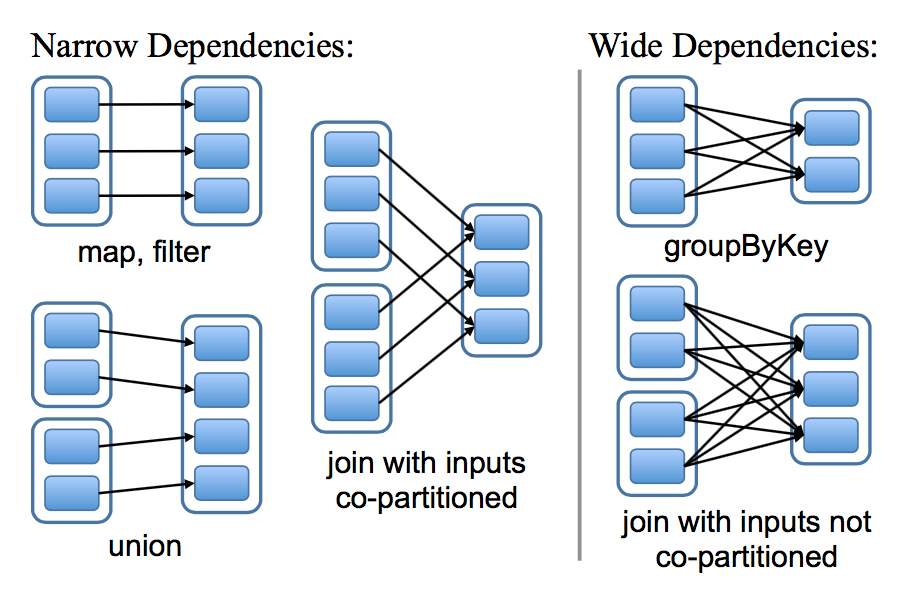

` 目录：`

- [第一部分——Spark及生态圈概述](#第一部分spark及生态圈概述)
    - [一、产生的背景](#一产生的背景)
    - [二、Spark发展历史](#二spark发展历史)
    - [三、Spark基本组件](#三spark基本组件)
    - [四、Spark和Hadoop的对比](#四spark和hadoop的对比)
    - [五、集群架构](#五集群架构)
- [第二部分——Spark SQL](#第二部分spark-sql)
    - [一、Spark SQL的产生](#一spark-sql的产生)
    - [二、Spark SQL愿景与特点](#二spark-sql愿景与特点)
        - [2.1 愿景](#21-愿景)
        - [2.2 特点](#22-特点)
    - [三、Spark SQL操作数据](#三spark-sql操作数据)
        - [3.1 SQLContext的用法](#31-sqlcontext的用法)
        - [3.2 HiveContext的使用](#32-hivecontext的使用)
        - [3.3 SparkSession的使用](#33-sparksession的使用)
        - [3.4 Spark-shell的使用](#34-spark-shell的使用)
        - [3.5 Spark-sql的使用](#35-spark-sql的使用)
        - [3.6 thriftserver/beeline的使用](#36-thriftserverbeeline的使用)
        - [3.7 jdbc编程访问](#37-jdbc编程访问)
    - [四、RDD介绍](#四rdd介绍)
        - [4.1 Spark RDD 定义与特点](#41-spark-rdd-定义与特点)
        - [4.2 创建RDD](#42-创建rdd)
            - [1. 由现有集合创建](#1-由现有集合创建)
            - [2. 引用外部存储系统中的数据集](#2-引用外部存储系统中的数据集)
        - [4.3 textFile & wholeTextFiles](#43-textfile--wholetextfiles)
        - [4.4 操作RDD](#44-操作rdd)
        - [4.5 缓存RDD](#45-缓存rdd)
            - [1. 缓存级别](#1-缓存级别)
            - [2. 使用缓存](#2-使用缓存)
            - [3. 移除缓存](#3-移除缓存)
        - [4.6 理解shuffle](#46-理解shuffle)
            - [1. shuffle介绍](#1-shuffle介绍)
            - [2. Shuffle的影响](#2-shuffle的影响)
            - [3. 导致Shuffle的操作](#3-导致shuffle的操作)
        - [4.7 宽依赖和窄依赖](#47-宽依赖和窄依赖)
        - [4.8 DAG的生成](#48-dag的生成)
    - [五、DataFrame & Dataset](#五dataframe--dataset)
        - [5.1 Spark Dataframe](#51-spark-dataframe)
        - [5.2. Spark Dataset](#52-spark-dataset)
        - [5.3 RDD、DataFrame和DataSet的比较](#53-rdddataframe和dataset的比较)
            - [1. 起始版本](#1-起始版本)
            - [2. 数据表示形式](#2-数据表示形式)
            - [3. 数据格式](#3-数据格式)
            - [4. 编译时类型安全](#4-编译时类型安全)
            - [5. 序列化](#5-序列化)
            - [6. 垃圾回收](#6-垃圾回收)
            - [7. 效率/内存使用](#7-效率内存使用)
            - [8. 编程语言支持](#8-编程语言支持)
            - [9. 聚合操作(Aggregation)](#9-聚合操作aggregation)
        - [5.4 结论](#54-结论)
    - [六、DataFrame API操作初识](#六dataframe-api操作初识)
        - [6.1 DataFrame的基本操作](#61-dataframe的基本操作)
        - [6.2 DataFrame与RDD之间的相互操作](#62-dataframe与rdd之间的相互操作)
            - [1. 操作方式一——反射](#1-操作方式一反射)
            - [2. 操作方式二——编程方式](#2-操作方式二编程方式)
            - [3. DataFrame的其他主要操作](#3-dataframe的其他主要操作)
    - [七、DataSet API操作初识](#七dataset-api操作初识)
        - [7.1 使用DataSet处理csv文件](#71-使用dataset处理csv文件)
    - [八、External data source](#八external-data-source)
        - [8.1 什么是外部数据源](#81-什么是外部数据源)
        - [8.2 scala操作parquet文件](#82-scala操作parquet文件)
        - [8.3 spark-sql操作parquet](#83-spark-sql操作parquet)
        - [8.4 外部数据源API操作hive表](#84-外部数据源api操作hive表)
        - [8.5 外部数据源API操作MySQL](#85-外部数据源api操作mysql)
        - [8.5 Hive和MySQL的综合使用](#85-hive和mysql的综合使用)
            - [1. 关联MySQL和Hive表数据](#1-关联mysql和hive表数据)
            - [2. 使用外部数据源综合查询hive和mysql的表数据](#2-使用外部数据源综合查询hive和mysql的表数据)
- [第三部分——Spark SQL行为日志处理实战](#第三部分spark-sql行为日志处理实战)
    - [一、项目梳理](#一项目梳理)
        - [1.1 日志数据内容](#11-日志数据内容)
        - [1.2 数据处理流程](#12-数据处理流程)
        - [1.3 项目需求](#13-项目需求)
    - [二、项目实战](#二项目实战)
        - [2.1 日志清洗案例](#21-日志清洗案例)
        - [2.2 ip解析包的下载](#22-ip解析包的下载)
        - [2.3 数据清洗以及地市信息的处理](#23-数据清洗以及地市信息的处理)
        - [2.4 需求一实现：统计最受欢迎的课程/手记的Top N访问次数](#24-需求一实现统计最受欢迎的课程手记的top-n访问次数)
            - [1. 创建数据库以及数据表](#1-创建数据库以及数据表)
            - [2.创建该表所对应的实体类](#2创建该表所对应的实体类)
            - [3. 创建MySQL操作工具类](#3-创建mysql操作工具类)
            - [４. 创建DAO层操作将数据存放表中](#４-创建dao层操作将数据存放表中)
            - [5. 创建TopN统计函数并将结果写入MySQL](#5-创建topn统计函数并将结果写入mysql)
        - [2.5 需求二实现：按照地市统计最受欢迎的课程/手记的Top N访问次数](#25-需求二实现按照地市统计最受欢迎的课程手记的top-n访问次数)
            - [1. MySQL中创建对应的表](#1-mysql中创建对应的表)
            - [2. 创建该表对应的实体类](#2-创建该表对应的实体类)
            - [3. 创建DAO层操作将数据存放表中](#3-创建dao层操作将数据存放表中)
            - [4. 创建地市TopN统计函数并将结果写入MySQL](#4-创建地市topn统计函数并将结果写入mysql)
        - [2.6 需求三实现：按流量统计慕课网主站最受欢迎的Top N课程](#26-需求三实现按流量统计慕课网主站最受欢迎的top-n课程)
            - [1. 创建数据库表](#1-创建数据库表)
            - [2. 创建对应的实体类](#2-创建对应的实体类)
            - [3. 创建DAO层操作将数据存放表中](#3-创建dao层操作将数据存放表中-1)
            - [4. 按照流量进行TopN统计并将结果写入MySQL](#4-按照流量进行topn统计并将结果写入mysql)
        - [2.7 创建按时间删除数据表](#27-创建按时间删除数据表)
        - [2.8 Spark on YARN](#28-spark-on-yarn)
            - [1. Spark on Yarn的两种模式](#1-spark-on-yarn的两种模式)
            - [2. 提交到Yarn上进行测试](#2-提交到yarn上进行测试)
        - [2.9 将数据清洗作业跑在Yarn上](#29-将数据清洗作业跑在yarn上)
        - [2.10 将统计作业跑在Yarn上](#210-将统计作业跑在yarn上)
    - [三、项目优化](#三项目优化)
        - [3.1 存储格式的选择](#31-存储格式的选择)
        - [3.2 压缩格式的选择](#32-压缩格式的选择)
        - [3.3 代码优化](#33-代码优化)
        - [3.3 调整并行度](#33-调整并行度)
        - [3.4 关闭分区字段自动推断](#34-关闭分区字段自动推断)
- [第四部分——Spark Streaming](#第四部分spark-streaming)
    - [一、实时流处理的概述](#一实时流处理的概述)
    - [二、日志收集框架Flume](#二日志收集框架flume)
    - [三、消息队列Kafka](#三消息队列kafka)
    - [四、Spark Streaming](#四spark-streaming)
    - [五、Spark Streaming集成Kafka](#五spark-streaming集成kafka)
    - [六、Spark Streaming集成Kafka和Flume](#六spark-streaming集成kafka和flume)

` 注意： `

本项目分为Java版本和Scala版本。在学习的时候使用Scala，因为企业生产中都是使用Java来编写的，因此之后用Java进行重构。

本项目中所使用的处理文件，都在data目录中，注意在执行程序时，记得修改路径。所有的代码，都在各自标题对应的英文文件夹中。

# 第一部分——Spark及生态圈概述

## 一、产生的背景

MapReduce局限性：代码非常繁琐，只能支持map和reduce方法，执行效率低下。map处理完后的数据回写到磁盘上，reduce再从磁盘上把数据拉取过来，因此执行效率低下。map和reduce都会对应一个jvm，因此作业量大，则线程开销非常庞大。不适合迭代多次，交互感很低，不支持流式处理。

在hadoop上框架多样化，每个框架各干各自的事：批处理：MapReduce、Hive、Pig  流式处理：Strom、Jstrom  交互式计算：Impala

这使得学习、运维成本非常高。因此Spark由此而生。

## 二、Spark发展历史
  
1、2009年，Spark诞生于伯克利大学AMPLab，属于伯克利大学的研究性项目；

2、2010 年，通过BSD 许可协议正式对外开源发布；

3、2012年，Spark第一篇论文发布，第一个正式版（Spark 0.6.0）发布；

4、2013年，成为了Aparch基金项目；发布Spark Streaming、Spark Mllib（机器学习）、Shark（Spark on Hadoop）；

5、2014 年，Spark 成为 Apache 的顶级项目； 5 月底 Spark1.0.0 发布；发布 Spark Graphx（图计算）、Spark SQL代替Shark；

6、2015年，推出DataFrame（大数据分析）；2015年至今，Spark在国内IT行业变得愈发火爆，大量的公司开始重点部署或者使用Spark来替代MapReduce、Hive、Storm等传统的大数据计算框架；

7、2016年，推出dataset（更强的数据分析手段）；

8、2017年，structured streaming 发布；

9、2018年，Spark2.4.0发布，成为全球最大的开源项目。

## 三、Spark基本组件

Spark Core：Spark 核心 API，提供 DAG 分布式内存计算框架

Spark SQL：提供交互式查询 API

Spark Streaming：实时流处理

SparkML：机器学习 API

Spark Graphx：图形计算

<div align="center">  </div>

## 四、Spark和Hadoop的对比

mapreduce 读 – 处理 - 写磁盘 -- 读 - 处理 - 写

spark     读 - 处理 - 写内存　-- 读　-- 处理  --（需要的时候）写磁盘 - 写

Spark 是在借鉴了 MapReduce 之上发展而来的，继承了其分布式并行计算的优点并改进了 MapReduce 明显的缺陷，（spark 与 hadoop 的差异）具体如下：

首先，Spark 把中间数据放到内存中，迭代运算效率高。MapReduce 中计算结果需要落地，保存到磁盘上，这样势必会影响整体速度，而 Spark 支持 DAG 图（有向无环图）的分布式并行计算的编程框架，减少了迭代过程中数据的落地，提高了处理效率。（延迟加载）

其次，Spark 容错性高。Spark 引进了弹性分布式数据集 RDD (Resilient DistributedDataset) 的抽象，它是分布在一组节点中的只读对象集合，这些集合是弹性的，如果数据集一部分丢失，则可以根据“血统”（即允许基于数据衍生过程）对它们进行重建。另外在RDD 计算时可以通过 CheckPoint 来实现容错。

最后，Spark 更加通用。mapreduce 只提供了 Map 和 Reduce 两种操作，Spark 提供的数据集操作类型有很多，大致分为：Transformations 和 Actions 两大类。Transformations包括 Map、Filter、FlatMap、Sample、GroupByKey、ReduceByKey、Union、Join、Cogroup、MapValues、Sort 等多种操作类型，同时还提供 Count, Actions 包括 Collect、Reduce、Lookup 和 Save 等操作

总结：

  1. Spark 是 MapReduce 的替代方案，而且兼容 HDFS、Hive，可融入 Hadoop 的生态系统，以弥补 MapReduce 的不足。
  2. 使用先进的 DAG 调度程序，查询优化器和物理执行引擎，以实现性能上的保证；
  3. 多语言支持，目前支持的有 Java，Scala，Python 和 R,提供了 80 多个高级 API，可以轻松地构建应用程序；
  4. 支持批处理，流处理和复杂的业务分析；丰富的类库支持：包括 SQL，MLlib，GraphX 和 Spark Streaming 等库，并且可以将它们无缝地进行组合；
  5. 丰富的部署模式：支持本地模式和自带的集群模式，也支持在 Hadoop，Mesos，Kubernetes 上运行；
  6. 多数据源支持：支持访问 HDFS，Alluxio，Cassandra，HBase，Hive 以及数百个其他数据源中的数据

<div align="center">  </div>


## 五、集群架构

| Term（术语）    | Meaning（含义）                                              |
| --------------- | ------------------------------------------------------------ |
| Application     | Spark 应用程序，由集群上的一个 Driver 节点和多个 Executor 节点组成。 |
| Driver program  | 主运用程序，该进程运行应用的 main() 方法并且创建  SparkContext |
| Cluster manager | 集群资源管理器（例如，Standlone Manager，Mesos，YARN）       |
| Worker node     | 执行计算任务的工作节点                                       |
| Executor        | 位于工作节点上的应用进程，负责执行计算任务并且将输出数据保存到内存或者磁盘中 |
| Task            | 被发送到 Executor 中的工作单元                                 |

<div align="center">  </div>

**执行过程**：

1. 用户程序创建 SparkContext 后，它会连接到集群资源管理器，集群资源管理器会为用户程序分配计算资源，并启动 Executor；
2. Dirver 将计算程序划分为不同的执行阶段和多个 Task，之后将 Task 发送给 Executor；
3. Executor 负责执行 Task，并将执行状态汇报给 Driver，同时也会将当前节点资源的使用情况汇报给集群资源管理器。

# 第二部分——Spark SQL

## 一、Spark SQL的产生

SQL是关系型数据库的标准，现在大数据框架，对于那些关系型数据库的开发人员来说成本太高，企业也依赖关系型数据库，sql非常易于学习。

Hive:类似sql的HQL，但是底层应用的MR，这样性能很低。因此hive做了改进，hive on tez，hive on spark。hive on spark ==》shark，shark推出时很受欢迎，基于内存速度快，基于内存的列式存储（很大提升数据处理的效率），缺点：为了实现兼容spark，hql的解析、逻辑执行计划生成和优化依赖hive，仅仅只是把物理执行计划从mr作业替换成spark。后续shark终止，重新设计了Spark SQL，属于Spark社区。但是Hive on Spark依然存在，属于hive社区，进行维护。

Spark sql 支持多种数据源，多种优化技术，扩展性很好


## 二、Spark SQL愿景与特点

### 2.1 愿景

写更少的代码；读更少的数据；将优化交给底层优化器

### 2.2 特点

Spark SQL 主要用于结构化数据的处理。其具有以下特点：

- 能够将 SQL 查询与 Spark 程序无缝混合，允许您使用 SQL 或 DataFrame API 对结构化数据进行查询；
- 支持多种数据源，包括 Hive，Avro，Parquet，ORC，JSON 和 JDBC；
- 支持 HiveQL 语法以及用户自定义函数 (UDF)，允许你访问现有的 Hive 仓库；
- 支持标准的 JDBC 和 ODBC 连接；
- 支持优化器，列式存储和代码生成等特性，以提高查询效率。

<div align="center">  </div>


## 三、Spark SQL操作数据

主要由以下的方法：

1. Spark1.x中的SQLContext/HiveContext的使用
2. Spark2.x中的SparkSession的使用
3. spark-shell/spark-sql的使用
4. thriftserver/beeline的使用
5. jdbc方式编程访问

下面的代码存放于sparksqloperatedata文件夹中。

### 3.1 SQLContext的用法

在IDEA中使用maven创建一个scala项目，然后设置pom.xml文件,可从提供的项目中直接复制。准备一份json文件，这份文件在spark目录中的examples/src/main/resources文件夹中，复制一份 cp people.json ~/app/data

```json

people.json文件

{"name":"Michael"}
{"name":"Andy", "age":30}
{"name":"Justin", "age":19}

```

编写scala代码：

```scala
package org.example.sparksqlpreliminary

import org.apache.spark.sql.SQLContext
import org.apache.spark.{SparkConf, SparkContext}

object SQLContextApp {

  def main(args: Array[String]): Unit = {

    //如果要在服务器提交作业，这个地址要写成val path = args(0)。
    // 也可以本地测试时候这么写，然后在IDEA中设置传入的参数。
    val path = "file:///home/willhope/app/data/people.json"

    /**
     * 1.设置sparkConf，加载主类，就像是MR中的Driver类。以及设置local[N]代表在本地运行，
     * 使用N个线程，也就是说可以同时执行N个程序，
     * 虽然在本地运行，但是因为cpu大多是多个核心，所以使用多个线程会加速执行，
     * 那么local[2]就代表2个线程
     */
    val sparkConf = new SparkConf()
    //本地测试的时候要使用这句话，如果提交到服务器时，这句话可以不写
    sparkConf.setAppName("SQLContextApp").setMaster("local[2]")

    /**
     * 2.创建SparkContext，我在这里将其翻译为spark环境，或者spark容器，
     * 通常情况下翻译为上下文，但这样不利于理解。让spark容器加载设置的sparkConf
     */
    val sc = new SparkContext(sparkConf)

    /**
     * 3.创建SQLContext，创建sql容器，将SparkContext对象加载
     */
    val sqlContext = new SQLContext(sc)


    /**
     * 4.使用SQLContext做相关的处理，例如读取json文件，传入路径
     */
    val people = sqlContext.read.format("json").load(path)
    //printSchema函数展示文件的结构
    people.printSchema()
    //show函数展示文件的内容
    people.show()


    /**
     * 5.关闭资源
     */
    sc.stop()

  }

}

```

在IDEA中执行后，我们会发现

```
//解析出的字段
root
 |-- age: long (nullable = true)
 |-- name: string (nullable = true)

//显示结果
+----+--------+
| age|    name|
+----+--------+
|null| Michael|
|  30|    Andy|
|  19|  Justin|
|  20|zhangsan|
+----+--------+

```

在生产中，肯定是在服务器上提交的，因此要将项目进行打包，到项目所在的目录中进行maven编译，执行mvn clean package -DskipTests，之后在项目所在目录下的target目录下，就会有这个项目的sql-1.0.jar包，把此jar包复制一份到/home/willhope/lib/目录中，然后写脚本执行在终端中提交。

Spark提交，下面这些是提交时要注意的参数

```bash
 /spark-submit \
  --name <job-name> \
  --class <main-class>
  --master <master-url> \
  --deploy-mode <deploy-mode> \
  --conf <key>=<value> \
  ... # other options
  <application-jar> \
  [application-arguments]

# 在工作当中，要把下面的这些代码放在shell文件中执行
  spark-submit \
  --name SQLContextApp \
  --class org.example.sparksqlpreliminary.SQLContextApp \
  --master local[2] \
  /home/willhope/lib/sql-1.0.jar \
  /home/willhope/app/spark-2.1.0-bin-2.6.0-cdh5.15.1/examples/src/main/resources/people.json
```

Java版本代码：

```java

import org.apache.spark.SparkConf;
import org.apache.spark.SparkContext;
import org.apache.spark.sql.Dataset;
import org.apache.spark.sql.Row;
import org.apache.spark.sql.SQLContext;

public class SQLConetextJ {

    public static void main(String[] args) {

        //1. 设置文件路径
        String path = "/home/willhope/app/data/people.json";

        //2. 设置sparkconf
        SparkConf sparkConf = new SparkConf().setAppName("SQLConetextJ").setMaster("local[2]");

        //3. 设置spark环境，加载sparkConf
        SparkContext sparkContext = new SparkContext(sparkConf);

        //4. 设置sparksql
        SQLContext sqlContext = new SQLContext(sparkContext);

        //5. 相关处理，按行获取文件内容
        Dataset<Row> people = sqlContext.read().format("json").load(path);
        people.printSchema();
        people.show();

        //6. 关闭资源
        sparkContext.stop();

    }

}

```

### 3.2 HiveContext的使用

spark操作hive，编写的代码基本与SQLContext一致。

scala版本

```scala

import org.apache.spark.sql.hive.HiveContext
import org.apache.spark.{SparkConf, SparkContext}

object HiveContextApp {

  def main(args: Array[String]): Unit = {

    // 1. 设置sparkConf
    val sparkConf = new SparkConf()
    //本地测试的时候要使用这句话，如果提交到服务器时，这句话可以不写
    sparkConf.setAppName("HiveContextApp").setMaster("local[2]")

    // 2. 设置spark环境
    val sparkContext = new SparkContext(sparkConf)

    //3. 设置hivecontext
    val hiveContext = new HiveContext(sparkContext)

    //4. 进行相关处理
    hiveContext.table("emp").show

    //5. 关闭资源
    sparkContext.stop()

  }

}

```

到项目所在的目录中进行maven编译，执行mvn clean package -DskipTests,之后在项目所在目录下的target目录下就会有这个项目的jar包。然后写脚本执行在终端中提交。这里与上面的不同，因为访问的是hive，因此无须添加要处理文件路径，但是要添加上访问mysql数据库的jar包。

```bash
  spark-submit \
  --name HiveContextApp \
  --class com.scala.spark.HiveContextApp \
  --jars ~/software/mysql-connector-java-5.1.27-bin.jar  \
  --master local[2] \
  /home/willhope/lib/sql-1.0.jar \
```

java代码：

```java
import org.apache.spark.SparkConf;
import org.apache.spark.SparkContext;
import org.apache.spark.sql.hive.HiveContext;

public class HiveConetextJ {

    public static void main(String[] args) {

        // 1. 设置spark配置
        SparkConf sparkConf = new SparkConf().setMaster("local[2]").setAppName("HiveConetextJ");

        // 2. 创建spark环境
        SparkContext sc = new SparkContext(sparkConf);

        // 3. 设置hive环境
        HiveContext hiveContext = new HiveContext(sc);

        // 4. 相关处理
        hiveContext.table("emp").show();

        // 5. 关闭资源
        sc.stop();

    }

}

```

### 3.3 SparkSession的使用

Spark session是spark2.x推荐的，可以替代SQLContext和HiveContext的作用，而且代码量大大降低

scala版本：

```scala
import org.apache.spark.sql.SparkSession

object SparkSessionApp {

  def main(args: Array[String]): Unit = {

    // 1. 使用SparkSession加载主类
    val sparkSession  = SparkSession.builder().appName("SparkSessionApp").master("local[2]").getOrCreate()

    // 2. 读取json文件
//    sparkSession.read.format("json").load("")
    //或者使用
    val people = sparkSession.read.json("file:///home/willhope/app/data/people.json")
    people.show()

    sparkSession.stop()

  }
}


```

java版本：


```java
import org.apache.spark.sql.Dataset;
import org.apache.spark.sql.Row;
import org.apache.spark.sql.SparkSession;

public class SparkSessionJ {


    public static void main(String[] args) {


        // 1. 设置文件路径

        String inputPath = "/home/willhope/app/data/people.json";

        // 2. 创建SparkSession
        SparkSession sparkSession = SparkSession.builder().master("local[2]").appName("SparkSessionJ").getOrCreate();


        // 3. 进行相关的处理
        Dataset<Row> people = sparkSession.read().json(inputPath);
        people.printSchema();
        people.show();

        sparkSession.stop();
    }

}

```

### 3.4 Spark-shell的使用

在使用前，将hadoop所有项启动，hive启动起来。

要在Spark-shell访问hive，要先切换到hive目录下的conf目录，将hive-site.xml文件拷贝到Spark目录下的conf。cp hive-site.xml /home/willhope/app/spark-2.4.4-bin-2.6.0-cdh5.15.1/conf/，然后将hive目录下的lib下的mysql驱动jar包拷贝到spark目录下的jars中。也可以在spark目录下的bin目录下，添加路径执行./spark-shell --master local[2] --jars /home/willhope/software/mysql-connector-java-5.1.47.jar

配置好了一切后，启动./spark-shell --master local[2]，然后输入spark.sql("show tables").show，可访问hive下的表，注意，sql()的括号中用来写sql语句。

```sql

  1. spark.sql("show tables").show
  # 结果
 
  +--------+--------------------+-----------+
  |database|           tableName|isTemporary|
  +--------+--------------------+-----------+
  | default|          track_info|      false|
  | default|track_info_provin...|      false|
  +--------+--------------------+-----------+

  2. spark.sql("select * from track_info").show
  # 结果，这个表中有30万行数据，但只显示前20行，spark速度非常快。
  +---------------+--------------------+--------------------+-------------------+-------+--------+------+----+----------+
  |             ip|                 url|                  id|               time|country|province|  city|page|       day|
  +---------------+--------------------+--------------------+-------------------+-------+--------+------+----+----------+
  |   106.3.114.42|http://www.yihaod...|3T4QEMG2BQ93ATS98...|2013-07-21 11:24:56|   中国|  北京市|     -|   -|2013-07-21|
  |  58.219.82.109|http://www.yihaod...|3T489Y1W6TECTAKDF...|2013-07-21 13:57:11|   中国|  江苏省|无锡市|   -|2013-07-21|
  |  58.219.82.109|http://search.yih...|3T489Y1W6TECTAKDF...|2013-07-21 13:50:48|   中国|  江苏省|无锡市|   -|2013-07-21|
  |  58.219.82.109|http://search.yih...|3T489Y1W6TECTAKDF...|2013-07-21 13:57:16|   中国|  江苏省|无锡市|   -|2013-07-21|
  |  58.219.82.109|http://www.yihaod...|3T489Y1W6TECTAKDF...|2013-07-21 13:50:13|   中国|  江苏省|无锡市|   -|2013-07-21|
  |  218.11.179.22|http://www.yihaod...|3T3WSNPKS9M3AYS9Z...|2013-07-21 08:00:13|   中国|  河北省|邢台市|   -|2013-07-21|
  |  218.11.179.22|http://www.yihaod...|3T3WSNPKS9M3AYS9Z...|2013-07-21 08:00:20|   中国|  河北省|邢台市|   -|2013-07-21|
  | 123.123.202.45|http://search.1ma...|3T25C9M46884Y5G8V...|2013-07-21 11:55:28|   中国|  北京市|     -|   -|2013-07-21|
  | 123.123.202.45|http://t.1mall.co...|3T25C9M46884Y5G8V...|2013-07-21 11:55:21|   中国|  北京市|     -|   -|2013-07-21|
  |118.212.191.216|http://m.1mall.co...|3T22N5JG3SJD5425F...|2013-07-21 19:07:19|   中国|  江西省|南昌市|   -|2013-07-21|
  |   27.46.113.79|http://www.yihaod...|3T1KYPAPHWPSCWB3P...|2013-07-21 21:21:16|   中国|  广东省|深圳市|   -|2013-07-21|
  |   27.46.113.79|http://www.yihaod...|3T1KYPAPHWPSCWB3P...|2013-07-21 21:20:09|   中国|  广东省|深圳市|   -|2013-07-21|
  |   27.46.113.79|http://www.yihaod...|3T1KYPAPHWPSCWB3P...|2013-07-21 21:21:02|   中国|  广东省|深圳市|   -|2013-07-21|
  |   27.46.113.94|http://www.yihaod...|3T1KYPAPHWPSCWB3P...|2013-07-21 21:21:16|   中国|  广东省|深圳市|   -|2013-07-21|
  |   27.46.113.79|http://www.yihaod...|3T1KYPAPHWPSCWB3P...|2013-07-21 21:21:01|   中国|  广东省|深圳市|   -|2013-07-21|
  |   27.46.113.94|http://www.yihaod...|3T1KYPAPHWPSCWB3P...|2013-07-21 21:19:08|   中国|  广东省|深圳市|   -|2013-07-21|
  |   27.46.113.79|http://www.yihaod...|3T1KYPAPHWPSCWB3P...|2013-07-21 21:21:02|   中国|  广东省|深圳市|   -|2013-07-21|
  |   27.46.113.79|http://www.yihaod...|3T1KYPAPHWPSCWB3P...|2013-07-21 21:18:56|   中国|  广东省|深圳市|   -|2013-07-21|
  |   27.46.113.79|http://www.yihaod...|3T1KYPAPHWPSCWB3P...|2013-07-21 21:18:55|   中国|  广东省|深圳市|   -|2013-07-21|
  |   27.46.113.94|http://www.yihaod...|3T1KYPAPHWPSCWB3P...|2013-07-21 21:18:49|   中国|  广东省|深圳市|   -|2013-07-21|
  +---------------+--------------------+--------------------+-------------------+-------+--------+------+----+----------+
  only showing top 20 rows

  3.  spark.sql("select * from emp e join dept d on e.deptno=d.deptno").show
  # 结果
  +-----+------+---------+----+----------+------+------+------+------+----------+--------+
  |empno| ename|      job| mgr|  hiredate|   sal|  comm|deptno|deptno|     dname|     loc|
  +-----+------+---------+----+----------+------+------+------+------+----------+--------+
  | 7369| SMITH|    CLERK|7902|1980-12-17| 800.0|  null|    20|    20|  RESEARCH|  DALLAS|
  | 7499| ALLEN| SALESMAN|7698| 1981-2-20|1600.0| 300.0|    30|    30|     SALES| CHICAGO|
  | 7521|  WARD| SALESMAN|7698| 1981-2-22|1250.0| 500.0|    30|    30|     SALES| CHICAGO|
  | 7566| JONES|  MANAGER|7839|  1981-4-2|2975.0|  null|    20|    20|  RESEARCH|  DALLAS|
  | 7654|MARTIN| SALESMAN|7698| 1981-9-28|1250.0|1400.0|    30|    30|     SALES| CHICAGO|
  | 7698| BLAKE|  MANAGER|7839|  1981-5-1|2850.0|  null|    30|    30|     SALES| CHICAGO|
  | 7782| CLARK|  MANAGER|7839|  1981-6-9|2450.0|  null|    10|    10|ACCOUNTING|NEW YORK|
  | 7788| SCOTT|  ANALYST|7566| 1987-4-19|3000.0|  null|    20|    20|  RESEARCH|  DALLAS|
  | 7839|  KING|PRESIDENT|null|1981-11-17|5000.0|  null|    10|    10|ACCOUNTING|NEW YORK|
  | 7844|TURNER| SALESMAN|7698|  1981-9-8|1500.0|   0.0|    30|    30|     SALES| CHICAGO|
  | 7876| ADAMS|    CLERK|7788| 1987-5-23|1100.0|  null|    20|    20|  RESEARCH|  DALLAS|
  | 7900| JAMES|    CLERK|7698| 1981-12-3| 950.0|  null|    30|    30|     SALES| CHICAGO|
  | 7902|  FORD|  ANALYST|7566| 1981-12-3|3000.0|  null|    20|    20|  RESEARCH|  DALLAS|
  | 7934|MILLER|    CLERK|7782| 1982-1-23|1300.0|  null|    10|    10|ACCOUNTING|NEW YORK|
  +-----+------+---------+----+----------+------+------+------+------+----------+--------+


```

### 3.5 Spark-sql的使用

其实与spark-shell用法相同，在spark目录下的bin目录下，添加路径执行./spark-sql --master local[2]，可以在浏览器输入 http://willhope-pc:4040/jobs/ 查看，这里启动后，其实就相当于启动了一个mysql控制台那种，可以直接写sql语句。在浏览器中刷新，可以看到刚才作业的完成情况。

  ```sql
  # 创建一张表
  create table t(key string,value string);

  # 然后查看是否创建成功
  show tables;

  # 查看执行计划
  explain extended select a.key*(2+3), b.value from  t a join t b on a.key = b.key and a.key > 3;

  == Parsed Logical Plan ==
  'Project [unresolvedalias(('a.key * (2 + 3)), None), 'b.value]
  +- 'Join Inner, (('a.key = 'b.key) && ('a.key > 3))
    :- 'UnresolvedRelation `t`, a
    +- 'UnresolvedRelation `t`, b

  == Analyzed Logical Plan ==
  (CAST(key AS DOUBLE) * CAST((2 + 3) AS DOUBLE)): double, value: string
  Project [(cast(key#321 as double) * cast((2 + 3) as double)) AS (CAST(key AS DOUBLE) * CAST((2 + 3) AS DOUBLE))#325, value#324]
  +- Join Inner, ((key#321 = key#323) && (cast(key#321 as double) > cast(3 as double)))
    :- SubqueryAlias a
    :  +- MetastoreRelation default, t
    +- SubqueryAlias b
        +- MetastoreRelation default, t

  == Optimized Logical Plan ==
  Project [(cast(key#321 as double) * 5.0) AS (CAST(key AS DOUBLE) * CAST((2 + 3) AS DOUBLE))#325, value#324]
  +- Join Inner, (key#321 = key#323)
    :- Project [key#321]
    :  +- Filter (isnotnull(key#321) && (cast(key#321 as double) > 3.0))
    :     +- MetastoreRelation default, t
    +- Filter (isnotnull(key#323) && (cast(key#323 as double) > 3.0))
        +- MetastoreRelation default, t

  == Physical Plan ==
  *Project [(cast(key#321 as double) * 5.0) AS (CAST(key AS DOUBLE) * CAST((2 + 3) AS DOUBLE))#325, value#324]
  +- *SortMergeJoin [key#321], [key#323], Inner
    :- *Sort [key#321 ASC NULLS FIRST], false, 0
    :  +- Exchange hashpartitioning(key#321, 200)
    :     +- *Filter (isnotnull(key#321) && (cast(key#321 as double) > 3.0))
    :        +- HiveTableScan [key#321], MetastoreRelation default, t
    +- *Sort [key#323 ASC NULLS FIRST], false, 0
        +- Exchange hashpartitioning(key#323, 200)
          +- *Filter (isnotnull(key#323) && (cast(key#323 as double) > 3.0))
              +- HiveTableScan [key#323, value#324], MetastoreRelation default, t

  ```

### 3.6 thriftserver/beeline的使用

前者是服务器，后者是客户端的意思，hive中的server称为hiveserver，spark中的server称为thriftserver。

1. 在spark目录中的sbin目录下启动./sbin/start-thriftserver.sh。可在 http://willhope-pc:4041/sqlserver/ 中查看，这里本应该是4040，但是如果之前启动了spark-sql，那么这个端口应该更改为4041，因为端口被占用，然后会自动加1

2. 在spark目录中bin目录下启动beeline。./beeline -u jdbc:hive2://localhost:10000 -n willhope （注意这里的用户名是系统用户名），这个可以启动多个。

3. 启动成功后，出现 0: jdbc:hive2://localhost:10000> 

4. 执行show tables;即可查看hive中表的情况。在 http://willhope-pc:4041/sqlserver/ 中刷新，可以查看作业执行情况。

5. 修改thriftserver启动占用的默认端口号：

```
./start-thriftserver.sh  \
--master local[2] \
--jars ~/software/mysql-connector-java-5.1.27-bin.jar  \   这句如果添加了mysql的jar到jars目录中，则不用写
--hiveconf hive.server2.thrift.port=14000 

beeline -u jdbc:hive2://localhost:14000 -n willhope
```

6. thriftserver和普通的spark-shell/spark-sql有什么区别？
  - spark-shell、spark-sql都是一个spark  application；
  - thriftserver， 不管你启动多少个客户端(beeline/code)，只要连到一个server，永远都是一个spark application
这里已经解决了一个数据共享的问题，多个客户端可以共享数据；


### 3.7 jdbc编程访问

使用jdbc访问hive。

scala版本：

```scala
import java.sql.DriverManager

/**
 *  jdbc编程访问
 */
object SparkSQLThriftServerApp {

  def main(args: Array[String]): Unit = {

    Class.forName("org.apache.hive.jdbc.HiveDriver")

    val connection = DriverManager.getConnection("jdbc:hive2://localhost:10000","willhope","") //密码不写
    val pstmt = connection.prepareStatement("select empno,ename from emp")
    val res = pstmt.executeQuery()
    while (res.next()){
      println("empno:"+res.getInt("empno") + ",ename:" + res.getString("ename"))
    }

    res.close()
    pstmt.close()
    connection.close()
  }

}

```

java版本：

```java
import java.sql.Connection;
import java.sql.DriverManager;
import java.sql.PreparedStatement;
import java.sql.ResultSet;

public class ThriftServerJ {

    public static void main(String[] args) throws Exception{

        Class.forName("org.apache.hive.jdbc.HiveDriver");

        Connection connection = DriverManager.getConnection("jdbc:hive2://localhost:10000","willhope","");

        PreparedStatement pstmt = connection.prepareStatement("select empno,ename from emp");

        ResultSet res = pstmt.executeQuery();

        while ((res.next())){
            System.out.println("empno:"+res.getInt("empno") + ",ename:" + res.getString("ename"));
        }

        res.close();
        pstmt.close();
        connection.close();

    }

}

```

## 四、RDD介绍

### 4.1 Spark RDD 定义与特点

`RDD` 全称为 Resilient Distributed Datasets(弹性分布式数据集)，是 Spark 最基本的数据抽象，它是只读的、分区记录的集合，支持并行操作，可以由外部数据集或其他 RDD 转换而来，它具有以下特性：

+ 一个 RDD 由一个或者多个分区（Partitions）组成。对于 RDD 来说，每个分区会被一个计算任务所处理，用户可以在创建 RDD 时指定其分区个数，如果没有指定，则默认采用程序所分配到的 CPU 的核心数；
+ RDD 拥有一个用于计算分区的函数 compute；
+ RDD 会保存彼此间的依赖关系，RDD 的每次转换都会生成一个新的依赖关系，这种 RDD 之间的依赖关系就像流水线一样。在部分分区数据丢失后，可以通过这种依赖关系重新计算丢失的分区数据，而不是对 RDD 的所有分区进行重新计算；
+ Key-Value 型的 RDD 还拥有 Partitioner(分区器)，用于决定数据被存储在哪个分区中，目前 Spark 中支持 HashPartitioner(按照哈希分区) 和 RangeParationer(按照范围进行分区)；
+ 一个优先位置列表 (可选)，用于存储每个分区的优先位置 (prefered location)。对于一个 HDFS 文件来说，这个列表保存的就是每个分区所在的块的位置，按照“移动数据不如移动计算“的理念，Spark 在进行任务调度的时候，会尽可能的将计算任务分配到其所要处理数据块的存储位置。

`RDD[T]` 抽象类的部分相关代码如下：

```scala
// 由子类实现以计算给定分区
def compute(split: Partition, context: TaskContext): Iterator[T]

// 获取所有分区
protected def getPartitions: Array[Partition]

// 获取所有依赖关系
protected def getDependencies: Seq[Dependency[_]] = deps

// 获取优先位置列表
protected def getPreferredLocations(split: Partition): Seq[String] = Nil

// 分区器 由子类重写以指定它们的分区方式
@transient val partitioner: Option[Partitioner] = None
```

### 4.2 创建RDD

RDD 有两种创建方式，分别介绍如下：

#### 1. 由现有集合创建

这里使用 `spark-shell` 进行测试，启动命令如下：

```shell
spark-shell --master local[4]
```

启动 `spark-shell` 后，程序会自动创建应用上下文，相当于执行了下面的 Scala 语句：

```scala
val conf = new SparkConf().setAppName("Spark shell").setMaster("local[4]")
val sc = new SparkContext(conf)
```

由现有集合创建 RDD，你可以在创建时指定其分区个数，如果没有指定，则采用程序所分配到的 CPU 的核心数：

```scala
val data = Array(1, 2, 3, 4, 5)
// 由现有集合创建 RDD,默认分区数为程序所分配到的 CPU 的核心数
val dataRDD = sc.parallelize(data) 
// 查看分区数
dataRDD.getNumPartitions
// 明确指定分区数
val dataRDD = sc.parallelize(data,2)
```

执行结果如下：

<div align="center">  </div>

#### 2. 引用外部存储系统中的数据集

引用外部存储系统中的数据集，例如本地文件系统，HDFS，HBase 或支持 Hadoop InputFormat 的任何数据源。

```scala
val fileRDD = sc.textFile("/usr/file/emp.txt")
// 获取第一行文本
fileRDD.take(1)
```

使用外部存储系统时需要注意以下两点：

+ 如果在集群环境下从本地文件系统读取数据，则要求该文件必须在集群中所有机器上都存在，且路径相同；
+ 支持目录路径，支持压缩文件，支持使用通配符。

### 4.3 textFile & wholeTextFiles

两者都可以用来读取外部文件，但是返回格式是不同的：

+ **textFile**：其返回格式是 `RDD[String]` ，返回的是就是文件内容，RDD 中每一个元素对应一行数据；
+ **wholeTextFiles**：其返回格式是 `RDD[(String, String)]`，元组中第一个参数是文件路径，第二个参数是文件内容；
+ 两者都提供第二个参数来控制最小分区数；
+ 从 HDFS 上读取文件时，Spark 会为每个块创建一个分区。

```scala
def textFile(path: String,minPartitions: Int = defaultMinPartitions): RDD[String] = withScope {...}
def wholeTextFiles(path: String,minPartitions: Int = defaultMinPartitions): RDD[(String, String)]={..}
```

### 4.4 操作RDD

RDD 支持两种类型的操作：*transformations*（转换，从现有数据集创建新数据集）和 *actions*（在数据集上运行计算后将值返回到驱动程序）。RDD 中的所有转换操作都是惰性的，它们只是记住这些转换操作，但不会立即执行，只有遇到 *action* 操作后才会真正的进行计算，这类似于函数式编程中的惰性求值。

```scala
val list = List(1, 2, 3)
// map 是一个 transformations 操作，而 foreach 是一个 actions 操作
sc.parallelize(list).map(_ * 10).foreach(println)
// 输出： 10 20 30
```

### 4.5 缓存RDD

#### 1. 缓存级别

Spark 速度非常快的一个原因是 RDD 支持缓存。成功缓存后，如果之后的操作使用到了该数据集，则直接从缓存中获取。虽然缓存也有丢失的风险，但是由于 RDD 之间的依赖关系，如果某个分区的缓存数据丢失，只需要重新计算该分区即可。

Spark 支持多种缓存级别 ：

| Storage Level<br/>（存储级别）                 | Meaning（含义）                                              |
| ---------------------------------------------- | ------------------------------------------------------------ |
| `MEMORY_ONLY`                                  | 默认的缓存级别，将 RDD 以反序列化的 Java 对象的形式存储在 JVM 中。如果内存空间不够，则部分分区数据将不再缓存。 |
| `MEMORY_AND_DISK`                              | 将 RDD 以反序列化的 Java 对象的形式存储 JVM 中。如果内存空间不够，将未缓存的分区数据存储到磁盘，在需要使用这些分区时从磁盘读取。 |
| `MEMORY_ONLY_SER`<br/>     | 将 RDD 以序列化的 Java 对象的形式进行存储（每个分区为一个 byte 数组）。这种方式比反序列化对象节省存储空间，但在读取时会增加 CPU 的计算负担。仅支持 Java 和 Scala 。  |
| `MEMORY_AND_DISK_SER`<br/> | 类似于 `MEMORY_ONLY_SER`，但是溢出的分区数据会存储到磁盘，而不是在用到它们时重新计算。仅支持 Java 和 Scala。 |
| `DISK_ONLY`                                    | 只在磁盘上缓存 RDD                                            |
| `MEMORY_ONLY_2`, <br/>`MEMORY_AND_DISK_2`, etc | 与上面的对应级别功能相同，但是会为每个分区在集群中的两个节点上建立副本。 |
| `OFF_HEAP`                                     | 与 `MEMORY_ONLY_SER` 类似，但将数据存储在堆外内存中。这需要启用堆外内存。 |

> 启动堆外内存需要配置两个参数：
>
> + **spark.memory.offHeap.enabled** ：是否开启堆外内存，默认值为 false，需要设置为 true；
> + **spark.memory.offHeap.size** : 堆外内存空间的大小，默认值为 0，需要设置为正值。

#### 2. 使用缓存

缓存数据的方法有两个：`persist` 和 `cache` 。`cache` 内部调用的也是 `persist`，它是 `persist` 的特殊化形式，等价于 `persist(StorageLevel.MEMORY_ONLY)`。示例如下：

```scala
// 所有存储级别均定义在 StorageLevel 对象中
fileRDD.persist(StorageLevel.MEMORY_AND_DISK)
fileRDD.cache()
```

#### 3. 移除缓存

Spark 会自动监视每个节点上的缓存使用情况，并按照最近最少使用（LRU）的规则删除旧数据分区。当然，你也可以使用 `RDD.unpersist()` 方法进行手动删除。


### 4.6 理解shuffle

#### 1. shuffle介绍

在 Spark 中，一个任务对应一个分区，通常不会跨分区操作数据。但如果遇到 `reduceByKey` 等操作，Spark 必须从所有分区读取数据，并查找所有键的所有值，然后汇总在一起以计算每个键的最终结果 ，这称为 `Shuffle`。

<div align="center">  </div>


#### 2. Shuffle的影响

Shuffle 是一项昂贵的操作，因为它通常会跨节点操作数据，这会涉及磁盘 I/O，网络 I/O，和数据序列化。某些 Shuffle 操作还会消耗大量的堆内存，因为它们使用堆内存来临时存储需要网络传输的数据。Shuffle 还会在磁盘上生成大量中间文件，从 Spark 1.3 开始，这些文件将被保留，直到相应的 RDD 不再使用并进行垃圾回收，这样做是为了避免在计算时重复创建 Shuffle 文件。如果应用程序长期保留对这些 RDD 的引用，则垃圾回收可能在很长一段时间后才会发生，这意味着长时间运行的 Spark 作业可能会占用大量磁盘空间，通常可以使用 `spark.local.dir` 参数来指定这些临时文件的存储目录。

#### 3. 导致Shuffle的操作

由于 Shuffle 操作对性能的影响比较大，所以需要特别注意使用，以下操作都会导致 Shuffle：

+ **涉及到重新分区操作**： 如 `repartition` 和 `coalesce`；
+ **所有涉及到 ByKey 的操作**：如 `groupByKey` 和 `reduceByKey`，但 `countByKey` 除外；
+ **联结操作**：如 `cogroup` 和 `join`。


### 4.7 宽依赖和窄依赖

RDD 和它的父 RDD(s) 之间的依赖关系分为两种不同的类型：

- **窄依赖 (narrow dependency)**：父 RDDs 的一个分区最多被子 RDDs 一个分区所依赖；
- **宽依赖 (wide dependency)**：父 RDDs 的一个分区可以被子 RDDs 的多个子分区所依赖。

如下图，每一个方框表示一个 RDD，带有颜色的矩形表示分区：

<div align="center">  </div>

区分这两种依赖是非常有用的：

+ 首先，窄依赖允许在一个集群节点上以流水线的方式（pipeline）对父分区数据进行计算，例如先执行 map 操作，然后执行 filter 操作。而宽依赖则需要计算好所有父分区的数据，然后再在节点之间进行 Shuffle，这与 MapReduce 类似。
+ 窄依赖能够更有效地进行数据恢复，因为只需重新对丢失分区的父分区进行计算，且不同节点之间可以并行计算；而对于宽依赖而言，如果数据丢失，则需要对所有父分区数据进行计算并再次 Shuffle。

### 4.8 DAG的生成

RDD(s) 及其之间的依赖关系组成了 DAG(有向无环图)，DAG 定义了这些 RDD(s) 之间的 Lineage(血统) 关系，通过血统关系，如果一个 RDD 的部分或者全部计算结果丢失了，也可以重新进行计算。那么 Spark 是如何根据 DAG 来生成计算任务呢？主要是根据依赖关系的不同将 DAG 划分为不同的计算阶段 (Stage)：

+ 对于窄依赖，由于分区的依赖关系是确定的，其转换操作可以在同一个线程执行，所以可以划分到同一个执行阶段；
+ 对于宽依赖，由于 Shuffle 的存在，只能在父 RDD(s) 被 Shuffle 处理完成后，才能开始接下来的计算，因此遇到宽依赖就需要重新划分阶段。

<div align="center">  </div>


## 五、DataFrame & Dataset

### 5.1 Spark Dataframe

为了支持结构化数据的处理，Spark SQL 提供了新的数据结构 DataFrame。与RDD不同，DataFrame 是一个由列(列名、列的属性)组成的数据集。它在概念上等同于关系数据库中的表或 R/Python 语言中的 `data frame`。它是一个不可变的分布式数据集合。 Spark中的DataFrame允许开发人员将数据结构(类型)加到分布式数据集合上，从而实现更高级别的抽象。 由于 Spark SQL 支持多种语言的开发，所以每种语言都定义了 `DataFrame` 的抽象，主要如下：

| 语言   | 主要抽象                                     |
| ------ | -------------------------------------------- |
| Scala  | Dataset[T] & DataFrame (Dataset[Row] 的别名)  |
| Java   | Dataset[T]                                   |
| Python | DataFrame                                    |
| R      | DataFrame                                    |

` 注 ：` Dataframe的本质就是一个Dataset，这也就是为什么使用Java编写使用Dataframe时，写的是Dataset<Row>。也可以理解为是在RDD上加了一个schema，因为RDD只是一个分布式数据集，没有列名、列属性等等，给RDD套上一个schema形成以一个表结构式的数据，就是Dataframe，且1.3版本以前，Dataframe就称为SchemaRDD。 

### 5.2. Spark Dataset

Apache Spark中的Dataset是DataFrame API的扩展，它提供了类型安全(type-safe)，面向对象(object-oriented)的编程接口。 Dataset利用优化器可以让用户通过类似于sql的表达式对数据进行查询。Dataset 也是分布式的数据集合，集成了 RDD 和 DataFrame 的优点，具备强类型的特点，同时支持 Lambda 函数，但只能在 Scala 和 Java 语言中使用。在 Spark 2.0 后，为了方便开发者，Spark 将 DataFrame 和 Dataset 的 API 融合到一起，提供了结构化的 API(Structured API)，即用户可以通过一套标准的 API 就能完成对两者的操作。

### 5.3 RDD、DataFrame和DataSet的比较

#### 1. 起始版本

RDD – 自Spark 1.0起

DataFrames – 自Spark 1.3起

DataSet – 自Spark 1.6起

#### 2. 数据表示形式

RDD是分布在集群中许多机器上的数据元素的分布式集合。 RDD是一组表示数据的Java或Scala对象。例如下图中，RDD操作Person对象，而不知道Person中具体的值，属性。

DataFrame是命名列构成的分布式数据集合。 它在概念上类似于关系数据库中的表。例如下图中，Dataframe知道每个person的属性，值，以及属性所定义的数据类型，可方便操作某一个属性及其值。

Dataset是DataFrame API的扩展，提供RDD API的类型安全，面向对象的编程接口以及Catalyst查询优化器的性能优势和DataFrame API的堆外存储机制的功能。

<div align="center">  </div>

#### 3. 数据格式

RDD可以轻松有效地处理结构化和非结构化的数据。 和Dataframe和DataSet一样，RDD不会推断出所获取的数据的结构类型，需要用户来指定它。

DataFrame仅适用于结构化和半结构化数据。 它的数据以命名列的形式组织起来。

DataSet可以有效地处理结构化和非结构化数据。 它表示行(row)的JVM对象或行对象集合形式的数据。 它通过编码器以表格形式(tabular forms)表示。
  
#### 4. 编译时类型安全

RDD提供了一种熟悉的面向对象编程风格，具有编译时类型安全性。

DataFrame如果您尝试访问表中不存在的列，则编译错误。 它仅在运行时检测属性错误。

DataSet可以在编译时检查类型, 它提供编译时类型安全性。

**编译时类型(静态类型)与运行时类型安全的解释**

静态类型 (Static-typing) 与运行时类型安全 (runtime type-safety) 主要表现如下:

在实际使用中，如果你用的是 Spark SQL 的查询语句，则直到运行时你才会发现有语法错误，而如果你用的是 DataFrame 和 Dataset，则在编译时就可以发现错误 (这节省了开发时间和整体代价)。DataFrame 和 Dataset 主要区别在于：

在 DataFrame 中，当你调用了 API 之外的函数，编译器就会报错，但如果你使用了一个不存在的字段名字，编译器依然无法发现。而 Dataset 的 API 都是用 Lambda 函数和 JVM 类型对象表示的，所有不匹配的类型参数在编译时就会被发现。

以上这些最终都被解释成关于类型安全图谱，对应开发中的语法和分析错误。在图谱中，Dataset 最严格，但对于开发者来说效率最高。

<div align="center">  </div>

上面的描述可能并没有那么直观，下面的给出一个 IDEA 中代码编译的示例：

<div align="center">  </div>

这里一个可能的疑惑是 DataFrame 明明是有确定的 Scheme 结构 (即列名、列字段类型都是已知的)，但是为什么还是无法对列名进行推断和错误判断，这是因为 DataFrame 是 Untyped 的。

**Untyped & Typed的解释** 

在上面我们介绍过 DataFrame API 被标记为 `Untyped API`，而 DataSet API 被标记为 `Typed API`。DataFrame 的 `Untyped` 是相对于语言或 API 层面而言，它确实有明确的 Scheme 结构，即列名，列类型都是确定的，但这些信息完全由 Spark 来维护，Spark 只会在运行时检查这些类型和指定类型是否一致。这也就是为什么在 Spark 2.0 之后，官方推荐把 DataFrame 看做是 `DatSet[Row]`，Row 是 Spark 中定义的一个 `trait`，其子类中封装了列字段的信息。

相对而言，DataSet 是 `Typed` 的，即强类型。如下面代码，DataSet 的类型由 Case Class(Scala) 或者 Java Bean(Java) 来明确指定的，在这里即每一行数据代表一个 `Person`，这些信息由 JVM 来保证正确性，所以字段名错误和类型错误在编译的时候就会被 IDE 所发现。

```scala
case class Person(name: String, age: Long)
val dataSet: Dataset[Person] = spark.read.json("people.json").as[Person]
```

#### 5. 序列化

RDD每当Spark需要在集群内分发数据或将数据写入磁盘时，它就会使用Java序列化。序列化单个Java和Scala对象的开销很昂贵，并且需要在节点之间发送数据和结构。

Spark DataFrame可以将数据序列化为二进制格式的堆外存储（在内存中），然后直接在此堆内存上执行许多转换。无需使用java序列化来编码数据。它提供了一个Tungsten物理执行后端，来管理内存并动态生成字节码以进行表达式评估。

DataSet在序列化数据时，Spark中的数据集API具有编码器的概念，该编码器处理JVM对象与表格表示之间的转换。它使用spark内部Tungsten二进制格式存储表格表示。数据集允许对序列化数据执行操作并改善内存使用。它允许按需访问单个属性，而不会消灭整个对象。

#### 6. 垃圾回收
  
RDD 创建和销毁单个对象会导致垃圾回收。

DataFrame 避免在为数据集中的每一行构造单个对象时引起的垃圾回收。

DataSet因为序列化是通过Tungsten进行的，它使用了off heap数据序列化，不需要垃圾回收器来摧毁对象

#### 7. 效率/内存使用

RDD 在java和scala对象上单独执行序列化时，效率会降低，这需要花费大量时间。

DataFrame 使用off heap内存进行序列化可以减少开销。 它动态生成字节代码，以便可以对该序列化数据执行许多操作。 无需对小型操作进行反序列化。

DataSet它允许对序列化数据执行操作并改善内存使用。 因此，它可以允许按需访问单个属性，而无需反序列化整个对象。

#### 8. 编程语言支持

RDD 提供Java，Scala，Python和R语言的API。 因此，此功能为开发人员提供了灵活性。

DataFrame同样也提供Java，Scala，Python和R语言的API。

DataSet 的一些API目前仅支持Scala和Java，对Python和R语言的API在陆续开发中。
  
#### 9. 聚合操作(Aggregation)

RDD API执行简单的分组和聚合操作的速度较慢。

DataFrame API非常易于使用。 探索性分析更快，在大型数据集上创建汇总统计数据。

Dataset中，对大量数据集执行聚合操作的速度更快。

### 5.4 结论

+ 当我们需要对数据集进行底层的转换和操作时， 可以选择使用RDD。
+ RDD 适合非结构化数据的处理，而 DataFrame & DataSet 更适合结构化数据和半结构化的处理。
+ 当我们需要高级抽象时，可以使用DataFrame和Dataset API。
+ DataFrame & DataSet 可以通过统一的 Structured API 进行访问，而 RDDs 则更适合函数式编程的场景。
+ 相比于 DataFrame 而言，DataSet 是强类型的 (Typed)，有着更为严格的静态类型检查。
+ DataSets、DataFrames、SQL 的底层都依赖了 RDDs API，并对外提供结构化的访问接口。
+ 对于非结构化数据，例如媒体流或文本流，同样可以使用DataFrame和Dataset API。
+ 我们可以使用DataFrame和Dataset 中的高级的方法。 例如，filter, maps, aggregation, sum, SQL queries以及通过列访问数据等，如果您不关心在按名称或列处理或访问数据属性时强加架构（例如列式格式）。
+ 如果我们想要在编译时更高程度的类型安全性。RDD提供更底层功能， DataFrame和Dataset则允许创建一些自定义的结构，拥有高级的特定操作，节省空间并高速执行。为了确保我们的代码能够尽可能的利用Tungsten优化带来的好处，推荐使用Scala的 Dataset API（而不是RDD API）。Dataset即拥有DataFrame带来的relational transformation的便捷，也拥有RDD中的functional transformation的优势。

<div align="center">  </div>

## 六、DataFrame API操作初识

### 6.1 DataFrame的基本操作

方法介绍：


| 方法名     |  方法介绍    |
|:-------:  |:---------:  |
|printSchema|输出Dataframe对应的schema信息|
|show | 默认最多显示20条记录，但可自定义显示数据数|
|select| 查询数据|
|col | 对某列进行操作|
|as  | 起别名|
|filter|过滤即条件判断|
|group by|根据某列分组|
|count|计数|

scala 版本代码：

```scala

import org.apache.spark.sql.SparkSession

/**
 * DataFrame API基本操作
 */
object DataFrameApp {

  def main(args: Array[String]): Unit = {

    //将json文件加载成一个dataframe
    val spark = SparkSession.builder().appName("DataFrameApp").master("local[2]").getOrCreate()

    //将json文件加载成一个dataframe
    val peopleDF = spark.read.format("json").load("file:///home/willhope/app/data/people.json")

    //输出dataframe对应的schema信息
    peopleDF.printSchema()

    //输出数据集的前20条，可以自己在括号中写数量
    peopleDF.show()

    //输出某个列的内容
    peopleDF.select("name").show()

    //输出年龄列，并将年龄+10,select name from table
    peopleDF.select(peopleDF.col("name") , peopleDF.col("age")+10).show()

    //起个别名,输出年龄列，并将年龄+10,select name , age + 10  as age2 from table;
    peopleDF.select(peopleDF.col("name") , (peopleDF.col("age")+10).as("age2")).show()

    //根据某一列的值进行过滤： select * from table where age > 19
    peopleDF.filter(peopleDF.col("age")>19).show()

    //根据某一列进行分组，然后在进行局和操作：select age , count(1) from table group by age
    peopleDF.groupBy("age").count().show()

    spark.stop()
  }

}

```

Java 版本代码： 与scala代码有些许不同，主要体现在，scala中+,>,<都是方法，而在Java中，不能直接使用，需要用plus，$greater()，$less()

```java

package dataframe;

import org.apache.spark.sql.Dataset;
import org.apache.spark.sql.Row;
import org.apache.spark.sql.SparkSession;

public class DataFrameJ {

    public static void main(String[] args) {


        String inputPath = "/home/willhope/app/data/people.json";

        // 1. SparkSession设置主类，master
        SparkSession sparkSession = SparkSession.builder().master("local[2]").appName("DataFrameJ").getOrCreate();

        // 2. 读取文件
        Dataset<Row> peopleDs = sparkSession.read().format("json").load(inputPath);

        // 3. 相关操作
        //输出dataframe对应的schema信息
        peopleDs.printSchema();

        //显示记录，括号里面可以填写想要输出的行数
        peopleDs.show();

        //查询name列的数据：select name from table
        peopleDs.select("name").show();

        //查询某几列所有数据，并对列进行计算：select name,age + 10 as age2 from table;
        //注意Java中不能写+10，写成plus()，在scala中+是方法
        peopleDs.select(peopleDs.col("name"), (peopleDs.col("age").plus(10)).as("age2")).show();

        //过滤年龄大于19岁的人
        //注意Java中不能写>19，写成$greater()，在scala中>是方法
        peopleDs.filter(peopleDs.col("age").$greater(19)).show();

        //根据某一列分组，然后再聚合操作select age,count(1) from table group by age
        peopleDs.groupBy("age").count().show();

        sparkSession.stop();

    }

}


```

### 6.2 DataFrame与RDD之间的相互操作

#### 1. 操作方式一——反射

所谓的反射，即事先知道RDD数据的字段和字段类型，然后创建一个相应的类，属性，然后将RDD的数据进行某些相关操作后，将数据赋值给创建的类，形成对象。

scala版本：

```scala
import org.apache.spark.sql.SparkSession
/**
 * DataFrame 与 RDD 的互相操作
 */

object DataFrameRDDReflection {

  def main(args: Array[String]): Unit = {

    // 1. 输入地址
    val inputPath = "file:///home/willhope/app/data/infos.txt"

    //2. SparkSession设置
    val sparkSession = SparkSession.builder().master("local[2]").appName("DataFrameRDDReflection").getOrCreate()

    //3. RDD ==> DataFrame
    // 首先通过sparkContext的textFile()读取文件，获得RDD，返回类型为String。
    // 这里可以理解为将文本内容进行行分割，就像MapReduce的map阶段前，将文本行分割
    val rdd = sparkSession.sparkContext.textFile(inputPath)

    //导入隐式转换，注意这个implicits前面的值是我们设置的SparkSession的名
    import sparkSession.implicits._
    //将数据按照分隔符分割，split分割后，返回的是一个String类型数组，然后将数组中的内容取出来，并且转换类型，赋值给定义的类
    val infoDF = rdd.map(_.split(",")).map(line => Info(line(0).toInt , line(1),line(2).toInt)).toDF()

    /**
     * infoDF的操作方式一：使用DataFrame的API
     */
    //展示
    infoDF.show()
    //过滤
    infoDF.filter(infoDF.col("age") > 30).show()

    /**
     * infoDF的操作方式二：使用SparkSql的API
     * 如果对编程不了解，也可以采用sql的方式来解决，创建一张临时的表，然后可以直接使用spark-sql
     */
    //注册一张临时的表，可以理解为视图，可以方便使用sql语句来进行操作
    infoDF.createOrReplaceGlobalTempView("infos")
    sparkSession.sql("select * from infos where age > 30").show()

    //4. SparkSession停止
    sparkSession.stop()

  }
  case class Info(id:Int , name:String , age:Int)

}


```

java版本：

首先需要定义一个person类

```java
package dataframe;

public class Person{

    Integer id;

    String name;

    Integer age;

    public Person() {
        this.id = 0;
        this.name = "";
        this.age = 0;
    }

    public Person(Integer id, String name, Integer age) {
        this.id = id;
        this.name = name;
        this.age = age;
    }

    public Integer getId() {
        return id;
    }

    public void setId(Integer id) {
        this.id = id;
    }

    public String getName() {
        return name;
    }

    public void setName(String name) {
        this.name = name;
    }

    public Integer getAge() {
        return age;
    }

    public void setAge(Integer age) {
        this.age = age;
    }
}
```

其次，进行相应的处理

```java
package dataframe;

import org.apache.spark.api.java.JavaRDD;
import org.apache.spark.sql.Dataset;
import org.apache.spark.sql.Row;
import org.apache.spark.sql.SparkSession;

public class DataFrameRDDReflection {


    public static void main(String[] args) {

         //1. 设置文件路径
        String inputPath = "file:///home/willhope/app/data/infos.txt";

        //2. 设置SparkSession，master
        SparkSession sparkSession = SparkSession.builder().master("local[2]").appName("DataFrameRDDReflection").getOrCreate();

        //3. 读取文件，生成RDD
        JavaRDD<String> javaRDD = sparkSession.sparkContext().textFile(inputPath,1).toJavaRDD();

        //4. 处理RDD，获取各个字段，并将其返回成对象RDD
        JavaRDD<Person> personJavaRDD = javaRDD.map(line -> {
            String[] infos = line.split(",");
            Integer id = Integer.parseInt(infos[0]);
            String name  = infos[1];
            Integer age = Integer.parseInt(infos[2]);
            return new Person(id ,name, age);
        });

        //5. 将RDD转换为Dataframe
        Dataset<Row> personDF = sparkSession.createDataFrame(personJavaRDD,Person.class);

        //6. Dataframe操作
        personDF.show();
        personDF.printSchema();
        personDF.filter(personDF.col("age").$greater(20)).show();

        //创建临时表，进行sql操作
//        personDF.createOrReplaceGlobalTempView("t_person");
//        sparkSession.sql("select * from t_person order by age desc").show();

        //关闭资源
        sparkSession.stop();
    }

}

```

#### 2. 操作方式二——编程方式

编程方式，事先不知道列的情况下使用此方法。但是，通常优先考虑反射方法

scala版本：

```scala

package org.example.dataframe

import org.apache.spark.sql.{Row, SparkSession}
import org.apache.spark.sql.types.{IntegerType, StringType, StructField, StructType}

object DataFrameRDDProgram {

  def main(args: Array[String]): Unit = {

    //1. 设置文件路径
    val inputPath = "file:///home/willhope/app/data/infos.txt"

    //2. 设置SparkSession，master
    val spark = SparkSession.builder().appName("DataFrameRDDProgram").master("local[2]").getOrCreate()

    //3. sparkContext可以获取到rdd，textfile可以从hdfs上读取文件，或者从本地获取文件
    val rdd = spark.sparkContext.textFile(inputPath)

    //4. 处理文件内容，不需要像反射方法中定义类，使用Row接收数据即可
    val infoRDD = rdd.map(_.split(",")).map(line => Row(line(0).toInt, line(1), line(2).toInt))

    //5. 设置structType，设置Row数据的结构，第三个参数表示能否为空
    val structType = StructType(Array(StructField("id",IntegerType,true),
      StructField("name",StringType,true),
      StructField("age",IntegerType,true)
    ))

    //6. 将rdd转换为Dataframe
    val infoDF = spark.createDataFrame(infoRDD,structType)
    infoDF.printSchema()
    infoDF.show()

    infoDF.filter(infoDF.col("age") > 30).show()

    //如果对编程不了解，也可以采用sql的方式来解决，创建一张临时的表，然后可以直接使用spark-sql
//    infoDF.createOrReplaceTempView("infos")
//    spark.sql("select * from infos where age>30").show()
    spark.stop()
  }

}

```

java版本：

```java

package dataframe;

import org.apache.spark.api.java.JavaRDD;
import org.apache.spark.sql.Dataset;
import org.apache.spark.sql.Row;
import org.apache.spark.sql.RowFactory;
import org.apache.spark.sql.SparkSession;
import org.apache.spark.sql.types.DataTypes;
import org.apache.spark.sql.types.StructField;
import org.apache.spark.sql.types.StructType;

import java.util.ArrayList;
import java.util.List;

public class DataFrameRDDProgram {

  public static void main(String[] args) {
      String inputPath = "file:///home/willhope/app/data/infos.txt";

      //2. 设置SparkSession，master
      SparkSession sparkSession = SparkSession.builder().master("local[2]").appName("DataFrameRDDProgram").getOrCreate();

      //3. 读取文件，生成RDD
      JavaRDD<String> javaRDD = sparkSession.sparkContext().textFile(inputPath,1).toJavaRDD();

      //4. 处理原始数据RDD，生成新的RDD
      JavaRDD<Row> rowJavaRDD = javaRDD.map(
              line -> {
                  String[] infos = line.split(",");
                  Integer id = Integer.parseInt(infos[0]);
                  String name = infos[1];
                  Integer age = Integer.parseInt(infos[2]);
                  Row row = RowFactory.create(id, name, age);
                  return row;
              }
      );

      //5. 创建自定义数据类型
      List<StructField> fields = new ArrayList<>();
      StructField field_id = DataTypes.createStructField("id",DataTypes.IntegerType,true);
      StructField field_name = DataTypes.createStructField("name", DataTypes.StringType, true);
      StructField field_age = DataTypes.createStructField("age", DataTypes.IntegerType, true);
      fields.add(field_id);
      fields.add(field_name);
      fields.add(field_age);
      //6. 将自定义的数据类型StructType化，生成schema
      StructType schema = DataTypes.createStructType(fields);

      //7. 把RDD和schema关联起来并查询
      Dataset<Row> personDataFrame = sparkSession.createDataFrame(rowJavaRDD, schema);
      personDataFrame.printSchema();
      personDataFrame.show();
      personDataFrame.filter(personDataFrame.col("age").$greater(20)).show();

      //创建临时表，进行sql操作
//        personDF.createOrReplaceGlobalTempView("t_person");
//        sparkSession.sql("select * from t_person order by age desc").show();

      //关闭资源
      sparkSession.stop();

  }

}

```

#### 3. DataFrame的其他主要操作

scala版本：这段代码就不放入文件夹中了，跟第一节代码没多大区别。看一下即可

```scala

import org.apache.spark.sql.{Row, SparkSession}


/**
 * 展示dataframe中其他的操作
 */
object DataFrameCase {

  def main(args: Array[String]): Unit = {

    val spark = SparkSession.builder().appName("DataFrameApp").master("local[2]").getOrCreate()

    //sparkContext可以获取到rdd，textfile可以从hdfs上读取文件，或者从本地获取文件
    val rdd = spark.sparkContext.textFile("file:///home/willhope/sparkdata/student.data")

    //注意：需要导入隐式转换
    import  spark.implicits._
    val studentDF = rdd.map(_.split("\\|")).map(line => Student(line(0).toInt, line(1), line(2),line(3))).toDF()
   
    //只显示前20条
    studentDF.show()
    
    //指定显示条数
    studentDF.show(30)
    
    //查看前10条记录，可以不加foreach，但是会显示的很乱
    studentDF.take(10).foreach(println)
    
    //显示第一条记录
    studentDF.first()
    
    //显示前三条
    studentDF.head(3)
    
    //查询指定的列
    studentDF.select("email").show(30,false)

    //查询多个指定的列
    studentDF.select("name","email").show(30,false)

    //显示名字为空的和为Null的列
    studentDF.filter("name = '' or name = 'NULL'").show()

    //显示以M开头的人的信息，其中substr等价与substring
    studentDF.filter("substr(name,0,1)='M'").show()

    //查看spark-sql中内置的功能函数，显示1000条
    spark.sql("show functions").show(1000)

    //排序，默认升序
    studentDF.sort(studentDF("name")).show()
    //设置为降序
    studentDF.sort(studentDF("name").desc).show()
    //名字的升序，id的降序排列
    studentDF.sort(studentDF("name").asc , studentDF("id").desc).show()

    //将列名重命名
    studentDF.select(studentDF("name").as("student_name")).show()

    //内联结
    val studentDF2 = rdd.map(_.split("\\|")).map(line => Student(line(0).toInt, line(1), line(2),line(3))).toDF()
    //在内联结的时候，等于号必须写3个
    studentDF.join(studentDF2 , studentDF.col("id") === studentDF2.col("id")).show()


    spark.stop()

  }

  case class Student(id : Int , name : String , phone : String , email : String)

}

```

` 上面的代码每次在IDEA中执行时，都会非常慢，因此，我们转换到spark-shell上面运行，会比较快一些。`

在Spark的bin目录下，执行

```shell

./spark-shell --master local[2]

val rdd = spark.sparkContext.textFile("file:///home/willhope/app/data/student.data")

case class Student(id : Int , name : String , phone : String , email : String)

val studentDF = rdd.map(_.split("\\|")).map(line => Student(line(0).toInt, line(1), line(2),line(3))).toDF()
  
studentDF.show(30)

# 结果

+---+--------+--------------+--------------------+
| id|    name|         phone|               email|
+---+--------+--------------+--------------------+
|  1|   Burke|1-300-746-8446|ullamcorper.velit...|
|  2|   Kamal|1-668-571-5046|pede.Suspendisse@...|
|  3|    Olga|1-956-311-1686|Aenean.eget.metus...|
|  4|   Belle|1-246-894-6340|vitae.aliquet.nec...|
|  5|  Trevor|1-300-527-4967|dapibus.id@acturp...|
|  6|  Laurel|1-691-379-9921|adipiscing@consec...|
|  7|    Sara|1-608-140-1995|Donec.nibh@enimEt...|
|  8|  Kaseem|1-881-586-2689|cursus.et.magna@e...|
|  9|     Lev|1-916-367-5608|Vivamus.nisi@ipsu...|
| 10|    Maya|1-271-683-2698|accumsan.convalli...|
| 11|     Emi|1-467-270-1337|        est@nunc.com|
| 12|   Caleb|1-683-212-0896|Suspendisse@Quisq...|
| 13|Florence|1-603-575-2444|sit.amet.dapibus@...|
| 14|   Anika|1-856-828-7883|euismod@ligulaeli...|
| 15|   Tarik|1-398-171-2268|turpis@felisorci.com|
| 16|   Amena|1-878-250-3129|lorem.luctus.ut@s...|
| 17| Blossom|1-154-406-9596|Nunc.commodo.auct...|
| 18|     Guy|1-869-521-3230|senectus.et.netus...|
| 19| Malachi|1-608-637-2772|Proin.mi.Aliquam@...|
| 20|  Edward|1-711-710-6552|lectus@aliquetlib...|
| 21|        |1-711-710-6552|lectus@aliquetlib...|
| 22|        |1-711-710-6552|lectus@aliquetlib...|
| 23|    NULL|1-711-710-6552|lectus@aliquetlib...|
+---+--------+--------------+--------------------+

studentDF.take(10).foreach(println)

# 结果

[1,Burke,1-300-746-8446,ullamcorper.velit.in@ametnullaDonec.co.uk]
[2,Kamal,1-668-571-5046,pede.Suspendisse@interdumenim.edu]
[3,Olga,1-956-311-1686,Aenean.eget.metus@dictumcursusNunc.edu]
[4,Belle,1-246-894-6340,vitae.aliquet.nec@neque.co.uk]
[5,Trevor,1-300-527-4967,dapibus.id@acturpisegestas.net]
[6,Laurel,1-691-379-9921,adipiscing@consectetueripsum.edu]
[7,Sara,1-608-140-1995,Donec.nibh@enimEtiamimperdiet.edu]
[8,Kaseem,1-881-586-2689,cursus.et.magna@euismod.org]
[9,Lev,1-916-367-5608,Vivamus.nisi@ipsumdolor.com]
[10,Maya,1-271-683-2698,accumsan.convallis@ornarelectusjusto.edu]

其他的省略

```

## 七、DataSet API操作初识

1.6版本出现的，强类型，支持Lambda表达式，Dataframe能用的，DataSet大部分都能用，目前支持Java和Scala。DataSet需要用Dataframe使用as来转换。

### 7.1 使用DataSet处理csv文件

scala版本：

```scala

package org.example.dataframe

import org.apache.spark.sql.SparkSession

object DatasetApp {
  def main(args: Array[String]): Unit = {

    val spark = SparkSession.builder().appName("DatasetApp").master("local[2]").getOrCreate()

    //注意需要导入隐式转换
    import spark.implicits._
    //设置文件路径
    val path = "file:///home/willhope/app/data/sales.csv"

    //spark解析csv文件，此功能属于外部数据源方法，先用dataframe处理，然后在转为dataset
    //第一个option()方法，传入header，表示csv文件中第一行是属性，要获取到这些属性
    //第二个option()方法，传入inferSchema，表示自动推导csv中各个属性结构
    //返回的是Dataframe类型
    val df = spark.read.option("header","true").option("inferSchema","true").csv(path)
    df.show()

    //df转换为ds，as后面设置一个类型，这个类型就是自定义的类，用来接受csv中的属性
    val ds = df.as[Sales]
    //仅仅取出id
    ds.map(line=>line.itemId).show()

    spark.stop()
  }

  //此类的数据定义就是csv上面的header属性
  case class Sales(transactionId:Int,customerId:Int,itemId:Int,amountPaid:Double)

}

```

java版本：

首先，我们需要看下所给文件的属性都有哪些，通过RDD自动推断文件的schema，按照schema所显示的属性和数据类型，编写相对应的类，在类中将文件属性定义好。这里定义一个Sales类。

```java
package dataframe;

public class Sales {

    int transactionId;
    int customerId;
    int itemId;
    double amountPaid;

    public Sales(){
        this.transactionId = 0;
        this.customerId = 0;
        this.itemId = 0;
        this.amountPaid = 0.0;
    }

    public Sales(int transactionId, int customerId, int itemId, double amountPaid) {
        this.transactionId = transactionId;
        this.customerId = customerId;
        this.itemId = itemId;
        this.amountPaid = amountPaid;
    }

    public int getTransactionId() {
        return transactionId;
    }

    public void setTransactionId(int transactionId) {
        this.transactionId = transactionId;
    }

    public int getCustomerId() {
        return customerId;
    }

    public void setCustomerId(int customerId) {
        this.customerId = customerId;
    }

    public int getItemId() {
        return itemId;
    }

    public void setItemId(int itemId) {
        this.itemId = itemId;
    }

    public double getAmountPaid() {
        return amountPaid;
    }

    public void setAmountPaid(double amountPaid) {
        this.amountPaid = amountPaid;
    }
}


```

其次，我们将文件进行解析。

```java
import org.apache.spark.api.java.function.MapFunction;
import org.apache.spark.sql.Dataset;
import org.apache.spark.sql.Encoders;
import org.apache.spark.sql.Row;
import org.apache.spark.sql.SparkSession;

public class DataSetApp2 {

    public static void main(String[] args) {

        //设置文件路径
        String path = "file:///home/willhope/app/data/sales.csv";

        //设置SparkSession
        SparkSession sparkSession = SparkSession.builder().appName("DataSetApp2").master("local[2]").getOrCreate();

        //读取文件，获得RDD
        Dataset<Row> dataFrame = sparkSession.read().option("header","true")
                .option("inferSchema","true")
                .csv(path);
        //通过这个方法，我们可以得出文件具体属性和类型，有了此方法，我们能够很快的定义一个相应的类
        dataFrame.printSchema();
        dataFrame.show();

        //转换成dataset
        Dataset<Sales> dataset = dataFrame.as(Encoders.bean(Sales.class));
        dataset.map(
                (MapFunction<Sales, Integer>) (Sales s)->s.transactionId,Encoders.INT()
        ).show();

        // 关闭资源
        sparkSession.stop();
    }

}

```

## 八、External data source

### 8.1 什么是外部数据源

用户角度：

	需要方便快速从不同的数据源（json、parquet、rdbms等），经过混合处理（json join parquet等），	再将处理结果以特定的格式（json、parquet）写回到指定的系统（HDFS、S3）上去

外部数据源：

  自Spark SQL 1.2 开始引入外部数据源API，使spark可以快速访问各种外部数据源，从而进行读写。

  读取：spark.read.format("格式").load(path)

  写回：spark.write.format("格式").save(path)

### 8.2 scala操作parquet文件

scala版本

```scala
import org.apache.spark.sql.SparkSession

object ParquetApp {

  def main(args: Array[String]): Unit = {

    //1. 设置文件路径
    val inputPath = "file:///home/willhope/app/data/users.parquet"
    val outputPath = "file:///home/willhope/app/data/userjsonout"

    //2. 设置SparkSession，master
    val spark = SparkSession.builder().appName("ParquetApp").master("local[2]").getOrCreate()

    //3. 读取文件，设置文件的格式，获取Dataframe，处理parquet文件时，可以不指定format，因为spark默认处理parquet
    val userDF = spark.read.format("parquet").load(inputPath)
    userDF.printSchema()
    userDF.show()


    //4. 上面三句可以更改为下面一句
//    spark.read.format("parquet").option("path",inputPath).load().show()

    //5. 显示自己需要的两列
    userDF.select("name","favorite_color").show()

    //6. 将显示的两列写出到json文件中
    userDF.select("name","favorite_color").write.format("json").save(outputPath)

    // 关闭SparkSession
    spark.close()

  }

}

```

java版本：

```java
package exdatasource;

import org.apache.spark.sql.Dataset;
import org.apache.spark.sql.Row;
import org.apache.spark.sql.SparkSession;

public class ParquetApp {


    public static void main(String[] args) {

        //1. 设置路径
        String inputPath = "file:///home/willhope/app/data/users.parquet";
        String outputPath = "file:///home/willhope/app/data/userjsonout";

        //2. 获取SparkSession
        SparkSession sparkSession = SparkSession.builder().master("local[2]").appName("ParquetApp").getOrCreate();

        //3. 相关处理
        Dataset<Row> users = sparkSession.read().parquet(inputPath);
        users.printSchema();
        users.show();
        users.select("name", "favorite_color").show();

        //4. 导出数据为json格式
        users.select("name", "favorite_color").write().json(outputPath);

        // 关闭资源
        sparkSession.stop();
    }
}

```

### 8.3 spark-sql操作parquet

```s
# 创建表，并添加数据
CREATE TEMPORARY VIEW parquetTable
USING org.apache.spark.sql.parquet
OPTIONS (
  localpath "/home/willhope/app/spark-2.4.4-bin-2.6.0-cdh5.15.1/examples/src/main/resources/users.parquet"
);

# 查询
SELECT * FROM parquetTable
```

### 8.4 外部数据源API操作hive表

打开spark-shell，在bin目录下./spark-shell --master local[2]

查看hive表有哪些数据库 : spark.sql("show databases").show 

选择数据库:spark.sql("use test_db")

查看当前数据库中有哪些表有数据 : spark.sql("show tables").show //这个默认查看default数据库中的表

重新选择数据库:spark.sql("use default")

读取表的数据：spark.table("track_info_province_stat").show

统计各个省的数量：spark.sql("select province , count(1)  as num from track_info_province_stat group by province").show

将结果写回：spark.sql("select province , count(1)  as num from track_info_province_stat group by province").write.saveAsTable("hive_table_test")

在执行数据写回时，有一个200，这是spark在shuffle或者join时默认的分区，可以自定义设置：spark.sqlContext.setConf("spark.sql.shuffle.partitions","10"）通过spark.sqlContext.getConf("spark.sql.shuffle.partitions")来获取数量值。

### 8.5 外部数据源API操作MySQL

在spark-shell中执行

```scala

val jdbcDF = spark.read.format("jdbc").option("url", "jdbc:mysql://localhost:3306/hadoop_hive").option("dbtable", "hadoop_hive.TBLS").option("user", "root").option("password", "123456").option("driver", "com.mysql.jdbc.Driver").load()

//显示schema
jdbcDF.printSchema

```

结果展示：

```

root
 |-- TBL_ID: long (nullable = true)
 |-- CREATE_TIME: integer (nullable = true)
 |-- DB_ID: long (nullable = true)
 |-- LAST_ACCESS_TIME: integer (nullable = true)
 |-- OWNER: string (nullable = true)
 |-- RETENTION: integer (nullable = true)
 |-- SD_ID: long (nullable = true)
 |-- TBL_NAME: string (nullable = true)
 |-- TBL_TYPE: string (nullable = true)
 |-- VIEW_EXPANDED_TEXT: string (nullable = true)
 |-- VIEW_ORIGINAL_TEXT: string (nullable = true)
 |-- LINK_TARGET_ID: long (nullable = true)

# 显示表信息
jdbcDF.show

# 结果
+------+-----------+-----+----------------+--------+---------+-----+--------------------+--------------+------------------+------------------+--------------+
|TBL_ID|CREATE_TIME|DB_ID|LAST_ACCESS_TIME|   OWNER|RETENTION|SD_ID|            TBL_NAME|      TBL_TYPE|VIEW_EXPANDED_TEXT|VIEW_ORIGINAL_TEXT|LINK_TARGET_ID|
+------+-----------+-----+----------------+--------+---------+-----+--------------------+--------------+------------------+------------------+--------------+
|     9| 1580547501|    1|               0|willhope|        0|   12|          track_info|EXTERNAL_TABLE|              null|              null|          null|
|    10| 1580549739|    1|               0|willhope|        0|   14|track_info_provin...| MANAGED_TABLE|              null|              null|          null|
|    11| 1581157740|    1|               0|willhope|        0|   16|                   t| MANAGED_TABLE|              null|              null|          null|
|    16| 1581302295|    1|               0|willhope|        0|   21|     hive_table_test| MANAGED_TABLE|              null|              null|          null|
+------+-----------+-----+----------------+--------+---------+-----+--------------------+--------------+------------------+------------------+--------------+

# 查询TBL_ID,TBL_NAME
jdbcDF.select("TBL_ID","TBL_NAME").show

# 结果
+------+--------------------+
|TBL_ID|            TBL_NAME|
+------+--------------------+
|    16|     hive_table_test|
|    11|                   t|
|     9|          track_info|
|    10|track_info_provin...|
+------+--------------------+

```

也可以在IDEA中使用下面这种编码

```scala
package org.example.exdatasource

import org.apache.spark.sql.SparkSession

object JDBCMySQL {

  val spark = SparkSession.builder().appName("JDBCMySQL").master("local[2]").getOrCreate()

  val jdbcDF = spark.read.format("jdbc").option("url", "jdbc:mysql://localhost:3306/hadoop_hive").option("dbtable", "hadoop_hive.TBLS").option("user", "root").option("password", "123456").option("driver", "com.mysql.jdbc.Driver").load()

  jdbcDF.printSchema

  jdbcDF.show

  jdbcDF.select("TBL_ID","TBL_NAME").show


}

```

或者这种编码：

```scala
package org.example.exdatasource

import java.util.Properties

import org.apache.spark.sql.SparkSession

object JDBCMySQL2 {

  val connectionProperties = new Properties()
  connectionProperties.put("user", "root")
  connectionProperties.put("password", "123456")
  connectionProperties.put("driver", "com.mysql.jdbc.Driver")

  val spark = SparkSession.builder().appName("JDBCMySQL").master("local[2]").getOrCreate()

  val jdbcDF2 = spark.read.jdbc("jdbc:mysql://localhost:3306", "hadoop_hive.TBLS", connectionProperties)

}

```

也可以使用spark-sql执行，创建一张临时视图，对视图进行sql操作。

```sql
CREATE TEMPORARY VIEW jdbcTable
USING org.apache.spark.sql.jdbc
OPTIONS (
  url "jdbc:mysql://localhost:3306",
  dbtable "hadoop_hive.TBLS",
  user 'root',
  password '123456',
  driver 'com.mysql.jdbc.Driver'
);
```

查看表中内容，show tables;

查询jdbcTable，select * from jdbcTable;

### 8.5 Hive和MySQL的综合使用


#### 1. 关联MySQL和Hive表数据

+ 在MySQL中操作

```sql
create database spark;

use spark;

CREATE TABLE DEPT(
DEPTNO int(2) PRIMARY KEY,
DNAME VARCHAR(14) ,
LOC VARCHAR(13) ) ;

INSERT INTO DEPT VALUES(10,'ACCOUNTING','NEW YORK');
INSERT INTO DEPT VALUES(20,'RESEARCH','DALLAS');
INSERT INTO DEPT VALUES(30,'SALES','CHICAGO');
INSERT INTO DEPT VALUES(40,'OPERATIONS','BOSTON');

select * from DEPT;
```
+ 在Hive中创建一个emp表，这个表之前创建过，这里省略。

我们需要关联MySQL中DEPT表的deptno和emp表中的deptno。

#### 2. 使用外部数据源综合查询hive和mysql的表数据

```scala

import org.apache.spark.sql.SparkSession

/**
 * 使用外部数据源综合查询Hive和MySQL的表数据
 */

object HiveMySQLApp {

  def main(args: Array[String]): Unit = {
    val spark = SparkSession.builder().appName("HiveMySQLApp").master("local[2]").getOrCreate()

    //加载hive表
    val hiveDF = spark.table("emp")

    //加载MySQL表
    val mysqlDF = spark.read.format("jdbc").option("url", "jdbc:mysql://localhost:3306/spark").option("dbtable", "spark.DEPT").option("user", "root").option("password", "123456").option("driver", "com.mysql.jdbc.Driver").load()

    //join操作
    val resultDF = hiveDF.join(mysqlDF , hiveDF.col("deptno") === mysqlDF.col("DEPTNO"))
    resultDF.show()

    resultDF.select(hiveDF.col("empno"),hiveDF.col("ename"),mysqlDF.col("deptno"),mysqlDF.col("dname")).show()

    spark.stop()
  }

}

```

# 第三部分——Spark SQL行为日志处理实战

## 一、项目梳理

日志记录用户行为：用户每次访问网站时所有的行为数据（访问、浏览、搜索、点击...）用户行为轨迹、流量日志，根据这些行为，对用户进行推荐，在后台对用户进行分析，并为用户贴上标签。用户行为日志生成的渠道来自，web服务器。

### 1.1 日志数据内容

` 本次实战项目，原始数据压缩后有500MB，github无法上传这么大的数据。这里提供一份数据access.log，存放于Data文件夹中，或者使用从原始数据中抽取的10000条数据，生成一个新的文件10000_access.log ，此文件只有2.7MB`。

一般的日志处理方式，我们是需要进行分区的，按照日志中的访问时间进行相应的分区，比如：d,h,m5(每5分钟一个分区)数据处理流程，本次项目按照天进行分区。日志内容一般包括下面几点：

1）访问的系统属性： 操作系统、浏览器等等

2）访问特征：访问时间、点击的url、从哪个url跳转过来的(referer)、页面上的停留时间，访问过程耗费流量等

3）访问信息：session_id，访问ip(访问城市)，访问时间和区域

例如：2013-05-19 13:00:00     http://www.taobao.com/17/?tracker_u=1624169&type=1      B58W48U4WKZCJ5D1T3Z9ZY88RU7QA7B1        http://hao.360.cn/      1.196.34.243   

本项目日志示例：183.162.52.7 - - [10/Nov/2016:00:01:02 +0800] "POST /api3/getadv HTTP/1.1" 200 813 "www.imooc.com" "-" cid=0&timestamp=1478707261865&uid=2871142&marking=androidbanner&secrect=a6e8e14701ffe9f6063934780d9e2e6d&token=f51e97d1cb1a9caac669ea8acc162b96 "mukewang/5.0.0 (Android 5.1.1; Xiaomi Redmi 3 Build/LMY47V),Network 2G/3G" "-" 10.100.134.244:80 200 0.027 0.027

### 1.2 数据处理流程

1）数据采集

Flume：web日志写入到HDFS

2）数据清洗ETL

脏数据Spark、Hive、MapReduce 或者是其他的一些分布式计算框架  清洗完之后的数据可以存放在HDFS(Hive/Spark SQL的表)

3）数据处理

按照我们的需要进行相应业务的统计和分析 Spark、Hive、MapReduce 或者是其他的一些分布式计算框架

4）处理结果入库

结果可以存放到RDBMS、NoSQL

5）数据的可视化

通过图形化展示的方式展现出来：饼图、柱状图、地图、折线图  ECharts、HUE、Zeppelin（后两个一般是大数据开发人员使用的）

**离线数据处理架构**
<div align="center">  </div>

### 1.3 项目需求

需求一：统计慕课网主站最受欢迎的课程/手记的Top N访问次数

需求二：根据地市统计慕课网主站最受欢迎的Top N课程，根据IP地址提取出城市信息

需求三：按流量统计慕课网主站最受欢迎的Top N课程


## 二、项目实战

### 2.1 日志清洗案例

这里使用的是从原文件抽取的日志，10000_access.log。

我们所需要的字段：访问时间、访问URL、耗费的流量、访问IP地址信息
我们所需要输出的，即进行处理后输出的内容：URL、cmsType(video/article)、cmsId(编号)、流量、ip、城市信息、访问时间、天

数据清洗的代码，scala版本：

首先，我们需要对日志中的所需要的字段进行提取，其次，由于日志中的时间格式非常乱，需要一个日志处理类。日期处理类如下：

```scala
package org.example.project.etl

import java.util.{Date, Locale}

import org.apache.commons.lang3.time.FastDateFormat

/**
 * 日期时间解析工具类:
 * 注意：SimpleDateFormat是线程不安全
 */
object DateUtils {

  //输入文件日期时间格式
  //10/Nov/2016:00:01:02 +0800
  val YYYYMMDDHHMM_TIME_FORMAT = FastDateFormat.getInstance("dd/MMM/yyyy:HH:mm:ss Z", Locale.ENGLISH)

  //目标日期格式
  val TARGET_FORMAT = FastDateFormat.getInstance("yyyy-MM-dd HH:mm:ss")


  /**
   * 获取时间：yyyy-MM-dd HH:mm:ss
   */
  def parse(time: String) = {
    TARGET_FORMAT.format(new Date(getTime(time)))
  }

  /**
   * 获取输入日志时间：long类型
   *
   * time: [10/Nov/2016:00:01:02 +0800]
   */
  def getTime(time: String) = {
    try {
      YYYYMMDDHHMM_TIME_FORMAT.parse(time.substring(time.indexOf("[") + 1,
        time.lastIndexOf("]"))).getTime
    } catch {
      case e: Exception => {
        0l
      }
    }
  }

  def main(args: Array[String]) {
    println(parse("[10/Nov/2016:00:01:02 +0800]"))
  }

}


```

日志处理类：

```scala
package org.example.project.etl

import org.apache.spark.sql.SparkSession

/**
 * 第一步清洗：抽取出我们所需要的指定列的数据
 */
object SparkStatFormatJob {

  def main(args: Array[String]) {

    val spark = SparkSession.builder().appName("SparkStatFormatJob")
      .master("local[2]").getOrCreate()

    val acccess = spark.sparkContext.textFile("file:///home/willhope/app/data/10000_access.log")

    //acccess.take(10).foreach(println)

    acccess.map(line => {
      val splits = line.split(" ")
      val ip = splits(0)

      /**
       * 原始日志的第三个和第四个字段拼接起来就是完整的访问时间：
       * [10/Nov/2016:00:01:02 +0800] ==> yyyy-MM-dd HH:mm:ss
       */
      val time = splits(3) + " " + splits(4)
      val url = splits(11).replaceAll("\"","")
      val traffic = splits(9)
      //      (ip, DateUtils.parse(time), url, traffic)
      DateUtils.parse(time) + "\t" + url + "\t" + traffic + "\t" + ip
    }).saveAsTextFile("file:///home/willhope/app/data/output/")

    spark.stop()
  }

}

```

` 我们上面处理好的数据量有些小，这里，我们将使用一个现成的处理好的数据文件access.log，这个文件比较大，存放在BigData-Learning/Spark/data/access.log。将处理好的日志中的url，再次进行解析，我们需要一个ip解析包，解析日志中的ip，分析出地市信息。`


### 2.2 ip解析包的下载

使用github上已有的开源项目

1. git clone https://github.com/wzhe06/ipdatabase.git

2. 编译下载的项目：mvn clean package -DskipTests 会出现一个target目录，里面有一个jar包。如果出现pom.xml中log4j有错误，将版本改为1.2.17，然后重新编译。也可以使用现成的jar包，已经放在项目中了。

3. 安装jar包到自己的maven仓库
mvn install:install-file -Dfile=/home/willhope/Documents/dev/ipdatabase/target/ipdatabase-1.0-SNAPSHOT.jar -DgroupId=com.ggstar -DartifactId=ipdatabase -Dversion=1.0 -Dpackaging=jar

4. 在IDEA中使用，在项目的pom.xml中进行引用

```xml

    <dependency>
      <groupId>com.ggstar</groupId>
      <artifactId>ipdatabase</artifactId>
      <version>1.0</version>
    </dependency>

    <dependency>
      <groupId>org.apache.poi</groupId>
      <artifactId>poi-ooxml</artifactId>
      <version>3.14</version>
    </dependency>
    
    <dependency>
      <groupId>org.apache.poi</groupId>
      <artifactId>poi</artifactId>
      <version>3.14</version>
    </dependency>

    <dependency>
      <groupId>mysql</groupId>
      <artifactId>mysql-connector-java</artifactId>
      <version>5.1.38</version>
    </dependency>

```
5. 将开源ipdatabase项目中，resources目录下的三个相关文件，添加到工程目录的resources文件夹下。

### 2.3 数据清洗以及地市信息的处理

1. 首先，我们需要创建一个ip解析类IpUtils，使用这个开源的项目，将ip进行解析

```scala
import com.ggstar.util.ip.IpHelper

/**
 * IP解析工具类
 */
object IpUtils {

  def getCity(ip:String)={
    IpHelper.findRegionByIp(ip)
  }

  //测试是否能输出北京市
//  def main(args: Array[String]): Unit = {
//    println(getCity("58.30.15.255"))
//  }
}
```
2. 其次，我们要自定义需要输出的字段以及相对应的数据类型，定义一个AccessConvertUtil。

```scala
import org.apache.spark.sql.Row
import org.apache.spark.sql.types.{LongType, StringType, StructField, StructType}

/**
 * 访问日志转换(输入==>输出)工具类
 */
object AccessConvertUtil {

  //定义的输出的字段
  val struct = StructType(
    Array(
      StructField("url",StringType),
      StructField("cmsType",StringType),
      StructField("cmsId",LongType),
      StructField("traffic",LongType),
      StructField("ip",StringType),
      StructField("city",StringType),
      StructField("time",StringType),
      StructField("day",StringType)
    )
  )

  /**
   * 根据输入的每一行信息转换成输出的样式
   * @param log  输入的每一行记录信息
   */
  def parseLog(log:String) = {

    try{
      val splits = log.split("\t")

      val url = splits(1)
      val traffic = splits(2).toLong
      val ip = splits(3)

      val domain = "http://www.imooc.com/"
      val cms = url.substring(url.indexOf(domain) + domain.length)
      val cmsTypeId = cms.split("/")

      var cmsType = ""
      var cmsId = 0l
      if(cmsTypeId.length > 1) {
        cmsType = cmsTypeId(0)
        cmsId = cmsTypeId(1).toLong
      }

      val city = IpUtils.getCity(ip)
      val time = splits(0)
      val day = time.substring(0,10).replaceAll("-","")

      //这个row里面的字段要和struct中的字段对应上
      Row(url, cmsType, cmsId, traffic, ip, city, time, day)
    } catch {
      case e:Exception => Row(0)
    }
  }
}


```

3. 定义一个我们的Driver类SparkStatCleanJob，将数据进行处理后，保存到本地

```scala

import org.apache.spark.sql.{SaveMode, SparkSession}

object SparkStatCleanJob {

  def main(args: Array[String]) {
    val spark = SparkSession.builder().appName("SparkStatCleanJob")
      .master("local[2]").getOrCreate()

    val accessRDD = spark.sparkContext.textFile("/home/willhope/Documents/dev/BigData-Learning/Spark/data/access.log")

    //accessRDD.take(10).foreach(println)

    //RDD ==> DF
    val accessDF = spark.createDataFrame(accessRDD.map(x => AccessConvertUtil.parseLog(x)),
      AccessConvertUtil.struct)

//        accessDF.printSchema()
//        accessDF.show(false)
    //如果resources目录下有hdfs.xml和core.xml两个文件，则地址写本地的话，会报错。将两个文件删除后，就不会有问题
//    accessDF.write.format("parquet").partitionBy("day").save("/home/willhope/Documents/dev/BigData-Learning/Spark/data/logClean")
    //coalesce设置成一个分区，如果输出路径已经存在，使用mode()覆盖源目录下的文件
    accessDF.coalesce(1).write.format("parquet").mode(SaveMode.Overwrite).partitionBy("day").save("/home/willhope/Documents/dev/BigData-Learning/Spark/data/logClean")

    spark.stop
  }
}


```

### 2.4 需求一实现：统计最受欢迎的课程/手记的Top N访问次数


#### 1. 创建数据库以及数据表

首先，创建一个数据库access，create database access character set utf8；

其次，创建一张表day_video_access_topn_stat，用来存放每天课程访问次数TopN的数据。

```sql
create table day_video_access_topn_stat(
day varchar(8) not null,
cms_id bigint(10) not null,
times bigint(10) not null,
primary key (day,cms_id)
);
```

#### 2.创建该表所对应的实体类

根据JavaEE的开发经验，我们需要对表创建一个相对应的实体类

```scala

/**
 * 每天发课程访问次数实体类
 * @param day
 * @param cmsId
 * @param times
 */
case class DayVideoAccessStat(day : String,cmsId:Long,times:Long) {

}


```

#### 3. 创建MySQL操作工具类

然后创建相应的MySQL操作类，主要用来链接MySQL数据库，释放数据库连接

```scala

import java.sql.{Connection, DriverManager, PreparedStatement}

/**
 * 操作MySQL类
 */
object MySQLUtils {

  def getConnection() = {
    //一定要设置编码，否则会出错误
    DriverManager.getConnection("jdbc:mysql://localhost:3306/access?useUnicode=true&characterEncoding=utf8&user=root&password=123456")

  }

  /**
   * 释放数据库等资源
   * @param connection
   * @param pstmt
   */
  def release(connection:Connection,pstmt:PreparedStatement)={
    try{
      if(pstmt != null){
        pstmt.close()
      }
    }catch {
      case e : Exception => e.printStackTrace()
    }finally {
      if(connection != null){
        connection.close()
      }
    }
  }


}


```

####　４. 创建DAO层操作将数据存放表中

最后创建相应的操作类，即DAO层类，只包含操作表的方法，操作数据库中的表，对数据进行统计

```scala

import java.sql.{PreparedStatement, Connection}

import scala.collection.mutable.ListBuffer

/**
 * 各个维度统计的DAO操作
 */
object StatDAO {


  /**
   * 批量保存DayVideoAccessStat到数据库
   */
  def insertDayVideoAccessTopN(list: ListBuffer[DayVideoAccessStat]): Unit = {

    var connection: Connection = null
    var pstmt: PreparedStatement = null

    try{
      connection = MySQLUtils.getConnection()

      //设置手动提交
      connection.set
      Commit(false)

      val sql = "insert into day_video_access_topn_stat(day,cms_id,times)values(?,?,?)"
      pstmt = connection.prepareStatement(sql)

      for(ele <- list){
        pstmt.setString(1,ele.day)
        pstmt.setLong(2,ele.cmsId)
        pstmt.setLong(3,ele.times)

        //使用batch能够更好的拥有性能
        pstmt.addBatch()
      }

      // 提交
      pstmt.executeBatch()
      connection.commit()

    }catch {
      case e : Exception => e.printStackTrace()
    }finally {
      MySQLUtils.release(connection,pstmt)
    }

  }

}


```

#### 5. 创建TopN统计函数并将结果写入MySQL

```scala

import org.apache.spark.sql.functions._
import org.apache.spark.sql.{DataFrame, SparkSession}

/**
 * TopN统计Spark作业
 */
object TopNStatJob {


  def main(args: Array[String]): Unit = {

    val spark = SparkSession.builder().appName("TopNStatJob").config("spark.sql.sources.partitionColumnTypeInference.enabled","false")
      .master("local[2]").getOrCreate()

    val acDF = spark.read.format("parquet").load("/home/willhope/Documents/dev/BigData-Learning/Spark/data/logClean")

    acDF.printSchema()
    //printSchema发现，day的属性是Integer类型，但是我们原先定义的是String类型，我们需要在SparkSession中设置参数
    /**
     * root
     * |-- url: string (nullable = true)
     * |-- cmsType: string (nullable = true)
     * |-- cmsId: long (nullable = true)
     * |-- traffic: long (nullable = true)
     * |-- ip: string (nullable = true)
     * |-- city: string (nullable = true)
     * |-- time: string (nullable = true)
     * |-- day: integer (nullable = true)
     */

    acDF.show(false)

    videoAccessTopNStat(spark,acDF,"20170511")

    spark.stop()

  }


  /**
   * 最受欢迎的TopN课程
   */
  def videoAccessTopNStat(spark: SparkSession, accessDF:DataFrame, day:String): Unit = {

    /**
     * 使用DataFrame的方式进行统计
     */
    import spark.implicits._
    //$ "" 相当于column，agg是聚合函数放在org.apache.spark.sql.functions._包下面
    val videoAccessTopNDF = accessDF.filter($"day" === day && $"cmsType" === "video")
      .groupBy("day","cmsId").agg(count("cmsId").as("times")).orderBy($"times".desc)

    /**
     * 使用临时表形式，sql进行查询
     */
//    accessDF.createOrReplaceTempView("access_logs")
//    val videoAccessTopNDF = spark.sql("select from access_logs where day=$day and cmsType='video' group by day,cmsId order by times desc")

    /**
     * 将统计结果写入到MySQL中
     */
    try{
      videoAccessTopNDF.foreachPartition(partitionOfRecords => {
      val list = new ListBuffer[DayVideoAccessStat]

      partitionOfRecords.foreach(info =>{
        val day = info.getAs[String]("day")
        val cmsId = info.getAs[Long]("cmsId")
        val times = info.getAs[Long]("times")

        list.append(DayVideoAccessStat(day,cmsId,times))
      })
      StatDAO.insertDayVideoAccessTopN(list)
    })
    }catch {
      case e : Exception => e.printStackTrace()
    }


    videoAccessTopNDF.show(false)

  }

}

```

### 2.5 需求二实现：按照地市统计最受欢迎的课程/手记的Top N访问次数

#### 1. MySQL中创建对应的表

```sql

create table day_video_city_access_topn_stat(
day varchar(8) not null,
cms_id bigint(10) not null,
city varchar(20) not null,
times bigint(10) not null,
times_rank int not null,
primary key(day,cms_id,city)
);

```

#### 2. 创建该表对应的实体类

```scala

/**
 * 创建按地市信息
 * @param day
 * @param cmsId
 * @param times
 * @param timesRank
 */
case class DayCityVideoAccessStat(day:String,cmsId:Long,times:String,timesRank:Int)

```

#### 3. 创建DAO层操作将数据存放表中

在StatDAO类中，添加insertDayCityVideoAccessTopN方法，批量保存DayCityVideoAccessStat到数据库

```scala

 /**
   * 批量保存DayCityVideoAccessStat到数据库
   */
  def insertDayCityVideoAccessTopN(list: ListBuffer[DayCityVideoAccessStat]): Unit = {

    var connection: Connection = null
    var pstmt: PreparedStatement = null

    try{
      connection = MySQLUtils.getConnection()

      //设置手动提交
      connection.set
      Commit(false)

      val sql = "insert into day_video_city_access_topn_stat(day,cms_id,city,times,times_rank)values(?,?,?,?,?)"
      pstmt = connection.prepareStatement(sql)

      for(ele <- list){
        pstmt.setString(1,ele.day)
        pstmt.setLong(2,ele.cmsId)
        pstmt.setString(3,ele.city)
        pstmt.setString(4,ele.times)
        pstmt.setInt(5,ele.timesRank)

        //使用batch能够更好的拥有性能
        pstmt.addBatch()
      }

      // 提交
      pstmt.executeBatch()
      connection.commit()

    }catch {
      case e : Exception => e.printStackTrace()
    }finally {
      MySQLUtils.release(connection,pstmt)
    }

  }

```


#### 4. 创建地市TopN统计函数并将结果写入MySQL

在TopNStat类中添加cityAccessTopNStat函数，并将结果写入MySQL中。并在main函数中调用此方法。

```scala

   /**
   * 按照地市信息进行TopN统计
   * @param spark
   * @param accessDF
   * @param day
   */
  def cityAccessTopNStat(spark: SparkSession, accessDF: DataFrame, day: String) = {

    /**
     * 使用DataFrame的方式进行统计
     */
    import spark.implicits._
    //$ "" 相当于column，agg是聚合函数放在org.apache.spark.sql.functions._包下面
    val cityAccessTopNDF = accessDF.filter($"day" === day && $"cmsType" === "video")
      .groupBy("day","city","cmsId").agg(count("cmsId").as("times")).orderBy($"times".desc)

    //使用窗口函数window,用于将数据进行划分
    val cityDF = cityAccessTopNDF.select(cityAccessTopNDF("day"),
      cityAccessTopNDF("cmsId"),
      cityAccessTopNDF("city"),
      cityAccessTopNDF("times"),
      row_number().over(Window.partitionBy(cityAccessTopNDF("city")).orderBy(cityAccessTopNDF("times").desc)
      ) .as("times_rank")
    ).filter("times_rank <= 3")//.show(false)

    /**
     * 将统计结果写入到MySQL中
     */
    try{
      cityDF.foreachPartition(partitionOfRecords => {
        val list = new ListBuffer[DayCityVideoAccessStat]

        partitionOfRecords.foreach(info =>{
          val day = info.getAs[String]("day")
          val cmsId = info.getAs[Long]("cmsId")
          val city = info.getAs[String]("city")
          val times = info.getAs[Long]("times")
          val timesRank = info.getAs[Int]("times_rank")
          list.append(DayCityVideoAccessStat(day,cmsId,city,times,timesRank))
        })
        StatDAO.insertDayCityVideoAccessTopN(list)
      })
    }catch {
      case e : Exception => e.printStackTrace()
    }

//    cityAccessTopNDF.show(false)

  }

```

### 2.6 需求三实现：按流量统计慕课网主站最受欢迎的Top N课程

#### 1. 创建数据库表
```sql

create table day_video_traffics_topn_stat(
day varchar(8) not null,
cms_id bigint(10) not null,
traffics bigint(20) not null,
primary key(day,cms_id)
);

```

#### 2. 创建对应的实体类

```scala

/**
 * 创建day_video_traffics_topn_stat对应的实体类
 * @param day
 * @param cmsId
 * @param traffics
 */
case class DayVideoTrafficsStat(day:String,cmsId:Long,traffics:Long)


```

#### 3. 创建DAO层操作将数据存放表中

在StatDAO类中，添加insertDayVideoTrafficsTopN方法，批量保存DayVideoTrafficsStat到数据库

```scala

 /**
   * 批量保存DayVideoTrafficsStat到数据库
   */
  def insertDayVideoTrafficsTopN(list: ListBuffer[DayVideoTrafficsStat]): Unit = {

    var connection: Connection = null
    var pstmt: PreparedStatement = null

    try {
      connection = MySQLUtils.getConnection()

      connection.set
      Commit(false) //设置手动提交

      val sql = "insert into day_video_traffics_topn_stat(day,cms_id,traffics) values (?,?,?) "
      pstmt = connection.prepareStatement(sql)

      for (ele <- list) {
        pstmt.setString(1, ele.day)
        pstmt.setLong(2, ele.cmsId)
        pstmt.setLong(3, ele.traffics)
        pstmt.addBatch()
      }

      pstmt.executeBatch() // 执行批量处理
      connection.commit() //手工提交
    } catch {
      case e: Exception => e.printStackTrace()
    } finally {
      MySQLUtils.release(connection, pstmt)
    }
  }

```

#### 4. 按照流量进行TopN统计并将结果写入MySQL

在TopNStat类中添加cityAccessTopNStat函数，并将结果写入MySQL中。并在main函数中调用此方法。

```scala

  /**
   * 按照流量进行TopN统计
   * @param spark
   * @param accessDF
   * @param day
   */
  def videoTrafficsTopNStat(spark: SparkSession, accessDF: DataFrame, day: String) = {
    import spark.implicits._

    val videoTrafficsTopNDF = accessDF.filter($"day" === day && $"cmsType" === "video")
      .groupBy("day","cmsId")
      .agg(count("traffic").as("traffics")).orderBy($"traffics".desc)
    /**
     * 将统计结果写入到MySQL中
     */
    try {
      videoTrafficsTopNDF.foreachPartition(partitionOfRecords => {
        val list = new ListBuffer[DayVideoTrafficsStat]

        partitionOfRecords.foreach(info => {
          val day = info.getAs[String]("day")
          val cmsId = info.getAs[Long]("cmsId")
          val traffics = info.getAs[Long]("traffics")
          list.append(DayVideoTrafficsStat(day, cmsId, traffics))
        })

        StatDAO.insertDayVideoTrafficsTopN(list)
      })
    } catch {
      case e:Exception => e.printStackTrace()
    }
  }

  def main(args: Array[String]): Unit = {

    val spark = SparkSession.builder().appName("TopNStatJob").config("spark.sql.sources.partitionColumnTypeInference.enabled","false")
      .master("local[2]").getOrCreate()

    val acDF = spark.read.format("parquet").load("/home/willhope/Documents/dev/BigData-Learning/Spark/data/logClean")

    acDF.printSchema()
    //printSchema发现，day的属性是Integer类型，但是我们原先定义的是String类型，我们需要在SparkSession中设置参数
    /**
     * root
     * |-- url: string (nullable = true)
     * |-- cmsType: string (nullable = true)
     * |-- cmsId: long (nullable = true)
     * |-- traffic: long (nullable = true)
     * |-- ip: string (nullable = true)
     * |-- city: string (nullable = true)
     * |-- time: string (nullable = true)
     * |-- day: integer (nullable = true)
     */

    acDF.show(false)

    val day = "20170511"
//    videoAccessTopNStat(spark,acDF,day)

//        cityAccessTopNStat(spark,acDF,day)

    videoTrafficsTopNStat(spark,acDF,day)

    spark.stop()

  }
```


### 2.7 创建按时间删除数据表

在DAO层，我们需要添加一个删除表内容的操作，用于指定删除某一天的表内容。

```scala

/**
   * 按照传入的时间，进行删除表
   * @param day
   */
  def deleteData(day:String):Unit={
    val tables = Array("day_video_access_topn_stat","day_video_city_access_topn_stat","day_video_traffics_topn_stat")

    var connection : Connection = null
    var pstmt: PreparedStatement = null
    try{
      connection = MySQLUtils.getConnection()

      for (table <- tables){
        //相当于delete from table ... day = 传入的参数
        val deleteSQL = s"delete from $table where day = ?"
        pstmt = connection.prepareStatement(deleteSQL)
        pstmt.setString(1,day)
        pstmt.execute()
      }

    }catch {
      case e : Exception => e.printStackTrace()
    }finally {
      MySQLUtils.release(connection,pstmt)
    }
  }

```

### 2.8 Spark on YARN

在Spark中，支持4种可插拔的集群管理模式运行模式：

1）Local：开发时使用

2）Standalone： 是Spark自带的，如果一个集群是Standalone的话，那么就需要在多台机器上同时部署Spark环境

3）YARN：建议大家在生产上使用该模式，统一使用YARN进行整个集群作业(MR、Spark)的资源调度

4）Mesos：很少使用

不管使用什么模式，Spark应用程序的代码是一模一样的，只需要在提交的时候通过--master参数来指定我们的运行模式即可

#### 1. Spark on Yarn的两种模式

- Spark on Yarn的Client模式

	Driver运行在Client端(提交Spark作业的机器)

	Client会和请求到的Container进行通信来完成作业的调度和执行，Client是不能退出的

	日志信息会在控制台输出：便于我们测试

- spark on Yarn的Cluster模式

	Driver运行在ApplicationMaster中

	Client只要提交完作业之后就可以关掉，因为作业已经在YARN上运行了

	日志是在终端看不到的，因为日志是在Driver上，只能通过yarn logs -applicationIdapplication_id

#### 2. 提交到Yarn上进行测试

首先，将这句话 export HADOOP_CONF_DIR=/home/willhope/app/hadoop-2.6.0-cdh5.15.1/etc/hadoop 配置到spark目录下的conf下的env.sh中。这里使用Spark自带的测试用例进行测试。

```bash

./bin/spark-submit \
--class org.apache.spark.examples.SparkPi \
--master yarn \
--executor-memory 1G \
--num-executors 1 \
/home/willhope/app/spark-2.4.4-bin-2.6.0-cdh5.15.1/examples/jars/spark-examples_2.11-2.4.4.jar \
4

```
此处的yarn就是我们的yarn client模式。如果是yarn cluster模式的话，需要将--master 后面的yarn更改为yarn-cluster

```bash

./bin/spark-submit \
--class org.apache.spark.examples.SparkPi \
--master yarn-cluster \
--executor-memory 1G \
--num-executors 1 \
/home/willhope/app/spark-2.4.4-bin-2.6.0-cdh5.15.1/examples/jars/spark-examples_2.11-2.4.4.jar \
4

```

结果的查看

在spark目录下执行 yarn logs -applicationId application_1581676454713_0001，如果没有配置则看不见。可以在网页上面看 http://willhope-pc:8088 ，然后点击任务的history，然后再点击logs，再点击stdout  

### 2.9 将数据清洗作业跑在Yarn上

复制一份SparkStatCleanJob更改为SparkStatCleanJobYarn，将main方法更改为如下：

```scala
package org.example.project.log

import org.apache.spark.sql.{SaveMode, SparkSession}

/**
 * 运行在Yarn上
 */
object SparkStatCleanJobYarn {

  def main(args: Array[String]) {

    if(args.length != 2){
      println("Usage: SparkStatCleanJobYarn <inputPath> <outputPath>")
      System.exit(1)
    }

    val Array(inputPath , outputPath) = args

    val spark = SparkSession.builder().getOrCreate()

    val accessRDD = spark.sparkContext.textFile(inputPath)

    //accessRDD.take(10).foreach(println)

    //RDD ==> DF
    val accessDF = spark.createDataFrame(accessRDD.map(x => AccessConvertUtil.parseLog(x)),
      AccessConvertUtil.struct)

    accessDF.coalesce(1).write.format("parquet").mode(SaveMode.Overwrite).partitionBy("day").save(outputPath)

    spark.stop
  }
}


```

打包时要注意，pom.xml中需要给每个dependency下面添加<scope>provided</scope>，以及添加如下build。

```xml
    <dependency>
      <groupId>org.scala-lang</groupId>
      <artifactId>scala-library</artifactId>
      <version>${scala.version}</version>
      <scope>provided</scope>
    </dependency>
    <dependency>
      <groupId>org.apache.spark</groupId>
      <artifactId>spark-core_2.11</artifactId>
      <version>${spark.version}</version>
      <scope>provided</scope>
    </dependency>
    <dependency>
      <groupId>org.apache.spark</groupId>
      <artifactId>spark-sql_2.11</artifactId>
      <version>${spark.version}</version>
      <scope>provided</scope>
    </dependency>
    <dependency>
      <groupId>org.apache.spark</groupId>
      <artifactId>spark-hive_2.11</artifactId>
      <version>${spark.version}</version>
      <scope>provided</scope>
    </dependency>
    <dependency>
      <groupId>org.spark-project.hive</groupId>
      <artifactId>hive-jdbc</artifactId>
      <version>1.2.1.spark2</version>
      <scope>provided</scope>
    </dependency>


  <build>
    <sourceDirectory>src/main/scala</sourceDirectory>
    <testSourceDirectory>src/test/scala</testSourceDirectory>
    <plugins>
        <plugin>
          <artifactId>maven-assembly-plugin</artifactId>
          <configuration>
            <archive>
              <manifest>
                <mainClass></mainClass>
              </manifest>
            </archive>
            <descriptorRefs>
              <descriptorRef>jar-with-dependencies</descriptorRef>
            </descriptorRefs>
          </configuration>
        </plugin>
      </plugins>
 </build>

```

在这个项目的目录下，使用 mvn assembly:assembly 进行打包，之后会在项目的target目录下产生一个sql-1.0-jar-with-dependencies.jar，然后拷贝一份将其放到自己顺手使用的目录下。再在spark目录下进行提交：

先将要处理的access.log上传到hdfs上的access/input的目录下，然后在hdfs创建输出的目录access/output,在执行下面的语句进行提交，提交后，会输出一个parquet格式的文件。

`注意：--files在spark中的使用`，我们需要将ip解析的文件添加进去。本地测试时，这两个文件存放在resources目录下，现在放在/home/willhope/lib/下面。

```

./bin/spark-submit \
--class org.example.project.log.SparkStatCleanJobYarn \
--name SparkStatCleanJobYarn \
--master yarn \
--executor-memory 1G \
--num-executors 1 \
--files /home/willhope/lib/ipDatabase.csv,/home/hadoop/lib/ipRegion.xlsx \
/home/willhope/lib/sql-1.0-jar-with-dependencies.jar \
hdfs://willhope-pc:8020/access/input/* hdfs://willhope-pc:8020/access/output

```

我们在spark-shell中查看一下是否有数据：

```
spark.read.format("parquet").load("hdfs://willhope-pc:8020/access/output/day=20170511/part-00000-71d465d1-7338-4016-8d1a-729504a9f95e.snappy.parquet").show(false)
```
### 2.10 将统计作业跑在Yarn上

复制一份TopNStatJob更改为TopNStatJobYarn，将里面的main函数更改为

```scala

package org.example.project.log

import org.apache.spark.sql.expressions.Window
import org.apache.spark.sql.functions._
import org.apache.spark.sql.{DataFrame, SparkSession}

import scala.collection.mutable.ListBuffer

/**
 * TopN统计Spark作业
 */
object TopNStatJobYarn {

  /**
   * 最受欢迎的TopN课程
   */
  def videoAccessTopNStat(spark: SparkSession, accessDF:DataFrame, day:String): Unit = {

    /**
     * 使用DataFrame的方式进行统计
     */
    import spark.implicits._
    //$ "" 相当于column，agg是聚合函数放在org.apache.spark.sql.functions._包下面
    val videoAccessTopNDF = accessDF.filter($"day" === day && $"cmsType" === "video")
      .groupBy("day","cmsId").agg(count("cmsId").as("times")).orderBy($"times".desc)

    /**
     * 使用临时表形式，sql进行查询
     */
//    accessDF.createOrReplaceTempView("access_logs")
//    val videoAccessTopNDF = spark.sql("select from access_logs where day=$day and cmsType='video' group by day,cmsId order by times desc")

    /**
     * 将统计结果写入到MySQL中
     */
    try{
      videoAccessTopNDF.foreachPartition(partitionOfRecords => {
      val list = new ListBuffer[DayVideoAccessStat]

      partitionOfRecords.foreach(info =>{
        val day = info.getAs[String]("day")
        val cmsId = info.getAs[Long]("cmsId")
        val times = info.getAs[Long]("times")

        list.append(DayVideoAccessStat(day,cmsId,times))
      })
      StatDAO.insertDayVideoAccessTopN(list)
    })
    }catch {
      case e : Exception => e.printStackTrace()
    }


    videoAccessTopNDF.show(false)

  }


  /**
   * 按照地市进行统计TopN课程
   * @param spark
   * @param accessDF
   * @param day
   */
  def cityAccessTopNStat(spark: SparkSession, accessDF:DataFrame, day:String): Unit = {
    import spark.implicits._

    val cityAccessTopNDF = accessDF.filter($"day" === day && $"cmsType" === "video")
      .groupBy("day","city","cmsId")
      .agg(count("cmsId").as("times"))

    //cityAccessTopNDF.show(false)

    //Window函数在Spark SQL的使用

    val top3DF = cityAccessTopNDF.select(
      cityAccessTopNDF("day"),
      cityAccessTopNDF("city"),
      cityAccessTopNDF("cmsId"),
      cityAccessTopNDF("times"),
      row_number().over(Window.partitionBy(cityAccessTopNDF("city"))
        .orderBy(cityAccessTopNDF("times").desc)
      ).as("times_rank")
    ).filter("times_rank <=3") //.show(false)  //Top3


    /**
     * 将统计结果写入到MySQL中
     */
    try {
      top3DF.foreachPartition(partitionOfRecords => {
        val list = new ListBuffer[DayCityVideoAccessStat]

        partitionOfRecords.foreach(info => {
          val day = info.getAs[String]("day")
          val cmsId = info.getAs[Long]("cmsId")
          val city = info.getAs[String]("city")
          val times = info.getAs[Long]("times")
          val timesRank = info.getAs[Int]("times_rank")
          list.append(DayCityVideoAccessStat(day, cmsId, city, times, timesRank))
        })

        StatDAO.insertDayCityVideoAccessTopN(list)
      })
    } catch {
      case e:Exception => e.printStackTrace()
    }

  }

  /**
   * 按照流量进行TopN统计
   *
   * @param spark
   * @param accessDF
   * @param day
   */
  def videoTrafficsTopNStat(spark: SparkSession, accessDF: DataFrame, day: String) = {
    import spark.implicits._

    val videoTrafficsTopNDF = accessDF.filter($"day" === day && $"cmsType" === "video")
      .groupBy("day","cmsId")
      .agg(count("traffic").as("traffics")).orderBy($"traffics".desc)
    /**
     * 将统计结果写入到MySQL中
     */
    try {
      videoTrafficsTopNDF.foreachPartition(partitionOfRecords => {
        val list = new ListBuffer[DayVideoTrafficsStat]

        partitionOfRecords.foreach(info => {
          val day = info.getAs[String]("day")
          val cmsId = info.getAs[Long]("cmsId")
          val traffics = info.getAs[Long]("traffics")
          list.append(DayVideoTrafficsStat(day, cmsId, traffics))
        })

        StatDAO.insertDayVideoTrafficsTopN(list)
      })
    } catch {
      case e:Exception => e.printStackTrace()
    }
  }

  def main(args: Array[String]): Unit = {
    if(args.length != 2){
      println("Usage : TopNStatJobYarn <inputPath> <day>")
      System.exit(1)
    }

    val Array(inputPath , day) = args

    //我们自定义的结构体中time是string类型，但是spark会将此类型改变为int类型，因此使用config方法让其禁止更改
    val spark = SparkSession.builder().appName("TopNStatJobYarn")
      .config("spark.sql.sources.partitionColumnTypeInference.enabled","false")
      .master("local[2]").getOrCreate()

    val accessDF = spark.read.format("parquet").load(inputPath)

    //    accessDF.printSchema()
    //    accessDF.show(false)

    StatDAO.deleteData(day)


    //使用dataFrame统计,最受学生欢迎的TopN课程
    videoAccessTopNStat(spark,accessDF,day)

    //按照地市进行统计TopN课程
    cityAccessTopNStat(spark , accessDF,day)

    //按照流量进行统计
    videoTrafficsTopNStat(spark , accessDF,day)

    spark.stop()

  }

}


```

在这个项目的目录下，先使用mvn clean，再使用 mvn assembly:assembly 进行打包，之后会在项目的target目录下产生一个sql-1.0-jar-with-dependencies.jar，然后将其放到当前用户目录下的lib中。再在spark目录下进行提交：

提交

```

./bin/spark-submit \
--class org.example.project.log.TopNStatJobYarn \
--name TopNStatJobYarn \
--master yarn \
--executor-memory 1G \
--num-executors 1 \
/home/willhope/lib/sql-1.0-jar-with-dependencies.jar \
hdfs://willhope:8020/access/output 20170511 

```
## 三、项目优化

### 3.1 存储格式的选择

存储格式的选择：http://www.infoq.com/cn/articles/bigdata-store-choose/

### 3.2 压缩格式的选择

压缩格式的选择：https://www.ibm.com/developerworks/cn/opensource/os-cn-hadoop-compression-analysis/

### 3.3 代码优化

在数据统计操作的时候，我们需要使用高性能算子。

例如：通常情况下我们创建的Dataframe需要与MySQL进行打交道的时候，我们第一步先调用foreachPartition(),在对每一个partition进行for循环，使用list将所有数据构件好，之后再定义sql语句，遍历list取出数据，使用JDBC的addBatch()方法提高效率，在批量更新SQL操作的时候建议使用addBatch，这样效率是高些，数据量越大越能体现出来。

其次，我们需要合理复用已有的程序，如果多个函数中，我们重复进行一个操作，那就可以将此操作使用函数进行一个封装，或者我们需要重复写一个变量，那个将其抽取出来，写成参数传入函数。我们要多学习设计模式方面的知识，使得我们的程序更具有健壮性。

### 3.3 调整并行度

spark.sql.shuffle.partitions可用来进行设置partition的数量，一个partition就是一个task。默认的partition值为200，在实际工程中，partition值如果设置的不合理，则会影响性能。

```

./bin/spark-submit \
--class org.example.project.log.TopNStatJobYarn \
--name TopNStatJobYarn \
--master yarn \
--executor-memory 1G \
--num-executors 1 \
--conf spark.sql.shuffle.partitions=100 \
/home/hadoop/lib/sql-1.0-jar-with-dependencies.jar \
hdfs://hadoop001:8020/access/output 20170511 
```

### 3.4 关闭分区字段自动推断

我们在main函数中设置SparkSession和主类时，可以讲分区字段自动推断关闭，来提升性能。

```scala
    val spark = SparkSession.builder().appName("TopNStatJob").config("spark.sql.sources.partitionColumnTypeInference.enabled","false")
      .master("local[2]").getOrCreate()，
```

# 第四部分——Spark Streaming

## 一、实时流处理的概述

离线处理时效性非常低，如果要对需求进行分钟级别，秒级别的处理，则离线处理就不能满足。

如果对时效性要求高，处理的数据量大，数据变化快等等问题，则要求使用实时流式处理，常见的场景就是电商的秒杀系统和推荐系统，淘宝双十一的交易等等。电信行业中，流量卡在快要使用完的时候，会发短息告知用户的流量使用情况，这个例子就是一个实时处理。

实时计算24小时不间歇，流式计算，滔滔江水，绵绵不绝。

- 离线计算与实时计算的对比

1）数据来源

离线：HDFS 历史数据，数据量比较大

实时：消息队列，实时新增/修改记录过来的某一笔数据

2）处理过程

离线：MR

实时：Spark（DataStream、ss）

3）处理速度

离线：慢

实时：快速

4）进程

离线：启动+销毁

实时：7 × 24小时

- 实时流处理框架的对比

Apache storm ： 真正的实时处理，每进来一个数据就会处理。

Apache Spark Streaming ： 按照时间间隔将作业拆分为多个批处理。

IBM Stream、Yahoo！S4

LinkedIn Kafka：Kafka已经不仅仅是一个消息队列。

Flink：既可以流式处理，也可以批处理，类似Spark

- 实时流处理架构与技术选型

web/app ===>  webserver(产生的access.log)  ====> Flume采集  ===> Kafka(用来当缓冲) ===>  Spark/Storm  ===> RDBMS/NoSQL ===> 可视化展示

## 二、日志收集框架Flume

Webserver服务器集群是独立于大数据集群的，因此，要使用Flume将Webserver产生的日志进行收集到hadoop平台上。

- Flume概述

官网 ： flume.apache.org

分布式、高可靠和高可用性地进行有效的收集、聚合和移动到目的地。webserver ===> flume ===> hdfs

flume的核心组件：

1）source  从外部收集

2）channel  从source聚集

3）sink  从channel收集后输出

- Flume安装

1）在终端下载： wget：http://archive.cloudera.com/cdh5/cdh/5/flume-ng-1.6.0-cdh5.15.1.tar.gz

2）解压缩： tar -zxvf flume-ng-1.6.0-cdh5.15.1.tar.gz /home/willhope/app

3)添加环境变量： sudo vi /etc/profile

```
# flume environment

export FLUME_HOME=/home/willhope/app/apache-flume-1.6.0-cdh5.15.1-bin

export PATH=$FLUME_HOME/bin:$PATH
```

4)生效 source /etc/profile

5)到flume下面的conf目录设置

```
cp flume-env.sh.template flume-env.sh
vi flume-env.sh
export JAVA_HOME=/..........  在终端输入echo JAVA_HOME可以查看
```

6）查看安装成功

在flume的bin目录下输入：flume-ng version

- Flume实战

使用flume的关键就是写配置文件

A)配置Source

B)配置Channel

C)配置Sink

D)把以上三个组件串起来

a1:agent名称

r1：source名称

c1：channel名称

- Agent选型一：

在flume目录下的conf目录中写一个example.conf文件，如下，将a1.sources.r1.bind = willhope-PC更改好自己的用户
```
# Name the components on this agent
a1.sources = r1
a1.sinks = k1
a1.channels = c1

# Describe/configure the source
a1.sources.r1.type = netcat
a1.sources.r1.bind = willhope-PC
a1.sources.r1.port = 44444

# Describe the sink
a1.sinks.k1.type = logger

# Use a channel which buffers events in memory
a1.channels.c1.type = memory

# Bind the source and sink to the channel
a1.sources.r1.channels = c1
a1.sinks.k1.channel = c1
```

启动agent

flume-ng agent --name a1 --conf $FLUME_HOME/conf --conf-file $FLUME_HOME/conf/example.conf -Dflume.root.logger=INFO,console

- Agent选型二：

exec source + memory channel + logger sink

在flume目录下的conf目录中写一个exec-memory-logger.conf文件

```
# Name the components on this agent
a1.sources = r1
a1.sinks = k1
a1.channels = c1

# Describe/configure the source
a1.sources.r1.type = exec
a1.sources.r1.command = tail -F /home/willhope/data/flumedata/data.log
a1.sources.r1.shell = /bin/sh -c

# Describe the sink
a1.sinks.k1.type = logger

# Use a channel which buffers events in memory
a1.channels.c1.type = memory

# Bind the source and sink to the channel
a1.sources.r1.channels = c1
a1.sinks.k1.channel = c1
```

启动agent

flume-ng agent --name a1 --conf $FLUME_HOME/conf --conf-file $FLUME_HOME/conf/exec-memory-logger.conf -Dflume.root.logger=INFO,console

- Agent选型三：

exec source + memory channel + hdfs sink

在flume目录下的conf目录中写一个exec-memory-hdfs.conf文件

```
# Name the components on this agent
a1.sources = r1
a1.sinks = k1
a1.channels = c1

# Describe/configure the source
a1.sources.r1.type = exec
a1.sources.r1.command = tail -F hdfs://willhope-pc:8020/flume/data.log
a1.sources.r1.shell = /bin/sh -c

# Describe the sink
a1.sinks.k1.type = hdfs

# Use a channel which buffers events in memory
a1.channels.c1.type = memory

# Bind the source and sink to the channel
a1.sources.r1.channels = c1
a1.sinks.k1.channel = c1
```

启动agent

flume-ng agent --name a1 --conf $FLUME_HOME/conf --conf-file $FLUME_HOME/conf/exec-memory-hdfs.conf -Dflume.root.logger=INFO,console

- Agent选型四：**（重点）**

A服务器的日志转移到B服务器，因此有两个agent。机器A上监控一个文件，当我们访问网站时会有用户行为日志记录到access.log，avro sink把新产生的日志输出到对应的avro source制定的hostname和port上，通过avro source对应的agent将我们的日志输出到控制台(Kafka)

1）在flume目录下的conf目录中写一个exec-memory-avro.conf文件，此类型为exec source + memory channel + avro sink 

```
# Name the components on this agent
exec-memory-avro.sources = exec-source
exec-memory-avro.sinks = avro-sink
exec-memory-avro.channels = memory-channel

# Describe/configure the source
exec-memory-avro.sources.exec-source.type = exec
exec-memory-avro.sources.exec-source.command = tail -F /home/willhope/data/flumedata/data.log
exec-memory-avro.sources.exec-source.shell = /bin/sh -c

# Describe the sink
exec-memory-avro.sinks.avro-sink.type = avro
exec-memory-avro.sinks.avro-sink.hostname = willhope-PC
exec-memory-avro.sinks.avro-sink.port = 44444

# Use a channel which buffers events in memory
exec-memory-avro.channels.memory-channel.type = memory

# Bind the source and sink to the channel
exec-memory-avro.sources.exec-source.channels = memory-channel
exec-memory-avro.sinks.avro-sink.channel = memory-channel
```

2）在flume目录下的conf目录中写一个avro-memory-logger.conf文件，此类型为 avro source  + memory channel + logger sink

```
# Name the components on this agent
avro-memory-logger.sources = avro-source
avro-memory-logger.sinks = logger-sink
avro-memory-logger.channels = memory-channel

# Describe/configure the source
avro-memory-logger.sources.avro-source.type = avro
avro-memory-logger.sources.avro-source.bind = willhope-PC
avro-memory-logger.sources.avro-source.port = 44444


# Describe the sink
avro-memory-logger.sinks.logger-sink.type = logger

# Use a channel which buffers events in memory
avro-memory-logger.channels.memory-channel.type = memory

# Bind the source and sink to the channel
avro-memory-logger.sources.avro-source.channels = memory-channel
avro-memory-logger.sinks.logger-sink.channel = memory-channel
```

启动agent

flume-ng agent --name avro-memory-logger --conf $FLUME_HOME/conf --conf-file $FLUME_HOME/conf/avro-memory-logger.conf -Dflume.root.logger=INFO,console

再启动agent

flume-ng agent --name exec-memory-avro --conf $FLUME_HOME/conf --conf-file $FLUME_HOME/conf/exec-memory-avro.conf -Dflume.root.logger=INFO,console

## 三、消息队列Kafka

- Kafka架构：

producer：生产者，生产馒头（老妈）

consumer：消费者，吃馒头（你）

broker：篮子

topic：主题，给馒头标签，不同标签的馒头是给不同的人吃

- Kafka的使用前提——zookeeper的安装 

下载zookeeper-3.4.5-cdh5.15.1.tar.gz，然后解压缩到app目录下，然后配到系统环境变量

```
#zookeeper environment
export ZK_HOME=/home/willhope/app/zookeeper-3.4.5-cdh5.15.1
export PATH=$ZK_HOME/bin:$PATH
```

将conf目录下的zoo_sample.cfg复制一份为zoo.cfg，然后修改conf目录下的zoo.cfg，设置dataDir=/home/willhope/app/tmp/zookeeper

进入到bin目录，输入 ./zkServer.sh start 启动zookeeper

jps查看成功与否：出现QuorumPeerMain 则表明成功

连接客户端： ./zkCli.sh 

- 下载Kafka并安装

官网下载 kafka_2.11-2.4.0.tgz，然后解压到 app目录中

配置到环境变量中，在source一下

```
#kafka environment
export KF_HOME=/home/willhope/app/kafka_2.11-2.4.0
export PATH=$KF_HOME/bin:$PATH
```

- 单节点单brocker的部署以及使用

Kafka目录下的conf下的server.properties

```
broker.id=0
listeners=PLAINTEXT://:9092
host.name=willhope-pc
log.dirs=/home/willhope/app/tmp/kafka-logs
zookeeper.connect=willhope-pc:2181
```

启动Kafka， 在bin目录下执行： kafka-server-start.sh $KF_HOME/config/server.properties ，jps 之后会出现kafka进程

创建topic：kafka-topics.sh --create --zookeeper willhope-pc:2181 --replication-factor 1 --partitions 1 --topic hello_topic

查看创建的topic：kafka-topics.sh --list --zookeeper willhope-pc:2181

查看创建的所有的topic的信息：kafka-topics.sh --describe --zookeeper willhope-pc:2181

查看指定的topic信息：kafka-topics.sh --describe --zookeeper willhope-pc:2181 --topic hello_topic

生产者 发送消息：kafka-console-producer.sh --broker-list willhope-pc:9092 --topic hello_topic

消费者 消费消息：kafka-console-consumer.sh --bootstrap-server willhope-pc:9092 --topic hello_topic --from-beginning（这里遇到过一个坑 https://blog.csdn.net/csdn_sunlighting/article/details/81516646 ）这里面的--from-beginning是一个可选项，这个参数设置后，表示从头开始消费，也就是说将生产者的生产全部消费。

- 单节点多broker部署与使用

在config目录下，将server.properties复制两份，分别为server-1.properties和server-2.properties和server-3.properties，然后进行修改.

先更改server-1.properties中的

```
broker.id = 1
listeners=PLAINTEXT://:9093
log.dirs=/home/willhope/app/tmp/kafka-logs-1

```

再更改server-2.properties中的

```
broker.id = 2
listeners=PLAINTEXT://:9094
log.dirs=/home/willhope/app/tmp/kafka-logs-2
```

再更改server-3.properties中的

```
broker.id = 3
listeners=PLAINTEXT://:9095
log.dirs=/home/willhope/app/tmp/kafka-logs-3
```

启动：kafka-server-start.sh -daemon $KF_HOME/config/server-1.properties &

kafka-server-start.sh -daemon $KF_HOME/config/server-2.properties &

kafka-server-start.sh -daemon $KF_HOME/config/server-3.properties &

创建topic：kafka-topics.sh --create --zookeeper willhope-pc:2181  --replication-factor 3 --partitions 1 --topic my-replicated-topic

查看创建的topic：kafka-topics.sh --list --zookeeper willhope-pc:2181

查看创建的所有的topic的信息：kafka-topics.sh --describe --zookeeper willhope-pc:2181

查看指定的topic信息：kafka-topics.sh --describe --zookeeper willhope-pc:2181 --topic my-replicated-topic

生产者 发送消息：kafka-console-producer.sh --broker-list willhope-pc:9093，willhope-pc:9094，willhope-pc:9095 --topic my-replicated-topic

消费者 消费消息：kafka-console-consumer.sh --bootstrap-server willhope-pc:9092 --topic my-replicated-topic --from-beginning（这里遇到过一个坑 https://blog.csdn.net/csdn_sunlighting/article/details/81516646 ）这里面的--from-beginning是一个可选项，这个参数设置后，表示从头开始消费，也就是说将生产者的生产全部消费。

- Flume和Kafka的整合

在Flume的conf目录下，找到我们之前配置的avro-memory-logger.conf文件，将其更改为avro-memory-kafka.conf文件

```
# Name the components on this agent
avro-memory-kafka.sources = avro-source
avro-memory-kafka.sinks = kafka-sink
avro-memory-kafka.channels = memory-channel

# Describe/configure the source
avro-memory-kafka.sources.avro-source.type = avro
avro-memory-kafka.sources.avro-source.bind = willhope-PC
avro-memory-kafka.sources.avro-source.port = 44444


# Describe the sink
avro-memory-kafka.sinks.kafka-sink.type = org.apache.flume.sink.kafka.KafkaSink
avro-memory-kafka.sinks.kafka-sink.bootstrap.servers = willhope-pc:9092
avro-memory-kafka.sinks.kafka-sink.topic = hello_topic
avro-memory-kafka.sinks.kafka-sink.flumeBatchSize = 5
avro-memory-kafka.sinks.kafka-sink.producer.acks = 1

# Use a channel which buffers events in memory
avro-memory-kafka.channels.memory-channel.type = memory

# Bind the source and sink to the channel
avro-memory-kafka.sources.avro-source.channels = memory-channel
avro-memory-kafka.sinks.kafka-sink.channel = memory-channel
```

启动agent

flume-ng agent --name avro-memory-kafka --conf $FLUME_HOME/conf --conf-file $FLUME_HOME/conf/avro-memory-kafka.conf -Dflume.root.logger=INFO,console

再启动agent

flume-ng agent --name exec-memory-avro --conf $FLUME_HOME/conf --conf-file $FLUME_HOME/conf/exec-memory-avro.conf -Dflume.root.logger=INFO,console

## 四、Spark Streaming

### 4.1 HBase的安装

下载hbase-1.2.0-cdh5.15.1，然后解压缩到app目录下，再将其添加到环境变量中。进入到hbase目录中的conf目录，修改hbase-env.sh，将java的环境变量地址添加到此文件中。其次改写 export HBASE_MANAGES_ZK=false。

再修改hbase-site.xml文件

```
<property>
     <name>hbase.rootdir</name>
     <value>hdfs://willhope-pc:8020/hbase</value>
</property>

<property>
     <name>hbase.cluster.distributed</name>
     <value>true</value>
</property>

<property>
	<name>hbase.zookeeper.quorum</name>
	<value>willhope-pc:2181</value>
</property>

```

再修改regionservers。改成自己机器的当前用户名

启动：在使用前，先启动zookeeper，然后进入hbase的bin目录启动 ./start-hbase.sh。在浏览器中，willhope-pc:60010即可访问。在此bin目录下，还有一个hbase脚本，启动./hbase shell

//TODO........HBase是NoSQL，因此先不涉及。用到时候在学。

### 4.2 Spark Streaming 概述

可实时处理，低延时，具有高吞吐量，可扩展，能从错误中高效的恢复的分布式数据处理框架。能够将不同的数据源的数据通过多种采集方式（kafka、flume等）收集起来，能够使用高级算子处理复杂数据，并写入到数据库中（关系型和非关系型）。

Spark Streaming能够一站式解决不同的应用场景，例如金融商业欺诈，实时监控，异常对策，推荐系统等等。

### 4.3 Spark Streaming词频统计案例

Spark Streaming 的源码托管在github上，在项目中有一个examples目录，里面存放了很多案例。

#### 1. 使用spark submit 提交作业

此模式一般在服务器端运行时使用。 

./spark-submit --master local[2] \
--class org.apache.spark.examples.streaming.NetworkWordCount \
--name NetworkWorCount \
/home/hadoop/app/spark-2.4.2-bin-2.6.0-cdh5.15.1/examples/jars/spark-examples_2.11-2.4.2.jar hadoop000 9999

#### 2. 使用spark-shell 提交作业

此模式一般在测试代码的时候使用。

```scala
  // sparkConf不许编写，因为在启动spark-shell时候，就已经创建了 
  //val sparkConf = new SparkConf().setAppName("NetworkWordCount")
   import org.apache.spark.streaming.{Seconds, StreamingContext}
   val ssc = new StreamingContext(sc, Seconds(1))

    // val lines = ssc.socketTextStream(args(0), args(1).toInt, StorageLevel.MEMORY_AND_DISK_SER)
    // 需要修改上面的参数
    val lines = ssc.socketTextStream("hadoop000", 9999)
    val words = lines.flatMap(_.split(" "))
    val wordCounts = words.map(x => (x, 1)).reduceByKey(_ + _)
    wordCounts.print()
    ssc.start()
    ssc.awaitTermination()
```

### 4.4 Spark Streaming核心实战案例

#### 1. SparkStreaming 处理 socket数据


#### 2. 
## 五、Spark Streaming集成Kafka

## 六、Spark Streaming集成Kafka和Flume


# 第五部分——SparkStreaming 实战

## 一、使用Python进行日志的生产

